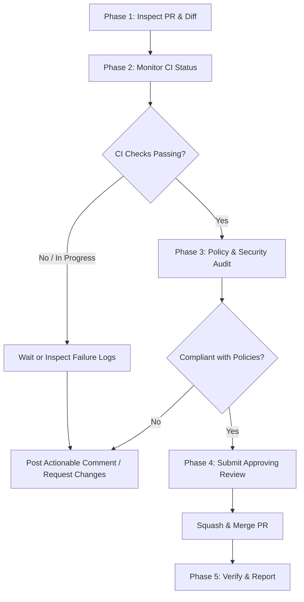

# Pull Request Review & Merge Skill

This skill guides the agent through inspecting, monitoring, validating, approving, merging, or commenting on Pull Requests in the **Dataflow Solution Guides** repository.

---

## 1. Core Principles & Golden Rules

1. **Never Merge In-Progress or Failing Builds**:
   - Always wait until all required GitHub Actions jobs and CI checks complete with `success`.
   - Never merge if any check is `in_progress`, `failed`, or `cancelled`.
2. **Strict Security Guardrails**:
   - **Dataflow Worker Private IPs**: Verify workers have public IPs disabled (`--no_use_public_ip` in Python, `--usePublicIps=false` in Java).
   - **Dedicated Service Accounts**: Workers must run with custom least-privilege service accounts, never the Compute Engine default service account.
   - **VPC Subnets**: Must have `enable_private_access = true`.
   - **Worker Firewalls**: Ensure ingress and egress on TCP ports `12345` and `12346` for the `dataflow` target tag.
3. **Consistent Code Formatting & Linting**:
   - **Java**: Enforce Google Java Style via Spotless (`./gradlew spotlessApply`).
   - **Python**: Enforce Google style via Yapf (`yapf -i -r --style yapf .`) and shared PyLint (`pylint --rcfile ../pylintrc .`).
   - **Terraform**: Enforce `terraform fmt -check` and `terraform validate`.
4. **Terraform to Pipeline Linkage**:
   - Every Terraform module must define `resource "local_file" "variables_script"` to generate environment variables for pipelines.
   - Generated scripts must not be manually modified; changes must be made via Terraform.

---

## 2. PR Review Checklist by Category

Before approving or merging, identify the PR type and apply the corresponding checklist:

### A. Dependency Updates (Renovate / Dependabot)
* [ ] **Builds Pass**: Confirm `Build and validation` workflow passes all jobs (Java, Python, Terraform, Docker).
* [ ] **Compatibility**: Ensure upgraded versions (e.g. Gradle plugins, Python libraries, Cloud Foundation Fabric modules) maintain backward compatibility.
* [ ] **Sync Across Pipelines**: If a shared plugin/dependency is updated, check if other pipelines should also be kept in sync.
* [ ] **Rebase State**: If the PR was created by a bot and has conflicts, ensure it is cleanly rebased on the latest `main`.

### B. Java Pipeline Changes (`pipelines/*_java/`)
* [ ] **Gradle Build**: `./gradlew build` compiles cleanly and passes unit tests.
* [ ] **Formatting**: Code formatted with `./gradlew spotlessApply`.
* [ ] **Pipeline Options**: Private IPs enforced (`--usePublicIps=false`), dedicated service account specified.
* [ ] **Dead-Letter Outputs**: Unparseable/error records route to dead-letter queues or error tables instead of crashing worker threads.
* [ ] **Local Run**: Verifiable with `--runner=DirectRunner`.

### C. Python Pipeline Changes (`pipelines/*/`)
* [ ] **Formatting**: Formatted with `yapf -i -r --style yapf .`.
* [ ] **Linting**: 0 errors from `pylint --rcfile ../pylintrc .`.
* [ ] **Package Build**: `python setup.py sdist` builds source distribution without missing files.
* [ ] **Pipeline Options**: Private IPs enforced (`--no_use_public_ip`), dedicated service account specified.
* [ ] **DoFn Serialization**: Heavy/network objects initialized in `setup()`, not `__init__()`.
* [ ] **Custom Container / Cloud Build**: If custom SDK container is used, `Dockerfile` and `cloudbuild.yaml` follow repo standards.
* [ ] **Local Run**: Verifiable with `--runner=DirectRunner`.

### D. Terraform Infrastructure Changes (`terraform/*/`)
* [ ] **Foundation Fabric Standard**: Uses Google Cloud Foundation Fabric modules (v56.2.0).
* [ ] **Formatting & Validation**: `terraform fmt -check` and `terraform validate` pass.
* [ ] **Variables Script Generator**: Includes `resource "local_file" "variables_script"` matching the pipeline's expected path.
* [ ] **Network & IAM Security**: Private Google Access enabled, custom service account with minimal IAM roles, firewall ports 12345/12346 open.
* [ ] **Resource Cleanup**: Respects `var.destroy_all_resources` for test/demo environments.

### E. Agent Guidelines & Documentation (`AGENTS.md`, `use_cases/*.md`, `.agents/skills/`)
* [ ] **Documentation Accuracy**: Architectural descriptions, table listings, and CLI commands match the codebase.
* [ ] **Skill Manifest**: Any new skill added to `.agents/skills/` is registered in `AGENTS.md` and contains valid YAML frontmatter (`name`, `description`).
* [ ] **Link Integrity**: File and documentation markdown links are valid.

---

## 3. End-to-End Review & Merge Workflow



### Phase 1: Inspect PR & Identify Scope
Inspect the PR title, body, author, branch, and file changes:
```bash
# View PR summary and metadata
gh pr view <PR_NUMBER> -R GoogleCloudPlatform/dataflow-solution-guides

# View diff of changes
gh pr diff <PR_NUMBER> -R GoogleCloudPlatform/dataflow-solution-guides

# List modified files
gh pr view <PR_NUMBER> -R GoogleCloudPlatform/dataflow-solution-guides --json files
```

### Phase 2: Monitor CI Status & Builds
Check the status of GitHub Actions workflows:
```bash
# Check rollup status of CI checks
gh pr checks <PR_NUMBER> -R GoogleCloudPlatform/dataflow-solution-guides

# View active workflow runs
gh run list --workflow=pull_request.yml -R GoogleCloudPlatform/dataflow-solution-guides --limit 5

# View detailed job progress for a specific run
gh run view <RUN_ID> -R GoogleCloudPlatform/dataflow-solution-guides
```

Wait until all checks finish. If any job fails, inspect failure logs:
```bash
gh run view <RUN_ID> --log-failed -R GoogleCloudPlatform/dataflow-solution-guides
```

### Phase 3: Policy, Security & Architecture Audit
Cross-reference the diff against:
1. Root [AGENTS.md](../../AGENTS.md)
2. Subdirectory guidelines ([pipelines/AGENTS.md](../../pipelines/AGENTS.md), [terraform/AGENTS.md](../../terraform/AGENTS.md))
3. Section 2 Checklist above.

### Phase 4: Decision & Execution

#### Scenario A: All Checks Pass & Changes Are Safe
1. **Submit Approving Review**:
   ```bash
   gh pr review <PR_NUMBER> -R GoogleCloudPlatform/dataflow-solution-guides \
     --approve \
     --body "LGTM. Changes pass all CI build, linting, and validation checks and comply with repository security and architectural policies."
   ```
2. **Merge the Pull Request**:
   ```bash
   gh pr merge <PR_NUMBER> -R GoogleCloudPlatform/dataflow-solution-guides --squash --delete-branch
   ```

#### Scenario B: Checks Fail or Violations Detected
1. **Do NOT merge.**
2. **Submit a Detailed Comment / Request Changes**:
   ```bash
   gh pr review <PR_NUMBER> -R GoogleCloudPlatform/dataflow-solution-guides \
     --comment \
     --body "<DETAILED_EXPLANATION>"
   ```
   **Comment Structure**:
   - **Issue Summary**: Clear statement of what failed or violated policy.
   - **CI Log Snippet**: Exact error messages from the failed build/lint step.
   - **Actionable Remedy**: Step-by-step instructions or code snippets showing how to fix the issue.

### Phase 5: Local Testing & Validation (Optional / Deep Verification)
When needed to test locally or verify complex changes:
```bash
# Check out the PR branch locally
gh pr checkout <PR_NUMBER>

# For Java pipeline changes:
cd pipelines/<use_case>_java && ./gradlew build && ./gradlew spotlessCheck

# For Python pipeline changes:
cd pipelines/<use_case> && pylint --rcfile ../pylintrc .

# For Terraform changes:
cd terraform/<use_case> && terraform init && terraform validate
```
