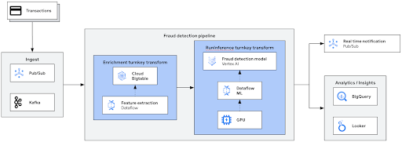

# Anomaly Detection sample pipeline (Python)
This sample pipeline demonstrates how to use Dataflow to process data, and detect anomalies
using GenAI.
This pipeline is written in Python.

This pipeline is part of the [Dataflow Anomaly Detection solution guide](../../use_cases/Anomaly_Detection.md).

## Architecture

The generic architecture for an anomaly detection pipeline looks like as follows:



In this directory, you will find a specific implementation of the above architecture, with the
following stages:

1. **Data ingestion:** Reads data from a Pub/Sub topic.
2. **Data preprocessing:** The sample pipeline does not do any transformation, but it is trivial
   to add a preprocessing step leveraging
   [the Enrichment transform](https://cloud.google.com/dataflow/docs/guides/enrichment) to perform
   feature engineering before calling the model.
3. **Inference:** Uses the RunInference transform with a model handler, using Keras and Tensorflow, to call the fraud detection model. The pipeline uses a GPU with the Dataflow worker, to speed up the inference.
4. **Detections:** The detections are sent to another Pub/Sub topic as output.


## Selecting the cloud region

Not all the resources may be available in all the regions. The default values included in this
directory have been tested using `us-central1` as region.

The file `cloudbuild.yaml` is using the machine type `E2_HIGHCPU_8` as the default machine type. If
that's not available in your preferred region, try with other machine types that are available
in Cloud Build:
* https://cloud.google.com/build/docs/api/reference/rest/v1/projects.builds#machinetype

Moreover, the file `scripts/00_set_environment.sh` specifies a machine type for the Datalow workers.
The selected machine type, `g2-standard-4`, is the recommended one for inference with GPU. If that
type is not available in your region, you can check what machines are available to use with the
following command:

```sh
gcloud compute machine-types list --zones=<ZONE A>,<ZONE B>,...
```

See more info about selecting the right type of machine in the following link:
* https://cloud.google.com/compute/docs/machine-resource

## How to launch the pipeline

All the scripts are located in the `scripts` directory and prepared to be launched from the top
sources directory.

In the script `scripts/00_set_environment.sh`, define the value of the project id and the region variable:

```
export PROJECT=<YOUR PROJECT ID>
export REGION=<YOUR CLOUD REGION>
```

Leave the rest of variables untouched, although you can override them if you prefer.

After you edit the script, load those variables into the environment

```sh
source scripts/00_set_environment.sh
```

And then run the script that builds and publishes the custom Dataflow container. This container will
contain all the required dependencies.

```sh
./scripts/01_build_and_push_container.sh
```

This will create a Cloud Build job that can take a few minutes to complete. Once it completes, you
can trigger the pipeline with the following:

```sh
./scripts/02_run_dataflow.sh
```

## Input data

To send data into the pipeline, you need to publish messages in the `messages` topic. Those
messages are passed "as is" to the model.

## Output data

The predictions are published into the topic `detections`, and can be observed using the
subscription `detections-sub`.