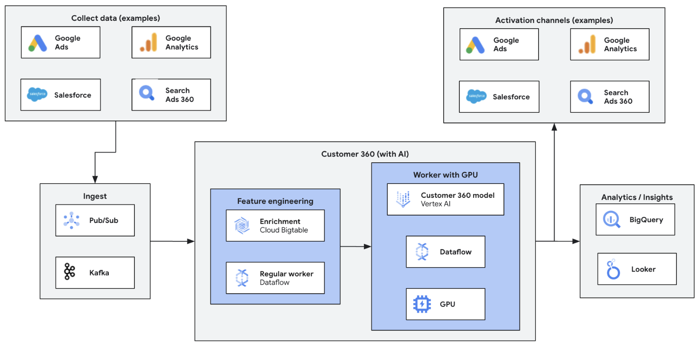

# Customer Data Platform sample pipeline (Python)

This sample pipeline demonstrates how to use Dataflow to process the streaming data in order to build Customer Data platform. We will be reading data form multiple streaming sources, two pub-sub topics in this sample pipeline, will join the data and put it in bigquery table for analytics later on.

This pipeline is part of the [Dataflow Customer Data Platfrom solution guide](../../use_cases/cdp.md).

## Architecture

The generic architecture for an inference pipeline looks like as follows:



In this directory, you will find a specific implementation of the above architecture, with the 
following stages:

1. **Data ingestion:** Reads data from a Pub/Sub topic.
2. **Data preprocessing:** The sample pipeline joins the data from two pub-sub topic based on some key fields. This is to showcase the unification of customer data from different sources to store itin one place.
3. **Output Data:** The final processed data is then appended to the bigquery table.

## Selecting the cloud region

Not all the resources may be available in all the regions. The default values included in this
directory have been tested using `us-central1` as region.

Moreover, the file `scripts/00_set_variables.sh` specifies a machine type for the Datalow workers.
The selected machine type, `e2-standard-8`, is the one that we used for unification of data. If that
type is not available in your region, you can check what machines are available to use with the
following command:

```sh
gcloud compute machine-types list --zones=<ZONE A>,<ZONE B>,...
```

See more info about selecting the right type of machine in the following link:
* https://cloud.google.com/compute/docs/machine-resource

## How to launch the pipeline

All the scripts are located in the `scripts` directory and prepared to be launched from the top 
sources directory.

In the script `scripts/00_set_variables.sh`, define the value of the project id and the region variable:

```
export PROJECT=<YOUR PROJECT ID>
export REGION=<YOUR CLOUD REGION>
```

Leave the rest of variables untouched, although you can override them if you prefer.

After you edit the script, load those variables into the environment

```sh
source scripts/00_set_variables.sh
```

And then run the script that builds and publishes the custom Dataflow container. This container will
contain all the required dependencies.

```sh
./scripts/01_cloudbuild_and_push_container.sh
```

This will create a Cloud Build job that can take a few minutes to complete. Once it completes, you
can trigger the pipeline with the following:

```sh
./scripts/02_run_dataflow_job.sh
```
You can also directly run below script instead of above 3 steps.

```sh
./scripts/run.sh
```

## Input data

To send data into the pipeline, you need to publish messages in the `transactions` and `coupon-redemption` topics.
Run the python code below to publish data to these pub-sub topics. This script is reading sample data from GCS buckets and publishing it to the pub-sub topic to create real-time streaming environment for this use case. One can update the GCS bucket location as per their environment. For reference, input files are added to folder ./input_data/.

```python3
./cdp_pipeline/generate_transaction_data.py
```

## Output data

The unified data from the two pub-sub topics is moved to the bigquery table `output_dataset.unified-table`.