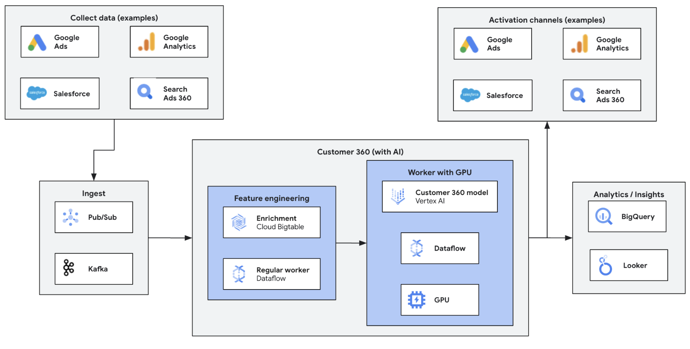

# Customer Data Platform sample pipeline (Python)

This sample pipeline demonstrates how to use Dataflow to process streaming data in order to build a Customer Data Platform (CDP). It reads data from multiple streaming sources (two Pub/Sub topics: `transactions` and `coupon_redemption`), joins the records based on transaction and customer keys, and writes the unified records into a BigQuery table for downstream analytics.

This pipeline is part of the [Dataflow Customer Data Platform solution guide](../../use_cases/CDP.md).

## Architecture

The generic architecture for the CDP pipeline looks as follows:



In this directory, you will find a specific implementation of the above architecture with the following stages:

1. **Data ingestion:** Reads streaming records from two Pub/Sub topics (`transactions` and `coupon_redemption`).
2. **Data preprocessing & Unification:** Windows incoming records into fixed 60-second windows and executes a `CoGroupByKey` left join to merge transactions with coupon redemptions based on `(transaction_id, household_key)`.
3. **Output Data:** Writes unified records into the BigQuery table `output_dataset.unified_data`.

## Selecting the cloud region

Not all resources may be available in all regions. The default values included in this directory have been tested using `us-central1` as region.

Moreover, the environment configuration specifies `e2-standard-8` machine types for the Dataflow workers. If that type is not available in your region, check available machine types using:

```sh
gcloud compute machine-types list --zones=<ZONE A>,<ZONE B>,...
```

See more info about selecting the right type of machine in Google Cloud Compute Engine documentation:
* https://cloud.google.com/compute/docs/machine-resource

## How to launch the pipeline

All scripts are located in the `scripts` directory and prepared to be launched from the `pipelines/cdp` directory.

### 1. Load environment variables
The environment configuration file `scripts/00_set_environment.sh` is generated automatically when deploying the Terraform infrastructure in `terraform/cdp/`. Load those variables into your current shell:

```sh
source scripts/00_set_environment.sh
```

### 2. Build and publish custom container
Build and push the custom Dataflow worker container to Artifact Registry using Cloud Build:

```sh
./scripts/01_build_and_push_container.sh
```

### 3. Launch Dataflow streaming pipeline
Submit the streaming pipeline job to Google Cloud Dataflow:

```sh
./scripts/02_run_dataflow.sh
```

## Automated Tests

Execute unit and pipeline transform tests with `pytest`:

```bash
pytest tests/ -v
```

## Input data simulation

To send test data into the pipeline, publish messages to the `transactions` and `coupon_redemption` Pub/Sub topics:

```python3
python3 ./cdp_pipeline/generate_transaction_data.py
```

This script reads sample transaction and coupon data (either from the configured GCS bucket or from local files in `./input_data/`) and publishes simulated events to the input Pub/Sub topics.

## Output data

The unified data from the two Pub/Sub topics is stored in the BigQuery table:
```
${PROJECT}.${BQ_DATASET}.${BQ_UNIFIED_TABLE}  # Default: output_dataset.unified_data
```

Verify output records via `bq`:
```bash
bq query --use_legacy_sql=false "SELECT * FROM \`${PROJECT}.output_dataset.unified_data\` LIMIT 10"
```