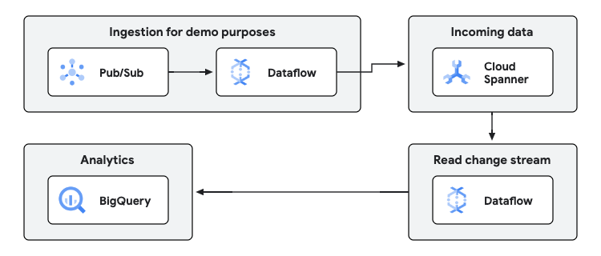

# ETL & integration sample pipeline (Java)

This sample pipeline demonstrates how to use Dataflow to create replicas of transactional databases, using change
streams, to create and maintain constantly updated replicas of the database. This pipeline is written in Java.

This pipeline is part of the [Dataflow ETL & integration solution guide](../../use_cases/ETL_integration.md).

## Architecture

The generic architecture for both looks like this:



There are two pipelines in this repository. The first pipeline reads from a Pub/Sub topic of public data, and writes
to a Spanner database. This pipeline's purpose is to keep Spanner with constant updates. The data is written in an
`events` table.

The second pipeline reads from a change stream from Spanner, and replicates the `events` table in BigQuery. The table
in BigQuery receives updates continuously and has the same data as the Spanner table, with a minimal latency.

The infrastructure required to launch the pipelines is deployed
through [the accompanying Terraform scripts in this solution guide](../../terraform/etl_integration/README.md).

## How to launch the pipelines

All the scripts are located in the `scripts` directory and prepared to be launched from the top
sources directory.

The Terraform code generates a file with all the necessary variables in the location `./scripts/01_set_variables.sh`.
Run the following command to apply that configuration:

```sh
source scripts/01_set_variables.sh
```

Then run the publisher pipeline. This pipeline will take data from the input
topic, and will write it to Spanner. This pipeline is meant only to have
some data in the Spanner change streams for the sake of running this guide
as an example, in a real setting your data would land in Spanner by many
other different means:

```sh
./scripts/02_run_publisher_dataflow.sh
```

Once you have the publisher pipeline populating some data into Spanner, you
can read from the change streams to replicate the database into BigQuery.
For that, execute the following:

```sh
./scripts/03_run_changestream_template.sh
```

## Input data

All the input data is taken by default from the following public Pub/Sub topic:
* `projects/pubsub-public-data/topics/taxirides-realtime`

So you don't need to send any data anywhere to run this guide as an example.

## Output data

The BigQuery dataset (by default, `replica`) will contain a table (by default,
called `events`, in the `taxis` database), with the same contents as the
Spanner table. This replication will happen in real time with low latency,
as new data lands in the Spanner table (or if any existing record is
modified or deleted).
