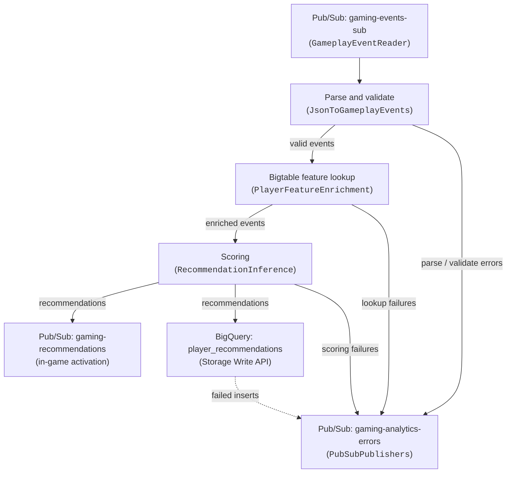

# Gaming Analytics Dataflow Pipeline (Java)

This Apache Beam streaming pipeline implements the in-game activation path of the
[Dataflow Gaming Analytics Solution Guide](../../use_cases/Gaming_Analytics.md). Gameplay events are
read from Pub/Sub, hydrated with the player features held in a Cloud Bigtable feature store, scored
with a recommender, published back to Pub/Sub for immediate in-game activation, and persisted to
BigQuery for analytics. Every element the pipeline cannot process is routed to a dead-letter Pub/Sub
topic instead of being dropped.

The infrastructure is provisioned by [`terraform/gaming_analytics`](../../terraform/gaming_analytics),
which also generates the `scripts/00_set_environment.sh` file consumed by the launch script.

---

## Pipeline architecture



### Stages

1. **Ingestion** (`extract/GameplayEventReader`): reads the raw JSON payloads from the input
   subscription.
2. **Parsing and validation** (`transform/JsonToGameplayEvents`): parses the payloads into typed
   `GameplayEvent` records with Beam schemas (`JsonToRow.withExceptionReporting`), then validates
   them. Two dead-letter stages are distinguished: `parse` (not JSON, or not matching the event
   schema) and `validate` (missing `player_id`, or an unparseable `event_timestamp`). A payload
   without `event_timestamp` is backfilled from the Pub/Sub message timestamp, because the BigQuery
   column is `REQUIRED`.
3. **Enrichment** (`transform/PlayerFeatureEnrichment`): looks the player up in Bigtable using
   `player_id` as the row key and flattens the `features` column family into a feature map. A miss
   is not an error — the event flows through with an empty map — but a lookup failure is
   dead-lettered.
4. **Inference** (`transform/RecommendationInference`): scores the enriched event with the
   configured `Recommender`. Anything the model throws becomes a dead-letter record rather than a
   failed bundle.
5. **Activation and analytics** (`load/PubSubPublishers`, `load/RecommendationBigQuerySink`): the
   recommendation is published to the output topic with `player_id`, `event_type` and
   `recommendation` message attributes, and the same record is streamed into BigQuery with the
   Storage Write API.

> [!NOTE]
> The [solution guide](../../use_cases/Gaming_Analytics.md) recommends deploying the analytics side
> as a **separate** pipeline reading from `gaming-recommendations`, so that BigQuery back-pressure
> can never slow the in-game activation path down. This sample keeps both branches in one pipeline
> to stay readable and cheap to run. To split them, delete the `WriteRecommendationsToBigQuery`
> branch from `GamingAnalyticsPipeline` and run a second job that reads `$OUTPUT_SUBSCRIPTION` and
> applies `RecommendationBigQuerySink` on its own.


### Inference modes

| `--inferenceMode` | Implementation | Notes |
| :--- | :--- | :--- |
| `local` *(default)* | `inference/LocalRecommender` | Deterministic in-process rules. No model artifact, no GPU, no network call. |
| `gpu` | `inference/LocalRecommender` | Alias of `local`; it is the value the Terraform module exports when the model is meant to run on the workers. |
| `vertex` | `inference/VertexAiRecommender` | Calls a Vertex AI online prediction endpoint with Application Default Credentials. Requires `--modelEndpoint`. |

> [!NOTE]
> The Terraform module defaults to `inference_mode = "gpu"`, which selects a `g2-standard-4` worker
> with an NVIDIA L4. The recommender shipped here is pure Java and CPU-only, so the launch script
> does **not** request the accelerator unless you export `USE_GPU_ACCELERATOR=true`, and you can
> override the machine type with `WORKER_MACHINE_TYPE`. Deploy with `inference_mode = "vertex"` (or
> set `machine_type`) if you want CPU workers to begin with.

The `LocalRecommender` rules are evaluated in order, first match wins:

| Rule | Recommendation |
| :--- | :--- |
| `churn_risk >= 0.7` | `retention_bonus_pack` |
| `event_type = level_failed` | `difficulty_assist_boost` (stronger when `level_failures >= 3`) |
| `spend_tier` in (`paying`, `whale`) and `event_type` in (`level_complete`, `purchase`) | `premium_bundle_offer` |
| `score > 1.5 * skill_rating` | `tournament_invite` |
| otherwise | `daily_quest_suggestion` |

Swap `LocalRecommender` for your own implementation of the `Recommender` interface to plug in a real
model; the rest of the pipeline is unaffected.

---

## Data model

All records are AutoValue classes with Beam schemas, defined in
[`GamingObjects.java`](src/main/java/com/google/cloud/dataflow/solutions/gaming_analytics/data/GamingObjects.java).

**Input event** (Pub/Sub topic `gaming-events`):

```json
{
  "player_id": "player_0001",
  "session_id": "session_1234",
  "event_type": "level_failed",
  "level": 12,
  "score": 9100,
  "event_timestamp": "2026-09-11T09:53:50.000Z"
}
```

**Output recommendation** (Pub/Sub topic `gaming-recommendations` and BigQuery
`gaming_analytics.player_recommendations`):

```json
{
  "player_id": "player_0001",
  "session_id": "session_1234",
  "event_type": "level_failed",
  "level": 12,
  "score": 9100,
  "recommendation": "difficulty_assist_boost",
  "recommendation_score": 0.64,
  "event_timestamp": "2026-09-11T09:53:50.000Z",
  "processing_timestamp": "2026-09-11T09:53:50.412Z"
}
```

**Dead-letter record** (Pub/Sub topic `gaming-analytics-errors`):

```json
{
  "stage": "validate",
  "payload": "{\"session_id\": \"orphan\"}",
  "error_message": "Missing mandatory field player_id",
  "timestamp": "2026-09-11T09:53:50.000Z"
}
```

---

## Project structure

```
pipelines/gaming_analytics_java/
├── build.gradle                                  # Gradle configuration (Beam 2.76, Java 25, AutoValue)
├── src/main/java/.../gaming_analytics/
│   ├── GamingAnalyticsPipeline.java              # Main pipeline DAG
│   ├── options/GamingAnalyticsOptions.java       # Pipeline options
│   ├── data/GamingObjects.java                   # AutoValue + Beam Schema data classes
│   ├── extract/GameplayEventReader.java          # Pub/Sub source
│   ├── transform/
│   │   ├── JsonToGameplayEvents.java             # JSON parsing and validation
│   │   ├── PlayerFeatureEnrichment.java          # Cloud Bigtable feature lookups
│   │   └── RecommendationInference.java          # Scoring with branching outputs
│   ├── inference/
│   │   ├── Recommender.java                      # Scoring strategy interface
│   │   ├── Prediction.java                       # Scoring result
│   │   ├── LocalRecommender.java                 # In-process rule based recommender
│   │   ├── VertexAiRecommender.java              # Vertex AI online prediction client
│   │   └── Recommenders.java                     # Inference mode factory
│   └── load/
│       ├── PubSubPublishers.java                 # Activation and dead-letter topics
│       └── RecommendationBigQuerySink.java       # BigQuery Storage Write API sink
├── src/test/java/.../gaming_analytics/           # Unit and DirectRunner tests
└── scripts/
    ├── 00_set_environment.sh                     # Generated by Terraform (gitignored)
    ├── 01_launch_pipeline.sh                     # Dataflow submission wrapper
    ├── populate_bigtable.py                      # Seeds the player feature store
    ├── generate_gameplay_events.py               # Publishes synthetic events
    └── requirements.txt                          # Dependencies of the Python helper scripts
```

---

## Pipeline options

| Option | Environment variable | Required | Description |
| :--- | :--- | :---: | :--- |
| `--inputSubscription` | `INPUT_SUBSCRIPTION` | yes | Subscription with the raw gameplay events. |
| `--outputTopic` | `OUTPUT_TOPIC` | yes | Topic receiving the recommendations. |
| `--errorTopic` | `ERROR_TOPIC` | yes | Dead-letter topic. |
| `--bigtableInstance` | `BIGTABLE_INSTANCE` | yes | Feature store instance. |
| `--bigtableTable` | `BIGTABLE_TABLE` | yes | Feature store table. |
| `--bigtableColumnFamily` | `BIGTABLE_COLUMN_FAMILY` | no (`features`) | Column family holding the features. |
| `--bigtableProject` | — | no | Defaults to the Dataflow project. |
| `--bigQueryTable` | `BQ_TABLE` | yes | `PROJECT:DATASET.TABLE` or `PROJECT.DATASET.TABLE`. |
| `--enableEnrichment` | `ENABLE_ENRICHMENT` | no (`true`) | Set to `false` to skip the Bigtable lookups. |
| `--inferenceMode` | `INFERENCE_MODE` | no (`local`) | `local`, `gpu` or `vertex`. |
| `--modelEndpoint` | `MODEL_ENDPOINT` | only in `vertex` mode | `projects/P/locations/L/endpoints/E`. |
| `--predictionLabelField` | — | no (`recommendation`) | Prediction field with the label. |
| `--predictionScoreField` | — | no (`recommendation_score`) | Prediction field with the score. |
| `--predictionTimeoutSeconds` | — | no (`10`) | Timeout of each prediction request. |

---

## Building and testing

### Prerequisites

- OpenJDK 25
- The bundled Gradle wrapper (`./gradlew`)
- Python 3.13 or 3.14 for the helper scripts (the versions the repository CI uses)
- Google Cloud SDK (`gcloud`, `bq`, `cbt`)

### Unit tests

```bash
./gradlew test
```

| Test class | Scope |
| :--- | :--- |
| `GamingObjectsTest` | BigQuery row mapping and the exact JSON payloads published to Pub/Sub. |
| `JsonToGameplayEventsTest` | Schema parsing, timestamp normalization and backfill, and both dead-letter stages. |
| `PlayerFeatureEnrichmentTest` | Bigtable cell to feature mapping (latest cell wins, column family filtering) and the disabled pass-through. |
| `LocalRecommenderTest` | Every recommendation rule, plus missing and malformed features. |
| `VertexAiRecommenderTest` | Endpoint URL, request body and every response shape, without a network call. |
| `RecommendersTest` | Inference mode selection and misconfiguration errors. |
| `RecommendationInferenceTest` | Scoring output and dead-lettering of model failures. |
| `RecommendationBigQuerySinkTest` | Table reference normalization. |
| `RecommendationStorageApiSchemaTest` | Encodes the BigQuery rows with the same Storage Write API encoder used at runtime, against the exact schema Terraform creates. Catches value representation mismatches (timestamps in particular) without a live table. |
| `PubSubPublishersTest` | Message payloads and attributes. |
| `GamingAnalyticsPipelineTest` | Full graph construction, the exact argument list `scripts/01_launch_pipeline.sh` produces, and an end-to-end DirectRunner run of the transform chain. |

### Formatting and full build

```bash
./gradlew spotlessApply   # apply Google Java Style
./gradlew build           # compile, test and package
```

### Local execution with the DirectRunner

```bash
./gradlew run -Pargs="--runner=DirectRunner \
  --project=<PROJECT_ID> \
  --inputSubscription=projects/<PROJECT_ID>/subscriptions/gaming-events-sub \
  --outputTopic=projects/<PROJECT_ID>/topics/gaming-recommendations \
  --errorTopic=projects/<PROJECT_ID>/topics/gaming-analytics-errors \
  --bigtableInstance=gaming-analytics \
  --bigtableTable=player_features \
  --bigQueryTable=<PROJECT_ID>.gaming_analytics.player_recommendations"
```

---

## End-to-end deployment runbook

### Step 1: provision the infrastructure

```bash
cd terraform/gaming_analytics
# terraform.tfvars needs at least project_id and region
terraform init
terraform plan -out=tfplan
terraform apply tfplan
```

### Step 2: load the environment

```bash
cd ../../pipelines/gaming_analytics_java
source scripts/00_set_environment.sh
env | grep -E 'TOPIC|SUBSCRIPTION|BIGTABLE|BQ_|MACHINE_TYPE|INFERENCE_MODE'
```

### Step 3: seed the feature store

```bash
python3 -m venv .venv
source .venv/bin/activate
pip install -r scripts/requirements.txt
python scripts/populate_bigtable.py
```

### Step 4: launch the pipeline

```bash
./scripts/01_launch_pipeline.sh
```

The script enforces the repository guardrails: private IPs only (`--usePublicIps=false`), the
dedicated worker service account (`--serviceAccount=$SERVICE_ACCOUNT`), the subnetwork exported by
Terraform, and Streaming Engine.

Monitor the job:

```bash
gcloud dataflow jobs list --status=active --region=$REGION
```

### Step 5: publish gameplay events

```bash
python scripts/generate_gameplay_events.py --num_events=300 --rate=10 --inject_errors
```

`--inject_errors` publishes malformed payloads (invalid JSON, wrong types, missing `player_id`,
unparseable timestamps) so that the dead-letter topic can be verified as well.

### Step 6: verify the outputs

Activation path:

```bash
gcloud pubsub subscriptions pull $OUTPUT_SUBSCRIPTION --limit=5 --auto-ack
```

Analytics path:

```sql
SELECT recommendation, count(*) AS events, avg(recommendation_score) AS avg_score
FROM `<PROJECT_ID>.gaming_analytics.player_recommendations`
GROUP BY recommendation
ORDER BY events DESC;
```

Dead-letter topic:

```bash
gcloud pubsub subscriptions pull $ERROR_SUBSCRIPTION --limit=5 --auto-ack
```

### Step 7: clean up

```bash
gcloud dataflow jobs list --status=active --region=$REGION
gcloud dataflow jobs cancel <JOB_ID> --region=$REGION
cd ../../terraform/gaming_analytics
terraform destroy
```
