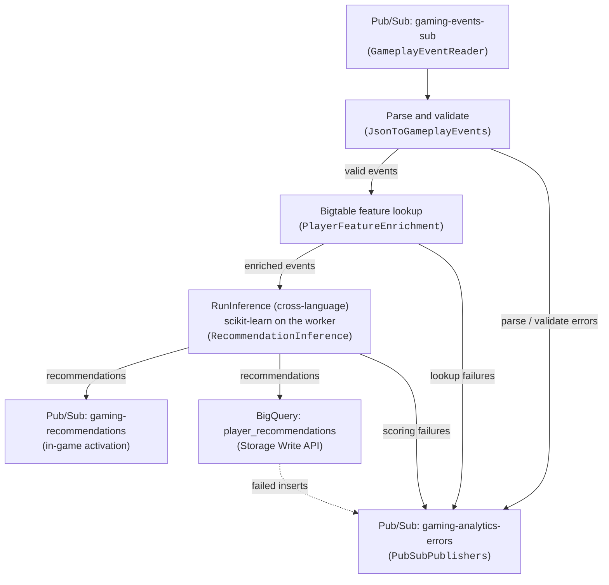

# Gaming Analytics Dataflow Pipeline (Java)

This Apache Beam streaming pipeline implements the in-game activation path of the
[Dataflow Gaming Analytics Solution Guide](../../use_cases/Gaming_Analytics.md). Gameplay events are
read from Pub/Sub, hydrated with the player features held in a Cloud Bigtable feature store, scored
with a scikit-learn model through cross-language `RunInference`, published back to Pub/Sub for
immediate in-game activation, and persisted to
BigQuery for analytics. Every element the pipeline cannot process is routed to a dead-letter Pub/Sub
topic instead of being dropped.

The infrastructure is provisioned by [`terraform/gaming_analytics`](../../terraform/gaming_analytics),
which also generates the `scripts/00_set_environment.sh` file consumed by the launch script.

---

## Pipeline architecture



### Stages

1. **Ingestion** (`extract/GameplayEventReader`): reads the raw JSON payloads from the input
   subscription.
2. **Parsing and validation** (`transform/JsonToGameplayEvents`): parses the payloads into typed
   `GameplayEvent` records with Beam schemas (`JsonToRow.withExceptionReporting`), then validates
   them. Two dead-letter stages are distinguished: `parse` (not JSON, or not matching the event
   schema) and `validate` (missing `player_id`, or an unparseable `event_timestamp`). A payload
   without `event_timestamp` is backfilled from the Pub/Sub message timestamp, because the BigQuery
   column is `REQUIRED`.
3. **Enrichment** (`transform/PlayerFeatureEnrichment`): looks the player up in Bigtable using
   `player_id` as the row key and flattens the `features` column family into a feature map. A miss
   is not an error — the event flows through with an empty map — but a lookup failure is
   dead-lettered.
4. **Inference** (`transform/RecommendationInference`): scores the enriched event with Apache Beam
   `RunInference`, running a scikit-learn model on the worker. Anything that cannot be turned into
   a feature vector, and any prediction that cannot be read back, becomes a dead-letter record
   rather than a failed bundle.
5. **Activation and analytics** (`load/PubSubPublishers`, `load/RecommendationBigQuerySink`): the
   recommendation is published to the output topic as a JSON message with no attributes, and the
   same record is streamed into BigQuery with the Storage Write API.

> [!NOTE]
> The [solution guide](../../use_cases/Gaming_Analytics.md) recommends deploying the analytics side
> as a **separate** pipeline reading from `gaming-recommendations`, so that BigQuery back-pressure
> can never slow the in-game activation path down. This sample keeps both branches in one pipeline
> to stay readable and cheap to run. To split them, delete the `WriteRecommendationsToBigQuery`
> branch from `GamingAnalyticsPipeline` and run a second job that reads `$OUTPUT_SUBSCRIPTION` and
> applies `RecommendationBigQuerySink` on its own.


### Inference: cross-language RunInference

`RunInference` is **not** a Python-only transform. The Java SDK reaches it through the
cross-language wrapper
[`org.apache.beam.sdk.extensions.python.transforms.RunInference`](https://beam.apache.org/documentation/ml/multi-language-inference/),
which runs the Python `apache_beam.ml.inference.base.RunInference` behind an expansion service. The
model handler is the Python `SklearnModelHandlerNumpy`, so the model is loaded and executed **inside
the Python SDK harness on the same worker** as the Java code: there is no prediction endpoint and no
per-element network call.

Because `RunInference` speaks schema values, `RecommendationInference` is a three-step composite:

| Step | Element type | Purpose |
| :--- | :--- | :--- |
| `ToFeatureVectors` | `EnrichedEvent` → `KV<Row, Iterable<Double>>` | Builds the numeric feature vector, keyed by a context `Row`. |
| `RunInference` | `KV<Row, Iterable<Double>>` → `KV<Row, Row>` | The language hop. `KeyedModelHandler` strips the key, scores, and pairs the key back. |
| `ToRecommendations` | `KV<Row, Row>` → `Recommendation` | Rebuilds the output record from the key and the prediction. |

The key carries `player_id`, `session_id`, `event_type`, `level`, `score` and `event_timestamp`
across the boundary, so the pass-through fields do not have to be re-joined afterwards — no extra
shuffle, and the ordering of the activation path is untouched.

#### Model contract

The feature vector order and the label order are a contract shared between
`RecommendationInference` and `scripts/train_model.py`; changing one side only silently produces
nonsense predictions.

| # | Feature | Source |
| :-- | :--- | :--- |
| 0 | `level` | Event |
| 1 | `score` | Event |
| 2 | `churn_risk` | Bigtable |
| 3 | `level_failures` | Bigtable |
| 4 | `skill_rating` | Bigtable |
| 5 | `spend_tier_score` | Bigtable, ordinal encoded (`free`=0, `paying`=1, `whale`=2) |
| 6 | `event_type_code` | Event, ordinal encoded (`level_start`=0 … `item_used`=4) |

The model is a multi-output `DecisionTreeRegressor` that returns one propensity per label:
`retention_bonus_pack`, `difficulty_assist_boost`, `premium_bundle_offer`, `tournament_invite`,
`daily_quest_suggestion`. The Java side takes the argmax as `recommendation` and the corresponding
propensity as `recommendation_score`. A regressor is used rather than a classifier on purpose:
`SklearnModelHandlerNumpy` only calls `model.predict()`, never `predict_proba()`, so a classifier
would leave `recommendation_score` empty.

#### Requirements this places on the deployment

> [!IMPORTANT]
> **Dataflow Runner v2 is required.** Multi-language pipelines do not run on the original Dataflow
> runner. `scripts/01_launch_pipeline.sh` passes `--experiments=use_runner_v2`.

> [!WARNING]
> **Private-IP workers still need egress for the Python SDK harness image.** A Runner v2
> multi-language job runs a second SDK harness container next to the Java one, and its image is the
> one the expansion service returns: `apache/beam_python3.x_sdk:2.76.0`, on **Docker Hub**. Private
> Google Access covers `gcr.io` and `*.pkg.dev`; Docker Hub is neither. With `--usePublicIps=false`
> the job will hang in worker start-up unless you provide one of:
>
> - a **Cloud NAT** on the worker subnetwork (simplest), or
> - the same image **mirrored into your own Artifact Registry** and passed with
>   `--sdkContainerImage`, which removes the Docker Hub dependency entirely.
>
> Do not "solve" this by giving the workers public IPs.
>
> The pinned Python packages are *not* part of this problem. `withExtraPackages` makes Beam download
> the wheels on the **submitting** machine at graph-construction time and stage them alongside the
> job; the worker installs them from the staging bucket, which Private Google Access does cover. A
> transient expansion service also gets its own virtualenv on that same machine, with those pins
> `pip install`ed into it. So it is the machine you launch from that needs to reach PyPI, not the
> workers.

> [!IMPORTANT]
> **The Python package versions must match the ones the model was pickled with.** scikit-learn does
> not guarantee pickle compatibility across versions: a mismatch either fails to unpickle or, worse,
> silently changes the predictions. This guide pins **`scikit-learn==1.7.2`**, **`numpy==2.4.6`** and
> **`pandas==2.3.3`** in two lists that must be changed together:
> `RecommendationInference.HARNESS_REQUIREMENTS` (installed into the harness) and
> `scripts/requirements.txt`. `scikit-learn` and `numpy` are mirrored a third time, as
> `PINNED_SKLEARN_VERSION` and `PINNED_NUMPY_VERSION` in `scripts/train_model.py`, so a bump of
> either of those two touches three files.
>
> The pickle-compatibility argument covers `scikit-learn` and `numpy` only, which is why they are
> also the only two enforced at training time: `check_pinned_versions()` in `scripts/train_model.py`
> compares the installed versions against those constants and refuses to write a model pickled with
> anything else. `pandas` is deliberately outside that check — it is an *import* requirement of the
> harness rather than part of the pickle, and `train_model.py` never imports it. See below.
>
> Those three versions are not arbitrary: they are exactly what the **Beam 2.76.0 Python SDK harness
> image already ships**, so installing them is a no-op on the stock container. When you bump
> `beamVersion` in `build.gradle`, read the new
> [`sdks/python/container/py3XX/base_image_requirements.txt`](https://github.com/apache/beam/tree/master/sdks/python/container)
> and move the pins with it; retrain the model if `scikit-learn` or `numpy` moved.
>
> `pandas` is pinned for a different reason than the other two. The handler is the NumPy one and the
> pickle contains no pandas objects, but `apache_beam.ml.inference.sklearn_inference` imports pandas
> at module scope, so the model loader cannot even be evaluated without it. Beam adds it
> automatically only when no extra packages are given at all, and this pipeline gives an explicit
> list, so it has to be named. Its exact version matters far less than scikit-learn's; it is pinned
> for consistency with the harness image.

#### Training the model

```bash
python3 -m venv .venv
source .venv/bin/activate
pip install -r scripts/requirements.txt

# Local pickle only:
python scripts/train_model.py --output_path=/tmp/gaming_recommender.pkl

# Train and upload, then point the pipeline at it:
python scripts/train_model.py --model_uri=gs://$BUCKET/models/gaming_recommender.pkl
export MODEL_URI=gs://$BUCKET/models/gaming_recommender.pkl
```

The model is deliberately small and explainable: 20 000 synthetic samples, a depth-8 decision tree,
fitted on labels generated by the same rules the previous rule-based recommender used, so the
recommendations remain interpretable and the guide stays reproducible without a real dataset.

> [!NOTE]
> The model runs on the worker CPU: scikit-learn does not use a GPU, and the Terraform module
> provisions plain CPU workers (`n1-standard-2` by default) with no accelerator. Bear in mind that a
> Runner v2 multi-language job runs a Java and a Python SDK harness side by side on every worker, so
> if you raise the throughput, give them more room with the Terraform `machine_type` variable or by
> exporting `WORKER_MACHINE_TYPE` before launching.

---

## Data model

All records are AutoValue classes with Beam schemas, defined in
[`GamingObjects.java`](src/main/java/com/google/cloud/dataflow/solutions/gaming_analytics/data/GamingObjects.java).

**Input event** (Pub/Sub topic `gaming-events`):

```json
{
  "player_id": "player_0001",
  "session_id": "session_1234",
  "event_type": "level_failed",
  "level": 12,
  "score": 9100,
  "event_timestamp": "2026-09-11T09:53:50.000Z"
}
```

**Output recommendation** (Pub/Sub topic `gaming-recommendations` and BigQuery
`gaming_analytics.player_recommendations`):

```json
{
  "player_id": "player_0001",
  "session_id": "session_1234",
  "event_type": "level_failed",
  "level": 12,
  "score": 9100,
  "recommendation": "difficulty_assist_boost",
  "recommendation_score": 0.64,
  "event_timestamp": "2026-09-11T09:53:50.000Z",
  "processing_timestamp": "2026-09-11T09:53:50.412Z"
}
```

**Dead-letter record** (Pub/Sub topic `gaming-analytics-errors`):

```json
{
  "stage": "validate",
  "payload": "{\"session_id\": \"orphan\"}",
  "error_message": "Missing mandatory field player_id",
  "timestamp": "2026-09-11T09:53:50.000Z"
}
```

---

## Project structure

```
pipelines/gaming_analytics_java/
├── build.gradle                                  # Gradle configuration (Beam 2.76, Java 25, AutoValue)
├── src/main/java/.../gaming_analytics/
│   ├── GamingAnalyticsPipeline.java              # Main pipeline DAG
│   ├── options/GamingAnalyticsOptions.java       # Pipeline options
│   ├── data/GamingObjects.java                   # AutoValue + Beam Schema data classes
│   ├── extract/GameplayEventReader.java          # Pub/Sub source
│   ├── transform/
│   │   ├── JsonToGameplayEvents.java             # JSON parsing and validation
│   │   ├── PlayerFeatureEnrichment.java          # Cloud Bigtable feature lookups
│   │   └── RecommendationInference.java          # Cross-language RunInference scoring
│   └── load/
│       ├── PubSubPublishers.java                 # Activation and dead-letter topics
│       └── RecommendationBigQuerySink.java       # BigQuery Storage Write API sink
├── src/test/java/.../gaming_analytics/           # Unit and DirectRunner tests
└── scripts/
    ├── 00_set_environment.sh                     # Generated by Terraform (gitignored)
    ├── 01_launch_pipeline.sh                     # Dataflow submission wrapper
    ├── train_model.py                            # Trains and uploads the scikit-learn model
    ├── populate_bigtable.py                      # Seeds the player feature store
    ├── generate_gameplay_events.py               # Publishes synthetic events
    └── requirements.txt                          # Dependencies of the Python helper scripts
```

---

## Pipeline options

| Option | Environment variable | Required | Description |
| :--- | :--- | :---: | :--- |
| `--inputSubscription` | `INPUT_SUBSCRIPTION` | yes | Subscription with the raw gameplay events. |
| `--outputTopic` | `OUTPUT_TOPIC` | yes | Topic receiving the recommendations. |
| `--errorTopic` | `ERROR_TOPIC` | yes | Dead-letter topic. |
| `--bigtableInstance` | `BIGTABLE_INSTANCE` | yes | Feature store instance. |
| `--bigtableTable` | `BIGTABLE_TABLE` | yes | Feature store table. |
| `--bigtableColumnFamily` | `BIGTABLE_COLUMN_FAMILY` | no (`features`) | Column family holding the features. |
| `--bigtableProject` | — | no | Defaults to the Dataflow project. |
| `--bigQueryTable` | `BQ_TABLE` | yes | `PROJECT:DATASET.TABLE` or `PROJECT.DATASET.TABLE`. |
| `--enableEnrichment` | `ENABLE_ENRICHMENT` | no (`true`) | Set to `false` to skip the Bigtable lookups. |
| `--modelUri` | `MODEL_URI` | yes | Pickled scikit-learn model, normally `gs://BUCKET/models/gaming_recommender.pkl`. Produced by `scripts/train_model.py`. |
| `--expansionService` | — | no | `host:port` of an already running Python expansion service. When unset, Beam starts a transient one at submission time, installs the pinned `scikit-learn`, `numpy` and `pandas` versions into its virtualenv, and stages those same versions for the workers. |

---

## Building and testing

### Prerequisites

- OpenJDK 25
- The bundled Gradle wrapper (`./gradlew`)
- Python 3.13 or 3.14 for the helper scripts (the versions the repository CI uses)
- Google Cloud SDK (`gcloud`, `bq`, `cbt`)

### Unit tests

```bash
./gradlew test
```

The default suite is **hermetic**: no Docker, no expansion service, no network access, no cloud
credentials. The cross-language hop is replaced by a stand-in so that the feature-vector and
prediction-decoding code on either side of it is still exercised.

| Test class | Scope |
| :--- | :--- |
| `GamingObjectsTest` | BigQuery row mapping, the exact JSON payloads published to Pub/Sub, and the `EnrichedEvent` schema-coder round trip. |
| `JsonToGameplayEventsTest` | Schema parsing, timestamp normalization and backfill, and both dead-letter stages. |
| `PlayerFeatureEnrichmentTest` | Bigtable cell to feature mapping (latest cell wins, column family filtering) and the disabled pass-through. |
| `RecommendationInferenceTest` | Feature vector construction and encoding, the context key round trip, prediction decoding and argmax, and dead-lettering on both sides of the language boundary. Also decodes a captured, real Python-SDK-encoded prediction, which is what proves the NumPy `inference` array lands in `ARRAY<DOUBLE>`. Does not start an expansion service. |
| `RecommendationBigQuerySinkTest` | Table reference normalization. |
| `RecommendationStorageApiSchemaTest` | Encodes the BigQuery rows with the same Storage Write API encoder used at runtime, against the exact schema Terraform creates. Catches value representation mismatches (timestamps in particular) without a live table. |
| `PubSubPublishersTest` | Message payloads and attributes. |
| `GamingAnalyticsPipelineTest` | Full graph construction, the exact argument list `scripts/01_launch_pipeline.sh` produces, and an end-to-end DirectRunner run of the transform chain. |

### Cross-language integration test (opt-in)

`RecommendationInferenceCrossLanguageIT` is the only test that touches the real Python side. It is
**skipped unless explicitly enabled**, because it starts a Python expansion service, which builds a
virtualenv and downloads Apache Beam and the pinned model packages from PyPI. Neither the default
build nor CI may depend on that.

```bash
# 1. Produce a model to configure the transform with.
python3 -m venv .venv && source .venv/bin/activate
pip install -r scripts/requirements.txt
python scripts/train_model.py --output_path=/tmp/gaming_recommender.pkl

# 2. Run just that test, opting in.
./gradlew test --tests '*RecommendationInferenceCrossLanguageIT' \
  -DrunCrossLanguageTests=true \
  -DcrossLanguageModelUri=/tmp/gaming_recommender.pkl
```

Both `-D` and `-P` are accepted. Expect several minutes on the first run; the virtualenv is then
cached under `~/.apache_beam/cache/venvs`.

**What it proves:** the expansion service really evaluates `MODEL_LOADER`, builds
`KeyedModelHandler(SklearnModelHandlerNumpy(model_uri))`, and accepts the schemas, the key coder and
the `model_uri` keyword argument. A companion negative test asserts that a deliberately broken model
loader is *rejected*, so the positive test cannot pass vacuously.

> [!IMPORTANT]
> **It does not execute the pipeline, and cannot.** The Java `DirectRunner` is not a portable runner
> and has no evaluator for an expanded external transform; running one fails with
> `NullPointerException: No evaluator for PTransform "beam:transform:external:v1"`. Executing this
> path needs a portable runner — here, Dataflow Runner v2. **End-to-end scoring is therefore only
> verifiable by deploying the pipeline**, not by any local test.

### The captured Python prediction fixture

What the opt-in test above cannot cover is the *encoding* on the far side of the boundary: the model
returns a NumPy `float64` array, and it has to arrive in the `ARRAY<DOUBLE>` `inference` field of
`PREDICTION_SCHEMA`. `RecommendationInferenceTest` therefore carries a base64 fixture of the exact
bytes the Python SDK produces for one prediction, and decodes it with the real Java coder. That test
is hermetic — it is just bytes — but the bytes are real.

Regenerate it only if `CONTEXT_SCHEMA` or `PREDICTION_SCHEMA` changes:

```python
# In an environment with apache-beam==2.76.0 and the pinned scikit-learn, numpy and pandas:
from apache_beam.coders import coders
from apache_beam.coders.row_coder import RowCoder
from apache_beam.ml.inference.base import KeyedModelHandler
from apache_beam.ml.inference.sklearn_inference import SklearnModelHandlerNumpy

# Build schema_pb2.Schema objects mirroring CONTEXT_SCHEMA and PREDICTION_SCHEMA, then:
handler = KeyedModelHandler(SklearnModelHandlerNumpy("/tmp/gaming_recommender.pkl"))
model = handler.load_model()
(key, prediction), = handler.run_inference([(context_row, feature_vector)], model)
encoded = coders.TupleCoder(
    (RowCoder(context_schema), RowCoder(prediction_schema))).encode((key, prediction))
print(base64.b64encode(encoded).decode())
```


### Formatting and full build

```bash
./gradlew spotlessApply   # apply Google Java Style
./gradlew build           # compile, test and package
```

### Local execution with the DirectRunner

> [!WARNING]
> **The DirectRunner can no longer run this pipeline end to end.** It is not a portable runner, so it
> has no evaluator for the expanded cross-language `RunInference`
> (`beam:transform:external:v1`). Use `DataflowRunner` with `--experiments=use_runner_v2`, or
> another portable runner, to execute the full graph. The DirectRunner is still used by the unit
> tests, which substitute a stand-in for the language hop.

---

## End-to-end deployment runbook

### Step 1: provision the infrastructure

```bash
cd terraform/gaming_analytics
# terraform.tfvars needs at least project_id and region
terraform init
terraform plan -out=tfplan
terraform apply tfplan
```

### Step 2: load the environment

```bash
cd ../../pipelines/gaming_analytics_java
source scripts/00_set_environment.sh
env | grep -E 'TOPIC|SUBSCRIPTION|BIGTABLE|BQ_|BUCKET|MACHINE_TYPE'
```

### Step 3: seed the feature store

```bash
python3 -m venv .venv
source .venv/bin/activate
pip install -r scripts/requirements.txt
python scripts/populate_bigtable.py
```

### Step 4: train and upload the model

```bash
python scripts/train_model.py --model_uri=gs://$BUCKET/models/gaming_recommender.pkl
export MODEL_URI=gs://$BUCKET/models/gaming_recommender.pkl
```

`MODEL_URI` is not exported by Terraform, and the launch script refuses to run without it.

### Step 5: launch the pipeline

```bash
./scripts/01_launch_pipeline.sh
```

The script enforces the repository guardrails: private IPs only (`--usePublicIps=false`), the
dedicated worker service account (`--serviceAccount=$SERVICE_ACCOUNT`), the subnetwork exported by
Terraform, and Streaming Engine. It also passes `--experiments=use_runner_v2`, without which the
cross-language `RunInference` cannot run.

Monitor the job:

```bash
gcloud dataflow jobs list --status=active --region=$REGION
```

### Step 6: publish gameplay events

```bash
python scripts/generate_gameplay_events.py --num_events=300 --rate=10 --inject_errors
```

`--inject_errors` publishes malformed payloads (invalid JSON, wrong types, missing `player_id`,
unparseable timestamps) so that the dead-letter topic can be verified as well.

### Step 7: verify the outputs

Activation path:

```bash
gcloud pubsub subscriptions pull $OUTPUT_SUBSCRIPTION --limit=5 --auto-ack
```

Analytics path:

```sql
SELECT recommendation, count(*) AS events, avg(recommendation_score) AS avg_score
FROM `<PROJECT_ID>.gaming_analytics.player_recommendations`
GROUP BY recommendation
ORDER BY events DESC;
```

Dead-letter topic:

```bash
gcloud pubsub subscriptions pull $ERROR_SUBSCRIPTION --limit=5 --auto-ack
```

### Step 8: clean up

```bash
gcloud dataflow jobs list --status=active --region=$REGION
gcloud dataflow jobs cancel <JOB_ID> --region=$REGION
cd ../../terraform/gaming_analytics
terraform destroy
```
