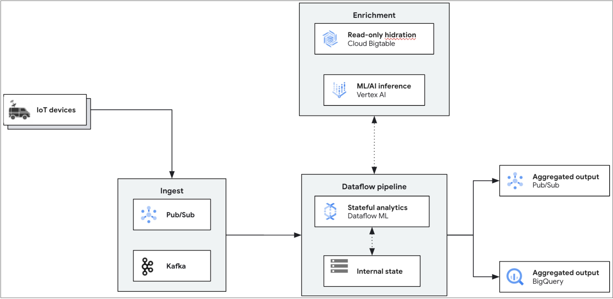

# Real-Time IoT Predictive Maintenance Analytics (Python)

This production-grade Apache Beam pipeline demonstrates how to use Google Cloud Dataflow to process real-time IoT vehicle telemetry events from Cloud Pub/Sub, enrich streaming records with Cloud Bigtable vehicle maintenance history, perform stateful windowed aggregations, execute in-worker ML predictive maintenance inference using Beam's `RunInference`, and route results to Google BigQuery (analytical storage) and Cloud Pub/Sub (real-time alert notifications).

This pipeline is part of the [Dataflow IoT Analytics Solution Guide](../../use_cases/IoT_Analytics.md).

## Architecture



### Pipeline Stages

1. **Streaming Data Ingestion**:
   - Ingests raw vehicle telemetry events from Cloud Pub/Sub (`ParseVehicleEventDoFn`).
   - Parses JSON payloads, validates sensor readings (temperature, vibration, speed, mileage), extracts event timestamps, and increments Beam monitoring counters (`events_parsed`, `events_parse_errors`).
2. **Stateful Windowed Metric Aggregation**:
   - Groups telemetry streams by `vehicle_id` using stateful processing (`AggregateVehicleMetricsDoFn`).
   - Uses persistent state accumulators (`CombiningValueStateSpec`) to compute rolling maximum temperature, maximum vibration, and latest timestamps across sliding/tumbling windows.
   - Clears state properly on timer expiration to ensure deterministic memory bounds.
3. **Bigtable Metadata Enrichment**:
   - Asynchronously enriches aggregated vehicle telemetry with maintenance history retrieved from Cloud Bigtable (`EnrichWithBigTableDoFn`).
   - Looks up vehicle attributes (last service date, past maintenance type, engine model) using `vehicle_id` as the row key.
   - Fallback defaults ensure pipeline resilience if a vehicle's metadata is not yet populated in Bigtable.
4. **Feature Engineering & Worker-Local Inference**:
   - `ExtractFeaturesDoFn` constructs standardized numerical feature vectors `[max_temperature, max_vibration, days_since_last_service]`.
   - `RunInference` with `SklearnModelHandlerNumpy` loads a local Random Forest classifier (`maintenance_model.pkl`) directly into worker memory, avoiding remote API latency and quota bottlenecks.
5. **Dual Sink Routing**:
   - **Google BigQuery**: Formats complete enriched records with inference classifications (`needs_maintenance: 0` or `1`) and writes to `iot.maintenance_analytics` via the BigQuery Storage Write API (`STORAGE_WRITE_API`).
   - **Cloud Pub/Sub Alerts**: Filters records where `needs_maintenance == 1` and immediately routes formatted JSON alerts to the `maintenance-alerts` Pub/Sub topic for downstream alerting and work-order dispatching.

---

## Prerequisites

- Python 3.14
- Google Cloud SDK (`gcloud`)
- Access to a Google Cloud Project with Billing and Dataflow APIs enabled
- Provisioned infrastructure via `terraform/iot_analytics`

---

## Machine Types & Worker Sizing

Because inference runs worker-locally with Scikit-Learn in worker memory, costly GPU accelerators are unnecessary.
- **Recommended Dataflow Worker Type**: `n2-standard-4` (4 vCPUs, 16 GB memory)
- **Networking**: Strictly private worker IPs (`--no_use_public_ips`) with Private Google Access enabled on the subnetwork.

---

## Quickstart & Local Execution

You can run and test the entire pipeline locally using `DirectRunner` before submitting to Google Cloud:

1. **Install Dependencies**:
   ```bash
   pip install -r requirements.txt -r requirements-dev.txt
   pip install -e .
   ```

2. **Train the Worker-Local Model (if modifying model features)**:
   ```bash
   python scripts/model.py
   ```
   *This generates `maintenance_model.pkl` in the pipeline root.*

3. **Run Unit Tests**:
   ```bash
   pytest tests/
   ```

4. **Run Locally with DirectRunner**:
   ```bash
   ./scripts/02_run_local.sh
   ```

---

## End-to-End Google Cloud Deployment

### 1. Provision Infrastructure
Deploy all required GCP resources (Pub/Sub topics, Bigtable instance & table, BigQuery dataset & table, Artifact Registry, Service Account):

```bash
cd ../../terraform/iot_analytics
terraform init
terraform apply
cd ../../pipelines/iot_analytics
```

### 2. Load Environment Variables
Source the environment script automatically generated by Terraform:

```bash
source ./scripts/00_set_environment.sh
```

### 3. Generate & Populate Reference Data
Generate synthetic vehicle telemetry and maintenance historical records:

```bash
python ./scripts/create_data.py
```

Populate the Bigtable lookup table with historical service metadata:

```bash
python ./scripts/create_and_populate_bigtable.py
```

### 4. Build Custom Worker Container
Build and push the Dataflow worker container to Artifact Registry using Cloud Build:

```bash
./scripts/01_cloud_build_and_push.sh
```

### 5. Submit the Streaming Pipeline to Dataflow
Launch the streaming job with the custom worker container and private worker networking:

```bash
./scripts/02_submit_job.sh
```

### 6. Publish Streaming Telemetry
Stream synthetic IoT vehicle events to the input Pub/Sub topic:

```bash
# Publish a single batch of simulated telemetry
python ./scripts/publish_on_pubsub.py

# Or stream continuous events with real-time timestamps:
python ./scripts/publish_on_pubsub.py --continuous --interval 1.0
```

### 7. Inspect Outputs

- **BigQuery Analytical Records**:
  Query the BigQuery table to inspect processed telemetry and predictions:
  ```sql
  SELECT vehicle_id, max_temperature, max_vibration, last_service_date, needs_maintenance, latest_timestamp
  FROM `YOUR_PROJECT_ID.iot.maintenance_analytics`
  ORDER BY latest_timestamp DESC
  LIMIT 20;
  ```

- **Real-Time Maintenance Alerts**:
  Pull alerts from the downstream Pub/Sub alert subscription:
  ```bash
  gcloud pubsub subscriptions pull $ALERT_SUBSCRIPTION_ID --auto-ack --limit=5
  ```

---

## Repository Structure

```
pipelines/iot_analytics/
├── Dockerfile                      # Custom Dataflow worker container image
├── MANIFEST.in                     # Source distribution packaging manifest
├── README.md                       # Pipeline documentation and runbook
├── cloudbuild.yaml                 # Cloud Build recipe for worker image
├── maintenance_model.pkl           # Pre-trained Scikit-Learn Random Forest model
├── pyproject.toml                  # Modern Python build-system configuration
├── requirements.txt                # Production runtime dependencies
├── requirements-dev.txt            # Development, linting, and testing dependencies
├── setup.py                        # Beam pipeline package specification
├── iot_analytics_pipeline/         # Core Apache Beam pipeline package
│   ├── __init__.py
│   ├── aggregate_metrics.py        # Stateful windowed vehicle metrics aggregation
│   ├── bigtable_enrichment.py      # Cloud Bigtable asynchronous lookup transform
│   ├── options.py                  # Pipeline CLI and runtime options
│   ├── parse_timestamp.py          # Pub/Sub payload parser and validator
│   ├── pipeline.py                 # Pipeline topology definition and runner
│   └── trigger_inference.py        # Feature extraction and RunInference formatting
├── scripts/                        # Operational scripts and data utilities
│   ├── 00_set_environment.sh       # Generated environment configuration
│   ├── 01_cloud_build_and_push.sh  # Build worker container image
│   ├── 02_run_local.sh             # Run pipeline locally with DirectRunner
│   ├── 02_submit_job.sh            # Launch Dataflow streaming job
│   ├── create_and_populate_bigtable.py # Seed Cloud Bigtable rows
│   ├── create_data.py              # Synthesize test vehicle & maintenance data
│   ├── model.py                    # Scikit-Learn training script
│   └── publish_on_pubsub.py        # Stream synthetic events to Pub/Sub
└── tests/                          # Unit test suite
    ├── __init__.py
    ├── test_aggregate_metrics.py
    ├── test_parse_timestamp.py
    └── test_pipeline.py
```