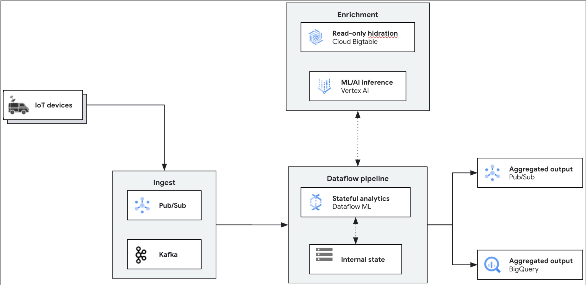

# IoT Analytics (Python)

This sample pipeline demonstrates how to use Dataflow to process realtime IoT data (from a pubsub topic) and enrich it using BigTable to further use to run inference on live data and populate realtime results on BigQuery table.


This pipeline is part of the [Dataflow IoT Analytics solution guide](../../use_cases/IoT_Analytics.md).

## Architecture

The generic architecture for an inference pipeline is shown below:



In this directory, you will find a specific implementation of the above architecture, with the
following stages:

1. **Data ingestion:** Reads data from a Pub/Sub topic.
For more information about Pub/Sub [ Cloud Pub/Sub Overview]( https://cloud.google.com/pubsub/docs/overview).
2. **Data preprocessing:** While this sample pipeline doesn't perform any transformations, you can easily add a preprocessing step using the
   [the Enrichment transform](https://cloud.google.com/dataflow/docs/guides/enrichment) for feature engineering before invoking the model.

3. **Inference:** Uses the RunInference transform with VertexAIModelHandlerJSON, which in turn sends online prediction request to an Auto-ML generated model. The pipeline uses a GPU with the Dataflow worker, to speed up the inference. For more information about Vertex AI [Vertex AI Overview](https://cloud.google.com/vertex-ai/docs/overview).

4. **Predictions:** The predictions are sent to BigQuery table.

## Getting Started

## Choosing Your Cloud Region

It's important to choose your cloud region carefully, as not all Google Cloud services and features are available in every region.

Tip: The default settings in this directory have been tested and work well in the us-central1 region. If you choose a different region, you may need to adjust some settings.

## Choosing Your Machine Type:

The cloudbuild.yaml file currently uses the E2_HIGHCPU_8 machine type. If this type isn't available in your chosen region, you'll need to edit the file and select a different machine type that is supported.
[Machine types](https://cloud.google.com/compute/docs/machine-types)


## Choosing Your Dataflow Worker Machine Type

The `scripts/00_set_environment.sh` file also specifies the machine type for your Dataflow workers. We recommend `g2-standard-4` for optimal GPU inference performance.

If `g2-standard-4` isn't available in your region, you can list suitable machine types using this command (replace <ZONE A>, <ZONE B>, etc. with your desired zones):

```sh
gcloud compute machine-types list --zones=<ZONE A>,<ZONE B>,.
```

See more info about selecting the right type of machine Type in the [Machine Types](https://cloud.google.com/compute/docs/machine-types)


## Next Steps

## Launch the pipeline

All scripts are in the scripts directory and designed to run from the project's root directory.

In the script `scripts/00_set_environment.sh`, define the value of the project id and the region variable:

```
export PROJECT_ID=<YOUR_PROJECT_ID>
export REGION=<YOUR_CLOUD_REGION>
export CONTAINER_URI=<YOUR_CONTAINER_URI>
export BIGTABLE_INSTANCE_ID=<BIGTABLE_INSTANCE_ID> #same as specified on terraform
export BIGTABLE_TABLE_ID=<BIGTABLE_TABLE_ID> #same as specified on terraform
export VEHICLE_DATA_PATH=<LOCAL_FILE_PATH_FOR_VEHICLE_DATA> #will get generated as part of the setup steps
export MAINTENANCE_DATA_PATH=<LOCAL_FILE_PATH_FOR_MAINTENANCE_DATA> #will get generated as part of the setup steps
export PUBSUB_TOPIC_ID=<YOUR_PUBSUB_TOPIC_ID> #same as specified on terraform
export MODEL_FILE_PATH=<LOCAL_MODEL_FILE_PATH> #call model.py to generate the file
export SERVICE_ACCOUNT=<YOUR_DATAFLOW_SERVICE_ACCOUNT> #same as specified on terraform
export SUBNETWORK=<YOUR_SUBNET> #same as specified on terraform
export MAX_DATAFLOW_WORKERS=<MAX_DATAFLOW_WORKERS>
export SUBSCRIPTION_ID=<PUBSUB_SUBSCRIPTION_ID>
export DATASET=<BIGQUERY_DATASET> #same as specified on terraform
export TABLE=<BIGQUERY_TABLE> #same as specified on terraform
export ROW_KEY=<BIGTABLE_ROW_KEY>
```

You can leave the remaining variables at their default values, but feel free to override them if you have specific preferences or requirements.

Once you've finished editing the script, make sure to source it again to load the updated variables into your current environment by running the following command.

```sh
source ./scripts/00_set_environment.sh
```
Next, run the python script to generate maintenance and vehicle data. This will later be populated in BigTable and PubSub

```
python ./scripts/01_create_data.py
```
This will create two .jsonl files in your local directory path, based on the variable that you specified in the first step.

Now, Create the bigtable and populate the data init with the same time publish messages in pubsub topic

```
python ./scripts/03_create_and_populate_bigtable.py
python ./scripts/04_publish_on_pubsub.py
```

Next, run the script to build and publish the custom Dataflow container. This container will include the necessary dependencies for the worker.

```sh
./scripts/04_cloud_build_and_push.sh
```

This will create a Cloud Build job that can take a few minutes to complete. Once it completes, you
can trigger the pipeline with the following:

```sh
./scripts/05_submit_job.sh
```

## Input data

To feed data into the pipeline, publish messages to the Pub/Sub topic `PUBSUB_TOPIC_ID` that you mentioned in environment variables and created via terraform. Using this command : 
```
python ./scripts/04_publish_on_pubsub.py
```

These messages are sent directly to the endpoint without modification.

## Output data

Predictions are populated to the BigQuery table `TABLE` and can be viewed using the BigQuery console.