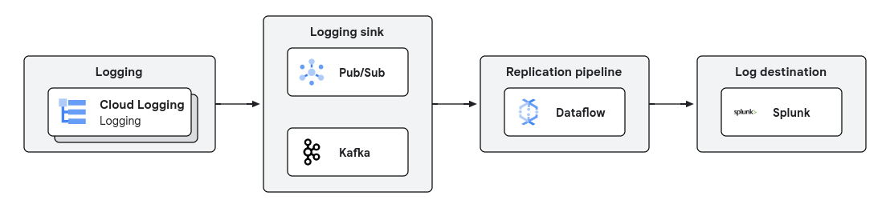

# Log replication sample pipeline (Dataflow template)

This sample pipeline reads log lines with additional metadata from a Pub/Sub 
topic, and it redirects to the corresponding log collector in Splunk. The 
pipeline leverages the 
[Google-provided Dataflow template](https://cloud.google.com/dataflow/docs/guides/templates/provided/pubsub-to-splunk).


This pipeline is part of the [Dataflow log replication & analytics solution 
guide](../../use_cases/Log_replication.md).

## Architecture

The generic architecture for both looks like this:



The Terraform code configures a Cloud Logging sink that makes sure that all 
logs are sent to the `all-logs` Pub/Sub topic.

The infrastructure required to launch the pipelines is deployed
through [the accompanying Terraform scripts in this solution guide](../../terraform/log_replication_splunk/README.md).

## How to launch the pipeline

All the scripts are located in the `scripts` directory and prepared to be launched from the top
sources directory.

The Terraform code generates a file with all the necessary variables in the 
location `./scripts/00_set_variables.sh`. Run the following command to 
apply that configuration:

```sh
source scripts/01_set_variables.sh
```

Now you can run the pipeline that will take logs from Pub/Sub and will send 
them to Splunk. You need to ensure that there is network connectivity to 
access Splunk from Dataflow (e.g. Internet access, if necessary), and that 
you have set the required credentials in the Terraform config, so Dataflow 
has the required permissions to publish into Splunk:

```sh
./scripts/01_launch_ps_to_splunk.sh
```

## Input data

All the logs produced in the project are being redirected to the Pub/Sub 
topic `all-logs`. The pipeline uses a Pub/Sub subscription, `all-logs-sub`, 
so no logs are lost if the pipeline is stopped (during the retention period 
of the subscription, which is 30 days by default).

The regular operation of the project (e.g. launching Dataflow) should 
already produce some logs as to observe some output in Splunk for testing 
purposes.

## Output data

There are two outputs in this pipeline:
* Splunk, written to the HEC endpoint
* Dead letter queue, the `deadletter-topic` Pub/Sub topic

When Splunk rejects messages for whatever reason, they are sent to the 
`deadletter-topic`.

If the Splunk endpoint rejects messages because it is overloaded, times out, 
etc, Dataflow will retry publishing those messages in Splunk. Only the 
messages that are rejected by Splunk due to non-transitory errors are sent 
to the dead letter queue.