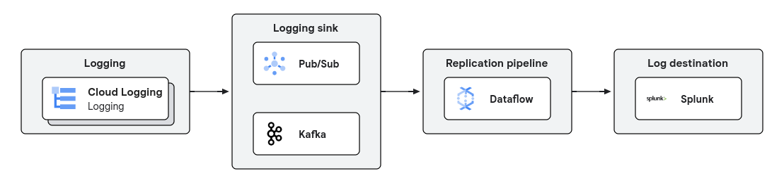

# Log replication sample pipeline (Dataflow template)

This sample pipeline reads log lines with additional metadata from a Pub/Sub 
topic, and it redirects to the corresponding log collector in Splunk. The 
pipeline leverages the 
[Google-provided Dataflow template](https://cloud.google.com/dataflow/docs/guides/templates/provided/pubsub-to-splunk).


This pipeline is part of the [Dataflow log replication & analytics solution 
guide](../../use_cases/Log_replication.md).

## Architecture

The generic architecture for both looks like this:



The Terraform code configures a Cloud Logging sink that makes sure that all 
logs are sent to the `all-logs` Pub/Sub topic.

The infrastructure required to launch the pipelines is deployed
through [the accompanying Terraform scripts in this solution guide](../../terraform/log_replication_splunk/README.md).

## How to launch the pipeline

All the scripts are located in the `scripts` directory and prepared to be launched from the top
sources directory.

The Terraform code generates a configuration file with all the necessary variables at `scripts/00_set_variables.sh`. Run the following command to load that configuration:

```sh
source scripts/00_set_variables.sh
```

Now you can run the pipeline that reads logs from Pub/Sub and forwards them to Splunk via the HTTP Event Collector (HEC):

```sh
./scripts/01_launch_ps_to_splunk.sh
```

## Input data

All logs produced in the Google Cloud project are redirected to the Pub/Sub topic `splunk-logs` via the Cloud Logging sink (`splunk-logging-sink`). The pipeline consumes logs from the Pub/Sub subscription `splunk-logs-sub`, ensuring no logs are lost if the pipeline is temporarily stopped.

You can also manually publish test log messages to the topic:

```sh
gcloud pubsub topics publish splunk-logs --message='{"event": "test log event", "severity": "INFO", "source": "manual-test"}'
```

## Output data & verification

There are two outputs in this pipeline:
* **Splunk**: Log events successfully delivered to the Splunk HEC endpoint.
* **Dead-letter queue (`splunk-deadletter-topic`)**: Log events that are rejected by Splunk due to non-transitory errors or permanent failures.

### Option A: Inspecting Logs in Splunk Web UI (Demo Mode)

If you deployed the demo Splunk instance (`deploy_demo_splunk = true` in Terraform), you can securely connect to the Splunk Web UI from your local browser without exposing public endpoints using Google Cloud Identity-Aware Proxy (IAP):

```sh
# Method 1: SSH Port Forwarding over IAP (Recommended)
gcloud compute ssh $SPLUNK_DEMO_INSTANCE \
    --zone=$ZONE \
    --project=$PROJECT \
    -- -N -L 8501:localhost:8000

# Method 2: Direct IAP TCP Forwarding
gcloud compute start-iap-tunnel $SPLUNK_DEMO_INSTANCE 8000 \
    --local-host-port=localhost:8501 \
    --zone=$ZONE \
    --project=$PROJECT
```

1. Open `http://localhost:8501` in your browser.
2. Log in with username `admin` and the password configured in `terraform.tfvars` (default: `SplunkDemoPass123!`).
3. Navigate to **Apps > Search & Reporting** and run a search (e.g. `index=*` or `sourcetype=*`) to view your Google Cloud logs in real time.

### Option B: Monitoring the Dead-Letter Queue

If messages cannot be delivered to Splunk, they are automatically routed to the dead-letter topic. You can monitor and inspect rejected events using the `splunk-deadletter-sub` subscription:

```sh
gcloud pubsub subscriptions pull splunk-deadletter-sub --auto-ack --limit=10
```