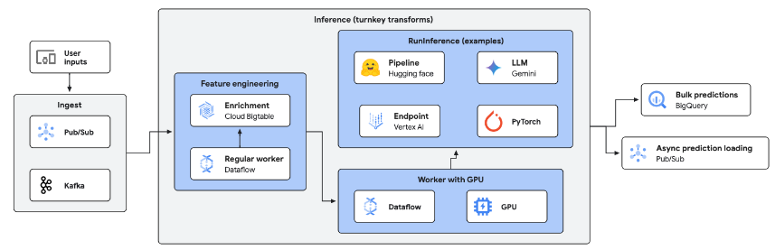

# GenAI & Machine Learning inference sample pipeline (Python)

This sample pipeline demonstrates how to use Dataflow to process streaming data and calculate real-time predictions using GenAI, specifically the [Google open source Gemma 4 model](https://ai.google.dev/gemma) (e.g. `google/gemma-4-E2B-it`) powered by **vLLM** on **Python 3.14**.

This pipeline is part of the [Dataflow Gen AI & ML solution guide](../../use_cases/GenAI_ML.md).

## Architecture

The generic architecture for an inference pipeline looks like as follows:



In this directory, you will find a specific implementation of the above architecture, with the following stages:

1. **Data ingestion:** Reads incoming prompt requests from a Pub/Sub topic.
2. **Data preprocessing:** The sample pipeline decodes messages, but it is trivial to add a preprocessing step leveraging [the Enrichment transform](https://cloud.google.com/dataflow/docs/guides/enrichment) to perform feature lookup and prompt engineering before calling the model.
3. **Inference:** Uses Apache Beam's `RunInference` transform with a custom `GemmaModelHandler` powered by **vLLM**. Model weights are baked directly into the container image at `/opt/models/gemma`, ensuring zero runtime downloads and low latency streaming inference on NVIDIA L4 GPUs (`g2-standard-4`).
4. **Predictions:** The generated text responses are published to another Pub/Sub topic as output.

## Gemma 4 model & Baked Container Weights

By default, the pipeline uses **Gemma 4** (`google/gemma-4-E2B-it`), which fits comfortably on the **24 GB NVIDIA L4 GPU** (`g2-standard-4`) provisioned by Terraform.

Model weights are baked into the container image during the Cloud Build step (`01_build_and_push_container.sh`) into `/opt/models/gemma`, allowing Dataflow workers to boot and perform offline streaming inference immediately without contacting external repositories.

## Selecting the cloud region and worker hardware

The Terraform deployment configures **`g2-standard-4`** workers equipped with an **NVIDIA L4 GPU** and 16 GB system memory, which is the recommended configuration for modern LLM inference on Dataflow.

You can verify available GPU accelerator machine types in your region with:

```sh
gcloud compute machine-types list --zones=<ZONE A>,<ZONE B>,...
```

See more info about selecting machine types:
* https://cloud.google.com/compute/docs/machine-resource

## How to launch the pipeline

All the scripts are located in the `scripts` directory and prepared to be launched from the `pipelines/ml_ai_python` directory.

The Terraform deployment automatically creates the environment script `scripts/00_set_variables.sh` with all the required resource names and configuration settings.

1. **Load environment variables**:
   ```sh
   source scripts/00_set_variables.sh
   ```

2. **Build and publish the custom Dataflow worker container**:
   Build the custom container packaging Python 3.14, vLLM, PyTorch with CUDA 12 support, baked Gemma 4 weights, and Apache Beam 2.75.0:
   ```sh
   ./scripts/01_build_and_push_container.sh
   ```

3. **Launch the streaming Dataflow job**:

> [!IMPORTANT]
> **Python Version Matching:**
> When submitting the pipeline using `DirectRunner` or `DataflowRunner`, ensure that the Python minor version in your local submission environment matches the Python version in the custom worker container image (**Python 3.14**). If a different version is used at submission time, Apache Beam's runtime descriptor verification and object deserialization on the worker will fail with a `RuntimeError: Pipeline construction environment and pipeline runtime environment are not compatible`.
>
> You can create a matching virtual environment using `uv` or `venv`:
> ```sh
> uv python install 3.14
> uv venv .venv --python 3.14
> source .venv/bin/activate
> pip install -r requirements.txt -e .
> ```

Launch the pipeline to Dataflow:
```sh
./scripts/02_run_dataflow.sh
```

## Input data

To send data into the pipeline, publish messages to the `messages` Pub/Sub topic:
```sh
gcloud pubsub topics publish messages --message="Explain how Apache Beam streaming inference works with Gemma on GPUs."
```

## Output data

The predictions are published into the topic `predictions`, and can be observed using the subscription `predictions-sub`:
```sh
gcloud pubsub subscriptions pull predictions-sub --auto-ack --limit=5
```