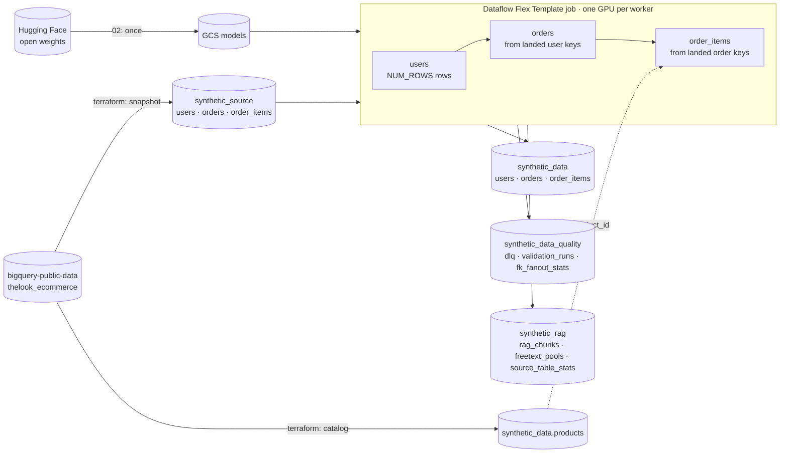
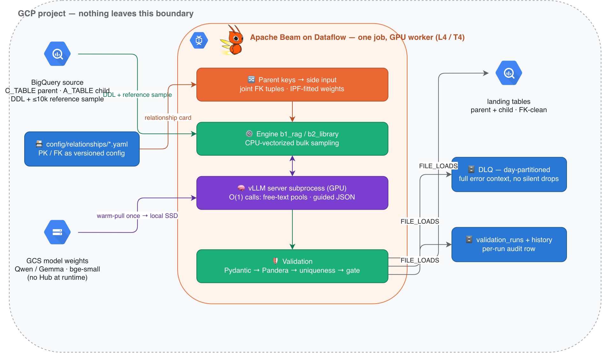

# Synthetic data generation with self-hosted LLMs (Python)

This pipeline is part of the [Dataflow synthetic data generation solution guide](../../use_cases/Synthetic_Data_Generation.md).

> [!NOTE]
> **This directory is a synchronized replica.** The golden source is
> [albertols/synthetic-llm-dataflow-bigquery](https://github.com/albertols/synthetic-llm-dataflow-bigquery);
> `.sync-source.json` records the exact commit. Open issues and pull requests
> there: files here are replaced by the next sync.

## Deploy and run on Google Cloud

The job reads the DDL and a bounded sample of each source table, runs an
open-weight LLM with vLLM on NVIDIA L4 (or T4) Dataflow workers, and writes validated
synthetic rows to BigQuery. The demo generates three related tables from the
fictitious [`thelook_ecommerce`](https://console.cloud.google.com/marketplace/product/bigquery-public-data/thelook-ecommerce)
public dataset, keeping every foreign key valid.



| Step | Command (from this directory) | What it does |
| :-- | :-- | :-- |
| 0 | `terraform apply` in [`terraform/synthetic-llm-dataflow-bigquery`](../../terraform/synthetic-llm-dataflow-bigquery/README.md) | Service accounts, Artifact Registry, bucket, datasets, source snapshots, landing tables with the public schemas, `config/bq_schema` tables; writes `scripts/00_set_variables.sh` |
| 1 | `./scripts/01_build_and_push_container.sh` | Builds the launcher + GPU worker image with Cloud Build |
| 2 | `./scripts/02_stage_models.sh` | Copies Gemma 4 E4B-it (or `MODEL=qwen3-4b`) and the bge-small embedder from Hugging Face (or `MODEL_SOURCE=modelscope`) to GCS, once |
| 3 | `./scripts/03_build_flex_template.sh` | Publishes the Flex Template spec |
| 4 | `./scripts/04_run_dataflow.sh [NUM_ROWS]` | Launches users → orders → order_items in one job with `config/relationships/gcp_public_fk_example.yaml` and prints `RUN_ID`; or `terraform apply -var launch_job=true` |
| 5 | `./scripts/05_verify_run.sh RUN_ID` | Row counts, PK duplicates, FK orphans and the `validation_runs` verdicts |

The model repositories are public, so step 2 needs no credentials. The
[Terraform README](../../terraform/synthetic-llm-dataflow-bigquery/README.md)
shows which tables come from `thelook_ecommerce`, the configuration files the
job reads, how the weights reach the workers, and which GPU, machine type and
vLLM dtype go together: an L4 on G2 runs either model with `vllm_dtype=auto`;
a T4 on N1 runs only `qwen3-4b`, with `vllm_dtype=float16`. Workers use private IPs only
and run as the dedicated service account created by Terraform.

Local checks, the same ones the repository CI runs:

```sh
uv sync --group dev                                  # or: pip install -r requirements.txt -r requirements-dev.txt
uv run pytest packages/sdfb-tests/tests -m "not gpu and not gcp" -q
yapf --diff -r --style yapf . && pylint --rcfile ../pylintrc .
```

To clean up, cancel any running job and run `terraform destroy` in the
Terraform directory.

---

# synthetic-llm-dataflow-bigquery

[](https://github.com/albertols/synthetic-llm-dataflow-bigquery/actions/workflows/ci.yml)
[](https://github.com/albertols/synthetic-llm-dataflow-bigquery/releases)
[](LICENSE)
[](pyproject.toml)
[](https://beam.apache.org/)
[](#cpugpu-split--vllm-serving)
[](https://beamsummit.org)
[](https://github.com/GoogleCloudPlatform/dataflow-solution-guides)

> [!NOTE]
> **Part of the [Google Cloud Dataflow Solution Guides](https://github.com/GoogleCloudPlatform/dataflow-solution-guides)**
> as the *synthetic data generation* guide: Terraform infrastructure, launch scripts and a relational demo
> on the public `thelook_ecommerce` dataset. This repository is the **golden source**; the guide's copy is
> generated from a tagged release by `/dsg-sync` ([ADR 0040](docs/adr/0040-dsg-donation-golden-source-sync.md)).

**Synthetic BigQuery data with self-hosted LLMs on Apache Beam / Dataflow.**

Generate fictitious-but-realistic synthetic rows for any BigQuery table — driven by its DDL plus a bounded reference sample, with all LLM inference **self-hosted on GPU workers inside the Dataflow pipeline**. No data or prompts ever leave the project boundary, no external AI APIs, no model hubs at runtime.

> **Beam Summit 2025** — the approach was accepted for presentation at [Apache Beam Summit 2025](https://beamsummit.org) as the session *"Building Banking Synthetic Data for a Lakehouse with Gemma"*.

## Table of contents

- [What this does — and why](#what-this-does--and-why)
- [Architecture at a glance](#architecture-at-a-glance)
- [Generation engines](#generation-engines)
- [`generation_plan` — per-type synthesis](#generation_plan--per-type-synthesis)
- [Relational generation (PK/FK)](#relational-generation-pkfk)
- [Stats-driven fidelity](#stats-driven-fidelity)
- [Validation & data quality](#validation--data-quality)
- [CPU/GPU split & vLLM serving](#cpugpu-split--vllm-serving)
- [Getting started](#getting-started)
- [CI/CD](#cicd)
- [Integration testing & validation reports](#integration-testing--validation-reports)
- [Documentation map](#documentation-map)
- [Glossary](#glossary)
- [License](#license)

## What this does — and why

Teams need realistic tabular data for development, testing, and analytics prototyping, but production BigQuery tables cannot be used directly for privacy, regulatory, and residency reasons. Masking degrades statistical realism, manual fixtures do not scale, and sending real rows to external LLM APIs to produce "lookalike data" is prohibited in regulated industries such as banking.

This pipeline reads a table's DDL and a bounded reference sample (≤10k rows, deterministic `FARM_FINGERPRINT` ordering), runs open-weight LLMs entirely inside your own cloud project, and writes validated synthetic rows back to BigQuery — with **memorization measured and gated on every run**. The fully self-hosted design (no data egress, open-weight models only, auditable per-run quality records) aligns directly with EU AI Act and data-sensitivity expectations.

**Status.** Both generation engines, relational PK/FK generation, stats-driven fidelity and the validation, dead-letter and audit chain are in place, and they have run on Dataflow GPU workers: single tables at 1M and 10M rows, and a five-table relational model in one job. What changed in each release is in the [changelog](https://github.com/albertols/synthetic-llm-dataflow-bigquery/blob/d32c34743d80c8481445956939b6bbde9c4d4a3c/CHANGELOG.md), the [releases page](https://github.com/albertols/synthetic-llm-dataflow-bigquery/releases) and the [measured release history](https://github.com/albertols/synthetic-llm-dataflow-bigquery/blob/d32c34743d80c8481445956939b6bbde9c4d4a3c/docs/releases/README.md). The evaluation framework (Tier-1/2/3 metrics) still lives on the `ws3-eval-framework` branch.

## Architecture at a glance

One Dataflow job generates parent and child tables with FK integrity by construction — and nothing leaves the project boundary:



Plain flow: `BigQuery (DDL + reference sample) → Dataflow GPU workers (GCS model weights warm-pulled; vLLM spawned in-worker; multi-threaded inference) → BigQuery (landing + DLQ + audit tables)`.

The single-job relational shape (parents generated first, their landed keys reaching the children in the same job) is [ADR 0030](docs/adr/0030-single-job-relational-generation.md); since v0.3.0 a child is generated *from* those keys rather than sampling a key pool ([ADR 0036](docs/adr/0036-parent-driven-fanout-generation.md)) — see [Relational generation](#relational-generation-pkfk). The diagram source is [`docs/assets/architecture-overview.drawio`](docs/assets/architecture-overview.drawio).

## Generation engines

Two interchangeable engines behind one `GenerationEngine` interface ([`packages/sdfb-core/src/sdfb_core/engines/base.py`](packages/sdfb-core/src/sdfb_core/engines/base.py)); the LLM runs **O(1) times per run, never per row** ([ADR 0013](docs/adr/0013-distribution-estimator-spine.md)):

- **`b1_rag` (RAG engine)** — serialize reference rows to text → embed → exact vector index → retrieve representative exemplars → LLM infers per-column value pools **once** → bulk rows sampled vectorized in NumPy on CPU.
- **`b2_library` (library-wrapper engine)** — wraps the open-source [`sdgx`](https://github.com/hitsz-ids/synthetic-data-generator) synthesizer (CTGAN backend, empirical fallback), fitted once per worker; the LLM only patches free-text columns with bounded value pools.

**RAG retrieval, in brief.** FAISS `IndexFlatIP` (exact inner product over L2-normalized vectors = cosine; deterministic, single-threaded search) holds ≤1,024 vectors per worker. Default retrieval takes the top-k = 8 exemplars nearest the centroid of all row vectors (the most *typical* rows condition the LLM); a greedy k-center mode picks a maximally *diverse* set instead, with a rotating re-seed variant to escape pool stagnation. Free-text columns retrieve exemplar *values* of that column. Rows are serialized GReaT-style ([arXiv 2210.06280](https://arxiv.org/abs/2210.06280)) and the persisted `chunk_text` is byte-identical to what the engine embeds, so stored vectors are safely reusable across runs. Full geometry: [`docs/designs/2026-07-25-rag-retrieval-geometry-roadmap.md`](docs/designs/2026-07-25-rag-retrieval-geometry-roadmap.md).

**Embedder.** [`bge-small-en-v1.5`](https://huggingface.co/BAAI/bge-small-en-v1.5) (MIT): 384-dim sentence embeddings, ~127 MiB on disk — small enough to co-reside with a multi-GB generation model, and demoted to CPU immediately after the bulk embed so vLLM gets the GPU (CUDA is used only when ≥512 MiB VRAM is free). Weights are staged in GCS and loaded offline — never from Hugging Face Hub at runtime.

**Persisted free-text pools.** LLM-generated value pools are stored in BigQuery keyed by `(reference_digest, model_uri, column, target)`. Measured motivation: a 1M-row run without persistence rebuilt pools 36× ≈ **19.1 GPU-hours** of duplicated LLM time ([ADR 0020](docs/adr/0020-freetext-pools-as-persisted-artifact.md)).

## `generation_plan` — per-type synthesis

Every run emits one structured `generation_plan` milestone log line (engine, per-column strategy map, seed strategy, pool sources) — the run's synthesis strategy is auditable from worker logs alone.

| Column type | Synthesis approach |
|---|---|
| **Constant** (1 distinct value) | Copied verbatim — never modeled. |
| **Integer** | Sampled within the observed `[min, max]` (uniform or exemplar-anchored blend), rounded; out-of-range values redrawn, not clipped. ≤20 distinct values → treated as categorical ("enum in disguise"). |
| **Float / NUMERIC** | Same range sampling; `NUMERIC`/`BIGNUMERIC` quantized to the exact DDL decimal scale. |
| **Date / Datetime / Timestamp** | Mapped to an epoch axis, sampled within the observed range, rendered back to the native type / observed format. Interim **now−10y floor** keeps generated dates recent; **sentinel years (0001, 9999) preserved at their observed frequency**; ≤20 distinct → categorical; TIME exempt from the floor. |
| **Categorical** (incl. Boolean) | Empirical frequency table measured from the full reference sample; a `similarity` knob blends empirical ↔ uniform; **never invents unseen categories**; nulls re-applied at the observed rate. |
| **String** | Routed by shape: ≤50 distinct → categorical · date-shaped → temporal · identifier-shaped → deterministic shaped identifiers (never reach the LLM) · high-cardinality/long → free-text. |
| **Freetext** | The only LLM-generated kind: schema-constrained **guided-JSON decoding** fills a bounded pool of novel values, sampled with replacement. `strict_freetext` fails the run loudly rather than silently copying source values. |
| **Primary key / identity** | Derived per row from `blake2b(run_id, batch_id, row_index, column)` — **never from reference data**; salted `run_id` + deterministic per-batch seeds make runs reproducible and collision-free. |

Per-column **prompt constraints** (operator-declared clauses, length bands, format masks) ride the DDL contract and are enforced by a tiered constraint router ([ADR 0024](docs/adr/0024-structured-prompt-constraint-templates.md), [ADR 0028](docs/adr/0028-constraint-router-relational-plan.md)); the worked Terraform ⇄ `_ddl.json` examples live in [`docs/DDL_CONTRACT_GUIDE.md`](docs/DDL_CONTRACT_GUIDE.md).

## Relational generation (PK/FK)

Multi-table generation with **referential integrity by construction**, not post-hoc repair. One versioned model — [`config/relationships/*.yaml`](config/relationships/README.md), never a table description ([ADR 0032](docs/adr/0032-relationships-as-config.md)) — declares PK/FK/identity structure with `enabled` / `enforced` / `drives` flags, and every launcher and worker logs one **relationship card** so the enforced shape is auditable per run.

**What v0.3.0 changed**, one sentence each:

- **Children are generated FROM their parent's landed keys** ([ADR 0036](docs/adr/0036-parent-driven-fanout-generation.md)): the source's children-per-parent-key histogram is measured once against the source table (cached between launches when `--fk_fanout_stats_table` names one), the child's row count is *derived* from it rather than taken from `--num_rows`, and the PK members that complete the key outside the driving edge are drawn **without replacement per parent key** wherever they are enumerable — so the parent/child ratio, the child's key uniqueness and its referential integrity all hold by construction instead of being rejected afterwards. The two 10M-row launches that motivated this lost 87.9% then 56.5% of their rows to `pk.duplicate`, drawing those same keys at random ([ADR 0035](docs/adr/0035-pk-capacity-fk-bound-members.md)).
- **A child may have SEVERAL parents** ([ADR 0037](docs/adr/0037-multi-parent-children.md)): the registry gives every enforced edge one of five roles — `driving`, `implied`, `independent`, `conditional`, `external` — and each role its own DAG path, so star schemas, diamonds, trees, chains (1:1 included), forests and a child that reaches both its parent and its grandparent all generate from one declared model. Nothing new is declared: the roles are derived from `cols` and the model's own DAG.
- **A measured conflict adjusts the model, loudly** ([ADR 0038](docs/adr/0038-measured-conflicts-adjust-the-model.md)): when a full-source measurement of the *declared* `pk:` proves it is not a key of the source, the launch drops that key from the **effective** model for the run, prints a `MODEL ADJUSTED` banner, emits the effective YAML to paste back, and carries on — rather than refusing a five-table launch over a fact the pipeline had just paid to measure. `--on_model_conflict=stop` restores the refusal; a model that contradicts *itself* still stops under both settings.

### The shapes one model can declare

**Every one of these generates from a single declared model — each child has exactly one *driving* edge it is generated from, and every other edge gets a role instead of a launch stop.** Arrows point the way the model declares them, child → the parent it references:

```mermaid
flowchart LR
  classDef beam  fill:#eb6834,color:#fff,stroke:#b44f26
  classDef cpu   fill:#1baf7a,color:#fff,stroke:#127a55
  classDef store fill:#2a78d6,color:#fff,stroke:#1d5599
  classDef data  fill:#6b7280,color:#fff,stroke:#4b5563

  subgraph star["⭐ star — a fact under two unrelated dimensions"]
    DA[("🗄️ dim_a<br/>pk A_KEY")]:::store
    DB[("🗄️ dim_b<br/>pk B_KEY")]:::store
    FACT[("🗄️ fact<br/>pk A_KEY,B_KEY,LINE_NO")]:::store
    FACT -->|"DRIVES"| DA
    FACT -->|"independent"| DB
  end

  subgraph diamond["💎 diamond — two branches rejoining"]
    TOP[("🗄️ top<br/>pk T")]:::store
    LEFT[("🗄️ left<br/>pk T,L")]:::store
    RIGHT[("🗄️ right<br/>pk T,R")]:::store
    BOT[("🗄️ bottom<br/>pk T,L,R")]:::store
    LEFT -->|"DRIVES"| TOP
    RIGHT -->|"DRIVES"| TOP
    BOT -->|"DRIVES"| LEFT
    BOT -->|"conditional on (T)"| RIGHT
  end

  subgraph tree["🌳 chain and tree — one parent each"]
    ROOT[("🗄️ root<br/>pk R")]:::store
    MID[("🗄️ mid<br/>pk R,M")]:::store
    LF1[("🗄️ leaf1<br/>pk R,M,L")]:::store
    LF2[("🗄️ leaf2<br/>pk R,M,Q")]:::store
    MID -->|"DRIVES"| ROOT
    LF1 -->|"DRIVES"| MID
    LF2 -->|"DRIVES"| MID
  end

  subgraph forest["🌲 forest — independent components, one of them 1:1"]
    AA[("🗄️ a<br/>pk A")]:::store
    BB[("🗄️ b<br/>pk A,B")]:::store
    EE[("🗄️ e<br/>pk E")]:::store
    FF[("🗄️ f<br/>pk E — the PK IS the edge")]:::store
    BB -->|"DRIVES"| AA
    FF -->|"DRIVES · 1:1"| EE
  end

  subgraph anc["🧬 a child reaching parent and grandparent"]
    GP[("🗄️ gp<br/>pk G")]:::store
    PA[("🗄️ p<br/>pk G,P")]:::store
    CH[("🗄️ c<br/>pk G,P,C")]:::store
    PA -->|"DRIVES"| GP
    CH -->|"DRIVES"| PA
    CH -->|"implied"| GP
  end
```



Read your own model off it: one parent per child is the common case and needs no flags at all; a second parent with **no column in common** with the driving edge is `independent` (the star's `dim_b`, drawn as a whole key tuple from the sampled pool); a second parent **sharing** a column is `conditional` (the diamond's `right` — `T` comes from the driving key, `R` is a candidate that exists in `right` *for that* `T`); a parent the driving parent already reaches is `implied` and costs nothing. Where no parent descends from the others and no edge is marked `drives: true`, the **first declared** edge drives and the launcher says so (`fk_driving_edge_defaulted`, WARNING) — `drives: true` is how you choose. The registry sweep pins every shape above (`packages/sdfb-tests/tests/unit/contracts/test_relationship_shapes.py`) and the DirectRunner suite generates them end to end with whole-tuple FK checks (`packages/sdfb-tests/tests/unit/test_fanout_shapes.py`); the two multi-parent shapes are a runnable sample: [`config/relationships/example_star_diamond.yaml`](config/relationships/example_star_diamond.yaml).

### One arrow in the job graph can carry several keys

A child with several foreign keys usually shows **one** incoming arrow in the Dataflow job graph, not one per key. That is correct, not a missing edge: the job graph draws **data dependencies**, and an `implied` edge moves no data — the child copies those columns out of the driving key tuple it already received. The full role → job-graph mapping, and how to *prove* integrity after a run instead of inferring it from the picture, is in [`config/relationships/README.md` § What the Dataflow job graph draws](config/relationships/README.md#what-the-dataflow-job-graph-draws).

### The rest of the chain, unchanged

- **Joint FK draws** ([ADR 0031](docs/adr/0031-joint-fk-key-draws.md)): where a child draws from a key pool — an `independent` or `external` edge — FK columns are drawn as **joint key tuples from observed parent combinations**, weighted by IPF-fitted marginals; drawing composite keys per-column would have produced ≥97% orphans on the measured two-table case.
- **Single-job pipeline** ([ADR 0030](docs/adr/0030-single-job-relational-generation.md)): one Dataflow job generates the whole enabled component, parents first — one vLLM server, table-tagged logs, no cross-job key handoff.
- **Launch scenarios** ([ADR 0029](docs/adr/0029-fk-model-scenarios-and-history-mappings.md)): minimal-input launches (landing table + flag), derived FK activation, and closure expansion resolve which tables join a run.
- **Orphan gate**: `fk.orphan` findings are BLOCKER-severity — a run that would land orphaned child rows fails. `fk.unmatched` (ADR 0037) is its deliberate opposite: a driving key whose conditional parent holds no candidate is an *input* fact, dropped before any GPU spend and counted, not a generator regression.

**Measured on Dataflow.** Two launches back the relational path:

- **The R6 pair** ([ADR 0033](docs/adr/0033-pool-ladder-integrity-at-scale.md)): 1M and 10M rows per table with FK enforcement, **0 orphans in 10,000,000 child rows** (job `2026-08-26_05_01_16-3186876581127148459`, aggregates in the [v0.1.0 release report](https://github.com/albertols/synthetic-llm-dataflow-bigquery/blob/d32c34743d80c8481445956939b6bbde9c4d4a3c/docs/releases/v0.1.0/report.md)). The raw evidence bundle is not in the repository because it held values derived from the source table.
- **The five-table launch** `2026-09-13_06_10_16-12600311608685394436`: children generated from their parents' landed keys (ADR 0036), a child with two parents (ADR 0037), and a declared key the source disproved, adjusted at launch (ADR 0038). All five tables succeeded.

The chart comes from the two-table run that led to joint key draws. Enforcing each FK column on its own would have orphaned more child rows (97%, a derived bound) than not enforcing at all (82%, measured); drawing whole key tuples leaves none.


## Stats-driven fidelity

Marginal fidelity is driven by a persisted per-column profile (`source_table_stats`: entropy, decile vectors, null/empty fractions, temporal mixes) measured once driver-side ([ADR 0022](docs/adr/0022-stats-driven-generation.md)). Numeric and temporal draws go through **inverse-CDF sampling over 11-point decile vectors** — draws land where the source is dense, instead of uniform-in-range sampling flattening skewed columns:


Skew is tracked with **normalised entropy** and **`top1_share`** (a balanced enum and one with 85% of rows on a single value have the same distinct count but very different entropy); the entropy gap between source and landing profiles doubles as a free mode-collapse check. The optional `--source_stats=exact` tier adds ONE approximate-aggregate `SELECT` (BigQuery HLL++) over the live table for true cardinality, fixing sample-capped pool starvation. Full geometry and figures: [`docs/designs/2026-08-05-source-table-stats.md`](docs/designs/2026-08-05-source-table-stats.md).

## Validation & data quality

**Three lines of defense, in-pipeline (Mode A):**

1. **Pydantic** — per-record type/constraint validation against a model generated from the BQ DDL.
2. **Pandera** — batched dataframe validation (1,000–10,000 rows per frame, all failures collected lazily): dtypes, nullability, primary-key uniqueness, strict column set, string max-length.
3. **Uniqueness** — run-scoped duplicate and identity-collision enforcement.

**DLQ pattern (no silent drops, ever).** Four tagged failure sources (engine errors, Pydantic-invalid, Pandera-invalid, duplicates) are normalized (`error_type`, `error_detail`, `rule_id`, `pipeline_step`, `run_id`, timestamp) and appended to a day-partitioned `synthetic_data_quality.dlq` table — every rejected row stays queryable with full error context.

**Thresholds gate.** Severity ladder BLOCKER → job FAILED / CRITICAL / MAJOR / MINOR; the observed blocker ratio is checked against a per-environment budget (dev 20% · uat 5% · prd 1%). The gate fires *after* BigQuery load jobs commit, so the audit row always lands even when the run fails. Every run writes one summary row to `synthetic_data_quality.validation_runs`.

**Memorization gate.** Any identical real/synthetic row match, or a per-column `copy_ratio` at/above the privacy threshold on a high-cardinality column, fails the run — in every environment (pass criteria: [`docs/RUN_PLAYBOOK.md`](https://github.com/albertols/synthetic-llm-dataflow-bigquery/blob/d32c34743d80c8481445956939b6bbde9c4d4a3c/docs/RUN_PLAYBOOK.md)).

**Evaluation framework** (branch `ws3-eval-framework`, merge pending): Tier 1 statistical metrics (KS/Wasserstein, total variation, PSI/JSD, correlation & mutual-information drift, DCR/NNDR privacy distances), Tier 2 SDMetrics quality/diagnostic reports → a single 0–1 `fidelity_overall_score`, Tier 3 opt-in SynthEval/Evidently.

## CPU/GPU split & vLLM serving

- One homogeneous worker pool per job; the split is **by stage, not by machine**: bulk row synthesis, validation, and IO are pure CPU (vectorized NumPy); the GPU is touched O(1) — free-text pool building via vLLM, plus the optional embedding pass.
- Machine matrix: **L4 → `g2-standard-8`** · **T4 → `n1-standard-8` + T4** (cost-capped experimentation) · **`e2-standard-8`, no GPU** for fake-client CI tiers.
- **vLLM spawn**: each worker warm-pulls model weights from GCS to local SSD once (idempotent marker + file lock), then spawns a single vLLM OpenAI-server subprocess owned by the engine's DoFn lifecycle ([ADR 0014](docs/adr/0014-vllm-model-client-owns-server.md)). VRAM is measured first — `gpu_memory_utilization` and `max-model-len` are fitted to actual free memory *before* spawn.
- **Resilience**: server shared across threads via lock + refcount; spawn-failure suppression after 3 strikes; a lost spawn race adopts the healthy server instead of killing it. Up to 4 threads build column pools concurrently against vLLM's continuous batching; byte-identical prompt prefixes exploit [vLLM automatic prefix caching](https://docs.vllm.ai/en/latest/features/automatic_prefix_caching.html).
- **Autoscaling deliberately capped** (max workers 1–4) — GPU capacity and spend stay bounded; `no_use_multiple_sdk_containers` gives exactly one SDK process the GPU; all sinks use BigQuery **`FILE_LOADS`** (batch-shaped, cheaper than streaming inserts).

## Getting started

**Laptop (no GPU, no GCP)** — pure-Python development with mocked inference:

```bash
uv sync --group dev
uv run pytest -m "not gpu and not gcp" -q   # expect all green
uv run ruff check .
uv run mypy packages/sdfb-core/src          # hard CI gate — 0 errors
```

**Workspace layout:**

```
packages/sdfb-core/    pure-Python contracts, codegen, engines, prompt templates (no Beam/GCP/torch)
packages/sdfb-beam/    Apache Beam pipeline + DoFns; extras: [gpu] vllm+torch, [embedding] faiss, [library] sdgx
packages/sdfb-tests/   unit + hypothesis + DirectRunner integration tests
config/                models.yml, thresholds.yml, bq_schema/, relationships/ — env-scoped knobs
docker/                custom container for GPU Dataflow workers (built in CI)
scripts/               ddl extraction, e2e probes/reports, release tooling, figure generators
composer/              Airflow DAG for scheduled Dataflow launches
public_cloud/deploy/gcp/  personal-GCP E2E layer (bootstrap, cost caps, run driver)
```

- **GPU machine / M4 onboarding** → [`docs/M4_SETUP.md`](https://github.com/albertols/synthetic-llm-dataflow-bigquery/blob/d32c34743d80c8481445956939b6bbde9c4d4a3c/docs/M4_SETUP.md)
- **What must exist before a run** (buckets, datasets, IAM) → [`docs/DEPLOYMENT_PREREQUISITES.md`](docs/DEPLOYMENT_PREREQUISITES.md)
- **Personal-GCP cost-capped runs** → [`public_cloud/deploy/gcp/README.md`](https://github.com/albertols/synthetic-llm-dataflow-bigquery/blob/d32c34743d80c8481445956939b6bbde9c4d4a3c/public_cloud/deploy/gcp/README.md)
- **Model weight layout in GCS** → [`docs/MODEL_LAYOUT.md`](docs/MODEL_LAYOUT.md)

## CI/CD

Builds are CI-driven, never local Docker builds ([ADR 0008](docs/adr/0008-ci-driven-builds.md)). The public build path is Cloud Build: the one GPU image for launcher and workers goes to Artifact Registry, then the Flex Template is built from it. The GitHub Actions in this repository run the laptop suite and the release layer. Every merge to master is tagged with SemVer derived from the squash-merge title, and the release Action regenerates [`docs/releases/`](https://github.com/albertols/synthetic-llm-dataflow-bigquery/blob/d32c34743d80c8481445956939b6bbde9c4d4a3c/docs/releases/README.md) — a deterministic before/after metrics report diffed from committed evidence bundles, no GCP access needed. Worker-image registry decision: [ADR 0015](docs/adr/0015-worker-image-via-artifact-registry.md); a runnable build-and-deploy path on your own project: [`public_cloud/deploy/gcp/README.md`](https://github.com/albertols/synthetic-llm-dataflow-bigquery/blob/d32c34743d80c8481445956939b6bbde9c4d4a3c/public_cloud/deploy/gcp/README.md).

## Integration testing & validation reports

Real-run evidence flows through a fixed contract:

- **Run** a tier from the run matrix ([`docs/E2E_TEST_MATRIX.md`](https://github.com/albertols/synthetic-llm-dataflow-bigquery/blob/d32c34743d80c8481445956939b6bbde9c4d4a3c/docs/E2E_TEST_MATRIX.md)) per the playbook ([`docs/RUN_PLAYBOOK.md`](https://github.com/albertols/synthetic-llm-dataflow-bigquery/blob/d32c34743d80c8481445956939b6bbde9c4d4a3c/docs/RUN_PLAYBOOK.md)) — GPU verdicts, Dataflow options, capacity strategy, pass criteria, launch recipes.
- **Land** metrics + reports in the local, gitignored `runs/<JOB_ID>/` bundle (`real/` verbatim, `oss/` alias-redacted twins).
- **Promote** bundles a release cites to `docs/releases/<version>/evidence/<JOB_ID>/` — the layout the release Action reads. Evidence bundles stay out of the public repo (the sensitive-content gate in `scripts/dsg/precheck.py` forbids that path); published releases carry the aggregate report only.
- **Interpret** with the report generators in [`.github/prompts/`](https://github.com/albertols/synthetic-llm-dataflow-bigquery/blob/d32c34743d80c8481445956939b6bbde9c4d4a3c/.github/prompts): the end-to-end validation report, the free-text crosscheck report, and the prompt-constraint recommender.

## Documentation map

| Layer | Where | What |
|---|---|---|
| Decisions | [`docs/adr/`](docs/adr/README.md) | 38 ADRs — every locked decision with alternatives and primary-source citations |
| Designs | [`docs/designs/`](docs/designs/) | visual-first design docs with regenerable figures ([`docs/designs/assets/`](docs/designs/assets/)) |
| Guides | [`docs/`](docs/) | run playbook, deployment prerequisites, DDL contract guide, model layout, E2E matrix |
| Releases | [`docs/releases/`](https://github.com/albertols/synthetic-llm-dataflow-bigquery/blob/d32c34743d80c8481445956939b6bbde9c4d4a3c/docs/releases/README.md) | per-version deterministic reports (aggregate metrics and charts) |
| Articles | [`docs/articles/`](https://github.com/albertols/synthetic-llm-dataflow-bigquery/blob/d32c34743d80c8481445956939b6bbde9c4d4a3c/docs/articles/README.md) | the Medium series — VCS-tracked, kept in sync with the implementation |

## Glossary

Synthetic-data concepts **as implemented here** — every term is backed by code or a measured artifact in this repo.

### Core concepts

- **Synthetic data** — artificial rows that mimic the *statistics* of a real table without containing its records.
- **Source / reference table** — the real BigQuery table being imitated; only its DDL and a bounded sample (≤10k rows) are ever read.
- **Reference sample** — the deterministic sample drawn from the source table; every distribution below is measured from it.
- **Reference digest** — SHA-256 fingerprint of the sample; keys every cached artifact and audit row, proving which data a run derived from.
- **Fidelity** — how closely synthetic data matches real-data statistics; the eval tier scores it 0–1 per run (SDMetrics `fidelity_overall_score`, branch-WIP).
- **Copy rate (`copy_ratio`)** — fraction of synthetic values in a column that also appear verbatim in the source; gated on high-cardinality columns — crossing the privacy threshold **fails the run**.
- **Memorization** — synthetic rows identical to real rows; any identical match **fails the run** in every environment.
- **DCR / NNDR** — distance-to-closest-record and nearest-neighbor distance ratio; low values mean synthetic rows sit suspiciously close to real ones (eval tier, branch-WIP).
- **Freetext column** — high-cardinality text that statistical samplers can't produce; the only place the LLM generates values, always under schema-constrained decoding.
- **Categories / categorical column** — a column with a small closed set of values; reproduced from its measured frequency table, never extended with invented values.
- **Category proportions** — the share of each category measured in the reference sample (e.g. 40% "WEB", 35% "STORE", 25% "PHONE") and reproduced within sampling noise.
- **Clustering (exemplar selection)** — selecting *representative or diverse* rows in embedding space (centroid / greedy k-center) to condition the LLM; per-cluster generative models are a roadmap candidate.
- **Numeric range** — observed `[min, max]` (plus null rate and decimal scale) per numeric column; synthesis stays inside it by construction.
- **Constant** — a column with one distinct value; copied verbatim.
- **Sentinel value** — a business placeholder (dates in year 0001/9999); detected, excluded from range modeling, re-injected at its observed frequency.
- **Embedding** — a 384-number vector representation of a row/value enabling similarity search; produced by a small self-hosted model (bge-small-en-v1.5).
- **RAG (retrieval-augmented generation)** — retrieving the most relevant reference examples (top-k = 8) to condition the LLM, instead of prompting it blind.
- **Pool** — a bounded, deduplicated set of LLM-generated values per freetext column, built once, persisted, and sampled with replacement — the reason LLM cost is O(1), not O(rows).
- **Similarity knob** — a 0–1 run parameter: →1 follows source statistics tightly; →0 flattens toward uniform (more privacy margin, less fidelity).
- **Guided JSON decoding** — constraining the LLM at decode time so output *must* parse against a JSON schema; malformed output is impossible by construction.
- **DLQ (dead-letter queue)** — the partitioned BigQuery table receiving every rejected row with full error context; nothing is silently dropped.
- **Blocker gate** — the run-level check that fails the Dataflow job when blocking-severity defects exceed the environment budget (dev 20% / uat 5% / prd 1%).
- **Generation plan** — the per-run structured log of which strategy every column got; makes each run's synthesis auditable.
- **PSI (population stability index)** — drift of a column's distribution vs the previous run (eval tier, branch-WIP).
- **Determinism / seeding** — all sampling flows from `blake2b(run_id, batch_id)`-derived seeds: same inputs → same synthetic output, distinct batches → distinct draws.

### Relational concepts

- **Relationship config** — the versioned `config/relationships/*.yaml` model declaring PK/FK/identity structure, with `enabled`/`enforced` flags; the single source of relational truth (table descriptions are never read).
- **Relationship card** — the one-block launcher/worker log rendering the enforced relational shape of the run; the audit trail for what integrity was in force.
- **Joint key draw** — sampling child FK columns as whole tuples from observed parent-key combinations instead of per-column — referential integrity by construction.
- **IPF weights** — iterative proportional fitting over the joint tuple table so drawn combinations also reproduce each column's marginal distribution.
- **Orphan rate** — fraction of child rows whose FK tuple matches no parent row; `fk.orphan` findings are BLOCKER-severity (measured: 0/10M on the R6 pair).
- **Launch scenarios** — the three minimal-input ways a relational run resolves its table set: landing table + flag, derived FK activation, closure expansion.
- **Parents-first / single-job propagation** — one Dataflow job generates parent tables before their children; a driven child takes the parent's landed keys as its generation input, and a parent it does not descend from reaches it as a side-input key pool — no cross-job handoff either way.
- **Driving edge** — the one edge a child is generated *from*: its parent's landed keys become the child's request stream. Derived from the model (single edge · `drives: true` · most-derived parent · first declared), never guessed.
- **Fan-out histogram** — children-per-parent-key, measured once over the **source** child table (never the 10k sample, which almost never holds two rows of one parent) and cached in `synthetic_data_quality.fk_fanout_stats`. It sizes a driven child: `rows = parent keys × mean fan-out`, not `--num_rows`.
- **Cell table** — the joint distribution of the PK members that complete a driven child's key outside the driving edge; drawn **without replacement** per parent key, so two children of one key cannot collide on the PK.
- **Edge role** — `driving` / `implied` / `independent` / `conditional` / `external`; assigned per enforced edge by column overlap with the driving edge, and mapped one-to-one onto a DAG path.
- **Conditional edge** — a second parent sharing a column with the driving edge: joined co-partitioned on the shared columns, so the shared value comes from the driving key and the rest is a candidate that exists in that parent for it.
- **Candidate cap (`--fk_candidate_cap`, default 64)** — the Top-M candidate tuples kept per shared value on a conditional edge, so a hot shared key never carries an unbounded list into a request.
- **`fk.unmatched`** — DLQ rule for a driving key whose conditional parent has no candidate and whose remaining columns cannot be NULL: the key is dropped *before* generation (no GPU spend) and counted. Unlike `fk.orphan` it is an input fact, not a regression.
- **Model adjustment (`--on_model_conflict`)** — when a full-source measurement proves a declared `pk:` is not a key of the source, the launch drops it from the **effective** model for that run, announces it (`MODEL ADJUSTED` banner, milestone, emitted YAML), keeps measuring `pk.duplicate` on that table while excluding it from the blocker gate, and writes source-vs-landing key-repeat shares as proof the copy is faithful.
- **Constraint router** — the tiered router (prompt vs bounded tiers) that decides how each operator-declared column constraint is enforced during generation.
- **Pool ladder** — the staged free-text pool sizing that scales pool targets with requested rows (not sample size), keeping distinct counts healthy at 1M/10M scale.
- **Identity column** — a column owned by identity synthesis (UUIDs, account-style identifiers) — derived deterministically per row, never sampled from reference data.

### Statistical concepts

- **Source-table statistics (`source_table_stats`)** — the persisted per-column profile (entropy, deciles, null/empty fractions, temporal mixes) measured once driver-side; workers never query it.
- **Stats tier (`--source_stats=sample|exact`)** — `sample` (default) profiles the 10k reference sample at zero extra query cost; `exact` adds ONE approximate-aggregate `SELECT` over the live table for true cardinality. A failed exact pass degrades loudly to sample, never kills the run.
- **Shannon entropy** — `H(X) = −Σᵢ pᵢ log₂ pᵢ` bits: how evenly a column's values spread across its categories. Distinct count alone cannot tell a balanced enum from one with 85% of rows on a single value; entropy can.
- **Normalised entropy (`entropy_norm`)** — `H / log₂(distinct)`, scaled to `[0, 1]` (1 = perfectly uniform). Cardinality-independent, so skew is comparable across columns.
- **`top1_share`** — the fraction of rows holding the single most frequent value; the complementary skew view. Triggers frequency-weighted FK sampling and mode-collapse checks.
- **Quantile** — the value below which a given fraction of the data falls. Quantiles from a 10k sample are statistically tight; distinct counts are not.
- **Decile vector** — the 11-point quantile vector `(q₀, q₁₀, …, q₁₀₀)` stored per numeric and temporal column: a compact summary of distribution *shape* containing no raw source values beyond the 11 boundary points.
- **Decile spacing** — where consecutive deciles crowd together the source is dense; wide gaps mean sparse regions. On timestamps this lets a June burst survive into the synthetic output instead of being smeared across the year.
- **Inverse CDF / inverse transform sampling** — draw `u ∈ (0,1)` uniformly and map it through `F⁻¹` (piecewise-linear over the decile vector): draws land where the source is dense; every draw stays novel and in-range.
- **Epoch decile vector** — the decile vector computed on epoch-seconds for dates/timestamps, after sentinel extraction and the now−10y floor, so temporal burst density survives.
- **Null-pattern mix** — the one *joint* statistic in M1: which columns are null *together* per row (top-8 observed patterns). Independent per-column null draws invent row patterns the source never shows.
- **HyperLogLog++ (`APPROX_COUNT_DISTINCT`)** — sketch-based approximate distinct counting (~0.5% typical error) letting the exact tier measure true cardinality in a single table scan.
- **DKW bound** — the Dvoretzky–Kiefer–Wolfowitz inequality: an n=10k sample pins every fraction and quantile within ≈±1.4 pp at 95% confidence *regardless of table size* — but bounds no distinct counts, which is exactly why the exact tier exists.
- **Pool starvation** — when a sample-capped distinct estimate under-sizes a freetext pool, so synthetic distinct == pool size. Fixed by the exact tier's `source_distinct` lifting the pool target.
- **Length hint** — the measured p05–p95 character-length band of a freetext column, appended to the pool prompt so generated prose matches observed lengths.
- **Prefix caching (vLLM)** — the inference server reuses attention state of any byte-identical prompt prefix; measured hints are appended as per-column *suffixes*, keeping the shared prefix cached and LLM cost flat.
- **Entropy gap (mode-collapse oracle)** — a synthetic column whose entropy sits far below the source's has collapsed onto few values even when its distinct count looks healthy; the source-vs-landing entropy delta is a free per-column fidelity check.

## License

Apache-2.0.

---

<details>
<summary><strong>Evidence & provenance</strong> — where every claim above is measured</summary>

| Claim / number | Source of truth |
|---|---|
| 1,815 laptop tests (2026-09-15) | `uv run pytest -m "not gpu and not gcp" --collect-only -q` on `master` → `1815/1816 tests collected (1 deselected)` |
| Children generated from parent keys — ratio, PK uniqueness and FK integrity by construction | [ADR 0036](docs/adr/0036-parent-driven-fanout-generation.md) · `packages/sdfb-tests/tests/unit/test_fanout_three_tables.py` (DirectRunner, three-table shape) |
| Star / diamond / tree / chain / forest / grandparent all resolve to roles, and generate | [ADR 0037](docs/adr/0037-multi-parent-children.md) · `packages/sdfb-tests/tests/unit/contracts/test_relationship_shapes.py` (registry) · `packages/sdfb-tests/tests/unit/test_fanout_shapes.py` (DirectRunner, whole-tuple FK checks) |
| A measured PK conflict adjusts the effective model instead of stopping the launch | [ADR 0038](docs/adr/0038-measured-conflicts-adjust-the-model.md) · `packages/sdfb-tests/tests/unit/cli/test_model_adjustment.py` · `packages/sdfb-tests/tests/unit/test_fanout_adjusted_pk.py` |
| 87.9% then 56.5% `pk.duplicate` on random draws of an FK-bearing PK (10M rows/table) | [ADR 0035](docs/adr/0035-pk-capacity-fk-bound-members.md) — launches `2026-09-09_09_00_54-…`, `2026-09-09_16_44_42-…` |
| 0 orphans / 10,000,000 child rows (R6 FK-enforced pair) | job `2026-08-26_05_01_16-3186876581127148459` · [v0.1.0 release report](https://github.com/albertols/synthetic-llm-dataflow-bigquery/blob/d32c34743d80c8481445956939b6bbde9c4d4a3c/docs/releases/v0.1.0/report.md) (raw bundle withdrawn: it contained source-derived values) · [ADR 0033](docs/adr/0033-pool-ladder-integrity-at-scale.md) |
| Five-table relational launch, all tables succeeded | job `2026-09-13_06_10_16-12600311608685394436` · acceptance recorded in [ADR 0037](docs/adr/0037-multi-parent-children.md) and [ADR 0038](docs/adr/0038-measured-conflicts-adjust-the-model.md) |
| 19.1 GPU-hours of duplicated pool builds (1M-row run, 36 rebuilds) | [ADR 0020](docs/adr/0020-freetext-pools-as-persisted-artifact.md) |
| ~7,257 CPU-s bulk generation for 1M rows; batched Pandera bounds | [`docs/designs/2026-07-27-ws6-pipeline-shape.md`](docs/designs/2026-07-27-ws6-pipeline-shape.md) |
| Embedder bytes (133,466,304 B fp32), 512 MiB VRAM gate, CPU demotion | `packages/sdfb-core/src/sdfb_core/rag/embedding.py`, [ADR 0019](docs/adr/0019-rag-population-scoped-to-consumers.md) |
| Retrieval geometry (centroid top-k=8, k-center) + figures | [`docs/designs/2026-07-25-rag-retrieval-geometry-roadmap.md`](docs/designs/2026-07-25-rag-retrieval-geometry-roadmap.md) |
| Eval metrics + memorization-gate identifiers | branch `ws3-eval-framework`: `sdfb_core/evaluation/`, `config/thresholds.yml` (merge pending) |
| Machine matrix, SDK-container and worker caps | [`docs/RUN_PLAYBOOK.md`](https://github.com/albertols/synthetic-llm-dataflow-bigquery/blob/d32c34743d80c8481445956939b6bbde9c4d4a3c/docs/RUN_PLAYBOOK.md), `composer/synthetic_beam_bigquery.py`, `public_cloud/deploy/gcp/tiers.yaml` |
| Engine-owned vLLM server (not Beam RunInference) | [ADR 0014](docs/adr/0014-vllm-model-client-owns-server.md) |
| Beam Summit 2025 acceptance | session *"Building Banking Synthetic Data for a Lakehouse with Gemma"* — [beamsummit.org](https://beamsummit.org) (accepted 2025-05-10) |
| Stats glossary terms + primary-source citations (Shannon 1948, Devroye 1986, Heule et al. 2013) | [ADR 0022](docs/adr/0022-stats-driven-generation.md), [`docs/designs/2026-08-05-source-table-stats.md`](docs/designs/2026-08-05-source-table-stats.md) |
| Architecture figure | [`docs/assets/architecture-overview.drawio`](docs/assets/architecture-overview.drawio) → `.png` (next-ai-drawio MCP export, 2026-08-31) |

</details>
