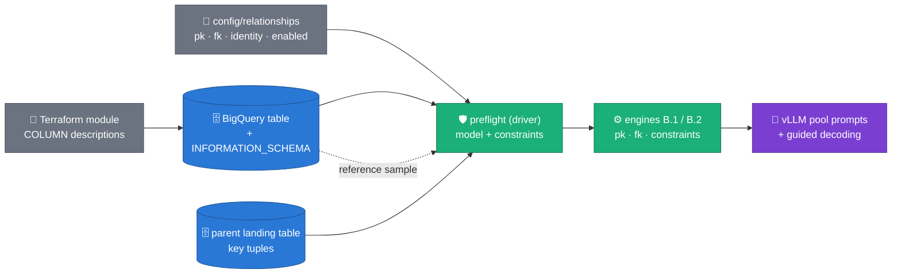
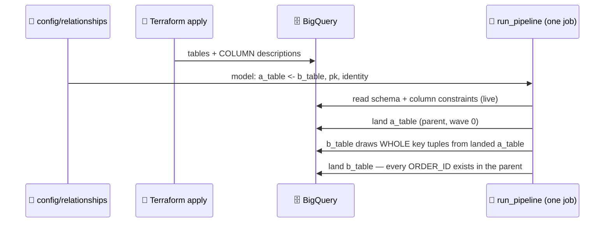

# Column-constraint guide (Terraform ⇄ `_ddl.json` ⇄ engines)

**Audience:** the person provisioning target tables (Terraform) and wiring
synthetic runs. This is the *configuration* companion to
[ADR 0024](adr/0024-structured-prompt-constraint-templates.md) (column-level
prompt constraints); design rationale and evidence live in
[the wave-2 design doc](designs/2026-08-10-prompt-constraints.md). Everything
below is copy-paste-ready and matches the parsers in
`packages/sdfb-core/src/sdfb_core/contracts/`.

> **Relationships are NOT here.** PK, FK and identity live in
> [`config/relationships/`](../config/relationships/README.md) — versioned
> YAML the repo owns, read at launch, changed without touching BigQuery
> ([ADR 0032](adr/0032-relationships-as-config.md)). Table descriptions are
> never parsed for relational structure. This guide owns the OTHER surface:
> per-column generation steering, which stays next to the column it steers.

---

## 1. Two surfaces, two owners

BigQuery's PK/FK "constraints" are **metadata only — never enforced**
([BigQuery table constraints](https://cloud.google.com/bigquery/docs/primary-foreign-keys)),
and a Terraform module that wraps `google_bigquery_table` often does **not
expose** its `table_constraints` block at all
([registry: `google_bigquery_table`](https://registry.terraform.io/providers/hashicorp/google/latest/docs/resources/bigquery_table)).
So BigQuery cannot hold the relationships the generator must honor.

The answer used to be a JSON contract embedded in the table description.
[ADR 0032](adr/0032-relationships-as-config.md) moved it out: relationships
are **repo config** now (`config/relationships/*.yaml`), because they
describe a MODEL spanning many tables, and scattering that across N table
descriptions made every change a `bq update` / `terraform apply` against
production metadata.

Per-column steering did not move. A `llm_prompt_constraint` describes how to
generate ONE field's values, so it belongs next to that field, where whoever
owns the column can read it — and Terraform sets it as a plain string.

| Surface | Lives in | Owns | Changed by |
|---|---|---|---|
| **Relationships** | `config/relationships/<model>.yaml` | `pk`, `identity`, `fk`, `enabled` | editing a file (or `--relationships_uri=gs://…`) |
| **Column constraints** | the COLUMN description | `format`, `pattern`, `values`, `route`, … | `terraform apply` on the landing table |



**Precedence rule** (`run_pipeline.py::_load_reference_and_preflight`): the
relationship model is the source of truth for `pk`/`identity`; a conflicting
`--pk_cols` / `--identity_cols` is **ignored with a WARNING**. Tables no model
declares fall back to those flags, so a one-off table needs no config at all.
FK key pools load whenever the model declares enforced `fk` edges and
`--generate_fk_relationships` is true (default) — the parent landing dataset
derives from `--landing_table`; an unlanded/empty parent stops the launch
loudly.

> **WHERE column constraints live (ADR 0027 D2): on the LANDING
> (synthetic/target) table — never the source.** The pipeline reads column
> descriptions live from `--landing_table`'s `INFORMATION_SCHEMA` at every
> launch and overlays them onto the source table's structure; the source
> (lake) table's descriptions are another team's prose and are deliberately
> stripped. A `terraform apply` there reaches the very next trigger
> (`target_metadata_overlaid` in the launcher log); no DDL re-extraction
> step. `--ddl_uri` pins are only the offline fallback.

## 2. The two surfaces at a glance

| Surface | Marker key | Owns | Parser |
|---|---|---|---|
| **Column** description | `"llm_prompt_constraint"` | per-column generation hints (string or object) | `contracts/prompt_constraint.py::parse_prompt_constraint` |
| `config/relationships/*.yaml` | — (whole file) | relationships: `pk`, `fk`, `identity`, `enabled` | `contracts/relationships.py::parse_relationship_model` |

### Placement is free — prose around the JSON is expected

The extractor walks brace-balanced `{…}` candidates and takes the first one
carrying the marker key. All four of these column descriptions parse
identically:

```text
1) JSON only:
   {"llm_prompt_constraint": {"format": "24-char uppercase hex"}}

2) Prose before:
   Order reference, hex-prefixed. {"llm_prompt_constraint": {"format": "24-char uppercase hex"}}

3) Prose after:
   {"llm_prompt_constraint": {"format": "24-char uppercase hex"}} Populated by the auth service.

4) Prose both sides:
   Order reference, hex-prefixed. {"llm_prompt_constraint": {"prefix": "ABC"}} Owned by team-demo-shop.
```

Two hard rules, both loud by design:

- a **marked but unparseable** JSON object fails the run at preflight
  (`DescriptionJsonError`) — a half-parsed contract silently dropping an FK
  is worse than a stop;
- **unknown keys inside a constraint object are skipped with a WARNING**
  (`prompt_constraint_unknown_keys` milestone) — newer descriptions never
  break older engines, and vice versa (ADR 0024 forward/backward
  compatibility).

## 3. Relationships — one file, not N descriptions

PK / identity / FK are declared in `config/relationships/<model>.yaml` and
nowhere else ([ADR 0032](adr/0032-relationships-as-config.md); full schema
and rules in [`config/relationships/README.md`](../config/relationships/README.md)):

```yaml
model: demo_shop
tables:
  a_table:
    pk: [ORDER_ID]
    identity: [ORDER_REF]
  b_table:
    pk: [LINE_ID]
    fk:
      - cols:     [ORDER_ID]
        ref:      a_table           # bare name = same model
        ref_cols: [ORDER_ID]        # need NOT be the parent's full PK
```

Two flags govern what a launch does with it — `enabled: false` on a table
DETACHES it (and anything that reached the model only through it),
`enforced: false` on an edge documents the relationship without generating
from it. Check any edit without launching:

```bash
uv run --no-sync python3 scripts/relationships/card.py --table b_table
```

Every child row then takes a WHOLE parent key tuple
([ADR 0031](adr/0031-joint-fk-key-draws.md)), so orphans are impossible by
construction and the `fk.orphan` BLOCKER rule measures it per run.

## 4. Column-level constraint — every settable field

String form (legacy, still first-class): free prose appended to the pool
prompt. Object form (ADR 0024): typed keys, rendered deterministically,
prefix-cache-safe. All keys optional; combine freely.

| Key | Type / cap | Functional capability it unlocks | Engine mechanics |
|---|---|---|---|
| `format` | str ≤ 500 | tell the LLM the business format in words | prompt clause `format=…` |
| `pattern` | anchored regex ≤ 200, must compile | **guarantee** the shape, not just request it | prompt clause **and** vLLM guided decoding (`items.pattern`) — overrides the derived regex |
| `examples` | ≤ 8 strings, ≤ 64 ch each; **must sit in the column's observed length bucket / charset** | show fictitious canonical values | prompt clause; echoes are rejected from pools (never land as data); an off-format example logs `prompt_constraint_example_off_format` at plan time — the model echoes its length (ADR 0033: a 28-ch example on a 31-ch column rejected 98 % of a run's candidates) |
| `values` | ≤ 64 strings | closed vocabulary | prompt clause `allowed values=[…]` |
| `prefix` / `suffix` | str | literal affixes (`ABC…`) | prompt clauses |
| `charset` | str | restrict the alphabet | prompt clause |
| `length` | int or `[min, max]` | pin width | prompt clause; **suppresses** the measured length hint (no duplicate tokens) |
| `units` | str | semantic scale ("EUR cents") | prompt clause |
| `locale` | str | language of prose ("es-ES") | prompt clause |
| `route` | `"auto"` \| `"llm"` | **force a typed column onto the LLM route** (constant/categorical/temporal/identifier STRING columns) | profiler override; non-STRING types warn `prompt_constraint_route_unsupported` and keep their typed route |
| `families` | `{prefix: share}` (or pair list) | prefix-family mass targets (`{"ABC1": 0.60, "ABC2": 0.35, "9999": 0.05}`) — replaces prose percentages, which no sampler can parse | ADR 0028 Tier-P weighted sampling; shares normalized; **not** rendered into the prompt |
| `notes` | str ≤ 500 | anything else, free prose | appended last (the legacy string form lands here) |

**Routing (ADR 0028).** A constrained column no longer always means an
LLM pool. Launcher-visible in the `generation_plan` milestone's
`pool_sources` and the `constraint_sampler_active` /
`freetext_pool_byte_template` milestones:

- **`pattern` present and samplable** (anchored; literals, classes,
  `\d`, bounded repeats, groups, alternation — no `+`/`*`, negated
  classes, backrefs, lookarounds) → a seeded CPU **pattern sampler**
  generates format-exact, unlimited unique values; `families` weights
  apply. No LLM call, no pool cap. **Author `pattern` first, always** —
  it is the difference between a guaranteed format and a request.
- **Binary payloads** (control-byte values mis-stored as STRING) →
  a **byte template** (`prefix` + random tail at pinned `length`) —
  never source copies, per the privacy note such clauses carry.
- **Anything else** → the LLM pool ladder, as before.

**PK columns** (declared in the table contract): preflight P4 refuses a
launch whose PK generator cannot cover `num_rows` unique values — give
PK columns a samplable `pattern`. Declared FKs require
`--fk_parent_landing` at launch (P6; `skip` is the loud opt-out).

Debugging the result: run with `--prompt_debug=redacted` and grep Dataflow
worker logs for `freetext_pool_prompt` — you see exactly the instruction +
rendered clause the model received, seeds elided (design doc §3c).

**Dataset-wide visual snapshot**: the
[`/visual_fk_pk_ddl_contract_guide`](https://github.com/albertols/synthetic-llm-dataflow-bigquery/blob/d32c34743d80c8481445956939b6bbde9c4d4a3c/.github/prompts/visual_fk_pk_ddl_contract_guide.prompt.md)
Copilot prompt scans every table description in a landing dataset,
resolves the full FK/PK model with the repo's own parsers, and writes a
timestamped `runs/ddl_contract_guides/<stamp>/{real,oss}/`
guide — ASCII + mermaid diagrams, per-table contract facts, and a
closing table of every field's description + constraint clause.

## 5. Worked example — `a_table_ddl.json` (parent)

Fictitious web-shop orders table. Every constraint style appears at
least once; comments call out which §4 row each column exercises.

```jsonc
{
  "table_info": {
    "table_id": "demo_project.demo_shop.a_table",
    // Table description = prose only. PK/identity live in
    // config/relationships/demo_shop.yaml (§3).
    "description": "Customer orders, one row per order. Owned by team-demo-shop.",
    "data_location": "EU",
    "table_type": "TABLE"
  },
  "schema": [
    {"name": "ORDER_ID", "type": "STRING", "mode": "REQUIRED", "max_length": 10,
     // format + pattern + length: guaranteed 10-digit shape via guided decoding
     "description": "{\"llm_prompt_constraint\": {\"format\": \"10-digit order number, 3-digit store code then 7-digit sequence\", \"pattern\": \"^[0-9]{10}$\", \"length\": 10}}"},

    {"name": "ORDER_REF", "type": "STRING", "mode": "REQUIRED", "max_length": 24,
     // prefix + charset + examples: a prefixed hex identifier
     "description": "Order reference, hex-prefixed. {\"llm_prompt_constraint\": {\"format\": \"24-character uppercase hexadecimal identifier\", \"pattern\": \"^[0-9A-F]{24}$\", \"prefix\": \"ABC\", \"charset\": \"0-9A-F\", \"examples\": [\"ABC0AA11BB22CC33DD44EE55\"]}}"},

    {"name": "PRODUCT_CODE", "type": "STRING", "mode": "REQUIRED", "max_length": 12,
     // composite positional format spelled out in `format`, pinned by pattern
     "description": "{\"llm_prompt_constraint\": {\"format\": \"3-digit category + 2-digit size + 2-digit colour + 1-digit variant + 4-char SKU suffix\", \"pattern\": \"^[0-9]{8}[A-Z0-9]{4}$\", \"examples\": [\"00900000DEMO\"]}} Decoded in the product catalog table."},

    {"name": "ORDER_CHANNEL", "type": "STRING", "mode": "REQUIRED", "max_length": 1,
     // closed vocabulary with business meanings in notes
     "description": "{\"llm_prompt_constraint\": {\"values\": [\"W\", \"S\"], \"notes\": \"W=web order, S=in-store order\"}}"},

    {"name": "FULFILMENT_MODE", "type": "STRING", "mode": "NULLABLE", "max_length": 2,
     // route:llm — low-cardinality STRING that would classify CATEGORICAL;
     // forced onto the LLM route WITH its vocabulary
     "description": "{\"llm_prompt_constraint\": {\"route\": \"llm\", \"values\": [\"1\", \"2\", \"3\", \"4\", \"99\"], \"notes\": \"1=home delivery 2=store pickup 3=parcel locker 4=courier 99=undefined\"}}"},

    {"name": "ORDER_DATE_TXT", "type": "STRING", "mode": "NULLABLE", "max_length": 10,
     // date-as-text: without a constraint this routes TEMPORAL automatically;
     // the constraint documents the rendering for humans AND the LLM fallback
     "description": "{\"llm_prompt_constraint\": {\"format\": \"calendar date as DD.MM.YYYY\", \"pattern\": \"^[0-3][0-9]\\\\.[0-1][0-9]\\\\.[1-2][0-9]{3}$\", \"examples\": [\"28.08.2019\"]}}"},

    {"name": "TOTAL_CENTS", "type": "INT64", "mode": "REQUIRED",
     // non-STRING: constraints render but route stays typed (numeric sampler);
     // a route:llm here would WARN and be ignored
     "description": "Amount in euro cents, no separators. {\"llm_prompt_constraint\": {\"units\": \"EUR cents\", \"charset\": \"0-9\"}}"},

    {"name": "SHIPMENT_REF", "type": "STRING", "mode": "NULLABLE", "max_length": 32,
     // space-padded composite: pattern pins the LITERAL
     // three-space run the LLM otherwise normalizes
     "description": "{\"llm_prompt_constraint\": {\"format\": \"5-letter carrier code, 1 digit, exactly three spaces, 2-letter country code, 20-digit tracking number, final check letter\", \"pattern\": \"^[A-Z]{5}[0-9] {3}[A-Z]{2}[0-9]{20}[A-Z]$\"}}"},

    {"name": "GIFT_MESSAGE", "type": "STRING", "mode": "NULLABLE", "max_length": 35,
     // prose narrative, language-pinned
     "description": "{\"llm_prompt_constraint\": {\"format\": \"short gift message phrase, uppercase\", \"locale\": \"es-ES\", \"examples\": [\"FELIZ CUMPLEAÑOS ANA\"]}}"},

    {"name": "STORE_NOTES", "type": "STRING", "mode": "NULLABLE", "max_length": 254,
     // legacy STRING constraint — still fully supported, renders verbatim
     "description": "{\"llm_prompt_constraint\": \"free-form Spanish store annotation, may mention a department name\"}"},

    {"name": "USER_STAMP", "type": "STRING", "mode": "REQUIRED", "max_length": 8}
    // no constraint at all — profiling alone drives generation (always valid)
  ],
  "primary_keys": ["ORDER_ID"],
  "partitioning": {"type": "DAY", "field": "_PARTITIONTIME"},
  "clustering": {"fields": ["PRODUCT_CODE"]}
}
```

## 6. Worked example — `b_table_ddl.json` (child, FK → a_table)

Its companion model file is §3's `demo_shop.yaml`; the DDL below carries
column constraints only.

```jsonc
{
  "table_info": {
    "table_id": "demo_project.demo_shop.b_table",
    // Prose only. The FK edge (this table's ORDER_ID samples a_table's
    // LANDED keys) is declared in config/relationships/demo_shop.yaml.
    "description": "Order line items.",
    "data_location": "EU",
    "table_type": "TABLE"
  },
  "schema": [
    {"name": "LINE_ID", "type": "STRING", "mode": "REQUIRED", "max_length": 12,
     "description": "{\"llm_prompt_constraint\": {\"format\": \"12-char uppercase hexadecimal line id\", \"pattern\": \"^[0-9A-F]{12}$\"}}"},

    {"name": "ORDER_ID", "type": "STRING", "mode": "REQUIRED", "max_length": 10,
     // FK column: NO constraint needed — the joint key draw overrides
     // whatever the profiler would do (ADR 0031)
     "description": "FK to a_table.ORDER_ID (see config/relationships)."},

    {"name": "LINE_STATUS", "type": "STRING", "mode": "REQUIRED", "max_length": 4,
     "description": "{\"llm_prompt_constraint\": {\"values\": [\"NEWL\", \"PAID\", \"SHIP\", \"RETN\"]}}"},

    {"name": "AMOUNT_CENTS", "type": "INT64", "mode": "REQUIRED",
     "description": "{\"llm_prompt_constraint\": {\"units\": \"EUR cents\"}} Example: 1000 for 10 EUR."},

    {"name": "EVENT_TS", "type": "TIMESTAMP", "mode": "REQUIRED"},

    {"name": "PICKER_STAMP", "type": "STRING", "mode": "NULLABLE", "max_length": 8,
     "description": "{\"llm_prompt_constraint\": {\"format\": \"W + 6 digits for warehouse staff, letter-prefixed 7-char code for sorting robots\", \"examples\": [\"W900003\", \"QQXA900\"]}}"}
  ],
  "primary_keys": ["LINE_ID"]
}
```

## 7. Terraform wiring

The schema JSON files above double as the `schema` payload of
`google_bigquery_table` — column descriptions travel inside them, and that
is the ONLY thing Terraform now carries for the generator. Relationships are
a repo file (§3); a `terraform apply` never touches them.

```hcl
resource "google_bigquery_table" "a_table" {
  dataset_id  = google_bigquery_dataset.demo_shop.dataset_id
  table_id    = "a_table"
  # Prose only — no relational JSON. PK/identity: config/relationships/.
  description = "Customer orders, one row per order. Owned by team-demo-shop."

  # Column array identical to the "schema" list of a_table_ddl.json §5 —
  # keep it in a versioned file so Terraform and the pipeline share one truth.
  schema = file("${path.module}/schemas/a_table.schema.json")

  # ⚠️ DO NOT reach for primary-key / table_constraints blocks here:
  # BigQuery constraints are unenforced metadata (and wrapper modules often
  # hide them). Declare keys in config/relationships (ADR 0032).
}

resource "google_bigquery_table" "b_table" {
  dataset_id  = google_bigquery_dataset.demo_shop.dataset_id
  table_id    = "b_table"
  description = "Order line items."
  schema      = file("${path.module}/schemas/b_table.schema.json")
}
```

`schemas/a_table.schema.json` is exactly the `"schema"` array from §5 (the
`google_bigquery_table.schema` attribute takes the column array, not the
whole `_ddl.json`):

```json
[
  {"name": "ORDER_ID", "type": "STRING", "mode": "REQUIRED", "maxLength": "10",
   "description": "{\"llm_prompt_constraint\": {\"format\": \"10-digit order number, 3-digit store code then 7-digit sequence\", \"pattern\": \"^[0-9]{10}$\", \"length\": 10}}"},
  {"name": "ORDER_REF", "type": "STRING", "mode": "REQUIRED", "maxLength": "24",
   "description": "Order reference, hex-prefixed. {\"llm_prompt_constraint\": {\"format\": \"24-character uppercase hexadecimal identifier\", \"pattern\": \"^[0-9A-F]{24}$\", \"prefix\": \"ABC\", \"charset\": \"0-9A-F\", \"examples\": [\"ABC0AA11BB22CC33DD44EE55\"]}}"}
]
```

## 8. Running the pair — one launch, parents first



```bash
# 0. (optional) refresh the offline DDL pin from the LANDING tables
python scripts/extract_ddl.py --project demo_project \
  --dataset synthetic_data --table a_table --output_base ./output

# 1. ONE launch generates the whole model, parents first: the target's
#    component comes from config/relationships, pk/identity with it.
python -m sdfb_beam.cli.run_pipeline \
  --reference_table demo_project.demo_shop.b_table \
  --landing_table demo_project.synthetic_data.b_table \
  --uniqueness_mode exact --prompt_constraints on
  # --generate_fk_relationships=true is the default
  # --relationships_uri=config/relationships is the default

# 2. Just this table, no relationships:
python -m sdfb_beam.cli.run_pipeline ... --generate_fk_relationships=false

# 3. A different model for one launch, no rebuild, no metadata edit:
python -m sdfb_beam.cli.run_pipeline ... \
  --relationships_uri=gs://my-bucket/relationships/demo_shop.yaml
```

## 9. Functional ⇄ technical capability map

| You want… | You write… | The pipeline does… | Proof it worked |
|---|---|---|---|
| unique keys | `pk:` in the model file | exact per-run dedup + validation gate | `pk_analysis` clean, `validation_runs` PASSED |
| rows that join to the parent | an `fk:` edge in the model file | child draws WHOLE parent key tuples (ADR 0031) | `fk.orphan` count 0; join query returns 0 orphans |
| unique non-key identifiers | `identity:` in the model file | per-row unique generation, never pooled | duplicate probe on the column = 0 |
| to take one table out of a model | `enabled: false` | it and anything behind it detach; it still generates alone | the card marks it `[DISABLED — detached]` |
| exact string shapes | `pattern` (+ `format`) | guided decoding — the model *cannot* emit off-pattern | crosscheck `shape_recall` → 1.0 |
| preserved literal padding | `pattern` with explicit ` {3}` runs | decoding + collapsed-mask pool gate | `spurious_shapes` empty |
| closed vocabularies | `values` | prompt vocabulary clause | `top_values` ⊆ declared set |
| business-realistic prose | `format` + `locale` + `examples` | steered pool prompts | eyeball sample + `freetext_pool_prompt` milestone |
| LLM on a "boring" column | `route: "llm"` | classification override (STRING only) | `generation_plan` shows the column on the LLM route |
| to see the actual prompts | `--prompt_debug redacted` | logs instruction + clause, seeds elided | `freetext_pool_prompt` in Dataflow logs |

## 10. Common pitfalls

| Pitfall | Symptom | Fix |
|---|---|---|
| `ref:` naming a table not in the model | loud load failure | use the bare name of a table in the same model, or `dataset.table` for an already-landed external parent |
| real values pasted into `examples` | privacy leak into prompts/logs | examples must be **fictitious**; pools reject echoes, but don't tempt it |
| `examples` entry of the wrong length (a fixed-width column) | `prompt_constraint_example_off_format` WARNING, then `freetext_pool_format_collapse` — the LLM echoes the example's length and the pool comes from the shape fallback | make the example exactly the source width (count the padding spaces); `gate_lengths=` in the WARNING lists the accepted lengths |
| `route: "llm"` on INT64 | WARNING, route unchanged | only STRING-typed columns re-route |
| unescaped regex in JSON | `DescriptionJsonError` at preflight | JSON-escape backslashes: `\\\\.` for a literal dot |
| constraint typo in a *marked* object | loud stop (by design) | fix the JSON; prose outside the braces is always safe |
| Terraform `table_constraints` block | silently unenforced metadata | declare relationships in `config/relationships/` instead |
| a legacy `{"sdfb": 1, …}` object still in a table description | silently INERT — nothing reads it | move it to a model file (§3) and delete it from the description |
| `--pk_cols` on a table the model declares | WARNING, flag ignored | edit the model file; it is the source of truth |

---

Citations (retrieved 2026-08-11): [BigQuery primary & foreign keys —
unenforced](https://cloud.google.com/bigquery/docs/primary-foreign-keys),
[Terraform `google_bigquery_table`](https://registry.terraform.io/providers/hashicorp/google/latest/docs/resources/bigquery_table).
Parsers: `contracts/relational.py`, `contracts/prompt_constraint.py`;
consumption: `cli/run_pipeline.py::_load_reference_and_preflight`,
`io/fk_pools.py`. Fixture-shape reference:
`packages/sdfb-tests/fixtures/ddl/*.json`.
