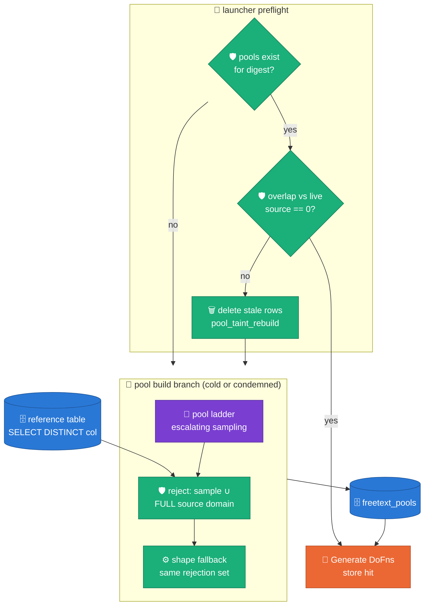

# ADR 0023 — free-text pools reject against the full source domain, and warm pools must prove they are clean

**Status:** ACCEPTED (2026-08-07)
**Evidence:** `runs/2026-08-05_13_45_47-1427089893336350116/report.md`
(B_TABLE R1 cold, 1M) · `runs/2026-08-07_03_23_43-2668234728217694289/`
(B_TABLE R7 warm, 10M) — the WS8 four-run cycle.
**Related:** ADR 0020 (pools as persisted artifact) · ADR 0022 (`source_distinct`
threading) · `thresholds.yml` `freetext.copy_fraction` (BLOCKER, `scope: post_run`).

## Context

The B_TABLE R1 cold baseline landed **33–99% verbatim source values on 10
free-text columns** (`copy_ratio_nonsentinel` 0.33–0.99 against source
domains of 2.5k–146k distinct values), and `validation_runs.status` was
`PASSED` anyway — `freetext.copy_fraction` is BLOCKER-severity but
`scope: post_run`, so nothing in the DAG could act on it. Two structural
gaps compounded:

1. **Rejection saw only the profiled sample.** Both the LLM-novelty check
   (`b1_rag/engine.py::_pool_llm_yield`) and the template fallback
   (`_shape_fallback_pool`) rejected candidates against
   `prof.observed_values` — the ≤10k-row reference sample. For a dense
   keyspace, an in-format candidate collides with the *unobserved* rest of
   the domain at exactly the rates observed.
2. **The warm path trusted `exists()` alone.** The R7 10M warm run's
   launcher guard saw pools persisted for the digest and skipped the
   rebuild — replaying the memorized pools wholesale at 10M-row scale.

## Decision

**Novelty is checked against the full source domain, at build time; a warm
store must prove it holds no live source values before it is trusted.**

1. **`SourceValueStore` seam** (`sdfb_core.pools.store`, Protocol):
   `fetch_distinct(column) → frozenset[str] | None`. The BigQuery
   implementation (`sdfb_beam.io.source_values.BigQuerySourceValueStore`)
   runs one `SELECT DISTINCT CAST(col AS STRING) … LIMIT cap+1` per LLM
   free-text column and returns `None` above the cap (default 1M values —
   far above the largest observed domain, 146k). Attached worker-side by
   `BuildFreeTextPoolsDoFn` only: the build branch runs once per digest, so
   the fetches are once-per-run, and Generate workers never read BigQuery
   (the ADR 0022 rule stands).
2. **Rejection sites**: `_pool_llm_yield` folds the fetched set into its
   `observed` rejection set; `_shape_fallback_pool` adds it to its
   rejection-sampling filter. A persisted pool value therefore cannot equal
   a source value *by construction* — `freetext.copy_fraction = 0` is now a
   property of the artifact, not a post-run hope. Cap-exceeded, store-error,
   and store-absent paths degrade to today's sample-only behavior, loudly
   (`freetext_pool_source_filter{,_absent,_error}` milestones).
3. **Warm taint preflight** (`run_pipeline.py::warm_pools_trusted`): when
   `exists()` says built, the launcher measures the persisted pool values
   against the live source (one array-parameter `IN UNNEST(@vals)` query
   per column — [BigQuery parameterized queries](https://cloud.google.com/bigquery/docs/parameterized-queries)).
   Nonzero overlap → `pool_taint_rebuild` (counts only, never values),
   blocking `delete()` of the digest's rows, and the build branch runs
   again — now with the rejection filter. Check-failure and delete-failure
   both keep the warm path (pools are an optimisation; an append-rebuild
   without a clean delete would leave stale rows racing rebuilt ones in
   `fetch`), loudly.

## Alternatives rejected

- **Wire `freetext.copy_fraction` into a post-landing in-DAG gate** (the
  R1 report's backlog #1): validates after 1M–10M tainted rows already
  landed and adds a BQ-join stage to the DAG. Prevention at pool-persist
  time is earlier, cheaper, and leaves the post-run probe as the
  independent verifier it already is.
- **Bloom filter instead of a frozenset**
  ([Bloom 1970](https://doi.org/10.1145/362686.362692)): saves memory we
  do not need to save at ≤1M values (tens of MB on an `n1-highmem-8`), and
  its false positives would silently shrink dense-keyspace pools. Exact
  membership is affordable and honest; revisit only if a >1M-distinct
  column ever needs the filter.
- **Ship distinct values through the pickled `GenerationContext`**: the
  146k-value columns would bloat the graph payload every worker deserializes;
  the worker-side store attach is the established pattern (`chunk_store`,
  `pool_store`).

## Consequences

- Cold pool builds gain one `SELECT DISTINCT` per LLM free-text column
  (13 columns on B_TABLE — seconds against a 1.9M-row table, once per
  digest).
- Dense keyspaces where in-format novelty barely exists will land smaller
  pools *honestly* (`freetext_pool_undersized` still fires): privacy beats
  cardinality; `freetext.distinct_floor` findings on such columns are now a
  property of the source domain, not a defect.
- The first post-fix launch against a pre-ADR warm store self-heals:
  the preflight condemns tainted digests and rebuilds clean (B_TABLE),
  while clean stores (A_TABLE — crosscheck `copy_fraction = 0.0`) keep
  their warm skip.
- **B.2 parity is open**: `b2_library/freetext.py` carries the same
  sample-only novelty filter (and deliberately blends observed values at
  high `similarity`). Wire the same seam before reading the WS8 **R5**
  memorization numbers as engine truth. *(Closed 2026-08-08:
  `FreeTextHook(source_value_store=…)` rejects against the full domain in
  the pool build and shape fallback; the store rides the generate path via
  `GenerationContext.source_values_table` with process-cached fetches,
  because B.2 builds pools lazily in Generate workers. The reference blend
  stays — it is confined to ≤100-distinct enum columns, the category reuse
  the substantive copy metric exempts.)*

## Erratum (2026-08-08)

The first post-fix run (`2026-08-07_09_44_36-8456…`) showed that part of
the Context's copy-ratio evidence was a **probe metric artifact**: the
`copy_ratio` SQL counted trimmed-empty landing values as copies whenever
the source contains empties, so empty-parity re-emission (by design)
inflated the 2026-08-05 B_TABLE numbers on its 73–99%-empty columns. The
probe now scores `copy_ratio_substantive` (NULL/trimmed-empty/sentinel
excluded, k-anonymity floor for frequent enum values — see
[Sweeney 2002](https://doi.org/10.1142/S0218488502001648)). The decision
stands: genuinely substantive collisions were also present (e.g. the
146k-distinct reference columns), the rejection filter and taint preflight
remain correct, and dominant enum-like literals are handled by the
`head_values` route rather than the pool.
