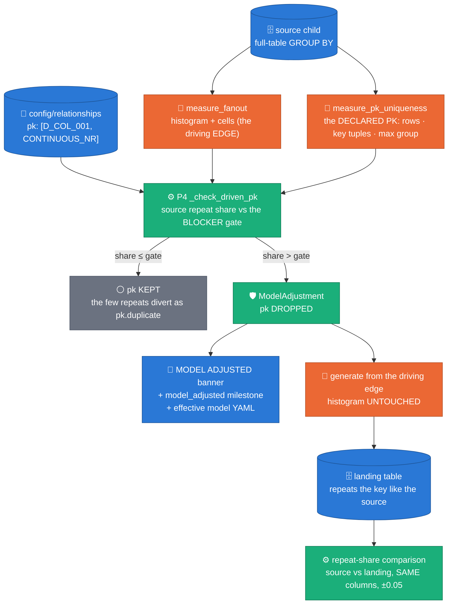
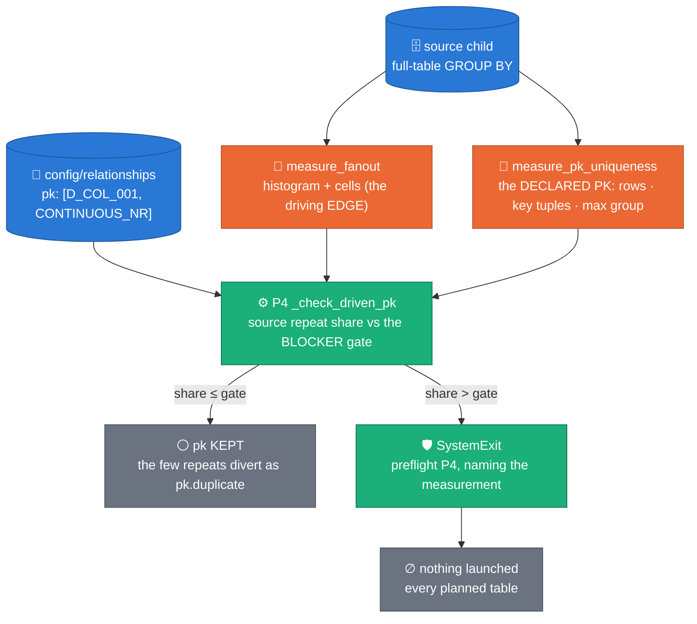

# ADR 0038 — The source is the authority: a MEASURED model conflict adjusts and announces; a self-contradiction still stops

**Status:** ACCEPTED (2026-09-14) — laptop acceptance green on `ws12-fanout-generation`, and Dataflow acceptance met by launch `2026-09-13_06_10_16-12600311608685394436`: the launcher adjusted one table's key, announced it, emitted the adjusted model, sized its descendant off the parent's DISTINCT keys, and all five tables succeeded — where the same model had generated nothing the day before. laptop acceptance green on `ws12-fanout-generation` (unit suite + the two DirectRunner shapes in `test_fanout_adjusted_pk.py`); Dataflow acceptance rides with the next M4 relational launch. **Fix wave H**  (2026-09-13 adversarial verification of `d05c4f0`) is folded into D3, D4, D6 and D9: the gate's denominator, P5's deference, a descendant's sizing, and the comparability of the two repeat shares. **Fix J** (2026-09-13, the launch H produced) replaces the driving-edge rule with the new D10: the DECLARED PK is measured on the source and decides against the run's BLOCKER gate — which also re-founds D4 and completes D6.
**Evidence:** launch `2026-09-12_14_50_30-6058498192553696658` — the full five-table launch stopped with nothing generated (`integration_tests/2026-09-12_14_50_30-6058498192553696658/worker_logs.jsonl`: `fk_fanout_measured edge='(D_COL_001)->B_TABLE'`, and the `preflight P4` stop on `E_TABLE`) · launch `2026-09-13_06_10_16-12600311608685394436` — the SAME shape with this ADR live: the model adjusted, three tables generated, and `F_TABLE` then failed the gate at `blocker_count=179853 observed=0.2908 > gate=0.2` on a declared PK nothing had measured (`integration_tests/2026-09-13_06_10_16-12600311608685394436/`).
**Amends:** [ADR 0036](0036-parent-driven-fanout-generation.md) D6 (the driven-child uniqueness mode is now FORCED, not defaulted, on an adjusted table) · [ADR 0037](0037-multi-parent-children.md) §6 (both P4 "the declared PK is not a key of the source" stops become adjustments by default)
**Keeps:** [ADR 0032](0032-relationships-as-config.md) — `config/relationships/*.yaml` stays the single source of truth and the single input format; this ADR adds no key and no file · [ADR 0035](0035-pk-capacity-fk-bound-members.md) — the capacity gate is untouched and still stops (see D6) · [ADR 0036](0036-parent-driven-fanout-generation.md) — the driving edge, the fan-out histogram, the cell draw and the seeding are all left exactly as measured · [ADR 0031](0031-joint-fk-key-draws.md) — FK integrity by construction is untouched

## Context

On 2026-09-12 a five-table relational launch produced **zero rows**. It
stopped driver-side, in preflight, on one table:

```
[preflight P4] …E_TABLE: the driving edge (D_COL_001) fans out to 13
children per parent in the source, but the declared PK ['D_COL_001']
equals the driving edge exactly — no completing members, so at most 1
child per parent key is representable.
```

The stop was correct about the facts and wrong about what to do with
them. `E_TABLE`'s `pk:` in the relationship model is a single column
that is ALSO its driving FK edge, and the full-source fan-out
measurement — which the launch had just paid for — proved that key value
repeats: **median 2 rows per value, up to 13**. Over the same histogram,
583,134 distinct key values carry 1,172,025 rows, so **50.25% of the
source's rows repeat a key**.

Two facts were in conflict, and they are not the same kind of fact:

| | the `pk:` line | the fan-out histogram |
|---|---|---|
| what it is | a **declaration** an operator wrote | a **measurement** of the production table |
| how it can be wrong | a person was wrong about the data | the source moved since the scan |
| what resolves it | looking at the data | — it IS the data |

The launcher resolved that conflict by believing the declaration and
refusing the run. That is backwards: the whole point of this pipeline is
to produce a fictitious table shaped like the real one, and the real one
demonstrably repeats that key. Refusing to generate leaves the operator
with nothing; generating a table that does NOT repeat the key would be a
worse outcome still — a synthetic table quietly more unique than its
source, with no line in any log saying so.

Note what the 10,000-row reference sample said on the same table, seven
lines earlier in the same log:

```
SDFB_MILESTONE name=preflight_pk_not_unique_in_sample duplicates=40
  sample_rows=10000 table=…E_TABLE
```

Forty duplicates in ten thousand rows — 0.4% — on a table whose median
key value carries two rows. The sample could not see the thing the full
scan proved. That asymmetry is the boundary this ADR draws.

## Decision

**D1 — the source is the authority for what the data IS; the model is a
declaration about it.** When a **full-source measurement** proves a
declared `pk:` is not a key of the source, the launch DROPS that key
from the **effective** model, records a `ModelAdjustment`, announces it,
and carries on. It no longer stops.

**D2 — nothing else about the table changes.** The fan-out histogram is
untouched, the driving edge is untouched, the cell table is untouched,
the FK draw is untouched. The child still generates from its parent's
landed keys with its measured children-per-key distribution, so the
landing table **reproduces the source's key-repeat share by
construction**. Capping the fan-out, narrowing it, or synthesizing a
discriminating column would each break exactly that, and each is
explicitly rejected (see Alternatives).

One consequence is not optional and is easy to miss: `exact_cells` means
*"the cells must KEY the child"*, and `joint_key_draw` caps an
`exact_cells` plan at `min(k, capacity)`. With the key gone there are no
cells and the capacity is 1 — i.e. **one row per parent key**, the
measured fan-out silently discarded. So an adjusted table's payload is
re-stamped `exact_cells: false`
(`run_pipeline.py::adjusted_fanout_payload`), and `pk_cell_columns`
returns `exact=False` for an empty PK. The same fix closes a latent bug
for any driven child that never declared a `pk:` at all.

**D3 — the duplicate share is still MEASURED, and stops gating.** An
adjusted table keeps its DECLARED PK columns for measurement only
(`PipelineConfig.pk_measure_columns`) and is FORCED to
`uniqueness_mode=streaming` (ADR 0036 D6), where `pk.duplicate` is
counted on a digest-only branch and **no row is removed**. That rule id
is then excluded from the BLOCKER gate **for that table only** — named
in `validation_runs.excluded_blocker_rules`, never hidden. Every other
table's `pk.duplicate` blocks exactly as before, and the adjusted table
still blocks on every other rule.

An excluded rule leaves **both sides** of the ratio (fix H1). The gate's
denominator is the rows the run actually GENERATED —
`valid_count + dlq_count` minus the excluded rules' counts
(`validation.summary.gate_total`) — because in `streaming` mode those
duplicate rows are already inside `valid_count`, so leaving them in the
denominator divides every OTHER blocker rule on that table by them too.
On the 2026-09-12 shape (105,609 derived rows, 0.5025 repeat share) a
genuine 1,400-row `engine_failure` then read **0.00886** against a 0.01
gate and PASSED, where the honest ratio over the rows generated is
**0.01343** and fails; a 26,000-row `schema.types` failure read 0.1639
against the dev 0.2 gate instead of 0.2462. `pipeline._gate_inputs`
already refuses that arithmetic for `valid_count` in streaming mode
("a silently weaker gate"); D3 now ends where that reasoning does.

**D4 — the copy must be provable, not asserted.** The adjustment carries
the SOURCE repeat share, computed at launch off the measurement already
in hand:

$$\text{repeat share} = 1 - \frac{\text{key\_values}}{\text{children}}
= 1 - \frac{\sum_{k>0} n_k}{\sum_k k \cdot n_k}$$

For `E_TABLE`: $1 - 583{,}134 / 1{,}172{,}025 = 0.5025$. The run summary
writes it next to the LANDING share — `pk.duplicate` over the rows
generated (`valid_count + row.duplicate`, the honest denominator in
streaming mode, since the two rules are independent branches) — plus the
delta and a verdict. **Tolerance: ±0.05 absolute**, and since **fix J**
the two shares describe the SAME columns in every case: the source share
is measured over the **declared PK** (D10), which is exactly what
`pk.duplicate` is counted over (`PipelineConfig.pk_measure_columns`).

Fix H4 had to disclaim that comparison, because the source share was
read off a GROUP BY the **driving edge** — the same key only when the
declared PK *is* that edge. The gap is not small: on launch
`…-12600311608685394436` `F_TABLE`'s driving edge `(D_COL_001)` repeats
**0.6175** of the source's rows while its declared PK
`(D_COL_001, CONTINUOUS_NR)` lands at **0.2908**. Measuring the declared
PK removes the mismatch at its root instead of annotating it, so
`repeat_share_note` and `ModelAdjustment.repeat_share_basis` are gone:
where a share exists it is comparable, and a launch that measured none
writes none rather than a number over other columns. The copy is faithful
by construction, so the only spread is sampling: the per-key draw
converges at $O(1/\sqrt{\text{keys}})$ (well under half a point at
`E_TABLE`'s 52,545 matched keys), plus the derived row count's rounding,
plus — on an orphan-heavy source — the fact that the child copies the
MATCHED share's distribution rather than the whole source's. Five points
survives all three and still catches a structural break: a fan-out
capped to one child lands ≈0.00 and a doubled one ≈0.75.

**D5 — a model SELF-contradiction still stops, under both settings.** No
amount of data resolves a model that contradicts itself, so these keep
their current stops verbatim: an unknown column (P2), an unresolved
parent (P3), two edges both marked `drives: true`, two edges writing one
child column, an ambiguous role, and a measurement that is MISSING
rather than contradicting (the `no cell table was measured` fail-closed
branch — that is an absent measurement, not a proven conflict).

**D6 — the ADR 0035 capacity gate is deliberately out of scope.** A PK
whose generator cannot cover `--num_rows` keeps stopping. It is not the
source contradicting the model; it is a GENERATOR limit with a
row-count remedy (`--num_rows <= the real key space`), and adjusting the
model would not make the rows generatable.

**P5's sample-based stop, however, now DEFERS** (fix H2). It ran *before*
P4, so a driven child whose 10,000-row sample showed ≥50% duplicate PK
tuples exited the whole launch at `[preflight P5]` — zero rows for every
planned table, precisely the outcome this ADR exists to end — and
`--on_model_conflict` was never read, so the operator had no escape
hatch. Every premise of its message is false for a driven child besides:
it does not draw its PK from marginals (it draws parent keys × the
measured fan-out), it never uses `--num_rows` (`resolve_table_rows`
returns the derived count), and its `pk.duplicate` is gate-excluded once
adjusted. So: **where a full-source fan-out measurement is in scope, the
measurement decides** — P5 logs `preflight_pk_sample_stop_deferred` and
P4's adjustment (or, under `stop`, P4's refusal) is what the operator
sees. A table with NO measurement keeps P5 exactly as before, and a
table that declares a driving edge whose parent is outside the launch —
the one driven case P5 can still be reached in — gets a message that
says so instead of claiming a fan-out nobody measured.

Fix J completes that deference. H2 handed the verdict to a check that,
for a PK with completing members, was not looking at the key; D10 makes
P4 decide on the declared PK's own measurement, so the hand-off is total
and P5's sample is the last word only where nothing was measured.

**D9 — a descendant of an adjusted parent is sized off the parent's
DISTINCT keys** (fix H3). A driven child's row count is
`round(parent keys × mean fan-out)`, and the composer fans it out from
the parent's distinct keys (an adjusted parent's `parent_pk=()` arms
`FanoutDistinct`); the histogram's own denominator is the number of
distinct SOURCE key values. Multiplying the parent's ROWS therefore asks
for rows the DAG cannot produce: on the motivating launch `F_TABLE`
would have been asked for 220,215 rows and could produce about 109,556 —
a 50.25% shortfall written to `validation_runs` as a missed request with
no milestone naming the cause. The multiplier is now the parent's landed
distinct keys: its rows when its PK is enforced,
`rows × (1 - source repeat share)` when it was adjusted
(`landed_distinct_keys`), and `model_adjustment_descendant_rows` fires
whenever that shrinks a descendant's derived count.

**D10 — the DECLARED PK is measured on the source, and that measurement
decides — against the run's BLOCKER GATE** (fix J). D1 says a
*full-source measurement* is the authority. Until fix J the only such
measurement was the driving edge's fan-out histogram, which describes
ONE column set. A declared PK with a member outside that edge was
therefore never measured at all: `_check_driven_pk` reasoned about the
histogram and returned early when the completing member was unbounded.
Launch `…-12600311608685394436` is what that costs. The adjustment
worked — `E_TABLE`'s key was dropped, the pasteable YAML was emitted,
`F_TABLE` was sized off the parent's distinct keys, three tables
generated — and then `F_TABLE`, whose `pk: [D_COL_001, CONTINUOUS_NR]`
is driven by `(D_COL_001)`, failed the gate:

```
BlockerThresholdExceeded: …-04-F_TABLE blocker_count=179853
  observed=0.2907744316776362 > gate=0.2 (env=dev)
```

The 10,000-row sample had said `duplicates=47` (0.47%) — too weak, as
ever, to see it. So:

1. **measure it.** One GROUP BY over the declared PK of the source
   child (`measure_pk_uniqueness`): rows, distinct key tuples, and the
   largest group — a COMPOSITE key counted as a tuple, NULLs grouped as
   a value exactly as `measure_fanout`'s child GROUP BY does. Cached in
   the same `fk_fanout_stats` payload under the same key, so a re-launch
   re-scans neither measurement. When the declared PK IS the driving
   edge the histogram already measures that tuple, and it is read off it
   for **zero** extra BigQuery — which is what makes the old
   driving-edge rule a special case of this one rather than a second
   rule beside it.
2. **compare it with the gate, not with any repetition.** The measured
   repeat share is $1 - \text{key\_tuples}/\text{rows}$. ABOVE the run's
   `blocker_failure_ratio`, the declared key cannot survive generation —
   The comparison is not the raw share: the gate divides the diverted rows by the rows that REACH it, generated plus diverted, so a source that repeats a share `s` lands `s / (1 + s)`. The launcher compares THAT, so at a 0.2 gate the true boundary is a source share of 0.25 and a table in the 20-25% band keeps its key on a run that would have passed with it enforced.
   generation reproduces the source, so that share lands as
   `pk.duplicate` and fails the run — and the `pk:` is dropped exactly as
   D1–D4 prescribe. AT OR BELOW it, the key is KEPT and
   `preflight_pk_source_repeats` says what the source measured: a table
   whose source is 0.4% dirty must not lose its key, and today's
   machinery diverts those few rows. `F_TABLE` at 0.2908 against a 0.2
   gate adjusts and the run completes; the same table against a 0.3 gate
   keeps its key and lands its duplicates as `pk.duplicate`, which is
   the operator's own threshold doing the deciding.
3. **ONE decision path.** The ADR 0037 capacity ladder (cells ×
   `--fk_candidate_cap` per conditional edge) is now the evidence of
   LAST resort — reached only where no measurement of the declared PK
   exists. Where one does and it kept the key, a capacity model below
   the source's largest fan-out is reported
   (`preflight_pk_capacity_below_fanout`) and never acted on: capacity
   ESTIMATES what a key can represent, the measurement MEASURED it, and
   an estimate must not take a key the data says is real.

Cost: one extra scan of the PK columns per driven child whose key is
not its driving edge, once per (source table, edge, model sha).

**D7 — the effective model is handed back.** Every model file owning an
adjusted table is re-emitted as YAML the operator can paste into
`config/relationships/`: the declared model with those tables' `pk:`
removed and a comment above each naming the measurement that removed
it. It is written beside the job's staged artifacts
(`--staging_location`, else `--temp_location`, else the working
directory) **and** logged verbatim, because the log is the copy that
always survives.

**D8 — `--on_model_conflict=adjust|stop`, default `adjust`.** With
`stop`, every pre-0038 message returns word for word.

### The flag, one panel per mode

`--on_model_conflict=adjust` (default) — the measurement wins and the
run says so:



`--on_model_conflict=stop` — the pre-0038 behaviour, unchanged:



The two differ **only** on the middle-right branch. Both measure the
same thing and both reach the same verdict about the declared key; they
disagree about whether a launch is worth more than a declaration.

## Consequences

- A run that adjusted its model can never be mistaken for a clean one:
  a multi-line `MODEL ADJUSTED` WARNING banner, one
  `model_adjusted table= change= declared= measured= consequence=`
  WARNING milestone per adjustment, a `model_adjustment_model` entry
  holding the effective YAML, and — at the end of the run — a
  `model_adjustment_repeat_share` milestone plus five new
  `validation_runs` columns.
- `validation_runs` gains five NULLABLE columns
  (`excluded_blocker_rules`, `source_repeat_share`,
  `landing_repeat_share`, `repeat_share_delta`,
  `repeat_share_within_tolerance`). The table must be updated from
  `config/bq_schema/synthetic_data_quality/validation_runs.schema.json`
  before the next run, or FILE_LOADS rejects the row. (Fix J removed the
  sixth, `repeat_share_note`: with both shares over the declared PK
  there is no "not comparable" case left to explain. A table already
  widened for it keeps a harmless unused column.)
- One extra BigQuery scan per driven child whose declared `pk:` is not
  its driving edge — a single GROUP BY over the PK columns of the source
  child, cached beside the fan-out under the same key. A child whose PK
  IS the driving edge pays nothing: the histogram already measured it.
- An adjusted table loses `identity.unique` MEASUREMENT, because
  `streaming` measures the row digest and the PK digest only. Identity
  values are synthesized per row from
  `(run_id, batch_id, row_index, column)` and `row.duplicate` still
  covers engine replay, so this is a reporting loss, not a guarantee
  loss. Accepted deliberately: diverting the duplicates the table is
  supposed to land would defeat the whole decision.
- **FK integrity is untouched, in both directions.** The adjusted table
  still draws its parent keys from the same joint pools (ADR 0031), and
  its key-sample caps stay sized from the DECLARED PK — the larger,
  upper-bound sizing — so nothing the composer broadcasts narrows. For
  its OWN children, `parent_pk=()` now arms the composer's
  `FanoutDistinct`, which is exactly right: the adjusted parent lands
  repeated keys, and fanning out from them un-deduplicated would
  multiply the grandchild's row count and emit PK-identical children.
  `test_fanout_adjusted_pk.py` pins that (`F_TABLE` lands one row per
  DISTINCT `E_TABLE` key).
- The operator's `config/relationships/*.yaml` is **not** edited by the
  run. The adjustment is per-launch and re-derived every launch from a
  fresh (or cached) measurement; making it permanent is a deliberate
  paste of the emitted YAML.

- **Known limitation, confirmed by adversarial verification 2026-09-13.**
  The distinct-key count carried to a descendant is the adjusted parent's
  distinct DRIVING-EDGE values, recorded per parent TABLE. A descendant
  whose edge references a WIDER parent key than that edge is therefore
  sized from the wrong column set — roughly half of what the DAG produces
  in the reproduced case — and `model_adjustment_descendant_rows` reports
  that figure as if it were the correct reduction. Every shape whose
  descendant `ref_cols` equal the parent's driving columns is exact,
  including the pair that motivated this ADR. The fix is to key the
  record by (parent table, ref_cols) and take the ratio from the
  descendant's own measurement: its `parents` over the parent's source
  row count, which the parent's own payload already carries as
  `children`. Until then a descendant of an adjusted parent with a wider
  edge under-requests, which lands fewer rows than asked rather than
  breaking a key or an edge.

## Alternatives rejected

- **Keep stopping.** What we had. It cost a whole five-table launch and
  produced zero rows over a fact the pipeline had already measured and
  could have simply honoured.
- **Cap the fan-out to what the declared PK can represent.** Lands one
  row per parent key, a table ~2x smaller than the source with a
  key-uniqueness property the source does not have. This is the failure
  mode `exact_cells: false` exists to prevent, and it would have been
  the silent outcome of a naive "just drop the PK" change.
- **Synthesize a discriminating column** (a sequence number completing
  the key). Invents a column the target table does not have, and the
  landing table then fails its own schema.
- **Let the sample decide.** `preflight_pk_not_unique_in_sample` saw 40
  duplicates in 10,000 rows on a table whose median key value carries
  two. A 10k sample of a 1.17M-row table is far too weak to drop a
  declared key on; it stays a warning and adjusts nothing — and, where a
  full-source measurement exists, it no longer STOPS either (D6, fix
  H2): a sample too weak to drop a key is also too weak to veto one.
- **Adjust silently.** The one genuinely dangerous option: a synthetic
  table whose key semantics differ from its declaration, with nothing in
  the log. Every part of D3/D4/D7 exists to make that impossible.
- **Edit `config/relationships/*.yaml` in place.** Breaks ADR 0032's
  "one file the operator can read and version" — a run that rewrites its
  own input makes the next launch's diff unreadable. The effective model
  is emitted for a human to apply.

## Acceptance

| criterion | where it is proven |
|---|---|
| the 1:1 conflict adjusts instead of raising; the payload and uniqueness mode follow | `cli/test_model_adjustment.py::test_one_to_one_conflict_adjusts_instead_of_raising`, `test_fanout_adjusted_pk.py::test_an_adjusted_table_is_pinned_to_streaming_even_with_identity` |
| `--on_model_conflict=stop` restores every message | `cli/test_model_adjustment.py::test_on_model_conflict_stop_restores_the_raise` + the `on_model_conflict="stop"` calls throughout `cli/test_preflight_fanout.py` |
| the source repeat share is computed correctly from a known histogram | `cli/test_model_adjustment.py::test_source_repeat_share_over_a_known_histogram`, `…_matches_the_e_table_launch` |
| an adjusted table's `pk.duplicate` is excluded while another table's blocks | `validation/test_validation_core.py::TestAdjustedTableGate` |
| the excluded rule leaves BOTH sides of the ratio — a genuine `engine_failure` / `schema.types` failure on an adjusted table still fails its gate, and a non-adjusted table's ratio is unchanged (H1) | `validation/test_validation_core.py::TestExcludedRuleLeavesBothSidesOfTheRatio` |
| a hot SAMPLE defers to the measurement: the launch adjusts under the default, refuses with P4's message under `stop`, an undriven table still stops at P5, and a driven-but-unmeasured one stops with the corrected message (H2) | `cli/test_model_adjustment.py::test_a_hot_sample_defers_p5_to_the_full_source_measurement`, `…_refuses_at_p4_under_stop`, `…_an_undriven_table_with_the_same_sample_still_stops_at_p5`, `…_a_driven_but_unmeasured_table_stops_with_the_driven_message` |
| a child of an ADJUSTED parent is sized off its DISTINCT keys; a child of an enforced-PK parent is unchanged (H3) | `cli/test_model_adjustment.py::test_a_child_of_an_adjusted_parent_is_sized_off_its_distinct_keys`, `…_an_enforced_pk_parent_is_unchanged`, `…_the_distinct_key_count_is_carried_from_the_adjustment` |
| a PK wider than the driving edge is now COMPARABLE — the source share is measured over the declared PK, so the delta and the ±0.05 verdict are written; an adjustment with no measurement of its own claims no share at all, in the record, the banner and the summary row (H4 → J) | `cli/test_model_adjustment.py::test_the_faithfulness_verdict_is_now_comparable_for_a_wide_pk`, `…_a_wide_pk_without_its_own_measurement_claims_no_share`, `…_the_banner_says_when_no_share_was_measured`, `…_the_summary_row_withholds_the_verdict_when_no_share_was_measured`, `…_the_one_to_one_case_carries_the_declared_pk_share` |
| the DECLARED PK is measured on the source: a composite key counts as ONE tuple, NULLs group as a value (no `IS NOT NULL`, no `COUNT(DISTINCT CONCAT(...))`), and a non-identifier column is refused (J) | `io/test_fanout_stats.py::test_measure_pk_uniqueness_counts_a_composite_key_as_one_tuple`, `…_handles_nulls_the_way_the_histogram_does`, `…_rejects_a_column_that_is_not_an_identifier` |
| the measurement DECIDES against the gate: F_TABLE's shape adjusts above it and the run proceeds; the same shape below it keeps its key and warns; `--on_model_conflict=stop` still refuses, naming the measurement (J) | `cli/test_model_adjustment.py::test_a_pk_with_a_completing_member_above_the_gate_adjusts`, `…_the_same_shape_below_the_gate_keeps_its_key_and_warns`, `…_the_measured_pk_conflict_still_refuses_under_stop` |
| ONE decision path: a PK that equals its driving edge reads the SAME measurement off the histogram, for zero extra BigQuery (J) | `cli/test_model_adjustment.py::test_the_one_to_one_case_reads_the_same_measurement_off_the_histogram`, `cli/test_fanout_launch_wiring.py::test_a_pk_equal_to_the_driving_edge_costs_no_second_scan` |
| the measurement is cached in the same payload and not re-run; a pre-fix-J cache row re-scans the PK only; a failed scan is a loud preflight stop (J) | `cli/test_fanout_launch_wiring.py::test_resolve_fanout_measures_the_declared_pk_and_caches_it`, `…_a_cache_entry_from_before_fix_j_measures_only_the_pk`, `…_a_failed_pk_measurement_is_a_preflight_stop` |
| the F_TABLE shape end to end: a driven child whose declared key adds a column the source repeats LANDS, keeps its FK tuples inside the parent, and reaches a landing repeat share within ±0.05 of the source's (J) | `test_fanout_adjusted_pk.py::test_a_driven_child_whose_declared_key_repeats_lands_rows` (200 parent keys, 400 landed rows, source share 0.1650) |
| the banner and the milestone fire once per adjustment | `cli/test_model_adjustment.py::test_milestone_fires_once_per_adjustment` |
| the emitted YAML parses through the registry with the PK removed and the reason attached | `cli/test_model_adjustment.py::test_the_emitted_yaml_parses_and_has_the_pk_removed`, `…_written_beside_the_staged_artifacts` |
| a table with no conflict is untouched end to end | `cli/test_model_adjustment.py::test_a_table_with_no_conflict_is_untouched`, `…_the_reference_sample_warns_but_never_adjusts` |
| the landing table reproduces the repeat share; FK tuples stay in the parent; the adjusted table's own child still generates | `test_fanout_adjusted_pk.py::test_an_adjusted_child_copies_the_source_repeat_share` (200 parent keys, 386 landed rows, landing share 0.4819 vs source 0.5000) |
| Dataflow: the five-table launch that stopped now lands, with `repeat_share_within_tolerance = true` on `E_TABLE` — and `F_TABLE`, which reached the gate on launch `…-12600311608685394436`, lands too | **pending the M4 re-run** |

## Provenance

Measured numbers in this ADR come from one immutable source, the
operator's local worker log of launch
`2026-09-12_14_50_30-6058498192553696658`:

(Launch logs live under the gitignored `integration_tests/` tree and carry the deployment's own project id, so they are read locally and never committed; the milestone names below are what to grep for in a re-run.)

| number | milestone in `worker_logs.jsonl` |
|---|---|
| 1,172,025 children · max 13 · p50 2 | `fk_fanout_measured edge='(D_COL_001)->B_TABLE'` (`children=`, `max=`, `p50=`) |
| 583,134 distinct key values in `E_TABLE` | `fk_fanout_source_orphans edge='(D_COL_001)->B_TABLE'` (`child_tuples=`) — the histogram's `sum(n for k>0)`, which the post-fix `fk_fanout_measured` line now also logs as `key_values=` |
| 52,545 MATCHED parent keys | same two lines (`parents=` / `parent_tuples=`) |
| 40 duplicates in 10,000 sample rows | `preflight_pk_not_unique_in_sample table=…E_TABLE` |

That the child holds 583,134 key tuples against 52,545 parent tuples is
itself why the pre-`7f71865` line reported `mean=22.3052` beside
`max=13`: the mean divided by the PARENT count. It is the same
orphan-heavy source the ±0.05 tolerance in D4 accounts for.

Fix J's numbers come from the second local launch,
`2026-09-13_06_10_16-12600311608685394436`:

| number | milestone / line |
|---|---|
| `blocker_count=179853 observed=0.2908 > gate=0.2` on `F_TABLE` | `BlockerThresholdExceeded` in `worker_logs.jsonl` |
| 47 duplicate PK tuples in 10,000 sample rows | `preflight_pk_not_unique_in_sample pk=D_COL_001,CONTINUOUS_NR` |
| 1,215,948 child rows · 465,079 key values on `(D_COL_001)` → a 0.6175 driving-edge repeat share | `fk_fanout_measured edge='(D_COL_001)->E_TABLE'` (`children=`, `key_values=`) |
| `F_TABLE` sized at 439,889 rows off the adjusted parent's distinct keys | `model_adjustment_descendant_rows` |

0.6175 is `1 - 465,079 / 1,215,948` — the driving edge's share, beside
the declared PK's 0.2908 that the gate measured. Two numbers, one table,
one launch: the reason D10 measures the key and not the edge.

0.5025 is `1 - 583,134 / 1,172,025`, computed by
`sdfb_core.contracts.model_adjustment.source_repeat_share`; the ADR does
not re-type it anywhere it is not derived. The two diagrams are inline
mermaid (no generated asset), per the `visual-first-documentation` form
heuristic for control flow.
