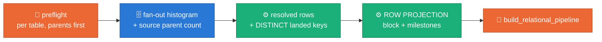

# ADR 0039 — A launch says how many rows it will generate, and where each number came from, before the graph is built

**Status:** PROPOSED (2026-09-14) — laptop acceptance green on `ws12-fanout-generation` (23 unit tests in `packages/sdfb-tests/tests/unit/cli/test_row_projection.py`, driven by the reference launch's own figures); Dataflow acceptance rides with the next M4 relational launch.
**Evidence:** launch `2026-09-13_06_10_16-12600311608685394436` (`integration_tests/2026-09-13_06_10_16-12600311608685394436/jobs_logs.jsonl`) — five tables, ~33M rows, 94.2% of them in one table, and not one line in the driver log said so before the workers started. The counts existed: `relational_single_job … rows_detail=B_TABLE:210958,C_TABLE:846891,E_TABLE:423999,A_TABLE:30937138,F_TABLE:439889`, one field among five, with no total, no derivation and nothing tying a number to the measurement that produced it.
**Extends:** [ADR 0036](0036-parent-driven-fanout-generation.md) D5 (a driven child's row count IS its parent's keys times the measured mean fan-out — this ADR does not change how a count is derived, only that the derivation is stated) · [ADR 0038](0038-measured-conflicts-adjust-the-model.md) fix H3 (the multiplier is the parent's DISTINCT landed keys) and its `model_adjusted` banner, whose style this block follows
**Keeps:** every sizing rule, every threshold and every gate in [ADR 0035](0035-pk-capacity-fk-bound-members.md)/[0036](0036-parent-driven-fanout-generation.md)/[0037](0037-multi-parent-children.md)/[0038](0038-measured-conflicts-adjust-the-model.md) exactly as they are. Nothing here stops a launch, changes a count, or costs a BigQuery call.

## Context

The 2026-09-13 launch asked for `--num_rows=210,958` and generated
32,858,875 rows. One table, `A_TABLE`, was 30,937,138 of them — 94.2% of
the run, 146.7x what the operator typed — because two ordinary fan-outs
compounded: `B_TABLE` → `C_TABLE` at 4.0x, then `C_TABLE` → `A_TABLE` at
36.5x.

Every one of those numbers was in the launcher's hands before the graph
existed. Preflight had measured each driving edge's fan-out histogram,
resolved each table's row count in plan order, adjusted `E_TABLE`'s `pk:`
against the source, and derived `F_TABLE`'s count from `E_TABLE`'s
DISTINCT keys. What it did with them was print `rows_detail=` — a
comma-joined field on a milestone about edges — and start the job.

An operator sizing a run then has to reverse-engineer arithmetic the
launcher already did: multiply `fk_fanout_measured mean=` by a count
from another line, remember that an adjusted parent hands out fewer keys
than rows, and sum five figures by hand to discover the run is 33M rows
and eighteen hours of L4 time.

Worse, two measurements on that same launch make part of that projection
**unsound**, and nothing related them to the counts:

- `E_TABLE`'s driving edge `(D_COL_001)->B_TABLE` holds **583,134**
  distinct key values in the source while the source parent offers
  **52,545** — a 9% matched share (`fk_fanout_source_orphans`). The
  generated table is honest about its own count and reproduces a ninth
  of the source's key range.
- `E_TABLE`'s `pk:` was ADJUSTED away (ADR 0038), so its projection —
  and every descendant's — assumes the source's 50.25% key-repeat share
  reproduces.

## Decision

**D1 — the launch PROJECTS, out loud, before it builds the graph.** After
preflight has resolved every table and before `build_relational_pipeline`
is called, the driver logs one multi-line block in the relationship
card's and the ADR 0038 banner's style: per table, in generation order,
the projected record count and WHERE it comes from — a root sized by
`--num_rows`, or a driven child sized from its parent's contribution
times the measured mean fan-out, naming the parent, the mean and the
edge — then the total, with a bar column so the dominant table is
obvious at a glance.



*The projection is the last thing printed before a DAG exists — every
input to it was already paid for upstream.*

**D2 — it is derived, never re-measured.** Every figure comes from what
the launch already holds: the fan-out payload's histogram (its mean, its
zero bucket), the source parent's distinct tuple count, the resolved row
counts and DISTINCT landed keys the relational runner fills in plan
order, and the ADR 0038 adjustments. `project_table` multiplies the same
two numbers, in the same order, that
`sdfb_beam.cli.preflight._derived_rows` sized the child with, so the
block can never disagree with the count the run requests — and the
per-table milestone carries both (`rows=` projected, `requested=` the
run's own `num_rows`) so any drift is one grep away. **No BigQuery work
is added.** The only plumbing change is `fanout_payload` carrying the
source parent count it already measured (`parents=`), because an
orphan-heavy source clamps the histogram's zero bucket to 0 and the
parent count cannot otherwise be read back off the histogram.

**D3 — a count that cannot be derived says so.** A driven child whose
driving-edge histogram carries no mass, or whose parent's landed keys are
unknown, gets `rows=None`, prints `not derivable` with the reason, and is
excluded from the total (which says how many tables it excluded). It
never falls back to `--num_rows` — for a driven child that is the one
number certainly wrong (ADR 0036 D5).

**D4 — four warnings, each derived from a measurement already taken, each
naming that measurement and the consequence for the LANDED data.** They
are listed in the block and logged one `row_projection_warning` milestone
each. Thresholds are deliberately loose; a clean launch prints the
projection and nothing else.

| Code | Fires when | The measurement | What it means for the landed table |
|---|---|---|---|
| `fk_source_orphans` | `matched_share < 0.5` on a driving edge | `fk_fanout_source_orphans` (restated from the payload's `parents` over the histogram's key values) | the child generates from the matched share of its key space only — the count is honest, the MODEL is suspect, and the fan-out's zero bucket being unmeasurable makes the mean an UPPER bound |
| `projection_explodes` | a driven child's projected rows exceed `--num_rows` by more than **10x** | the projected count against the launch's own `--num_rows`, with the multiplier and the parent chain | this table sizes the whole job — GPU hours, shuffle and landing scale with it. Not a defect: the measured fan-out, compounded |
| `fanout_zero_share` | `zero_share > 0.5` on a driving edge | `fk_fanout_measured zero_share=` | the count is right (the mean already divides by childless parents); the landed child covers only `1 - zero_share` of its parent's keys, so a join from the parent is mostly empty **by construction**, as in the source |
| `adjusted_key_projection` | this table's `pk:` was adjusted (ADR 0038) | `model_adjusted` + the source key-repeat share | the projection assumes that repeat distribution reproduces; the table's DISTINCT-key count (not its rows) is what every descendant is sized from. `model_adjustment_repeat_share` at the end of the run is the proof |

**Why those numbers.** `10x` — two hops of an ordinary 2-4x fan-out land
at 4-16x, so anything lower fires on shapes working exactly as declared;
the reference launch's own `C_TABLE` sits at 4.0x and says nothing while
`A_TABLE` at 146.7x fires. `0.5` matched share — past half, "the source's
FK is a bit dirty" stops being a credible reading; the reference launch
measured 0.09. `0.5` zero share — the reference launch's `F_TABLE` edge
measured 0.2024 and is not worth a word. The constants live in
`sdfb_core/contracts/row_projection.py` with this reasoning beside them.

**D5 — the block is launcher-side and multi-line; the milestones are the
greppable half.** One `row_projection` (the block, WARNING when it
carries warnings), one `row_projection_table` per table, one
`row_projection_total`, one `row_projection_warning` per warning. Worker
milestones stay one line, unchanged. A single-table launch prints the
block too — a root sized by `--num_rows` and no warnings — because the
block is where an operator reads what a launch will generate, and the
simplest shape must not be the one that stays silent.

## Consequences

- An operator reads one block instead of reconstructing arithmetic from
  four milestones, and sees the dominant table before paying for it.
- Two facts that were previously only implicit are now stated where the
  decision is made: an adjusted parent hands out fewer keys than rows,
  and a driving edge with orphaned child keys covers a slice of its own
  key space.
- `fanout_payload` gains one key. `FanoutPlan.from_payload` ignores it
  (as it already ignores `pk_source`), and a payload cached before this
  ADR simply carries no `parents` — the projection then claims no matched
  share rather than guessing one.
- Nothing gates on the projection. `--num_rows` is still the only knob;
  the block tells the operator what it bought.

## Alternatives rejected

- **Stop the launch above the factor ceiling.** The count is the measured
  fan-out reproduced faithfully — refusing it would refuse the pipeline's
  own contract. ADR 0038 settled the same question for the model: say
  what happened, do not refuse the data.
- **Put the totals in `relational_single_job`.** That milestone is about
  the DAG (tables, edges, order); a projection an operator reads to size
  a run is a document, not another comma-joined field.
- **Re-query BigQuery for exact parent/child counts.** Every figure this
  block needs was already measured. A second scan would make the launch
  slower to tell the operator something it already knew.

## Evidence — the block for the reference launch

Generated from that launch's own figures (the constants live in
`packages/sdfb-tests/tests/unit/cli/test_row_projection.py`, which asserts
the per-table counts against the log's `rows_detail`):

```text
ROW PROJECTION | 5 table(s), 32,858,875 rows — what this launch WILL generate, decided before the graph is built (ADR 0039)
  every count is derived from figures this launch already measured: --num_rows for a root, the driving parent's DISTINCT landed keys x the measured mean fan-out for a driven child (ADR 0036, ADR 0038). Nothing is generated yet.
 B_TABLE |       210,958 |   0.6% |                      | root — sized by --num_rows=210,958
 C_TABLE |       846,891 |   2.6% | #                    | driven by B_TABLE — 210,958 distinct keys x 4.0145 mean fan-out on (D_COL_001,D_COL_024,D_COL_025,C_COL_009)->B_TABLE
 E_TABLE |       423,999 |   1.3% |                      | driven by B_TABLE — 210,958 distinct keys x 2.0099 mean fan-out on (D_COL_001)->B_TABLE
 A_TABLE |    30,937,138 |  94.2% | ###################  | driven by C_TABLE — 846,891 distinct keys x 36.5302 mean fan-out on (D_COL_024,D_COL_025,C_COL_009)->C_TABLE
 F_TABLE |       439,889 |   1.3% |                      | driven by E_TABLE — 210,958 distinct keys x 2.0852 mean fan-out on (D_COL_001)->E_TABLE (its parent lands 423,999 rows over 210,958 DISTINCT keys — ADR 0038)
 TOTAL   |    32,858,875 | 100.0% |                      | across 5 table(s) — 94.2% of the run is A_TABLE
 WARNINGS | 3 — a measured relationship makes part of this projection unsound
  E_TABLE   [fk_source_orphans]
    measured    | the source parent covers only 9.0% of the distinct key values the source child holds on the driving edge (D_COL_001)->B_TABLE (fk_fanout_source_orphans matched_share=0.0901, under the 50% floor)
    consequence | E_TABLE generates from the matched 9.0% of its key space only, so the projected count is honest but the MODEL is suspect: the landed table reproduces that slice of the source's key range and nothing outside it, and the fan-out's zero bucket is unmeasurable, so the mean is an UPPER bound. Check the edge names the columns you meant.
  E_TABLE   [adjusted_key_projection]
    measured    | this table's declared `pk:` was ADJUSTED away (model_adjusted, ADR 0038) because 50.25% of the SOURCE's rows repeat a key value
    consequence | its projection assumes that repeat distribution reproduces: 423,999 rows over about 210,958 DISTINCT key values, which is what F_TABLE is sized from, not the row count. Read model_adjustment_repeat_share at the end of the run: outside tolerance, this table AND every descendant landed a count this block did not project.
  A_TABLE   [projection_explodes]
    measured    | 30,937,138 projected rows is 146.7x the launch's --num_rows=210,958 (over the 10x ceiling), down the chain B_TABLE -> C_TABLE -> A_TABLE
    consequence | this one table is 94.2% of the run's 32,858,875 rows and sizes the whole job — GPU hours, shuffle and landing cost scale with it. It is not a defect: it is the measured fan-out, compounded. Lower --num_rows, or take the table out of the launch, if that is not the run you meant to pay for.
```

Checking the arithmetic against the log: `E_TABLE` = 210,958 x
(1,172,025 / 583,134) = 423,999 · `F_TABLE` = 210,958 x 2.0852 = 439,889,
the `model_adjustment_descendant_rows` line verbatim · the total, 32,858,875,
is the sum `rows_detail` never took.

## Acceptance criteria

1. A relational launch logs `row_projection`, one `row_projection_table`
   per table and one `row_projection_total` **before** the first
   `relational_e2e` worker milestone of the run.
2. Every `row_projection_table rows=` equals that table's entry in the
   same launch's `relational_single_job rows_detail=`, and its
   `requested=` equals its `rows=`.
3. `row_projection_total rows=` equals the sum of those entries.
4. A launch with no orphaned driving edge, no adjusted key, no
   `zero_share > 0.5` and no child over 10x `--num_rows` logs **zero**
   `row_projection_warning` lines.
5. A driven child with no derivable count logs
   `row_projection_table basis=underivable note=…` and is excluded from
   the total (`row_projection_total underivable=1`).

## Figure provenance

| Figure | File | Content |
|---|---|---|
| launch-sequence mermaid | inline above | where the projection sits between preflight and the graph |
| the block | inline above | verbatim output of `report_row_projection` on the reference launch's figures, regenerable from `packages/sdfb-tests/tests/unit/cli/test_row_projection.py` |

No PNG asset: the block's own bar column carries the one magnitude claim
(which table owns the run), and a chart of five numbers already drawn in
the log would be a second copy to keep true.
