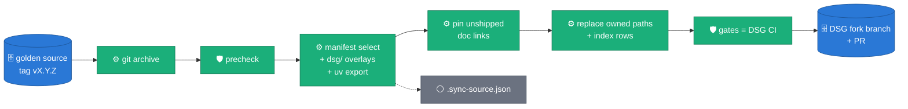

# ADR 0040 — Donated to the Dataflow Solution Guides; this repository stays the golden source

**Status:** ACCEPTED (2026-09-14). Laptop-proven: the sync, precheck and Terraform gates are green. The acceptance gates still outstanding are DSG CI on the first sync PR and a live Dataflow run of the DSG launch scripts.
**Target:** [GoogleCloudPlatform/dataflow-solution-guides](https://github.com/GoogleCloudPlatform/dataflow-solution-guides) (the DSG)
**Runbook:** [`.claude/skills/dsg-sync/SKILL.md`](https://github.com/albertols/synthetic-llm-dataflow-bigquery/blob/a01e54abd46e676b53f344bd8ba5d10af231de21/.claude/skills/dsg-sync/SKILL.md) · `/dsg-sync <ref>`
**Relies on:** [ADR 0009](0009-single-flex-template-image.md) (one image, two entrypoints) · [ADR 0032](0032-relationships-as-config.md) (relationship models as config)

## Context

The solution is donated to the DSG as a batch guide: a pipeline directory,
a Terraform module and a use-case page. Both repositories are public and
both will keep changing. Without a rule, the copy drifts: reviewers edit
it, the source moves on, and each later donation becomes a merge.

The DSG also has its own contract, and it differs from this repository's:

| Concern | This repository | DSG CI (`.github/workflows/pull_request.yml`) |
| :-- | :-- | :-- |
| Dependencies | uv workspace, `uv.lock` | pipenv + `requirements*.txt` + top-level `setup.py` |
| Style | ruff + mypy | yapf `--style yapf` + pylint with `pipelines/pylintrc` (Google style) |
| Tests | `pytest` over `packages/sdfb-tests/tests` | `pytest tests/` in the pipeline directory |
| Infrastructure | bring-your-own (docs) | Terraform per guide, Fabric modules, a generated `scripts/00_set_variables.sh` |

The donation also exposed a hazard. Content derived from a real source
table had been committed here and was public. A copy must never be the
place where that is discovered.

## Decision

**D1 — One direction, one source.** Everything under
`pipelines/synthetic-llm-dataflow-bigquery/`,
`terraform/synthetic-llm-dataflow-bigquery/` and
`use_cases/Synthetic_Data_Generation.md` is generated from one ref of this
repository and replaced wholesale on every sync. `.sync-source.json` records
the ref and sha. A change requested on the DSG side is made here, released,
and synced. DSG commits and PRs carry only the maintainer's git identity: the DSG is
Google-owned, so there are no co-author or tool-attribution trailers and no AI footers.

**D2 — The DSG contract lives here, as an overlay.** DSG-only files are
versioned in `dsg/`: launch scripts `01`–`05`, `setup.py`, Cloud Build
configs, the `tests/` wrapper, the Terraform module, the use-case page and
the README header. `dsg/manifest.yaml` states what else ships, which DSG
paths are owned, and the index rows (one row per DSG index table, applied
idempotently). It also lists `patches`: exact line replacements in DSG files
outside the owned paths, each with a reason. They carry fixes the guide needs
from DSG itself, such as its CI, while the upstream change is under review. A
patch is a no-op once its replacement has landed upstream, and it stops the sync
if neither side is found. An old tag syncs with the manifest it shipped with.

**D3 — Derive, don't duplicate.**
- `requirements*.txt` come from `uv export` of `uv.lock`, so pins cannot diverge.
- Links to documents that don't ship are rewritten to the golden source at the synced sha, so the copy stays small without dead links.
- The image tag and `setup.py` version come from the synced ref.

**D4 — This repository adopts DSG code style natively.** yapf (`--style
yapf`) and pylint with a vendored copy of the DSG `pylintrc` (`dsg/pylintrc`)
gate this repository's CI. Code is copied byte-for-byte, with no reformat on
the way out. The sync fails if DSG's `pylintrc` changes (`pylintrc-parity`),
so the rule cannot silently fork.

**D5 — A sensitive-content gate runs on both sides.**
`scripts/dsg/precheck.py` rejects:
- forbidden paths (evidence bundles, run journals, credentials);
- secret patterns, card numbers (checksum-validated), IBANs (checksum-validated);
- e-mail addresses outside an allowlist;
- tokens whose salted SHA-256 is in `dsg/sensitive_token_hashes.txt`, so the blocklist never holds the values it blocks.

It gates every source PR and every staged tree before the DSG checkout is touched.

**D6 — Gates mirror DSG CI and run before any commit.** The gates are:
precheck, pylintrc parity, link check, `bash -n`, yapf + pylint, Terraform
`fmt`/`init`/`validate`/`test`, and the pipenv build (`setup.py sdist`,
`pytest tests/`, `compileall`). Any failure stops the sync before `git
commit`. The PR body carries the gate table. It says "Not yet run in Google
Cloud" unless `--cloud-run` names a verifying job.

**D7 — The demo is relational and public.** The DSG launch generates
`users → orders → order_items` from the fictitious
`bigquery-public-data.thelook_ecommerce` dataset, with
`config/relationships/gcp_public/gcp-public-relationship.yaml`:
- orders is driven by users;
- order_items is driven by orders, via an edge widened to carry `user_id`, which makes its users edge implied;
- `product_id` comes from an external catalog parent.

Terraform snapshots the sources with their parent filters applied, so the
source has referential integrity. GEOGRAPHY columns are left out, because
the generator would invent WKT that BigQuery rejects on load.

## Alternatives considered

- **[Copybara](https://github.com/google/copybara)** (Google's tool for
  moving code between repositories with transformations). It fits the
  problem and is the model for D1–D3, but it needs a JVM toolchain and its
  own configuration language for a one-origin, one-destination flow. The
  manifest plus a tested Python script covers what we need; migrating to
  Copybara stays open if more destinations appear.
- **`git subtree` / submodule into the DSG.** Rejected: the DSG layout
  differs from this repository's (overlays, generated files, pinned links),
  and a subtree would carry this repository's full history into the DSG.
- **Manual copy per release.** Rejected: that is how drift and leaks start.

## Consequences

- One reformat commit touches every Python file; it is listed in `.git-blame-ignore-revs`.
- DSG review comments cost a release cycle, not a direct commit. The PR body and the DSG `AGENTS.md` section say so.
- The DSG copy keeps only the documents the code cites (ADRs, designs, three guides). Everything else stays here, one pinned link away.
- CI here grows by the precheck, yapf and pylint steps.

## Acceptance criteria

1. `uv run python scripts/dsg/sync.py --ref <tag> --dsg <checkout> --gates full` passes every gate on a clean DSG checkout.
2. A second run with the same ref produces no diff in the DSG checkout (idempotence).
3. The DSG PR's `Build and validation` checks are green.
4. `scripts/04_run_dataflow.sh` then `scripts/05_verify_run.sh RUN_ID` report zero PK duplicates and zero FK orphans on a live project.
