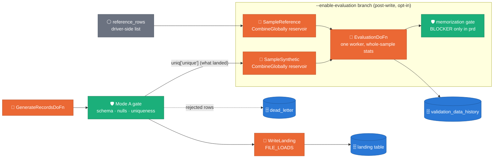
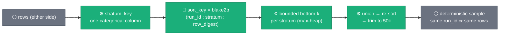
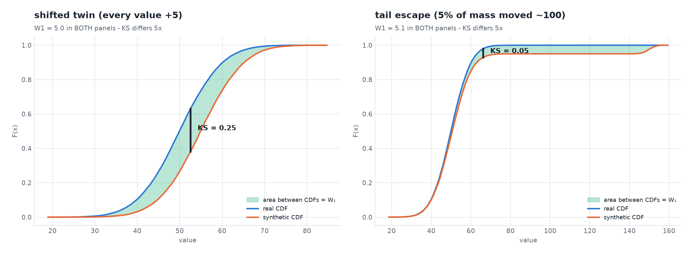
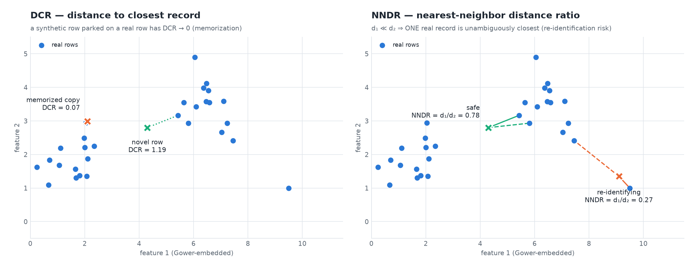

# Design — Evaluation framework (`synthetic_data_quality.validation_data_history`)

> **Status: PARTIALLY IMPLEMENTED** (proposed 2026-07-07; Tier-1/2/3 code lives on branch `ws3-eval-framework` — `sdfb_core/evaluation/` — merge pending)
> · visuals retrofitted 2026-08-05 per the `visual-first-documentation` skill
> · related: [ADR 0022](../adr/0022-stats-driven-generation.md) (the
> source-side stats this framework's landing-side metrics mirror),
> [`2026-08-05-source-table-stats.md`](2026-08-05-source-table-stats.md)
> (entropy/decile concept figures — the same mathematics, source side).
> Concept figures regenerate via
> `uv run --no-sync python3 scripts/doc/make_eval_figures.py`.

- **Scope**: formalizes and supersedes the fidelity/privacy portion of the
  "Mode B validation pipeline" bullet in [`docs/ROADMAP.md`](https://github.com/albertols/synthetic-llm-dataflow-bigquery/blob/d32c34743d80c8481445956939b6bbde9c4d4a3c/docs/ROADMAP.md) M2 (the
  GX/Soda structural-DQ portion of that bullet is untouched by this design — Mode A
  already owns schema/null/range/enum checks pre-write; this design does not
  duplicate them).
- **Author context**: ACTION_5 from the M1→M2 planning pass.

## 1. Goal

Mode A (`.claude/skills/validation-mode-a.md`) answers *"is each synthetic row
schema-conformant?"* — a per-record/per-batch structural question, gated before
`WriteLanding`. It has no way to answer a different, equally important class of
question: *does the synthetic table, taken as a whole, actually look like, and
behave like, the real data it's standing in for* — and *is it accidentally leaking
real rows verbatim?* That's the gap this design closes.

Concretely, this design exists to:

1. **Quantify fidelity, privacy, and utility of synthetic vs. source, per run.**
   Fidelity = do marginal distributions, correlations, and higher-order structure
   match. Privacy = is any synthetic row a near- or exact-duplicate of a real
   row (memorization). Utility = would a model trained on the synthetic data
   perform comparably to one trained on the real data (deferred — §3 TSTR).
2. **Track engine/feature evolution over time.** Every evaluation produces one
   row in `validation_data_history`, keyed by `(run_id, engine, engine_version,
   feature_flag_tags)`. An operator can `SELECT` the metric trend for one
   `(landing_table, engine)` pair across runs — did fidelity improve when the
   embedder changed, did a new similarity default regress correlation
   preservation, did the B.1→B.2 fidelity gap close — without a dashboard,
   just SQL (per CLAUDE.md's no-Looker/no-Dataplex constraint).
3. **Be the sign-off basis for new engine features.** Today the only artifact
   for "did this change make things better or worse" is `scripts/e2e/e2e_validation_analysis.py`
   run by hand against exported CSVs (see its `_cross_overlap` docstring:
   *"a memorization proxy when the live source is not queried here"* —
   `scripts/e2e/e2e_validation_analysis.py:248-282`). This design turns that manual,
   best-effort, offline step into an automated, per-run, machine-gated BigQuery
   row computed against the *actual* live reference sample for that run.

This is explicitly **not** a replacement for Mode A. Mode A's row-level gate
stays exactly as implemented; this design adds a second, coarser-grained,
opt-in signal that Mode A structurally cannot produce (see §5 for the precise
division of labor).

### Where the branch sits

Claim: *evaluation is a post-`WriteLanding` sibling branch — it measures what
landed, never gates what is being written (Mode A already owns that).*



The two inputs are already materialized elsewhere in the DAG (no new full BQ
read); the single-worker `EvaluationDoFn` exists because every §3 metric is a
whole-sample function — details in the sections below.

## 2. Execution model

### Toggle

A new CLI flag on `packages/sdfb-beam/src/sdfb_beam/cli/run_pipeline.py`'s
`parse_args()` (alongside the existing `--validation_runs_table`,
`run_pipeline.py:88-90`):

```python
p.add_argument("--enable-evaluation", action="store_true", default=False,
               help="Toggle the post-WriteLanding fidelity/privacy/utility "
                    "evaluation branch. Independent of --validation_runs_table "
                    "and of the Mode-A --fail_on_blocker gate. Default off.")
p.add_argument("--validation_data_history_table", default="",
               help="BQ table for the evaluation row (project.dataset.table); "
                    "empty skips the write even when --enable-evaluation is set "
                    "(mirrors --validation_runs_table's empty-skips-write contract).")
```

`PipelineConfig` (`packages/sdfb-beam/src/sdfb_beam/pipeline.py:45-74`) gains two
fields alongside `thresholds`/`fail_on_blocker`:

```python
enable_evaluation: bool = False
```

`build_pipeline()` gains one new parameter, `validation_data_history_sink:
beam.PTransform | None = None`, following the exact precedent already set by
`validation_runs_sink` (`pipeline.py:84`) — both are optional sinks; the branch
that uses each is skipped entirely when its sink is `None`. `enable_evaluation`
and `validation_data_history_sink` are independent booleans (both false in a
happy-path DirectRunner unit test today; both true in a real evaluation run) —
this mirrors how `fail_on_blocker` is independent of whether
`validation_runs_sink` is even supplied.

### DAG attachment point

Post-`WriteLanding`, sibling to the existing `if validation_runs_sink is not
None:` block (`pipeline.py:181-215`) — a new block:

```python
if config.enable_evaluation and validation_data_history_sink is not None:
    eval_row = _build_evaluation_branch(
        p, reference_rows=reference_rows, synthetic_rows=uniq["unique"],
        config=config, thresholds=thresholds,
    )
    _ = eval_row | "WriteValidationDataHistory" >> validation_data_history_sink
    result["validation_data_history"] = eval_row
```

Two inputs, both already materialized elsewhere in `build_pipeline()` — no new
BQ read of the full dataset:

- **Real side**: `reference_rows` — the same in-memory driver-side list already
  used to compute `digest = compute_reference_digest(reference_rows)`
  (`pipeline.py:92`), per the reference-data skill's "read reference live every
  job" contract.
- **Synthetic side**: `uniq["unique"]` — the exact PCollection already written
  to `landing_sink` (`pipeline.py:153`) and already returned as `result["valid"]`
  (`pipeline.py:174`). Evaluating this PCollection (not a duplicate generation
  path) means the evaluation branch measures precisely what landed, not what
  was merely attempted.

### Deterministic stratified sampling (seeded by `run_id`, capped ~50k rows/side)

**Stratification scheme — one concrete choice.** A new pure module,
`sdfb_core/evaluation/profile.py`, picks a single low-cardinality categorical
column to stratify on (deliberately **not** reusing `b1_rag/profile.py` or
`b2_library/fidelity.py`'s engine-local `ColumnKind` — those are explicitly
"kept local per engine during parallel development... consolidate to a shared
`engines/_fidelity.py` post-merge if duplication warrants," `b2_library/fidelity.py:9-11`,
and evaluation must not depend on whichever engine happened to run):

```python
@dataclass(frozen=True)
class StratificationPlan:
    column: str | None          # None ⇒ unstratified single "__all__" bucket
    values: tuple[object, ...]  # distinct values observed (bounds num_strata)

def choose_stratification_column(
    table_schema: TableSchema,
    reference_rows: list[dict],
    *, min_categories: int = 2, max_categories: int = 50,
) -> StratificationPlan:
    """First column (declared schema order) whose reference-sample distinct
    count falls in [min_categories, max_categories] and whose BQ type is not
    numeric. No qualifying column ⇒ StratificationPlan(column=None, values=())
    — the unstratified fallback, so this function always terminates with a
    concrete plan, never a TBD."""

def stratum_key(plan: StratificationPlan, row: dict) -> str:
    """str(row[plan.column]) if plan.column else "__all__"."""
```

Bounding `max_categories` at 50 keeps `num_strata` bounded, which bounds
per-stratum memory (see below) regardless of which table this runs against.

**Per-row deterministic priority.** `sdfb_core/evaluation/sampling.py`:

```python
_OVERALL_CAP = 50_000
_MIN_STRATUM_CAP = 1_000

def per_stratum_cap(num_strata: int, overall_cap: int = _OVERALL_CAP) -> int:
    return max(_MIN_STRATUM_CAP, overall_cap // max(num_strata, 1))

def sort_key(run_id: str, stratum: str, row: dict) -> int:
    """Deterministic 'bottom-k reservoir' priority. Reuses the same content
    digest already used for the Mode-A uniqueness gate
    (sdfb_core.validation.uniqueness.row_digest) so identical rows always
    hash identically regardless of pipeline run."""
    digest = row_digest(row)
    h = hashlib.blake2b(f"{run_id}:{stratum}:{digest}".encode(), digest_size=8)
    return int.from_bytes(h.digest(), "big")
```

Same `run_id` + same row content ⇒ same `sort_key`, every time — this is what
makes the sample **deterministic** (re-running evaluation against the same
run's data reproduces the same sample; it is *not* meant to reproduce across
different `run_id`s, since two runs legitimately see different reference pulls
per the reference-data skill's live-SELECT trade-off).

**Accumulator** (pure, in `sdfb_core/evaluation/sampling.py`):

```python
@dataclass
class ReservoirAccumulator:
    by_stratum: dict[str, list[tuple[int, dict]]]  # bounded bottom-k per stratum

def add_row(acc: ReservoirAccumulator, row: dict, *,
            plan: StratificationPlan, run_id: str, cap: int) -> ReservoirAccumulator: ...
def merge_accumulators(accs: Iterable[ReservoirAccumulator], *, cap: int) -> ReservoirAccumulator: ...
def extract_sample(acc: ReservoirAccumulator, *, overall_cap: int = _OVERALL_CAP) -> list[dict]:
    """Flattens every stratum's bottom-k, then re-sorts the union by sort_key
    and trims to overall_cap globally. This is what guarantees the 50k/side
    cap holds even when num_strata * per_stratum_cap overshoots it."""
```

`add_row`/`merge_accumulators` keep each stratum's list bounded to `cap`
entries (smallest `sort_key` wins — a bounded max-heap, not an unbounded list),
so accumulator memory is `O(num_strata * per_stratum_cap)` regardless of how
many rows flow through — this is the same commutative/associative-accumulator
shape already required of `MergeProfilesFn` in the whylogs merge
(`.claude/skills/validation-mode-a.md` "Profile" section) and of
`compute_canonical_digest`'s "associative by construction" note
(`.claude/skills/reference-data.md`).

The sampling mechanism, end to end — deterministic bottom-k per stratum,
then a global re-trim:



The hash priority is what makes this a *deterministic* reservoir: bottom-k
by a content-keyed hash is a uniform random sample for any fixed `run_id`
(each row's priority is an i.i.d. 64-bit value), yet re-running evaluation
for the same run reproduces it bit-for-bit — no RNG state to persist.

**Beam wiring** (`packages/sdfb-beam/src/sdfb_beam/dofns/evaluation.py`):

```python
class StratifiedReservoirFn(beam.CombineFn):
    def __init__(self, plan: StratificationPlan, run_id: str,
                 per_stratum_cap: int, overall_cap: int = 50_000): ...
    def create_accumulator(self) -> ReservoirAccumulator: ...
    def add_input(self, acc, row): ...
    def merge_accumulators(self, accs): ...
    def extract_output(self, acc) -> list[dict]: ...
```

applied as:

```python
real_sample = (
    p | "CreateReference" >> beam.Create(reference_rows)
      | "SampleReference" >> beam.CombineGlobally(StratifiedReservoirFn(plan, run_id, cap))
)
synth_sample = (
    synthetic_rows | "SampleSynthetic" >> beam.CombineGlobally(StratifiedReservoirFn(plan, run_id, cap))
)
```

`reference_rows` is already an in-memory driver-side list by the time
`build_pipeline()` runs it through `beam.Create()` — sampling it in plain
Python would be cheaper today. It's routed through the same `CombineGlobally`
as the synthetic side anyway, deliberately, for two reasons: (1) one selection
code path (and one test suite) governs both sides, so "real" and "synthetic"
samples are provably drawn by identical logic; (2) it carries forward cleanly
if `docs/ROADMAP.md`'s M2 "Reference snapshot pattern" ever replaces the
driver-side list with a genuine PCollection read — no rewrite needed at that
point, only a different upstream source into the same `CombineGlobally`.

### ONE evaluation DoFn on a single worker

```python
eval_row = (
    p | "EvalSeed" >> beam.Create([None])
      | "Evaluate" >> beam.ParDo(
            EvaluationDoFn(table_schema=config.table_schema, run_id=config.run_id,
                           engine=config.engine_name, engine_version=..., 
                           feature_flag_tags=_build_feature_flag_tags(config),
                           landing_table=config.landing_table, thresholds=thresholds),
            real_sample=beam.pvalue.AsSingleton(real_sample),
            synth_sample=beam.pvalue.AsSingleton(synth_sample),
        )
)
```

This is the identical `beam.Create([None])` + `AsSingleton` side-input shape
already used to force exactly one `_build_validation_run_row` call
(`pipeline.py:194-210`) — the same construction, reused for the same reason:
force one invocation on one bundle, i.e. one worker.

**Why heavy metrics cannot be row-level.** Every metric in §3 is a function of
the *whole* sample, not of one record: a correlation matrix, a mutual-information
matrix, an SDMetrics `QualityReport`, and a nearest-neighbor search all require
simultaneous access to every row's value for a column (or every row, for the
pairwise DCR/NNDR search) to produce a single number. Beam's `ParDo` model
gives each element an independent `process()` call with no visibility into
sibling elements — there is no way to compute `pandas.DataFrame.corr()` inside
a per-row `DoFn`. The `CombineGlobally` steps above exist precisely to
materialize the bounded sample into one bundle so a single `process()` call
can build two DataFrames and run whole-sample statistics.

**Memory bounds.** At the 50k-row/side cap: 50,000 rows × ~50 columns ×
8 bytes (float64) ≈ 20 MB per DataFrame, ≈ 40 MB for both sides — trivial for
a single non-GPU Dataflow worker. The one metric family that is *naturally*
pairwise — DCR/NNDR (§3) — is **not** computed via a dense 50k×50k pairwise
matrix (which would be ~20 GB and O(n²) memory): both use
`sklearn.neighbors.NearestNeighbors` (a tree-based nearest-neighbor index),
whose construction is `O(n log n)` and whose per-query cost is bounded — never
a materialized full pairwise distance matrix. This is a hard design
requirement, not an optimization detail: without it, this single-worker DoFn
would OOM at the target sample size.

**When the source sample is unavailable.** `extract_sample` on an empty
accumulator naturally yields `[]` (empty `reference_rows`, e.g. a
misconfigured `--reference_rows_limit=0` or a live SELECT that returned
nothing) — no exception. Likewise `synth_sample` can be empty if every
generated row was rejected pre-write (Mode-A BLOCKER gate tripped,
`uniq["unique"]` empty). `EvaluationDoFn.process()` checks
`len(real_sample) == 0 or len(synth_sample) == 0` up front and short-circuits:
it still **writes exactly one row** — `sample_rows_real`/`sample_rows_synthetic`
set to the true (possibly 0) counts, every metric column explicitly `NULL`,
`raw_metrics_json = {"status": "skipped_insufficient_sample", "reason": "..."}`
— plus a `logger.warning(...)`. The row is never silently dropped (same
"never catch-and-drop" ethos CLAUDE.md already applies to `ValidationError`
handling), and the memorization gate (§5) treats a `NULL` `identical_match_rate`
as "not evaluated," never as an implicit pass.

## 3. Metric tiers

### Why the fidelity family needs BOTH a sup-statistic and a mass-statistic

**Claim: two failure modes with the same Wasserstein distance can differ 5×
in KS — the two statistics see different failures, so the framework tracks
both.**



*Entry level:* both panels compare a real CDF (blue) to a synthetic one
(orange). KS is the tallest **vertical gap** between the curves (the black
bar); Wasserstein-1 is the **entire shaded area** between them. A shifted
twin moves every value a little (big gap, small-per-value area); a tail
escape moves 5% of values a long way (tiny gap — only 5% of mass is ever
displaced at any x — but the same total area). One number stays at 5.0 in
both panels; the other changes 5×.

*Research level:* `KS = supₓ|F(x) − G(x)|` (two-sample
Kolmogorov–Smirnov, [`scipy.stats.ks_2samp`](https://docs.scipy.org/doc/scipy/reference/generated/scipy.stats.ks_2samp.html));
`W₁ = ∫|F(x) − G(x)|dx` — for one-dimensional marginals the earth-mover
distance *is* the area between the CDFs
([`scipy.stats.wasserstein_distance`](https://docs.scipy.org/doc/scipy/reference/generated/scipy.stats.wasserstein_distance.html)),
which is why both read off the same picture. A sampler that clamps the tail
(e.g. inverse-CDF's p90→p100 linearization, see the
[source-stats doc](2026-08-05-source-table-stats.md)) shows up in W₁ long
before KS notices.

### Tier 1 — always-on (`scipy` + `scikit-learn`, laptop-testable, no extras)

| Metric | Definition | Why tracked | Call |
|---|---|---|---|
| **KS statistic** | Max CDF distance between real/synthetic marginals, per numeric column | Standard nonparametric goodness-of-fit; catches mode collapse / distribution-shape mismatch without assuming a parametric form | `scipy.stats.ks_2samp(real_col, synth_col).statistic` |
| **Wasserstein distance** | Earth-mover's distance between the same two marginals | KS catches *shape*; Wasserstein is scale-sensitive and catches *magnitude* of the discrepancy KS can miss (e.g. a shifted-but-same-shape distribution) | `scipy.stats.wasserstein_distance(real_col, synth_col)` |
| **TVD** (categorical) | `0.5 * Σ｜p_real(c) − p_synth(c)｜` over category `c` | Bounded [0,1] measure of how far two empirical categorical distributions diverge; dependency-free (built from `value_counts(normalize=True)`) | pure numpy, no library call |
| **PSI** (drift between runs) | `Σ (this_run(c) − prev_run(c)) · ln(this_run(c) / prev_run(c))`, binned | Industry-standard drift statistic comparing *this run's* synthetic distribution to the *previous run's* (not real-vs-synthetic — see §5's regression-tracking query); PSI > 0.2 is the conventional "significant drift" threshold | pure numpy/pandas, binned via `pandas.cut`/`value_counts` |
| **JSD** | Jensen–Shannon divergence, same this-run-vs-prev-run comparison as PSI | Symmetric and bounded ([0, ln 2]) where PSI is unbounded/asymmetric — a sanity-check companion to PSI, not a replacement | `scipy.spatial.distance.jensenshannon(p, q)` |
| **Correlation-matrix diff (Frobenius)** | `‖corr_real − corr_synth‖_F` over numeric columns, Pearson *and* Spearman | Catches a synthesizer that gets every column's marginal right but destroys inter-column relationships (linear via Pearson, monotonic-rank via Spearman) — a failure KS/TVD alone cannot see | `pandas.DataFrame.corr(method="pearson"/"spearman")`, diffed via `numpy.linalg.norm(a - b, ord="fro")` |
| **Mutual-information-matrix diff (Frobenius)** | Same Frobenius-diff idea, over a pairwise MI matrix instead of a linear-correlation matrix | Catches *nonlinear* dependency loss that Pearson/Spearman (linear/monotonic only) miss | `sklearn.feature_selection.mutual_info_regression`/`mutual_info_classif` (numeric↔numeric / numeric↔categorical), `sklearn.metrics.mutual_info_score` (categorical↔categorical), assembled into a matrix and Frobenius-diffed the same way |
| **DCR** (Distance to Closest Record) | For each synthetic row, the minimum Gower-style mixed distance to any real row, averaged over the synthetic sample | Low DCR ⇒ a synthetic row sits very close to some real row ⇒ memorization/near-duplication risk (the core privacy signal) | Numeric block: min-max-normalize then `sklearn.neighbors.NearestNeighbors` (Manhattan/Euclidean); categorical block: indicator mismatch; combined as an equal-weighted average per column ("Gower-style" — an approximation kept deliberately dependency-light for Tier 1's scipy/sklearn-only constraint; Tier 3's SynthEval computes the exact form). Implementation constraint: build ONE concatenated feature matrix (normalized numerics + one-hot categoricals) and query a fitted `NearestNeighbors` tree — never `metric='precomputed'`, whose dense n×n distance matrix would blow the single-worker memory bound |
| **NNDR** (Nearest-Neighbor Distance Ratio) | Per synthetic row: `dist(1st-nearest real neighbor) / dist(2nd-nearest real neighbor)`, averaged | Near 0 ⇒ one specific real record is uniquely, unambiguously the closest match ⇒ re-identification risk for *that* record; near 1 ⇒ no single record stands out. Standard SDV/anonymeter privacy-metric definition | `sklearn.neighbors.NearestNeighbors(n_neighbors=2).fit(real_matrix).kneighbors(synth_matrix)` on the same Gower-embedded space as DCR |
| **Identical-match rate** | Fraction of sampled synthetic rows whose full-row content digest exactly matches a sampled real row's digest | Direct reuse of the existing content hash (`sdfb_core.validation.uniqueness.row_digest`, already used by `EnforceUniqueness`); `0` ⇒ no verbatim leakage, `>0` ⇒ exact copy of a real row — the strongest privacy red flag, and the metric that feeds `memorization.copy_ratio` (§5) | `row_digest(synth_row) in {row_digest(r) for r in real_sample}` |

### The privacy pair, geometrically

**Claim: DCR flags a synthetic row parked on a real record; NNDR flags a
row for which ONE real record is unambiguously closest — different privacy
failures, one embedded space.**



*Entry level:* left panel — the orange × sits on top of a real row: its
distance to the closest record is ~0, the memorization signal. Right
panel — the orange × is not on any real row, but its nearest real neighbor
(solid line) is far closer than its second-nearest (dashed): whoever that
one record belongs to is singled out. The aqua × is safe on both readings:
comfortably distant, and ambiguous between neighbors.

*Research level:* both metrics live in the Gower-style mixed-feature
embedding ([Gower 1971](https://doi.org/10.2307/2528823)): min-max-normalized
numerics + one-hot categoricals. `DCR = min_r d(s, r)`;
`NNDR = d₍₁₎/d₍₂₎ ∈ (0, 1]` — the standard SDV/anonymeter definitions
([Giomi et al. 2022](https://arxiv.org/abs/2211.10459)). The §2 memory
bound is why the design mandates a fitted
`sklearn.neighbors.NearestNeighbors` tree (`O(n log n)` build, bounded
per-query) and forbids the dense 50k×50k distance matrix (~20 GB).
`identical_match_rate` is the degenerate DCR=0 case caught exactly, via the
same `row_digest` used by `EnforceUniqueness` — memorization risk made
gate-able ([Carlini et al. 2021](https://arxiv.org/abs/2012.07805)).

### Tier 2 — SDMetrics (primary suite; new base `sdfb-core` dependency, §6)

| Metric | Definition | Why tracked | Call |
|---|---|---|---|
| **QualityReport** | SDMetrics' composite fidelity score — aggregates column-shape (KS/TVD-like) and column-pair-trends (correlation-like) sub-scores into one 0–1 "Overall Quality Score" | The industry-recognized single number for `fidelity_overall_score` — cheaper to communicate to stakeholders than a basket of raw Tier-1 statistics, and independently validates the Tier-1 numbers rather than duplicating their exact math | `sdmetrics.reports.single_table.QualityReport().generate(real_df, synth_df, metadata).get_score()` |
| **DiagnosticReport** (incl. `NewRowSynthesis`) | SDMetrics' structural sanity report: coverage (are all categories/ranges represented), boundary adherence, and `NewRowSynthesis` — the fraction of synthetic rows that are *not* near-duplicates of any real row within SDMetrics' own numeric-tolerance definition | `NewRowSynthesis` is SDMetrics' own built-in novelty/privacy check; it uses a *tolerance band* (not exact-digest matching), so it's a useful cross-check against Tier 1's exact `identical_match_rate` rather than a replacement for it | `sdmetrics.reports.single_table.DiagnosticReport().generate(real_df, synth_df, metadata)` |

### Tier 3 — `[eval-extra]` (off by default, §6)

| Metric | Definition | Why Tier 3 | Call |
|---|---|---|---|
| **SynthEval privacy (DCR/NNDR)** | Purpose-built synthetic-tabular-data evaluation library's *native*, exact Gower-distance DCR/NNDR (not Tier 1's approximation) | Pulls its own dependency tree (reporting/plotting extras beyond plain sklearn) and is a slower, more precise re-check — appropriate as an opt-in second opinion, not an always-on gate input | `syntheval.SynthEval(real_df, synth_df).evaluate(analysis_classes=["privacy"])` |
| **Evidently drift report** | Longitudinal drift-report HTML comparing this run's synthetic distribution against a baseline (previous run, or the live reference) | Produces a durable **artifact** (an HTML file on GCS), never a dashboard — satisfies CLAUDE.md's no-Looker/no-Dataplex rule by construction (it's a file object, not a rendered service) | `evidently.Report(metrics=[DataDriftPreset()]).run(reference_data=..., current_data=...).save_html(...)`, uploaded to `gs://{bucket}/synthetic/eval/{run_id}/drift_report.html`; the GCS URI is stored in `raw_metrics_json`, never rendered in-house |

### TSTR — documented, deferred, non-priority

**Train-on-Synthetic-Test-on-Real**: fit `lightgbm.LGBMClassifier`/`LGBMRegressor`
on the synthetic sample, score F1 (classification) / RMSE (regression) against
a held-out real test split, and diff against a real-trained baseline's score
(`tstr_f1_delta`). Not implemented in this design because it needs two things
this repo doesn't yet have: (1) a heuristic for picking a "target" column on a
generic single-table schema with no declared ML task, and (2) a train/test
split protocol. The `tstr_f1_delta FLOAT64` column is reserved (`NULLABLE`,
always `NULL` today) in §4's DDL precisely so landing this later needs no
migration.

## 4. `validation_data_history` DDL

```sql
CREATE TABLE `{project}.synthetic_data_quality.validation_data_history` (
  execution_id          STRING    NOT NULL
    OPTIONS(description="Natural key for this evaluation execution (not run_id — a run_id may be re-evaluated, e.g. after a metrics-code fix, appending a new row rather than clobbering, matching this table's append-only convention)."),
  execution_timestamp   TIMESTAMP NOT NULL
    OPTIONS(description="Row write time (UTC); DAY partition key."),
  run_id                STRING    NOT NULL
    OPTIONS(description="Pipeline run id; joins to validation_runs.run_id and dead_letter.run_id."),
  engine                STRING    NOT NULL
    OPTIONS(description="b1_rag | b2_library — matches validation_runs.engine."),
  engine_version        STRING    NOT NULL
    OPTIONS(description="Engine code version (new GenerationEngine.version class attribute, proposed in §6) — distinguishes engine LOGIC evolution from the model/embedder weights already tracked via validation_runs.model_uri."),
  feature_flag_tags     ARRAY<STRING>
    OPTIONS(description="Sorted, human-diffable run-configuration tags, e.g. ['embedder:bge-small-en-v1.5', 'engine:b1_rag', 'identity_columns:customer_id', 'similarity:0.50']. See _build_feature_flag_tags in §4 notes."),
  sample_rows_real      INT64
    OPTIONS(description="Rows in the sampled real side after §2's stratified cap (0 if the reference sample was unavailable)."),
  sample_rows_synthetic INT64
    OPTIONS(description="Rows in the sampled synthetic side after §2's stratified cap (0 if every generated row was rejected pre-write)."),
  fidelity_overall_score FLOAT64
    OPTIONS(description="SDMetrics QualityReport().get_score(), 0-1. NULL when sample_rows_real or sample_rows_synthetic is 0."),
  avg_dcr               FLOAT64
    OPTIONS(description="Mean Distance to Closest Record (Tier 1, Gower-style), synthetic sample vs real sample. Lower = higher memorization risk."),
  nndr                  FLOAT64
    OPTIONS(description="Mean Nearest-Neighbor Distance Ratio (Tier 1). Near 0 = re-identification risk; near 1 = safe."),
  identical_match_rate  FLOAT64
    OPTIONS(description="Fraction of sampled synthetic rows with an exact row_digest match in the sampled real rows. Feeds the memorization.copy_ratio gate (§5)."),
  max_psi               FLOAT64
    OPTIONS(description="Max PSI across columns, this run's synthetic distribution vs the previous validation_data_history row for the same (landing_table, engine). NULL on the first run for a given pair."),
  corr_diff_frobenius   FLOAT64
    OPTIONS(description="Frobenius norm of (corr_real - corr_synth), Pearson. Spearman + the MI-matrix diff live in raw_metrics_json (not worth a dedicated column each)."),
  tstr_f1_delta         FLOAT64
    OPTIONS(description="Reserved for future TSTR (§3). Always NULL until implemented."),
  raw_metrics_json      JSON
    OPTIONS(description="Full nested metric payload: every Tier-1 per-column statistic, SDMetrics sub-scores, Tier-3 results when run, per-column binned distributions (needed by the NEXT run's PSI/JSD computation, since raw sample rows are never persisted — only these aggregates), the Evidently GCS URI when Tier 3 ran, the memorization-gate outcome, and sampling metadata (stratification column, per-stratum counts, whether the 50k cap was hit).")
)
PARTITION BY DATE(execution_timestamp)
CLUSTER BY engine, run_id;
```

Column-by-column notes not already covered inline:

- **`execution_id` vs `run_id`**: this table is append-only like `validation_runs`
  and `dead_letter` (`WRITE_APPEND` + `CREATE_NEVER`, matching the sink
  convention already used for both — `run_pipeline.py:252-271`). `run_id` is
  the join key back to `validation_runs`/`dead_letter`; `execution_id` exists
  because a single `run_id` could in principle be re-evaluated (e.g. rerunning
  `--enable-evaluation` against already-landed data after a metrics bug fix)
  without a schema that assumes one evaluation per run.
- **`engine_version`**: no such attribute exists on `GenerationEngine` today —
  both `B1RagEngine` and `B2LibraryEngine` declare only `name`
  (`b1_rag/engine.py:75`, `b2_library/engine.py:59`). This design proposes
  adding a parallel `version: str = "0.1.0"` class attribute, bumped by hand
  when engine *logic* changes materially — distinct from
  `validation_runs.model_uri`, which tracks LLM *weights*, not engine code.
- **`feature_flag_tags`**: built by a new `_build_feature_flag_tags(config:
  PipelineConfig) -> list[str]` function in `sdfb_beam/pipeline.py` (same file,
  same style as the existing `_build_validation_run_row` helper), reading
  `config.engine_name`, `config.similarity`, `config.identity_columns`,
  `config.embedder_uri` — sorted for determinism, so two runs with identical
  configuration produce byte-identical tag arrays (queryable via `IN
  UNNEST(feature_flag_tags)`).
- **No `landing_table`/`reference_table` column** — deliberately not
  duplicated here (per ADR 0007's DRY-across-documentation-and-code policy).
  `run_id` joins to `validation_runs`, which already carries both. §5's
  regression-tracking query does this join.
- **`raw_metrics_json` carrying per-column distributions**: this is load-bearing,
  not just a debug dump — since raw sample rows are never persisted (only
  aggregated metrics are, keeping this table small and free of duplicated PII
  beyond what's already in the landing table), the *next* run's PSI/JSD
  computation has nothing to diff against except whatever the *previous* row's
  `raw_metrics_json` stored. The evaluation DoFn must therefore write enough
  sufficient statistics (binned histograms per numeric column, frequency
  tables per categorical column) for a future run to recompute drift without
  re-reading raw rows.

Provisioning follows the exact pattern already documented for `dlq`/
`validation_runs` in `docs/DEPLOYMENT_PREREQUISITES.md` §"BigQuery — datasets &
tables": a new `config/bq_schema/synthetic_data_quality/validation_data_history.schema.json`
(the same BQ JSON array format as the two sibling files), created with

```bash
bq mk --schema config/bq_schema/synthetic_data_quality/validation_data_history.schema.json \
      --time_partitioning_field execution_timestamp --time_partitioning_type DAY \
      --clustering_fields engine,run_id \
      project:synthetic_data_quality.validation_data_history
```

Adding this table (and the `--enable-evaluation`/`--validation_data_history_table`
rows) to `DEPLOYMENT_PREREQUISITES.md`'s provisioning table is a follow-on doc
change when this design is implemented, not part of this document's scope —
the same deferral pattern the RAG-layer design used for `rag_chunks`
(`docs/designs/2026-07-07-rag-layer-design.md:290-293`).

## 5. Gate integration

### New rule: `memorization.copy_ratio`

`config/thresholds.yml` gains a new rule whose **severity itself varies by
env** (every existing rule has a fixed severity and, at most, a per-env
*threshold*; this is the first rule where severity is per-env, since a
sample-based ratio genuinely warrants looser tolerance while iterating in dev
than at prd sign-off):

```yaml
memorization.copy_ratio:
  dimension: privacy
  severity:
    dev: MAJOR
    uat: MAJOR
    prd: BLOCKER
  threshold: 0.0   # any exact duplicate of a sampled real row is a violation
```

`Thresholds.rules` (`sdfb_core/validation/thresholds.py:29`) already stores the
raw per-rule dict verbatim (`rules: dict[str, dict] = Field(default_factory=dict)`)
— no Pydantic model change is required to hold this new rule shape. What's new
is a small resolver, added to the same module:

```python
def resolve_severity(thresholds: Thresholds, rule_id: str, *, default: str = "MINOR") -> str:
    """Mirrors the per-env resolution already used for blocker_failure_ratio
    (Thresholds.from_mapping, thresholds.py:33-34): severity may be a bare
    string (fixed, like every existing rule) or a per-env dict (new, for
    memorization.copy_ratio)."""
    raw = thresholds.rules.get(rule_id, {}).get("severity", default)
    return raw.get(thresholds.env, default) if isinstance(raw, dict) else raw
```

And a new pure module, `sdfb_core/evaluation/gate.py` (co-located with the
metrics code that produces its input, rather than folded into
`validation/summary.py`'s pre-write BLOCKER gate, since this is a distinct
post-write concern):

```python
class MemorizationThresholdExceeded(RuntimeError):  # noqa: N818 — mirrors BlockerThresholdExceeded
    """Raised to FAIL the Dataflow job when the memorization gate trips at BLOCKER severity."""

def evaluate_memorization_gate(
    copy_ratio: float | None, thresholds: Thresholds,
    *, rule_id: str = "memorization.copy_ratio",
) -> None:
    """No-ops when copy_ratio is None (§2's 'sample unavailable' case — gate
    not evaluated, never treated as an implicit pass). Raises
    MemorizationThresholdExceeded when copy_ratio exceeds the rule's threshold
    AND resolve_severity(...) == 'BLOCKER' for this env. A MAJOR-severity
    breach is recorded (identical_match_rate is already in the written row)
    but does not fail the job — same 'MAJOR → metric only' semantics already
    documented in the thresholds.yml header and validation-mode-a.md's
    'Failing the job' section."""
```

Wired in `pipeline.py` as a sibling to `_BlockerGateDoFn`
(`pipeline.py:249-259`) — a new `_MemorizationGateDoFn` inside the
`enable_evaluation` branch, unconditional on any extra CLI flag: the
thresholds.yml row's per-env severity *is* the toggle (BLOCKER only in `prd`),
so no new "should this fail the job" knob is needed beyond what's already
resolved from `--env`.

### Regression tracking

"Previous row per `(table, engine)`" is realized via a join through
`validation_runs` (no duplicated `landing_table` column in
`validation_data_history`, per §4):

```sql
SELECT h.*
FROM `{project}.synthetic_data_quality.validation_data_history` h
JOIN `{project}.synthetic_data_quality.validation_runs` r USING (run_id)
WHERE r.landing_table = @landing_table
  AND h.engine = @engine
  AND h.execution_timestamp < @this_execution_timestamp
ORDER BY h.execution_timestamp DESC
LIMIT 1;
```

This is the **one new BQ read** this design introduces beyond the write
itself — a single `LIMIT 1` lookup, executed once inside `EvaluationDoFn`
(once per run, on the one single-worker invocation, never per-row — consistent
with "heavy metrics must not run in row-level DoFns," since this isn't
row-level at all). It serves two purposes: (1) it supplies the previous run's
binned distributions (from `raw_metrics_json`) that Tier 1's PSI/JSD need to
compute drift-between-runs (§3); (2) more broadly, it's what "track
engine/feature evolution over time" (§1) cashes out as — any operator can run
the same join, unfiltered by `LIMIT 1` and ordered ascending, to see
`fidelity_overall_score`/`avg_dcr`/`nndr`/`corr_diff_frobenius` trend across
every run for one `(landing_table, engine)` pair, as a plain `bq query`, never
a dashboard.

### Complements — does not replace — the Mode-A DLQ gate

`EnforceUniqueness` (`sdfb_beam/dofns/uniqueness.py`) only ever compares
synthetic rows **against each other** — it dedupes within one run's batch, has
no notion of the real reference data, runs exhaustively (every row, every run,
pre-write), and its two rule_ids (`row.duplicate`, `identity.unique`) are fixed
BLOCKER severity regardless of env. `memorization.copy_ratio` fills the gap
that leaves open: it compares sampled synthetic rows **against sampled real
rows** — the one comparison Mode A structurally never makes — runs on a bounded
sample (not exhaustive, since it's post-write and opt-in), and its severity is
env-conditional because a sample-based ratio can have false negatives (a
missed exact match outside the sample) that make a fixed always-BLOCKER
posture too strict while iterating in dev.

### Complements the e2e probe scripts

`scripts/e2e/e2e_validation_analysis.py`'s `_cross_overlap` (line 248) is an
offline, manually-invoked, per-column Jaccard-overlap heuristic — its own
docstring calls it *"a memorization proxy when the live source is not queried
here."* It exists because that script has no live BQ access in its intended
use (analyzing exported CSVs). The evaluation branch in this design is the
automated counterpart: it runs inside the same job that generated the data,
against the *actual* reference sample that job pulled, using exact
`row_digest` matching (not a proxy), and is machine-gated via thresholds.yml
rather than eyeballed. The e2e script remains useful for ad hoc, no-BigQuery-access
investigation; this design is what runs by default in CI/production once
`--enable-evaluation` is on.

## 6. Packaging & testability

### `sdfb-core` (pure, laptop-testable — no Beam, no GCP, no torch)

New package `packages/sdfb-core/src/sdfb_core/evaluation/`:

| Module | Contents | Import cost |
|---|---|---|
| `profile.py` | `StratificationPlan`, `choose_stratification_column`, `stratum_key` | stdlib only |
| `sampling.py` | `ReservoirAccumulator`, `sort_key`, `add_row`, `merge_accumulators`, `extract_sample`, `per_stratum_cap` | stdlib + `sdfb_core.validation.uniqueness.row_digest` |
| `metrics_t1.py` | KS/Wasserstein/TVD/PSI/JSD/correlation-diff/MI-diff/DCR/NNDR/identical-match functions (§3 signatures) | `scipy`, `scikit-learn`, `pandas` — imported at module top (cheap, no GPU/CUDA/network — same posture as `numpy` already being an unconditional top-level import in `sdfb-core` today) |
| `metrics_t2.py` | `sdmetrics_quality_score`, `sdmetrics_diagnostic` | `sdmetrics` — module-top import |
| `metrics_t3.py` | `syntheval_privacy`, `evidently_drift_report` | `syntheval`/`evidently` — **deferred imports inside each function body**, `try/except ImportError` raising a clear "install `sdfb-beam[eval-extra]`" message |
| `gate.py` | `MemorizationThresholdExceeded`, `evaluate_memorization_gate` | stdlib only |

**Caveat — audit before implementing.** Before landing `sdmetrics` as a base
dependency, audit its transitive dependency tree for the version pinned here
(`>=0.16.0`): recent `sdmetrics` releases can pull in `torch` transitively,
which would violate `sdfb-core`'s "no torch" rule (CLAUDE.md package map) the
same way this whole paragraph argues the other three libraries don't. If the
audited version does pull `torch`, move `sdmetrics` (and `metrics_t2.py`)
behind the `[eval-extra]` tier alongside Tier 3 instead of base — do not land
it as a base dependency in that case.

`sdfb-core/pyproject.toml` gains four new base dependencies:
`scipy>=1.11.0`, `scikit-learn>=1.4.0`, `sdmetrics>=0.16.0`, `pandas>=2.2.0`.
This is a real (if narrow) widening of `sdfb-core`'s footprint — CLAUDE.md's
package map describes `sdfb-core` as "no Beam, no GCP, no torch"; none of
these four libraries are Beam, GCP, or torch, so the constraint's actual
intent (keep `sdfb-core` importable and unit-testable on a laptop with no
cloud creds, no GPU) is preserved. `pandas` is the one library here that
`sdfb-core` didn't previously depend on at all (it's an existing `sdfb-beam`
dependency, `sdfb-beam/pyproject.toml:19`); adding it to `sdfb-core` is
required because the evaluation module needs DataFrames and must itself stay
Beam-free. Tier 1 + Tier 2 land as base (non-optional) dependencies —
deliberately, since the locked decision makes them "always-on": `uv sync
--group dev` alone (CLAUDE.md's documented laptop recipe) is sufficient to
unit-test every Tier 1/2 function against fixture DataFrames, no extra flag
needed.

`sdfb-beam/pyproject.toml` gains one new optional-dependency group, following
the exact precedent already set by `gpu`/`embedding`/`library` (extras
declared on `sdfb-beam` even though the importing code lives in `sdfb-core` —
`sdfb-beam/pyproject.toml:27-55`):

```toml
# Tier-3 evaluation extras — SynthEval + Evidently. Off by default; the
# functions that import these are deferred-import (sdfb_core/evaluation/metrics_t3.py)
# so their absence never breaks a Tier 1/2 evaluation run.
eval-extra = [
    "syntheval>=1.5.0",
    "evidently>=0.4.0",
]
```

`uv sync --group dev --package sdfb-beam --extra eval-extra` opts into Tier 3
on request; it is never required for Tier 1/2 or for the default `pytest`
baseline.

### `sdfb-beam` (Beam wiring only)

New module `packages/sdfb-beam/src/sdfb_beam/dofns/evaluation.py`:
`StratifiedReservoirFn` (a thin `beam.CombineFn` wrapping
`sdfb_core.evaluation.sampling`'s pure functions) and `EvaluationDoFn` (a
`beam.DoFn` whose `process()` calls into `sdfb_core.evaluation.metrics_t1`/
`metrics_t2`/`gate`, and — only when the Tier-3 extra is importable —
`metrics_t3`). This is the **only** place any of Tier 1–3's libraries are
imported at Beam-graph-construction or worker-runtime; `pipeline.py` itself
imports only `_build_feature_flag_tags` and the `EvaluationDoFn`/
`StratifiedReservoirFn` classes, never `scipy`/`sdmetrics`/etc. directly —
matching how `PanderaValidateBatchDoFn`/`ValidateRecordDoFn` are the only
importers of `pandera` today.

### Tests

New `packages/sdfb-tests/tests/unit/evaluation/` (mirrors the existing
`tests/unit/dofns/`, `tests/unit/engines/` layout):

- `test_profile.py`, `test_sampling.py`, `test_metrics_t1.py`,
  `test_metrics_t2.py`, `test_gate.py` — small, hand-built fixture
  DataFrames/row-lists (≤ 20 rows is enough to exercise every formula), no
  Beam required. `test_sampling.py` specifically asserts (a) determinism —
  same `run_id` + same rows fed twice ⇒ identical sample, and (b) cap
  enforcement — output never exceeds `per_stratum_cap`/50k regardless of
  input size — by calling `create_accumulator`/`add_row`/`merge_accumulators`/
  `extract_sample` directly as plain functions, the same unit-testing
  approach `MergeProfilesFn`'s commutativity requirement already implies for
  the whylogs profile merge.
- `test_metrics_t3.py` uses `pytest.importorskip("syntheval")` /
  `pytest.importorskip("evidently")` so it skips cleanly on the laptop
  (`eval-extra` not installed) rather than needing a new pytest marker wired
  into CLAUDE.md's documented `pytest -m "not gpu and not gcp"` baseline —
  deliberately minimizing this design's footprint on the existing verify
  recipe.
- Beam-side tests (`tests/unit/dofns/test_evaluation.py`) exercise
  `StratifiedReservoirFn`/`EvaluationDoFn` via `TestPipeline`/`DirectRunner`
  with a `FakeModelClient`-style small fixture, same pattern as the existing
  DoFn test suite.

## 7. Out of scope / future

- **TSTR** (§3): target-column selection heuristic, train/test split
  convention, LightGBM baseline management. `tstr_f1_delta` is reserved
  (`NULLABLE`) in §4's DDL so landing it later needs no migration.
- **Multi-table fidelity** (FK-aware joint distributions, cross-table
  correlation): out of scope per CLAUDE.md's single-table-only M1/M2-so-far
  constraint; `validation_data_history` is single-table-scoped exactly like
  `validation_runs`.
- **Dashboards**: explicitly not proposed. Any human-facing view of
  `validation_data_history` is a `bq query` (§5's regression-tracking query)
  or a GCS HTML artifact (Tier 3 Evidently) — never Looker, Dataplex, or any
  managed dashboarding service.
- Also flagged, not required for this design to be complete: a `--eval_tier`
  CLI knob to gate Tier 3 execution behind an explicit request rather than
  only extra-availability; a cheaper `--eval_privacy_only` fast-path (skip
  Tier 1 marginal stats, run only DCR/NNDR/identical-match) for repeated
  privacy-only checks; and `engine_version` migration tooling if that
  attribute's semantics change. Natural next increments, not blockers here.

## Figure provenance

Regenerate: `uv run --no-sync python3 scripts/doc/make_eval_figures.py` (prints
OKLab palette separation on every run). Concept figures: seeded,
deterministic, parameters in the script's `CONCEPT` block; no measured run
numbers (this design is not implemented — there are no runs to measure).

| Figure | File | Claim |
|---|---|---|
| 1 | `assets/eval-ks-vs-wasserstein.png` | same W₁, 5× different KS — the two statistics see different failures |
| 2 | `assets/eval-dcr-nndr.png` | DCR catches the parked copy; NNDR catches the unambiguous neighbor |
| inline | mermaid (house classes) | evaluation branch placement; deterministic stratified reservoir |

External references:
[`scipy.stats.ks_2samp`](https://docs.scipy.org/doc/scipy/reference/generated/scipy.stats.ks_2samp.html) ·
[`scipy.stats.wasserstein_distance`](https://docs.scipy.org/doc/scipy/reference/generated/scipy.stats.wasserstein_distance.html) ·
[Gower 1971](https://doi.org/10.2307/2528823) ·
[Giomi et al. 2022 (anonymeter)](https://arxiv.org/abs/2211.10459) ·
[Carlini et al. 2021](https://arxiv.org/abs/2012.07805) ·
[SDMetrics QualityReport](https://docs.sdv.dev/sdmetrics/reports/quality-report) ·
[SDMetrics KSComplement](https://docs.sdv.dev/sdmetrics/metrics/quality-metrics/kscomplement) ·
[Evidently](https://docs.evidentlyai.com/) —
retrieval date for all URLs: 2026-08-05.
