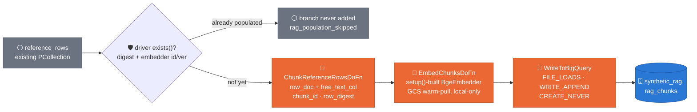
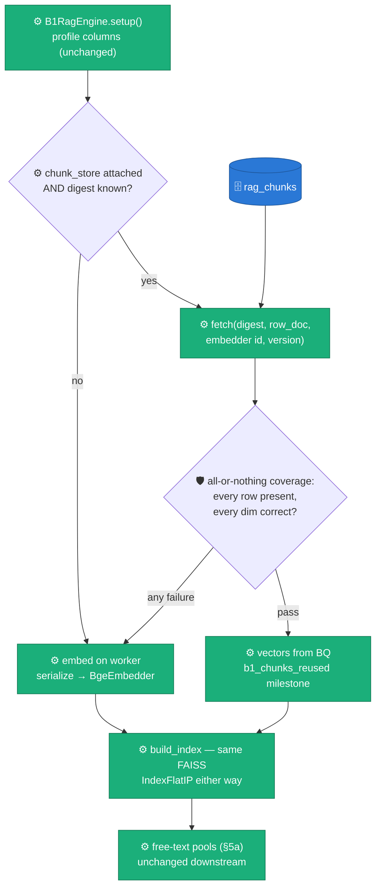
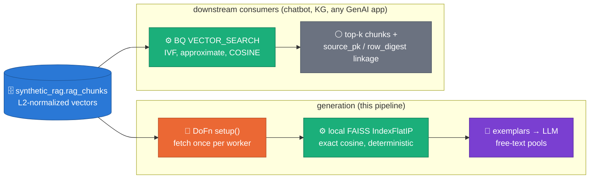

# Design — Persistent RAG layer (`synthetic_rag.rag_chunks`)

> **Status: ACCEPTED — Phase A implemented** (WS2, 2026-07-20; proposed
> 2026-07-07) · visuals retrofitted 2026-08-05 per the
> `visual-first-documentation` skill
> · decision record: [ADR 0017](../adr/0017-custom-rag-layer-over-beam-ml-rag.md)
> · retrieval *geometry* (unit-sphere trigonometry, centroid cones, k-center
> coverage) is owned by
> [`2026-07-25-rag-retrieval-geometry-roadmap.md`](2026-07-25-rag-retrieval-geometry-roadmap.md)
> and reused here, never redrawn.

- **Scope**: Phase A (this doc) is implemented. Phase B/C are deferred — see
  §6 and the retrieval roadmap in
  [`2026-07-25-rag-retrieval-geometry-roadmap.md`](2026-07-25-rag-retrieval-geometry-roadmap.md).
- **Author context**: ACTION_4 from the M1→M2 planning pass.

## 1. Goal & motivation

Today, every B.1 (`B1RagEngine`) worker re-embeds the entire reference sample from
scratch on every pipeline run, in `setup()`:

```python
# packages/sdfb-core/src/sdfb_core/engines/b1_rag/engine.py:123-129
if ctx.reference_rows:
    texts = serialize_rows(ctx.reference_rows, self._column_order)
    self._ref_vectors = self._embedder.embed(texts)
    self._index = build_index(self._ref_vectors, self._embedder.dim)
```

This is correct but wasteful in two ways:

1. **Redundant compute.** The reference-data skill (`.claude/skills/reference-data.md`)
   already establishes that reference rows are a *live SELECT* keyed by a
   `reference_digest` (SHA-256 over canonical-encoded rows, computed in
   `sdfb_beam/io/digest.py` per ADR 0005). When two runs happen to pull an
   identical reference sample (same `reference_digest`), or when the same run
   fans out to N workers, every worker pays the embedding cost again — CPU-bound
   `BgeEmbedder.embed()` (`packages/sdfb-core/src/sdfb_core/engines/b1_rag/embedder.py:150-175`)
   over up to 10k rows, per worker, per run.
2. **No downstream reuse.** The embeddings that condition B.1's free-text
   inference are thrown away in `teardown()` (`engine.py:136-149`). They have
   no life outside one worker's process. Any other consumer that wants
   semantically-searchable vectors over the same reference data — a chatbot
   grounded on the table, a knowledge-graph / entity-resolution pass, a
   generic RAG app, or a human debugging "why did the LLM pick this
   exemplar?" — has nothing to query. Today the *only* artifact that outlives
   a run is the synthetic rows themselves plus the `reference_digest` string
   in `validation_runs`.

**Goal:** persist the embeddings computed for one `reference_digest` exactly
once, in a canonical, queryable BigQuery table with BigQuery-native vector
search — so that (a) the synthesis pipeline stops re-embedding a reference
sample it has already embedded, and (b) any downstream GenAI / KG / chatbot
application can `VECTOR_SEARCH` the same table without needing its own
embedding pipeline or vector database. Generation-time behavior is otherwise
unchanged: B.1's local FAISS index is still built at worker `setup()` time —
it's just built *from* the persisted vectors instead of by re-embedding, when
they're available.

This is explicitly a **reuse-of-computation** design, not a retrieval-quality
change: B.1's retrieval semantics (row-as-document GReaT serialization,
exact cosine top-k, centroid-seeded exemplar retrieval) do not change. Only
*where the vectors come from* changes.

## 1a. Package shape (WS2 §4a)

Phase A landed this design as a standalone package rather than code living
inside `engines/b1_rag/`, so any future consumer (chatbot, KG/entity-
resolution pass, a second engine) can depend on the RAG primitives without
depending on `B1RagEngine` itself. `B1RagEngine` is now a **consumer** of
this package, not its owner.

`packages/sdfb-core/src/sdfb_core/rag/` (pure-Python, no Beam/GCP):

- `chunking.py` — `Chunk` dataclass + chunkers (`row_doc`, `free_text_col`).
  Row-doc `chunk_text` reuses `serialize_row()` byte-identically.
- `embedding.py` — the `Embedder` Protocol + `BgeEmbedder` (production,
  local-directory-only weights) / `HashingEmbedder` (dependency-free
  fallback).
- `index.py` — the exact FAISS `IndexFlatIP` / pure-Python top-k index.
- `store.py` — the `ChunkStore` Protocol (`fetch`/`exists`, see §4) +
  `InMemoryChunkStore` for tests and laptop runs.
- `serialize.py` — GReaT-style row → text serialization.
- `retrieval.py` — exact-local top-k exemplar retrieval (centroid and,
  as of Phase A §5a, per-column).

`packages/sdfb-beam/src/sdfb_beam/rag/` (Beam/GCP-dependent):

- `store.py` — `BigQueryChunkStore`, the `ChunkStore` implementation over
  `synthetic_rag.rag_chunks`.
- `population.py` — the `--build_rag_layer` population DoFns
  (`ChunkReferenceRowsDoFn`, `EmbedChunksDoFn`; see §3).

The old `sdfb_core.engines.b1_rag.{embedder,index,serialize}` import paths
survive as shims re-exporting from `sdfb_core.rag` — existing imports and
tests written against the pre-Phase-A layout keep working.

## 2. Storage model

### Dataset

`synthetic_rag` — a new BigQuery dataset, sibling to `synthetic_data` (landing)
and `synthetic_data_quality` (DLQ + validation_runs), created the same way
(`bq mk --dataset`, same region as the reference table — `europe-west3` per
ADR 0004). It is **cross-cutting**: unlike `synthetic_data`, which has one
table per source table, `synthetic_rag.rag_chunks` is a single table shared
across every source table the pipeline has ever run against, distinguished by
`source_fqn`.

### Table: `synthetic_rag.rag_chunks`

```sql
CREATE TABLE `{project}.synthetic_rag.rag_chunks` (
  chunk_id          STRING    NOT NULL
    OPTIONS(description="blake2b-256 hex digest of source_fqn || row_digest || chunk_index; deterministic identity key. WRITE_APPEND means duplicate rows are possible across retried/racing runs; readers dedupe by keying on row_digest."),
  source_fqn        STRING    NOT NULL
    OPTIONS(description="Fully-qualified source table this chunk was derived from, e.g. project.dataset.table (== TableSchema.fqn / table_info.table_id)."),
  source_pk         JSON
    OPTIONS(description="Primary-key column -> value map for the source row, e.g. {\"customer_id\": 4821}. NULL when the source table declares no primary_keys (TableSchema.primary_keys is None)."),
  row_digest        STRING    NOT NULL
    OPTIONS(description="SHA-256 of the canonical-encoded source row (same encoding as compute_canonical_digest in reference-data.md), independent of chunking — identifies the row content itself."),
  reference_digest  STRING    NOT NULL
    OPTIONS(description="SHA-256 over the whole reference sample this row was pulled as part of (sdfb_beam/io/digest.py). Groups chunks by 'which pipeline run's reference set produced them' and is the idempotency/lookup key for the generation-time read."),
  chunk_index       INT64     NOT NULL
    OPTIONS(description="0 for the row_doc chunk; 0..k-1 for free_text_col chunks when a row yields more than one (currently one per free-text column)."),
  chunk_kind        STRING    NOT NULL
    OPTIONS(description="'row_doc' (GReaT-style whole-row serialization) or 'free_text_col' (single free-text column's value)."),
  chunk_text        STRING    NOT NULL
    OPTIONS(description="The exact string that was embedded — reproduces serialize_row() output for row_doc, or the raw column value for free_text_col."),
  embedder_id       STRING    NOT NULL
    OPTIONS(description="Embedder family identifier, e.g. 'bge-small-en-v1.5'. Matches the embedder_uri path segment in MODEL_LAYOUT.md's embedders/ tree."),
  embedder_version  STRING    NOT NULL
    OPTIONS(description="Embedder weight version, e.g. 'v1' (the {version} path segment). (embedder_id, embedder_version) pins the vector space."),
  embedding         ARRAY<FLOAT64>
    OPTIONS(description="L2-normalized embedding vector, dim = embedder's native dim (384 for bge-small-en-v1.5). Normalized at write time so COSINE distance == inner product, matching build_index()'s FAISS IndexFlatIP convention."),
  metadata          JSON
    OPTIONS(description="Free-form extras: e.g. {\"column\": \"notes\"} for free_text_col chunks, {\"table_schema_version\": ...} for provenance. Never load-bearing for retrieval."),
  created_at        TIMESTAMP NOT NULL
    OPTIONS(description="Row write time (UTC). DAY partition key.")
)
PARTITION BY DATE(created_at)
CLUSTER BY reference_digest, source_fqn;
```

Column-by-column notes:

- **`chunk_id`** is the table's natural dedup key: `blake2b(f"{source_fqn}:{row_digest}:{chunk_index}".encode(), digest_size=32).hexdigest()`.
  Blake2b is chosen over SHA-256 purely for speed at write-time scale (millions
  of chunks across tables) — there is no cryptographic requirement here, only
  determinism and low collision probability, so any reasonable fast hash
  works; blake2b is the stdlib (`hashlib.blake2b`) choice. It is **not**
  declared `PRIMARY KEY` — BigQuery primary keys are unenforced metadata, and
  the idempotency check in §3 does its own existence query rather than
  relying on constraint enforcement.
- **`source_pk` + `row_digest`** together are the source-linkage story: given a
  `rag_chunks` row, `source_pk` lets a downstream consumer look the row back
  up in the live source table (`SELECT * FROM {source_fqn} WHERE {pk_col} =
  {pk_val} ...` for each key in the map) *if the row still exists there*, and
  `row_digest` is a content-addressed identity that survives even if the
  source row has since been updated or deleted — two chunks with the same
  `row_digest` are provably the same row content regardless of which run or
  which reference pull produced them. When `TableSchema.primary_keys` is
  `None` (no declared PK — legal per M1's schema contract), `source_pk` is
  `NULL` and `row_digest` is the *only* linkage back to row content (no
  guaranteed way to re-locate the live row, which is expected: PK-less tables
  already have this limitation everywhere else in the pipeline, e.g. identity
  columns in `sdfb_core/engines/identity.py`).
- **`reference_digest`** is reused verbatim from the existing provenance
  concept (`.claude/skills/reference-data.md`, ADR 0005) — it is the join key
  between `rag_chunks` and `validation_runs`, and the lookup key for the
  generation-time read in §4.
- **`embedding` as `ARRAY<FLOAT64>`** (not a fixed-size `ARRAY<FLOAT64>(384)`)
  — BigQuery's `VECTOR_SEARCH`/`CREATE VECTOR INDEX` accept variable-length
  `ARRAY<FLOAT64>` columns; fixed dimensionality is enforced by the writer
  (one embedder per table, `(embedder_id, embedder_version)` pinned — see §4),
  not by the column type.

### Vector index

```sql
CREATE VECTOR INDEX rag_chunks_embedding_idx
ON `{project}.synthetic_rag.rag_chunks`(embedding)
STORING (chunk_id, source_fqn, source_pk, row_digest, reference_digest,
         chunk_kind, chunk_text, embedder_id, embedder_version)
OPTIONS (
  index_type = 'IVF',
  distance_type = 'COSINE'
);
```

`STORING` is populated with every column a downstream consumer needs without a
second lookup (chunk_text for display, source_pk/row_digest for linkage,
embedder identifiers to filter mixed vector spaces) — `embedding` itself and
`metadata`/`created_at`/`chunk_index` are left out of `STORING` since they are
either the indexed column itself or rarely needed at query time (a consumer
can always join back to `rag_chunks` by `chunk_id` for the rest). IVF is
BigQuery's supported vector index type for this workload (approximate,
partitions vectors into lists); COSINE matches the normalized-embedding
convention already established by `build_index()`
(`packages/sdfb-core/src/sdfb_core/engines/b1_rag/index.py:1-17`, exact
`IndexFlatIP` over L2-normalized vectors == cosine). BigQuery requires a
minimum row count before an IVF index is actually built (silently falls back
to brute-force `VECTOR_SEARCH` below that threshold) — acceptable, since below
that threshold brute-force is fast anyway.

### Example downstream query

A GenAI app (chatbot, KG entity-linker, or any consumer outside this
pipeline) retrieving the top-8 semantically nearest chunks to a query vector,
scoped to one source table and one embedder version:

```sql
SELECT
  base.chunk_id,
  base.source_fqn,
  base.source_pk,
  base.chunk_text,
  base.chunk_kind,
  distance
FROM VECTOR_SEARCH(
  TABLE `{project}.synthetic_rag.rag_chunks`,
  'embedding',
  (SELECT @query_embedding AS embedding),
  top_k => 8,
  distance_type => 'COSINE',
  options => '{"fraction_lists_to_search": 0.05}'
)
WHERE base.source_fqn = 'my-proj.raw.customers'
  AND base.embedder_id = 'bge-small-en-v1.5'
  AND base.embedder_version = 'v1'
ORDER BY distance ASC;
```

`@query_embedding` is produced by embedding the caller's query text with the
*same* embedder (`bge-small-en-v1.5`) — this design does not prescribe how a
downstream GenAI app runs that embedding step; it only guarantees the vector
space it can compare against is documented (`embedder_id`/`embedder_version`)
and durable.

## 3. Population path

A new, **opt-in** Beam stage, gated behind two flags on
`sdfb_beam/cli/run_pipeline.py`'s existing argparse surface (alongside
`--ddl_uri`, `--reference_table`, etc. —
`packages/sdfb-beam/src/sdfb_beam/cli/run_pipeline.py:64-95`):

- `--build_rag_layer` (default `false`) — populate `synthetic_rag.rag_chunks`
  from this run's reference sample.
- `--rag_chunks_table` (default `""`) — the FQN of `synthetic_rag.rag_chunks`.
  The original design implied a fixed table name; implementation makes it an
  explicit flag so laptop/DirectRunner tests and multiple environments never
  hardcode a project-qualified name. `--rag_chunks_table` alone enables the
  §4 read-instead-of-reembed path; paired with `--build_rag_layer` it also
  enables population.

When both are set, this adds one branch to the DAG built by `build_pipeline()`
(`packages/sdfb-beam/src/sdfb_beam/pipeline.py`), fed from the same
`reference_rows` PCollection the engine already consumes — no second BQ read.

Claim: *population is one opt-in DAG branch off the reference rows the run
already holds, skipped entirely at DAG-construction time when the digest is
already embedded.*



The `exists()` check runs once on the driver before the graph is built —
one BQ query, never N per-worker checks; a hit means the branch is not in
the DAG at all.

Design notes:

- **Idempotency key is `reference_digest`, not `row_digest`.** Before running
  the chunk/embed/write branch, the pipeline driver issues one lightweight
  existence check —
  `SELECT COUNT(1) > 0 FROM synthetic_rag.rag_chunks WHERE reference_digest = @d
  AND embedder_id = @eid AND embedder_version = @ev LIMIT 1` — against the
  digest computed for *this run's* reference pull (the same digest already
  computed today by `sdfb_beam/io/digest.py` per ADR 0005, available before
  the DAG is constructed since the reference read + digest happen on the
  driver side per the reference-data skill). Implementation: this check runs
  as `BigQueryChunkStore.exists(...)` in `run_pipeline.py`'s driver code,
  before `PipelineConfig`/`build_pipeline()` is invoked; a hit logs the
  `rag_population_skipped` milestone and the branch is never added to the
  DAG. If rows already exist for that
  `(reference_digest, embedder_id, embedder_version)` triple, the branch is
  skipped entirely — no chunking, no embedding, no write. This mirrors
  the "read reference live every run, but let the digest identify re-runs
  that saw the same data" pattern already established for `validation_runs`.
  Doing the check once at DAG-construction time (not per-worker) keeps it a
  single BQ query rather than N.
- **Why not `row_digest`-level dedup instead?** `reference_digest`-level dedup
  is coarser but matches the actual cost driver: the expensive step is
  the embedding pass, which today runs once per *pipeline run*
  regardless of row-level overlap between runs. Row-level dedup (skip
  individual rows already embedded under a *different* reference pull) is a
  legitimate future optimization but adds a per-row existence lookup that
  this design defers — out of scope per §6.
- **Chunker reuses existing pure-Python primitives.** Row-as-document chunking
  calls the identical `serialize_row()` used today
  (`packages/sdfb-core/src/sdfb_core/rag/serialize.py`), so
  `chunk_text` for `chunk_kind='row_doc'` is byte-identical to what B.1
  embeds in `setup()` today — this is what makes the generation-time
  substitution in §4 safe (same text in, same vector out, modulo the embedder
  being pinned by version). Free-text chunking emits one chunk per non-null
  value of each column the DDL-derived schema profiles as free text,
  `chunk_kind='free_text_col'`, `metadata={"column": <col_name>}`. Both kinds
  are produced by `ChunkReferenceRowsDoFn` calling
  `sdfb_core.rag.chunking.chunk_row()`, which also computes `chunk_id`
  (blake2b), `source_pk`, and `row_digest` per chunk — id/provenance
  attachment happens here, not as a separate post-embed DoFn.
- **Embedder reuse, not duplication.** The population path's `EmbedChunksDoFn`
  builds its `BgeEmbedder` (or `HashingEmbedder` fallback) once in `setup()`,
  reusing the *same* GCS warm-pull + local-directory-only loading that
  `GenerateRecordsDoFn` already establishes
  (`packages/sdfb-beam/src/sdfb_beam/dofns/generate.py`, `EMBEDDER_LOCAL_DIR`)
  — this design does not introduce a second embedding code path, only a
  second *consumer* of it. See "Delta from the original design" below for why
  this is a DoFn rather than `RunInference`.
- **Write matches the existing sink convention exactly**: `FILE_LOADS` +
  `WRITE_APPEND` + `CREATE_NEVER`
  (`packages/sdfb-beam/src/sdfb_beam/cli/run_pipeline.py:252-269`) — the table
  must be pre-created via `bq mk --schema` against the DDL in §2, following
  the same provisioning story as `dlq`/`validation_runs` in
  `docs/DEPLOYMENT_PREREQUISITES.md` (§ "BigQuery — datasets & tables").
  `rag_chunks` is added to that document's provisioning table when this design
  is implemented — not part of this document's scope to edit, since M1
  contents are frozen; noted here as the follow-on doc change.

**Delta from the original design.** The original 2026-07-07 version of the
population diagram put the embed step behind `RunInference`
(`EmbedderModelHandler` wrapping `BgeEmbedder`). Phase A implemented it as `EmbedChunksDoFn`, a plain DoFn
with a `setup()`-built embedder instead — matching the lifecycle convention
`GenerateRecordsDoFn` already uses for the *generation-time* embedder
(build-heavy-object-once-in-setup, per `.claude/skills/beam-dofn.md`), so the
population and generation paths share one embedding code path and one
lifecycle pattern rather than two (`RunInference`'s batching/ModelHandler
machinery for one, `setup()` for the other). `RunInference` remains an
option, not a rejected one, if a second consumer of embeddings (e.g. a
higher-throughput batch backfill) ever needs its streamed-inference /
dynamic-batching behavior — this is a "simplest thing that works for one
consumer" choice, not a constraint against `RunInference` in general.

## 4. Generation-time path

`B1RagEngine.setup()` changes from *always embed* to *prefer read, fall back
to embed*, expressed over the `ChunkStore` Protocol
(`packages/sdfb-core/src/sdfb_core/rag/store.py`):

```python
class ChunkStore(Protocol):
    def fetch(
        self, reference_digest: str, chunk_kind: str,
        embedder_id: str, embedder_version: str,
    ) -> list[Chunk]: ...

    def exists(
        self, reference_digest: str, embedder_id: str, embedder_version: str,
    ) -> bool: ...
```

`BigQueryChunkStore` (`sdfb_beam/rag/store.py`) is the production
implementation; `InMemoryChunkStore` (`sdfb_core/rag/store.py`) is the
test/laptop double.

Claim: *the read path is all-or-nothing — one missing or wrong-dim row
discards the whole fetch and falls back to today's embed path, so the two
branches always converge on identical `_ref_vectors`/`_index` state.*



In prose, the same contract:

```text
setup(model_client, ctx):
  1. profile columns (unchanged)
  2. IF ctx.chunk_store is not None AND ctx.reference_digest:
       a. chunks = ctx.chunk_store.fetch(ctx.reference_digest, 'row_doc',
                                          ctx.embedder_id, ctx.embedder_version)
       b. all-or-nothing coverage check: build a row_digest -> embedding map
          from `chunks`; for EVERY row in the embed-prefix (the reference
          rows the engine would otherwise embed), require a chunk whose
          embedding both (i) exists and (ii) has len == self._embedder.dim.
          A single missing or wrong-dim row fails the whole check.
       c. IF the coverage check passes:
            - self._ref_vectors = the matched embeddings, in embed-prefix order
            - build_index(self._ref_vectors, dim)   # same FAISS/py fallback as today
            - log_milestone("b1_chunks_reused", rows=..., seconds=...)
            - SKIP the embed-on-worker path entirely
          ELSE (no store attached, empty table for this digest+version,
                partial coverage, or a dim mismatch — first run,
                --build_rag_layer never turned on, or embedder version bumped):
            - fall back to TODAY'S path exactly:
              texts = serialize_rows(...); self._embedder.embed(texts); build_index(...)
  3. free-text pools built as in §5a (unchanged by this section — retrieval-
     conditioned on whichever index was built in step 2)
```

Key properties:

- **All-or-nothing, not partial-reuse.** A partial read (some rows found in
  `rag_chunks`, others not) would either silently drop reference rows from
  the index or require mixing freshly-embedded and persisted vectors in one
  index — both are worse than a clean fallback. The dim check additionally
  guards against a `rag_chunks` row from a stale/mismatched embedder slipping
  through despite the `(embedder_id, embedder_version)` filter (e.g. a bug
  upstream writing the wrong dim). Any single failure discards the whole
  attempt and re-embeds — correctness over reuse.
- **Correctness is order-independent of which branch ran.** Whether vectors
  came from BQ or from re-embedding, `_ref_vectors` and `_index` end up
  populated the same way (same dim, same normalization contract in
  `build_index()`), so every downstream engine method
  (`_retrieve_exemplars`, `_infer_free_text_pool`) is unaffected — this is
  purely a `setup()`-internal optimization, not a behavior change to
  `generate_batch()`.
- **`(embedder_id, embedder_version)` pinning is load-bearing.** Mixing
  vectors from `bge-small-en-v1.5/v1` with a future `v2` (retrained /
  re-quantized weights) in one FAISS index would silently corrupt cosine
  similarity — nearest-neighbor search across two different embedding spaces
  is meaningless even though the vectors are the same dimensionality. The
  `fetch()` call filters on both fields explicitly so a version bump is
  invisible to the read (it just naturally falls to the "no rows for this
  digest+version" branch → re-embed), never a silent mix.
- **The `b1_chunks_reused` milestone** (`row count`, `seconds` to fetch +
  join) is the observable signal that a run actually benefited from the
  persisted layer — the operational way to tell "read path" from "fallback
  path" apart in run logs, since output rows are otherwise indistinguishable.
- **The BQ read is a small side input, not a second big reference pull.**
  Reading `chunk_text` + `embedding` for one `reference_digest` is bounded by
  the reference sample size (same order of magnitude as the existing
  `--reference_rows_limit`, default 10k rows) and happens once per worker in
  `setup()` — the same lifecycle stage that pays the embed cost today, so
  there is no new per-batch cost.
- **Worker-side attachment pattern.** `GenerationContext` carries
  `rag_chunks_table: str` (a plain FQN string, not a store object — the
  context stays Beam/GCP-free per package boundaries). The store itself is
  attached on the worker: `GenerateRecordsDoFn.setup()` checks
  `if ctx.rag_chunks_table and ctx.chunk_store is None`, and if so rebuilds
  `ctx` via `ctx.model_copy(update={"chunk_store": BigQueryChunkStore(ctx.rag_chunks_table)})`
  before constructing the engine — so `BigQueryChunkStore` (and its lazy
  `google.cloud.bigquery.Client`) is only ever instantiated inside a Beam
  DoFn's `setup()`, never on the driver or inside `sdfb-core`. Tests construct
  a `GenerationContext` with `chunk_store=InMemoryChunkStore(...)` directly,
  bypassing the DoFn entirely.

## 5. Chunking & retrieval standards

Claim: *one vector table, two deliberately different retrieval surfaces —
exact-local for the pipeline's own generation (deterministic, no RPCs in
the hot path), approximate-BQ for every external consumer.*



The split is load-bearing, not incidental: exact `IndexFlatIP` keeps
generation deterministic and RPC-free per the "deterministic top-k" comment
in `sdfb_core/rag/index.py`; IVF `VECTOR_SEARCH` trades exactness for
scale-free external querying. The *geometry* of the exact side — why
centroid top-k, what the retrieval cone looks like on the unit sphere, when
k-center beats it — is drawn in
[`2026-07-25-rag-retrieval-geometry-roadmap.md`](2026-07-25-rag-retrieval-geometry-roadmap.md)
([retrieval geometry](assets/embedding-geometry-topk.png),
[centroid vs per-query](assets/centroid-vs-perquery.png)) and reused, not
redrawn.

- **Row-as-document serialization** (`chunk_kind='row_doc'`): identical to
  today's GReaT-style sentence — `"col is value, col is value, ..."` in
  declared schema column order, nulls rendered as `"is null"`
  (`serialize_row()` in `sdfb_core/rag/serialize.py`). One `row_doc` chunk per
  reference row (`chunk_index=0`).
- **Per-free-text-column chunks** (`chunk_kind='free_text_col'`): one chunk
  per non-null value of each column the DDL-derived profiler classifies as
  `ColumnKind.FREE_TEXT` (`profile.py`). `chunk_index` increments per row
  starting at 1 (0 is reserved for `row_doc`) in declared column order when a
  row has multiple free-text columns. `metadata` carries `{"column":
  "<name>"}` so a downstream consumer can filter to one column's chunks
  without a text parse. Rationale: free-text columns (product descriptions,
  notes, comments) carry retrieval-worthy semantic signal at the *column*
  granularity that the whole-row sentence dilutes — a query for "customer
  complaints about shipping" should match on the `notes` column's embedding,
  not compete against every numeric/categorical column also serialized into
  the row sentence.
- **Normalization**: all embeddings are L2-normalized before write (mirrors
  `HashingEmbedder`/`BgeEmbedder`'s existing normalize-on-embed behavior —
  `BgeEmbedder.embed()` calls `torch.nn.functional.normalize(..., p=2, dim=1)`
  in `sdfb_core/rag/embedding.py`), so `COSINE` distance in `VECTOR_SEARCH`
  and inner product both agree — consistent with `build_index()`'s
  `IndexFlatIP`-over-normalized-vectors convention (`sdfb_core/rag/index.py`).
- **Retrieval granularity, generation-time vs. downstream**: B.1's internal
  retrieval (exemplar lookup for free-text pool inference,
  `B1RagEngine._retrieve_exemplars()` in
  `sdfb_core/engines/b1_rag/engine.py`) stays **exact** local FAISS
  `IndexFlatIP` search regardless of whether vectors were read from BQ or
  freshly embedded — never BigQuery `VECTOR_SEARCH` in the hot generation
  path (that would add network RPCs per worker `setup()` call and reintroduce
  the nondeterminism `IndexFlatIP` was chosen to avoid, per `sdfb_core/rag/index.py`'s
  "deterministic top-k" comment). BigQuery `VECTOR_SEARCH` (approximate, IVF)
  is exclusively the **downstream/external** query surface described in §2 —
  the two retrieval paths are deliberately different (exact-local for the
  pipeline's own generation, approximate-BQ for everyone else) because they
  have different latency/determinism requirements.
- **Top-k convention**: unchanged from today — `_DEFAULT_TOP_K = 8` exemplars
  retrieved to condition free-text pool inference in
  `sdfb_core/engines/b1_rag/engine.py`. This design does not introduce a new
  top-k parameter for the pipeline's own use; §2's example `VECTOR_SEARCH`
  query's `top_k => 8` is a suggested downstream default, not a contract.

## 5a. Phase A generation-quality changes (WS2 §4b.2-3)

Two changes landed alongside the persistence/reuse work in this same Phase A
pass — not because they depend on `rag_chunks`, but because both address
free-text generation quality gaps found by the same WS1/WS2 remediation
effort, and both reuse the retrieval primitives this design introduces.

- **Pool scaling.** The free-text value pool per column now targets
  `min(num_rows, column_distinct, _FREE_TEXT_POOL_MAX)` with
  `_FREE_TEXT_POOL_MAX = 512` (`engines/b1_rag/engine.py`), instead of a
  single fixed-size LLM call. The pool is filled by batched completions of
  `_POOL_VALUES_PER_CALL = 32` values per call, cycling the existing
  escalation ladder (retry-with-relaxed-sampling), with calls bounded at
  `max(len(levels), 2 * ceil(target / 32))` — multiple bounded calls, never
  a per-row LLM call, preserving ADR 0013's FASTGEN "infer distribution once"
  spine. This directly addresses the 28–619× oversampling on high-cardinality
  free-text columns that a fixed 32-value pool produced against larger
  reference/output sizes.
- **Per-column exemplar retrieval.** Free-text pool inference for column C
  now retrieves exemplars specific to C rather than diluted whole-row
  sentences, in seed precedence order:
  1. `free_text_col` chunks for C from the attached `ChunkStore` (when a
     store is attached and has coverage for C);
  2. locally embedded values of column C (embed C's own reference values,
     retrieve top-k against them);
  3. row-doc exemplars (today's whole-row retrieval), as a fallback when
     neither of the above yields anything for C;
  4. `text_examples` (static column-level examples from the DDL/profile),
     as the final fallback.
  This seam is why `retrieval.py` (§1a) exists as a standalone module: the
  per-column retrieval logic is shared by whichever exemplar source is
  available, rather than duplicated per source.

## 6. Constraints & out of scope

Reaffirming CLAUDE.md's hard constraints as they apply here:

- **No Vertex AI.** Embeddings are computed exclusively by the existing
  self-hosted `BgeEmbedder`, warm-pulled and built once per worker in a Beam
  DoFn's `setup()` (`EmbedChunksDoFn` for population, the engine's own
  `setup()` for generation-time fallback) — this design
  adds no new inference backend, no Vertex Embeddings API, no Vertex Vector
  Search / Matching Engine. BigQuery's native `VECTOR_SEARCH` /
  `CREATE VECTOR INDEX` is a BigQuery storage/query feature, not a managed AI
  service call — it operates over vectors this pipeline already computed and
  wrote, no different in kind from any other `SELECT` against a BQ table.
- **No BigQuery remote models / `ML.GENERATE_EMBEDDING`.** BigQuery also
  offers `ML.GENERATE_EMBEDDING` via a remote model connection to Vertex —
  explicitly not used here; embeddings only ever come from the in-Beam
  `BgeEmbedder` DoFn, written by the pipeline, never computed by a BQ-side
  remote function.
- **No external vector databases** (Pinecone, Weaviate, pgvector, etc.) — BQ
  itself is the vector store, per the user's locked decision.
- **No HuggingFace Hub at runtime** — the population path's `EmbedChunksDoFn`
  reuses the exact same GCS-warm-pull + local-directory-only loading already
  in place for generation (`packages/sdfb-beam/src/sdfb_beam/dofns/generate.py`,
  `EMBEDDER_LOCAL_DIR`), and `BgeEmbedder.__init__`
  (`packages/sdfb-core/src/sdfb_core/rag/embedding.py`) uses
  `local_files_only=True`. Nothing in this design calls
  `from_pretrained("org/repo")`.
- **Single-table M1 semantics preserved.** `rag_chunks` is schematically
  table-agnostic (any `source_fqn` can write into it) but this design makes
  **no** cross-table join, no multi-table graph, no entity-resolution logic —
  `source_fqn` is stored purely as a filter/partition dimension, not a
  relationship. Building a knowledge graph or cross-table entity linkage on
  top of `rag_chunks` is exactly the kind of downstream GenAI/KG use case
  this table is designed to *enable*, but doing so is explicitly **out of
  scope** for this pipeline — it would be a separate, external consumer
  reading `rag_chunks` via `VECTOR_SEARCH`, not new code in this repo.
- **No Dataplex, no Looker, no DQ dashboards** — this design adds a table and
  a query pattern, not an observability surface. If `rag_chunks` needs
  monitoring (row counts per digest, staleness), that is a
  `validation_runs`-style BigQuery row, not a dashboard, consistent with
  CLAUDE.md's existing prohibition.
- **Out of scope, deferred**:
  - Row-level (sub-`reference_digest`) dedup of unchanged rows across runs
    (§3 rationale).
  - A `--rebuild_rag_layer` / TTL-based refresh policy for stale chunks (this
    design is additive-only: old `reference_digest` rows are never deleted or
    updated by the pipeline).
  - Embedder version migration tooling (re-embedding all historical rows
    under a new `embedder_version` in bulk) — the read path in §4 handles a
    version bump gracefully (falls back to re-embed for that run) but nothing
    here re-backfills the table under the new version automatically.
- **Phase B/C — deferred until Phase A's E2E baseline** (not "out of scope",
  scheduled after Phase A; spec §4c/§4d; WS3 gates the comparison — Phase C
  ships only after Phase A's `validation_data_history` metrics establish the
  baseline it must beat):
  - **Phase B** (spec §4c): new `chunk_kind`s written by the population
    stage — `column_profile` (one chunk per column: name, type, inferred
    kind, cardinality, top values) and `table_summary` (one chunk per
    `reference_digest`). Generation does not consume these initially; they
    are retrieval substrate for downstream apps and future prompt-grounding.
  - **Phase C** (spec §4d): chunk granularity beyond row/free-text-column,
    hybrid keyword+vector search (deterministic BM25 blended with cosine),
    and reranking of B.1's own exemplar retrieval — this Phase A document is
    a storage/reuse design, not a retrieval-quality design; Phase C is where
    retrieval quality itself changes.

## 7. Migration / rollout

Landing this incrementally, with **B.1's default behavior completely
unchanged** until an operator opts in:

1. **[DONE] Land the schema, unused.** Added
   `config/bq_schema/synthetic_rag/rag_chunks.schema.json`
   (JSON array, same convention as `config/bq_schema/synthetic_data_quality/*.schema.json`).
   `synthetic_rag` dataset provisioning in `docs/DEPLOYMENT_PREREQUISITES.md`
   alongside `synthetic_data_quality` remains a follow-on doc change
   (WS5, spec §7).
2. **[DONE] Land the population stage behind `--build_rag_layer` (default
   `false`).** When the flag is absent/false, `build_pipeline()` behaves
   exactly as it does today — the new branch in §3 is simply not added to
   the DAG. This is the same "opt-in, additive DAG branch" shape already
   used for `validation_runs_sink` (`if args.validation_runs_table: ...` in
   `run_pipeline.py`) — a precedent for gating an optional BQ sink
   behind an empty/false CLI default.
3. **[DONE] Land the generation-time read, self-gating on data.**
   `GenerateRecordsDoFn.setup()`'s worker-side attachment (§4) is gated on
   the `--rag_chunks_table` flag being set (the store is only ever attached
   when there is a table to read from); once attached, `B1RagEngine.setup()`
   always *tries* the read when `ctx.reference_digest` is non-empty, and
   falls back to today's embed path when the all-or-nothing coverage check
   (§4) fails — no separate flag governs read-vs-fallback, that part is
   self-gating on data. This means: until an operator has actually run a job
   with `--build_rag_layer=true` for a given `reference_digest`, every B.1
   run with `--rag_chunks_table` set still behaves byte-for-byte as it does
   without the flag (empty table → immediate fallback, same code path, same
   output). The very first run under a new digest is always a fallback-embed
   run; only the *second* run against the same digest (or any run after a
   `--build_rag_layer` population job) benefits. This ordering — read path
   lands before or alongside the write path, safe by construction because of
   the fallback — means the two shipped as one PR; there is no unsafe
   partial-rollout state.
4. **Operational rollout**: run one job with `--build_rag_layer=true` against
   a reference table's current `reference_digest` (a cheap, isolated
   "backfill" run — it can even skip the synthetic-generation branches
   entirely if desired, though this design does not require adding a
   generation-skip flag; the chunking/embedding stage is independent of
   whether the run also does generation), then subsequent generation runs
   against the same digest read instead of re-embed. Bumping the embedder
   version (`v1` → `v2`) is a no-code-change operational event: run
   `--build_rag_layer=true` again under the new version; old-version rows
   remain in the table (additive-only, per §6) until an explicit cleanup
   decision is made (not part of this design).
5. **Rollback**: setting `--build_rag_layer=false` again, or simply never
   running it, leaves the system in today's state — the read branch's
   fallback makes `rag_chunks` purely additive infrastructure that can be
   ignored, emptied, or dropped without touching engine code.

## Figure provenance

All figures in this doc are inline mermaid (house classDef vocabulary —
🟠 Beam, 🟢 CPU/pure-Python, 🟣 GPU/vLLM, 🔵 stores, ⚪ values); this doc
plots no measured magnitudes of its own. The pool-reuse *evidence* (cold
vs warm pool timings) lives with the WS5/WS6 run docs
([`2026-07-26-ws5-generation-throughput.md`](2026-07-26-ws5-generation-throughput.md),
[`2026-07-27-ws6-pipeline-shape.md`](2026-07-27-ws6-pipeline-shape.md));
retrieval-geometry concept figures are owned by
[`2026-07-25-rag-retrieval-geometry-roadmap.md`](2026-07-25-rag-retrieval-geometry-roadmap.md)
and linked above (concept figures are shared repo assets — reuse before
redraw, per the `visual-first-documentation` skill).

External references:
[GReaT serialization (Borisov et al., ICLR 2023)](https://arxiv.org/abs/2210.06280)
(the row-as-document convention `serialize_row()` follows) ·
[BigQuery vector search](https://cloud.google.com/bigquery/docs/vector-search) ·
[FAISS](https://github.com/facebookresearch/faiss) —
retrieval date for all URLs: 2026-08-05.
