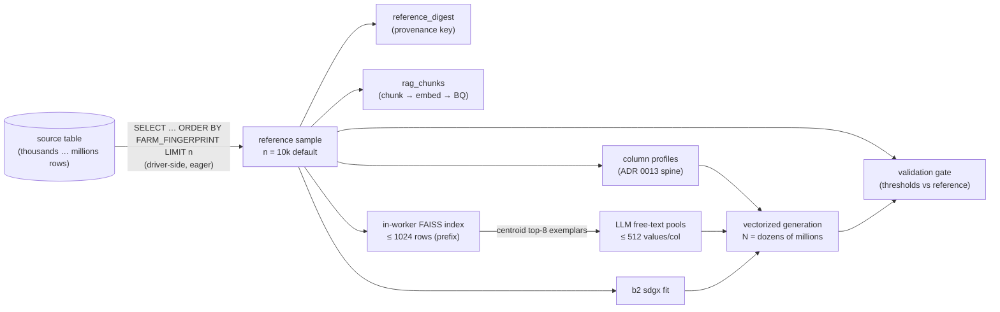
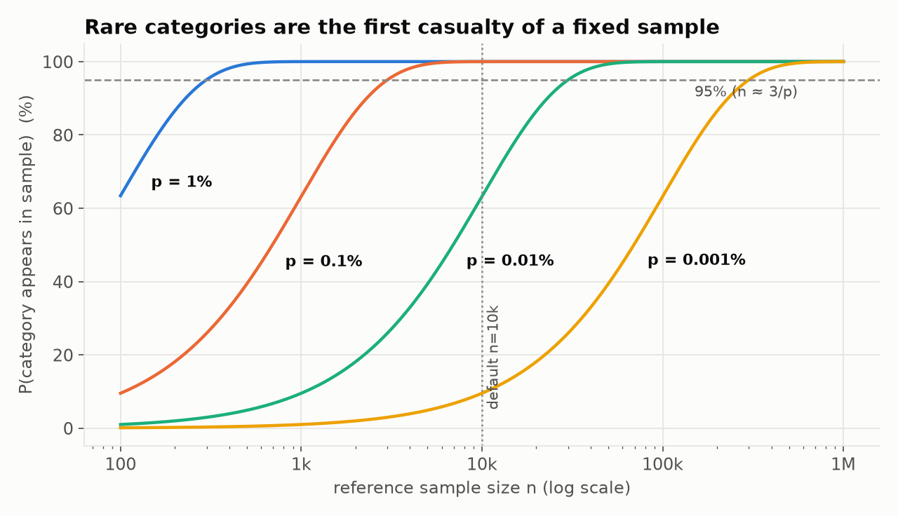
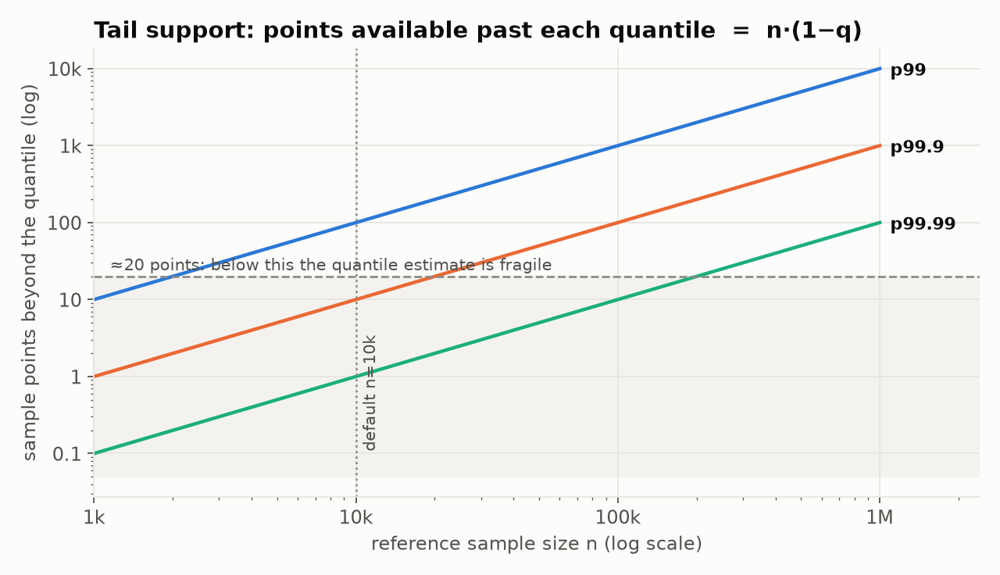
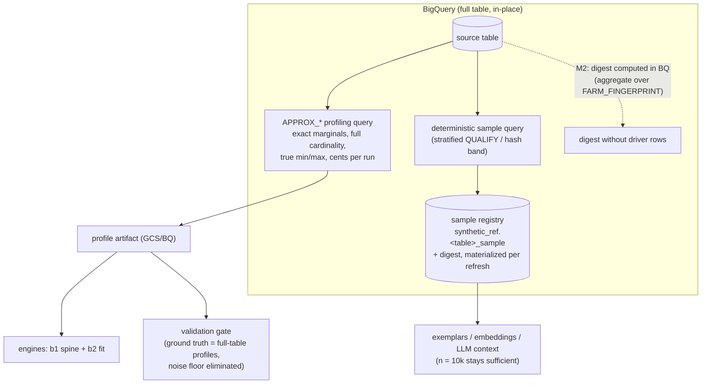
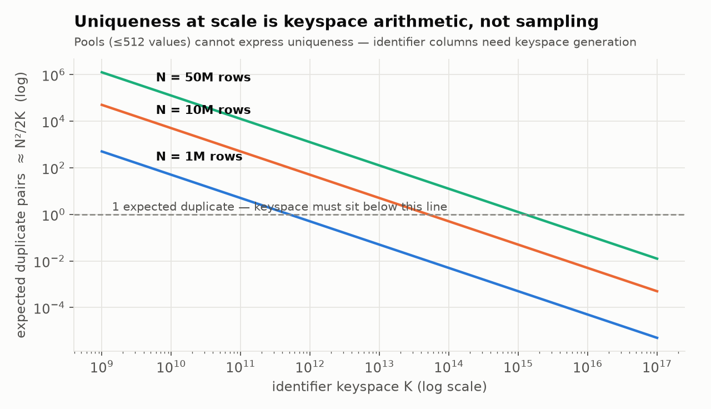
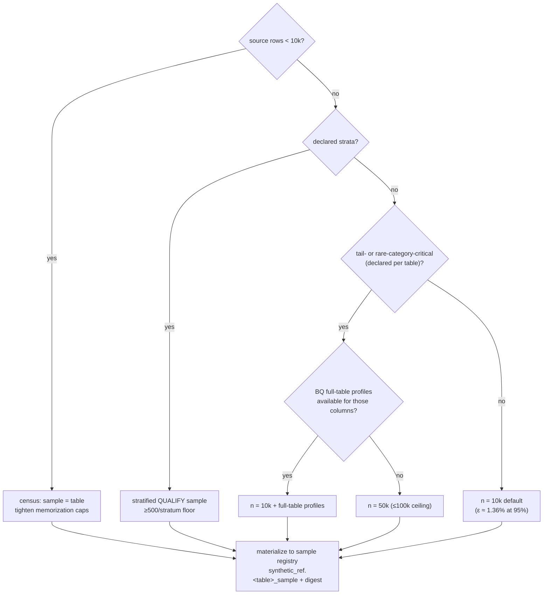

# Reference-sample scaling for b1_rag at production volume

- **Status**: discussion draft (2026-07-24) — decision points in [§10](#10-decision-points); nothing here is implemented yet beyond today's defaults.
- **Scope**: how `--reference_rows_limit` (default **10,000**, [ADR 0005](../adr/0005-live-select-reference-data.md), `sdfb_beam/io/bq_sources.py`) should fluctuate as the campaign grows to **30+ tables**, source tables from **thousands to millions of rows**, generating **dozens of millions of synthetic records**, on Beam/Dataflow with BigQuery as both source and sink.
- **Companion decisions**: [ADR 0013](../adr/0013-distribution-estimator-spine.md) (estimate once, sample vectorized), [ADR 0017](../adr/0017-custom-rag-layer-over-beam-ml-rag.md) (custom RAG layer; scope note on sample-not-table).

---

## 1. The core principle: sample size follows the estimand, not the output volume

**The reference sample size `n` is set by what is being estimated, not by how many rows `N` are generated.** Sampling error of an estimated distribution is a function of `n` alone; generating 50M rows from profiles fitted on 10k is not statistically worse *per row* than generating 50k rows from them.

What changes at scale is that estimation errors stop being noise and become **systematically replicated artifacts**: a mis-estimated p99.9, a never-sampled rare category, or a truncated cardinality estimate becomes a property of all 50M rows. `N` never enters the sample-size formula — it raises the **cost of being wrong**, which justifies *targeted* increases of `n` for identifiable weak spots (tails, rare categories, conditional segments), never uniform inflation.

## 2. What the sample actually feeds — six consumers, six sensitivities



| Consumer | Needs from the sample | Sensitivity to `n` |
|---|---|---|
| Column profiles (ADR 0013) | marginals: frequencies, quantiles, null rates, shapes | **High** — all of §3 applies |
| `reference_digest` | determinism only | None |
| `rag_chunks` + FAISS index | *mode coverage* for top-8 exemplar retrieval | **Low, plateaus fast** — corpus diversity matters, corpus mass doesn't |
| Free-text pool inference | diverse in-prompt exemplars | **Low** — bounded by the 512-value pool cap, not by `n` |
| b2/sdgx fitting | training set | Moderate — plateaus (§4) |
| Validation gate | a **noise floor** | **High and underappreciated** — §6.2 |

Only two consumers genuinely reward more rows — which motivates the §5 decoupling.

## 3. Quantitative foundations — what 10k buys and where it breaks

### 3.1 Marginal CDFs (DKW bound)

Worst-case CDF error `ε` at 95% confidence requires `n ≥ ln(40)/(2ε²)` (DKW inequality with Massart's tight constant). The current default is therefore not arbitrary:


| target ε (95%) | required n |
|---|---|
| 2.0% | ~4,600 |
| **1.36%** | **10,000 (current default)** |
| 1.0% | ~18,400 |
| 0.68% | ~40,000 |
| 0.5% | ~74,000 |

Every numeric column's full quantile function is pinned to ±1.36 points of mass at n=10k. Halving the error costs 4× the rows — sub-linear returns forever.

### 3.2 Rare categories — the first casualty of a fixed `n`

A category with true share `p` needs `n ≈ 3/p` to *appear at all* with 95% probability, and `n ≥ 100/p` for ≤10% relative error on its estimated frequency:



At n=10k: a 1% category is well estimated; a 0.1% category is merely present (~10 rows, ±30% error); a 0.01% category is a coin flip to exist in the sample — and therefore in **all** generated output. Good–Turing missing-mass (expected unseen probability ≈ singletons/n) is the cheap diagnostic: computable per column from the sample itself, it directly flags tables that need §7's per-table override.

### 3.3 Tails

The sample holds `n·(1−q)` points beyond the q-quantile:



At n=10k: p99 rests on 100 points (fine), p99.9 on 10 (fragile), p99.99 on 1 (meaningless). For finance-shaped columns (overdrafts, transaction amounts) whose extremes matter downstream, the options are a per-table bump to 50–100k, a parametric tail fit, or full-table profiling (§5) — not a global default change.

### 3.4 Conditional structure

A segment with 1% prevalence has effective n=100 inside a 10k sample; every within-segment estimate inherits §3.2. The standard remedy is **stratified deterministic sampling** with a per-stratum floor, one query in BigQuery:

```sql
SELECT * FROM `src` AS ref
QUALIFY ROW_NUMBER() OVER (
  PARTITION BY stratum_col
  ORDER BY FARM_FINGERPRINT(TO_JSON_STRING(ref))
) <= n_per_stratum
```

## 4. Industry practice

There is **no canonical row count** in the industry; the operative heuristics are *plateau by fidelity metric, stratify where it matters, cap by trainability*:

- **Statistical generators** (SDV family, CTGAN/TVAE, the sdgx lineage): applied work trains on samples in the tens of thousands (e.g., stratified subsamples of ~66k rows); [CTGAN-style models prefer larger sets but with diminishing returns and steeply rising fit cost](https://docs.synthetic.ydata.ai/latest/synthetic_data/single_table/ctgan_example/), while TVAE is favored for small data ([SDV overview](https://medium.com/towards-data-engineering/generating-comparing-and-evaluating-synthetic-tabular-data-with-sdv-1198e97c8603)). Practical protocol: fit on 10k → 25k → 50k, measure the fidelity delta, stop when it flattens.
- **LLM/RAG-based generation** (GReaT-style serialization, few-shot elicitation — this engine's family): the literature uses *tens to hundreds* of in-context exemplars, and retrieval-corpus value saturates once the distribution's modes are covered. No practice scales a RAG corpus with output volume; what is scaled is retrieval **diversity** (MMR / k-center selection) and per-column exemplar targeting — which b1_rag already implements.
- **Cautionary benchmark** for this domain: [synthetic tabular generators systematically fail to preserve behavioral patterns — temporal, velocity, multi-account signals](https://arxiv.org/pdf/2604.13125). That is a *model-class* limitation; no `n` fixes it (see §6.4).

## 5. The architectural move: decouple *profiling* from *sampling*

Most `n`-sensitivity lives in the profiles — and **BigQuery computes those over the full source table for cents, with zero sampling error**:

| Profile | Full-table BQ primitive |
|---|---|
| numeric quantiles | `APPROX_QUANTILES(col, 1000)` |
| categorical frequencies | `GROUP BY` counts / `APPROX_TOP_COUNT` |
| cardinality | `APPROX_COUNT_DISTINCT` — **crucial**: sample-based cardinality is truncated at ≤ n, precisely the b2 memorization/cardinality-cap failure territory |
| null rates | `COUNTIF(col IS NULL)` |
| temporal ranges | `MIN` / `MAX` |

Push profiling into BigQuery over **all** rows; the pulled raw-row sample then serves only what genuinely needs rows — exemplar chunks, embeddings, LLM context, digest — where 10k is already generous and plateaued.

> **Consequence**: the honest answer to "how should 10k grow as sources reach millions of rows" is — **mostly, it shouldn't; the profiles should stop depending on it.**



## 6. What sample scaling **cannot** fix at 50M rows

### 6.1 High-cardinality / identifier columns

A 512-value pool feeding 50M rows produces ~100k duplicates per value. Uniqueness-like columns must go through shape/keyspace generation (`text_shapes` / `sample_identifier`) with explicit collision budgets — expected duplicate pairs ≈ `N²/2K`:



N = 5·10⁷ with < 1 expected duplicate requires keyspace **K > 1.25·10¹⁵ (~2⁵⁰)**. This is per-column configuration arithmetic, not a sampling question.

### 6.2 The validation noise floor

The reference sample itself sits ~`1.36/√(n/10⁴)`% (KS) from the true source distribution — 1.36% at n=10k. **Any fidelity threshold tighter than ~2× that floor tests sampling noise, not the generator.** Certifying 0.5% marginal fidelity needs n≈74k — or full-table BQ profiles as ground truth (§5), which eliminates the floor. And at N in the tens of millions, never gate on p-values (statistical power is effectively infinite; everything "fails"); gate on effect sizes, as the current thresholds gate does.

### 6.3 Privacy posture — an argument *against* aggressive scaling

A bounded, digest-pinned sample is an **auditable leak surface**: the memorization probe compares generated output against a known 10k-row set. Conditioning on the full table makes leak auditing O(source) and enlarges raw exposure. After the 2026-07-10 exemplar-leak postmortem, bounded sampling is a feature to preserve, not a limitation to engineer away.

### 6.4 Cross-row / cross-table behavior

Velocities, event sequences, FK coherence — model-class limits (per the benchmark in §4), landing in M2 multi-table design. The industry pattern (SDV's hierarchical approach) is **FK-coherent sampling**: sample parents, then children *of sampled parents* — meaning child-table `n` becomes **induced, not chosen**. The per-table sampling config (§7) should anticipate an `n: derived-from-parent` mode.

## 7. Beam / Dataflow / BigQuery mechanics — the real ceilings

1. **Driver-eager load + `beam.Create`**: reference rows live in driver memory and are embedded in the pipeline graph. Practical ceiling ≈ **50–100k wide rows** before driver memory and [job-graph size limits](https://cloud.google.com/dataflow/quotas) bite. Beyond that requires worker-side `ReadFromBigQuery` — which breaks digest-before-launch *unless* the digest is computed in BQ itself (an order-insensitive aggregate over `FARM_FINGERPRINT(TO_JSON_STRING(ref))` of the sampled set). That is the M2 unlock.
2. **Sampling query cost**: `ORDER BY FARM_FINGERPRINT(...) LIMIT n` is a **full scan + global sort per run** — cents at GB scale, real money and minutes at TB scale × 30 tables × every run. Mitigations: (a) hash-band predicate `WHERE MOD(ABS(FARM_FINGERPRINT(TO_JSON_STRING(ref))), B) < b` plus a small in-band sort (full scan, no global sort, still deterministic); (b) the **sample registry** — materialize `synthetic_ref.<table>_sample` with its digest once per source refresh, shared by profiling/b1/b2/validation, drift detected by digest change.
3. **Avoid `TABLESAMPLE SYSTEM`**: it is [block sampling](https://cloud.google.com/bigquery/docs/table-sampling) — a milder relapse of the storage-contiguity skew that motivated FARM_FINGERPRINT ordering in the first place (the 2026-07-15 run: 51% of a `LIMIT` sample from one load batch).
4. **The 1024-row in-worker index** (`_MAX_EMBED_ROWS`, `engines/b1_rag/engine.py`): currently a prefix of the fingerprint order — uniform-random, so it under-covers rare modes by construction. A k-center / greedy-diversity selection over the 10k embeddings (cheap at this scale) buys more retrieval quality than any increase in `n`.
5. **Embedding wall-clock scales linearly with `n`** on CPU workers — a reminder that `n` inflation is paid in the `rag_chunks` population stage on every full run that rebuilds the layer.

## 8. Proposed per-table policy

| Table situation | Sample policy |
|---|---|
| Source < 10k rows | **Census** (whole table); attention flips to memorization caps — small sources are the leak-risk zone |
| Default | **10k**, documented as "ε ≈ 1.36% DKW at 95%" |
| Heavy tails / rare categories that must survive (declared per table) | **50k**, or stay at 10k + BQ full-table profiles for the affected columns |
| Declared strata | stratified deterministic sample, ≥ 500 rows/stratum floor |
| Anything > 100k | **not via the current driver path** — requires digest-in-BQ + worker-side read (M2) |
| All tables | BQ-side full-table `APPROX_*` profiling as the profile source of truth; raw-row sample only for exemplars/embedding/digest |

Per-table knobs (`n`, strata columns, tail columns, identifier keyspaces) belong in the DDL-JSON override direction already established for the temporal policy — with 30+ heterogeneous tables, one global default is a policy, not a fit.



## 9. Rules of thumb (the one-screen version)

- `n` follows the **estimand**; `N` (output volume) never enters the formula — it only raises the price of estimation error.
- 10k = ±1.36% on every marginal CDF. 4× rows per halving of error.
- To *see* a share-`p` category: `n ≈ 3/p`. To *estimate* it within 10%: `n ≈ 100/p`.
- Tail support = `n(1−q)`; want ≥ ~20 points past the deepest quantile you care about.
- Validation thresholds ≥ 2× the `1.36%·√(10⁴/n)` noise floor — or use full-table profiles and delete the floor.
- Uniqueness: keyspace `K > N²/2` per expected-collision budget; pools never emit identifiers.
- Bounded sample = auditable privacy surface. Treat that as a feature.

## 10. Decision points

In order of leverage:

1. **Commit to BQ-side full-table profiling as the M2 direction?** (Obsoletes most reasons to grow `n`.)
2. **Sample registry** — materialized, digest-versioned `synthetic_ref.<table>_sample` tables per source?
3. **Per-table sampling config in DDL-JSON** (n / strata / tail columns / identifier keyspaces)?
4. **Effect-size floor rule for the validation gate** (threshold ≥ 2× `1.36/√n` scaling)?

Items 2–4 are cheap and could land in the current workstream; item 1 is the architectural fork.

---

## References

**Statistics**

- Dvoretzky, A., Kiefer, J., Wolfowitz, J. (1956). *Asymptotic minimax character of the sample distribution function*. Ann. Math. Statist. 27(3). — the DKW inequality.
- Massart, P. (1990). *The tight constant in the Dvoretzky–Kiefer–Wolfowitz inequality*. Ann. Probab. 18(3). — gives `n ≥ ln(2/δ)/(2ε²)`.
- Good, I. J. (1953). *The population frequencies of species and the estimation of population parameters*. Biometrika 40. — Good–Turing missing mass, the per-column "unseen categories" diagnostic.

**Synthetic tabular generation**

- Xu, L. et al. (2019). *Modeling Tabular Data using Conditional GAN* (CTGAN). NeurIPS. [arXiv:1907.00503](https://arxiv.org/abs/1907.00503)
- Borisov, V. et al. (2023). *Language Models are Realistic Tabular Data Generators* (GReaT). ICLR. [arXiv:2210.06280](https://arxiv.org/abs/2210.06280) — the row-serialization scheme `rag_chunks` reuses.
- Seedat, N. et al. (2024). *Curated LLM: Synergy of LLMs and Data Curation for tabular augmentation in low-data regimes*. [arXiv:2312.12112](https://arxiv.org/abs/2312.12112) — few-shot LLM elicitation, the pool-inference family.
- [Synthetic Tabular Generators Fail to Preserve Behavioral Fraud Patterns](https://arxiv.org/pdf/2604.13125) — temporal/velocity/multi-account limits no sample size fixes.
- [ydata CTGAN guidance](https://docs.synthetic.ydata.ai/latest/synthetic_data/single_table/ctgan_example/) · [SDV evaluation overview](https://medium.com/towards-data-engineering/generating-comparing-and-evaluating-synthetic-tabular-data-with-sdv-1198e97c8603) · [privacy–utility tradeoffs in synthetic data (further reading)](https://arxiv.org/pdf/2506.11026)

**Platform**

- [BigQuery table sampling (`TABLESAMPLE` = block sampling)](https://cloud.google.com/bigquery/docs/table-sampling)
- [BigQuery approximate aggregate functions](https://cloud.google.com/bigquery/docs/reference/standard-sql/approximate_aggregate_functions) (`APPROX_QUANTILES`, `APPROX_TOP_COUNT`, `APPROX_COUNT_DISTINCT`)
- [Dataflow quotas & limits](https://cloud.google.com/dataflow/quotas) (job-graph size — the `beam.Create` ceiling)
- [FAISS: guidelines on index choice](https://github.com/facebookresearch/faiss/wiki) (flat/exact below ~50k vectors)

**Internal**

- [ADR 0005 — live SELECT reference data](../adr/0005-live-select-reference-data.md) · [ADR 0013 — distribution-estimator spine](../adr/0013-distribution-estimator-spine.md) · [ADR 0017 — custom RAG layer](../adr/0017-custom-rag-layer-over-beam-ml-rag.md)
- `packages/sdfb-beam/src/sdfb_beam/io/bq_sources.py` (sampling query + the 2026-07-15 contiguity-skew postmortem) · `packages/sdfb-beam/src/sdfb_beam/rag/population.py` (scope rationale) · `packages/sdfb-core/src/sdfb_core/engines/b1_rag/engine.py` (`_MAX_EMBED_ROWS`, pool caps)
- Figures: generated 2026-07-24 (matplotlib; DKW/coverage/tail/collision formulas as titled), sources in `docs/designs/assets/`.
