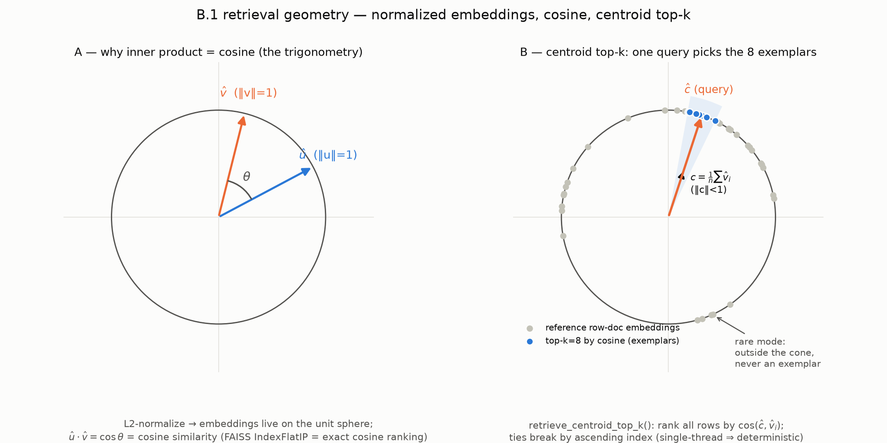
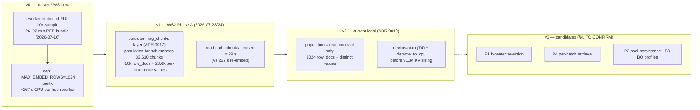
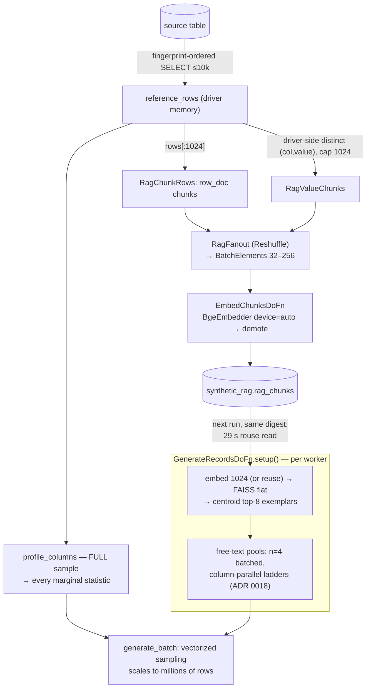
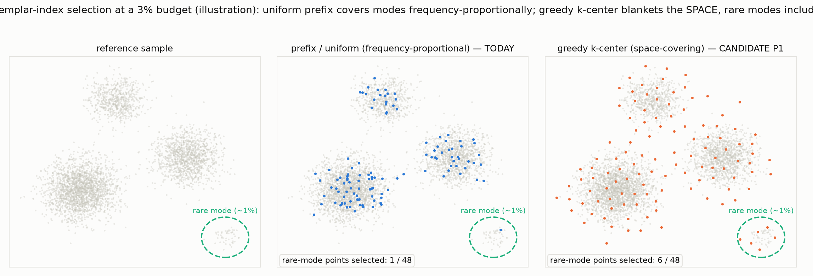
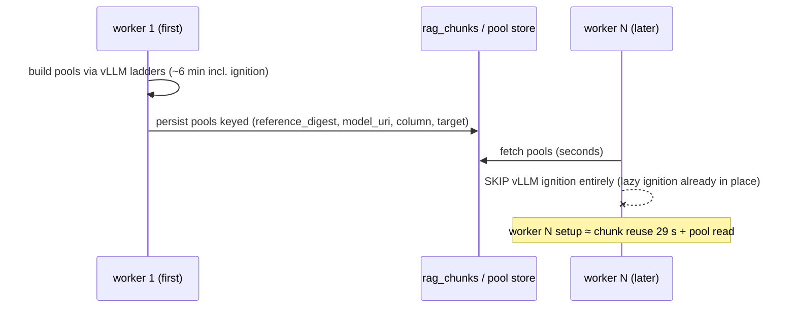
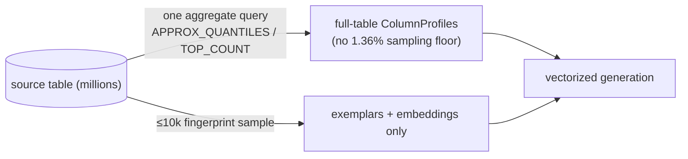
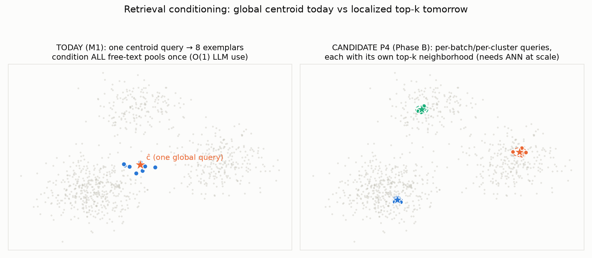

# B.1 RAG retrieval — geometry, evolution, and candidate improvements (visual deep-dive)

> **Status: CANDIDATES — TO BE CONFIRMED.** Nothing in §4 is committed work.
> This document exists to (a) make the retrieval geometry visible, (b) record
> how the implementation evolved to its current state, and (c) queue the
> improvement candidates with enough detail that each can be promoted into an
> implementation plan after explicit confirmation.
>
> Companions: [ADR 0018](../adr/0018-parallel-batched-freetext-pools.md)
> (generation-side pool builds) · [ADR 0019](../adr/0019-rag-population-scoped-to-consumers.md)
> (population scope + CUDA embed) ·
> [reference-sample scaling deep-dive](2026-07-24-reference-sample-scaling.md)
> (statistics at production volume). All figures are in
> [`assets/`](assets/), generated with matplotlib (provenance in §6).

---

## 1. The geometry — what "centroid top-k" actually computes

Every reference row is serialized to a GReaT-style text document
(`sdfb_core/rag/serialize.py`), embedded by bge-small-en-v1.5 (384-dim), and
**L2-normalized**. Normalization is the load-bearing trick: on the unit
sphere, the inner product of two vectors *is* the cosine of the angle between
them, so FAISS `IndexFlatIP` (inner product, exact, brute-force) ranks by
cosine similarity with zero approximation:

- **Panel A** — the trigonometric identity the whole layer rests on:
  `û·v̂ = cos θ`. "Similar rows" = "small angle".
- **Panel B** — the *only* retrieval M1 performs
  (`retrieve_centroid_top_k`, `sdfb_core/rag/retrieval.py`): compute the
  arithmetic centroid `c = (1/n)Σv̂ᵢ` (which lies *inside* the sphere,
  ‖c‖<1), query with it, and take the **top-k=8** rows by cosine. Those 8
  "most typical" rows become the exemplars shown to the LLM when it infers
  each free-text pool — once per worker, never per generated row (ADR 0013's
  FASTGEN spine).

Two properties worth internalizing:

1. **Determinism**: flat index + single-threaded search + ties broken by
   ascending row index ⇒ the same reference sample always yields the same 8
   exemplars. This is a hard M1 acceptance criterion, and it is why ANN
   (approximate) indexes are *not* used at this scale.
2. **Typicality bias, by design**: a centroid query lands in the densest
   region. Rows in rare modes (panel B, lower right) are never exemplars.
   For M1 — where exemplars only *condition a prompt* and all statistics come
   from the full-sample profiles — that is acceptable. It becomes a real
   limitation only for the Phase-B candidates in §4.

### Who consumes which vectors (the read contract)

| Chunk kind | Producer | Consumer | What it's used for | Size that matters |
|---|---|---|---|---|
| `row_doc` | population branch / in-engine embed | `_vectors_from_store` → in-worker index | centroid top-8 row exemplars | **first 1024 rows only** (`MAX_ROW_DOC_ROWS`) |
| `free_text_col` | population branch | `_fetch_free_text_chunks` → `_column_seed_examples` | top-8 *value* exemplars per column | distinct values (capped 1024/col) |
| (none) | `profile_columns` | `ColumnSampler` | **all marginal statistics** | full 10k sample — embeddings play no part |

This table is the "why only 1024" answer in one line: **1024 is not a
statistical parameter — it is the size of the only structure that reads
row-doc vectors, an 8-exemplar picker.** Marginal fidelity comes from the
full sample; output volume (millions of rows) comes from vectorized sampling
that never touches the index.

---

## 2. How we got here — implementation evolution

The cost trace of that evolution, measured run by run:

The two regressions debugged on 2026-07-24/25 bracketed this picture: the
generation-side pool ladder (fixed by ADR 0018: n=4 array-completions,
column-parallel ladders, pool cache, shape fallback — validated live: pool
build 1552 s → 346 s) and the population-side embed volume (fixed by ADR
0019, top of the chart).

### Current dataflow (v2), one picture

---

## 3. Side-effects of the ADR 0019 scoping — the confirmed analysis

(Consolidating the 2026-07-25 review discussion so it lives in the repo.)

- **No effect on generated-data statistics.** Profiles (categorical
  frequencies, numeric/temporal ranges, null fractions) are computed from the
  full 10k sample; embeddings only choose prompt exemplars. Top-8-of-1024 ≈
  top-8-of-10k for a centroid query (both estimate the same population
  centroid; the prefix is uniform-random by fingerprint ordering).
- **No effect on output volume.** RAG-layer cost scales with the *reference
  sample* (fixed), not with `num_rows`. Millions of generated rows change the
  batch count, not the retrieval or embedding work.
- **What millions of rows actually stress** (all pre-existing, quantified in
  the [scaling deep-dive](2026-07-24-reference-sample-scaling.md)):
  the 512-value pool cap (≈100k repeats/value at 50M rows — acceptable for
  prose, fatal for uniqueness-like columns, which must stay on
  shape/keyspace routes with collision budget `K > N²/2`); the ~1.36 %
  sampling-noise floor of a 10k sample (gate on effect sizes, not p-values);
  and per-worker setup amortization (→ P2).
- **Genuine losses, accepted consciously**: rows 1025–10k have no persisted
  row-doc vectors (nothing reads them today; P1/P4 would re-decide *which*
  1024, not just *whether* more); value chunks lost per-row provenance
  (`source_pk=NULL`, value-keyed digest — privacy-positive, breaks no
  consumer); a future consumer wanting full-distribution semantic structure
  (e.g. clustering a high-cardinality column) would need the cap raised or a
  dedicated selection pass.

---

## 4. Candidate improvements — TO BE CONFIRMED

Ranked by expected value; each entry names its trigger condition (the signal
that should promote it into a plan).

### P1 — k-center / greedy-diversity exemplar-index selection

Replace the uniform 1024-**prefix** with a greedy k-center selection over
the 10k row-doc embeddings, so the in-worker index (and the persisted
row-doc set) covers the *space*, not the *frequency mass*:

- **Mechanism**: greedy k-center (farthest-point traversal) is O(n·k) ≈ 10k
  × 1024 distance evaluations on 384-dim vectors — sub-second in the driver
  or worker; deterministic given the finger­print-ordered seed point.
- **Why it beats "raise 1024"**: the deep-dive's own conclusion — a
  diversity-selected 1024 buys more retrieval quality than any prefix
  enlargement, at zero extra embed/storage cost.
- **Contract impact**: `_vectors_from_store` keys on row digests, so the
  selected set must be written by the same selection (population and engine
  must share the picker — same single-source-of-truth pattern as
  `MAX_ROW_DOC_ROWS`). Re-seed per digest required.
- **Trigger**: Phase B per-query retrieval (P4), or evidence that pool
  prompts under-represent a mode that matters (e.g. per-mode fidelity gaps
  in WS3 evaluation).

### P2 — persist free-text pools per digest (pool store)

Today every worker rebuilds pools (~346 s with ADR 0018; vLLM ignition ~4–5
min before that). At high `num_rows`, Dataflow scales workers and each pays
this once:

- **Mechanism**: same pattern as the chunk store — either a `pool_value`
  chunk_kind in `rag_chunks` or a sibling table; the ADR 0018 process-level
  cache becomes L1, the store L2.
- **Accuracy note**: pools are novelty-filtered against the reference
  sample; persisting them changes *when* they're computed, not *what*.
- **Trigger**: first multi-worker (≥4) high-`num_rows` campaign, or M2
  30-table rollout where per-table setup cost multiplies.

### P3 — full-table BQ aggregate profiles (kill the sampling floor)

Move marginal statistics from the 10k sample to BigQuery full-table
aggregates (`APPROX_QUANTILES`, `APPROX_TOP_COUNT`, `COUNT(DISTINCT …)`),
keeping the sample only for exemplars/embeddings:

- **Why**: certifying 0.5 % marginal fidelity via sampling needs n≈74k; via
  aggregates it needs one cheap query. This is the deep-dive's §5 headline
  ("mostly, [10k] shouldn't grow — the profiles should stop depending on
  it").
- **Trigger**: fidelity thresholds tightened below ~2.7 % (2× floor), or
  source tables past ~1M rows where tail categories matter.

### P4 — per-batch / per-cluster retrieval conditioning (WS2 Phase B)

Move from one global centroid query to localized queries — per batch, per
cluster, or per generated-row anchor — each with its own top-k
neighborhood:

- **What it buys**: locally-conditioned free-text (and later, correlated
  column groups — the spec's "joint/conditional sampling" fidelity
  primitive) instead of one global exemplar set for everything.
- **What it costs**: retrieval moves onto the per-batch path (today it is
  strictly O(1) per worker), so index QPS starts to matter and the LLM call
  count rises with the number of *clusters* (must stay bounded — never
  per-row, or ADR 0013's FASTGEN spine is violated).
- **Where turbovec/ANN enters**: flat exact search is right at ≤10k vectors;
  per-query retrieval over larger samples (P3 world, 50k+) is where a
  quantized ANN index (turbovec `TurboQuantIndex`, or FAISS IVF) pays. The
  swap point is the `build_index()`/`ExactIPIndex` seam — but ANN breaks the
  bit-exact determinism guarantee, so it must be config-gated and the
  determinism criterion re-scoped first (ADR 0018 §compat).
- **Where LMCache enters**: per-cluster prompts share the static instruction
  prefix; KV reuse (vLLM APC now, LMCache across engines/restarts later)
  makes the extra LLM calls cheaper. Server-side flags only.
- **Trigger**: WS2 Phase B scoping after the Phase A E2E baseline is signed
  off.

### P5 — population-only job/template (GPU-less)

Deferred in ADR 0019: with the scoped volume the co-run branch underruns
setup, so splitting is pure ops hygiene now. **Trigger**: seeding campaigns
over many tables/digests at once (M2), or a desire to run population on
cheap CPU-only workers.

### P6 — same-run chunk consumption

The engine's reuse check runs at `setup()` time, before the same run's
`WriteRagChunks` commits — a fresh-digest run always re-embeds its own 1024
rows (267 s CPU / seconds on GPU). Options: a Beam-side ordering (generation
side-input on the population write result — couples the branches and delays
generation) or simply accepting it now that GPU embed makes the duplicate
work ~seconds. **Recommendation: accept; revisit only if P5 splits the
jobs.** 

### P7 — LMCache adoption

Server-side only (Dockerfile + `VLLMModelClient` spawn flags); prompts are
already prefix-stable by design. **Trigger**: the user's planned
LMCache/turbovec exploration; measure KV-hit rate on pool ladders first.

---

## 5. Decision checklist (what needs confirming before any plan is written)

- [ ] P1: is rare-mode exemplar coverage worth a re-seed of existing digests?
- [ ] P2: pool store as `rag_chunks.chunk_kind='pool_value'` or sibling table?
- [ ] P3: which tables get full-table aggregate profiles first; who owns the query cost?
- [ ] P4: Phase B scope — per-batch or per-cluster conditioning? bounded how?
- [ ] P4a: is relaxing bit-exact retrieval determinism acceptable behind a flag (prerequisite for turbovec/IVF)?
- [ ] P5/P6: split population into its own template now, or keep in-job?
- [ ] P7: LMCache trial on the personal-GCP T4 tier or wait for L4?

## 6. Figure provenance

All PNGs generated 2026-07-25 with matplotlib (light-mode palette from the
project's dataviz reference: blue `#2a78d6`, orange `#eb6834`, aqua
`#1baf7a`; scatter panels stay within the 3-hue all-pairs-safe subset):

| Figure | File | Content |
|---|---|---|
| 1 | `assets/embedding-geometry-topk.png` | unit-sphere trigonometry; centroid top-8 cone (synthetic angular data) |
| 2 | `assets/prefix-vs-kcenter-coverage.png` | uniform-prefix vs greedy k-center at a 3 % illustration budget; rare-mode counts from the actual selection algorithms run on the plotted data |
| 3 | `assets/centroid-vs-perquery.png` | global-centroid conditioning (today) vs localized top-k (P4) |
| 4 | `assets/embed-cost-evolution.png` | measured E2E embed-phase costs (2026-07-16 → 2026-07-25 runs) + ADR 0019 estimates (hatched) |

Earlier statistical figures referenced by §3 live in the
[scaling deep-dive](2026-07-24-reference-sample-scaling.md):
`sampling-error-dkw.png`, `rare-category-coverage.png`, `tail-support.png`,
`identifier-collisions.png`.
