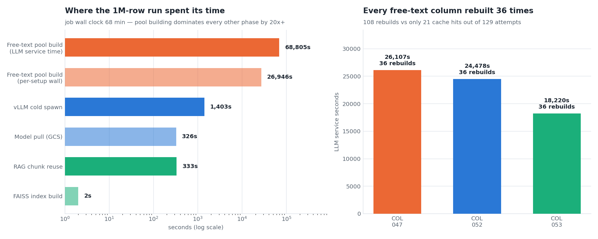
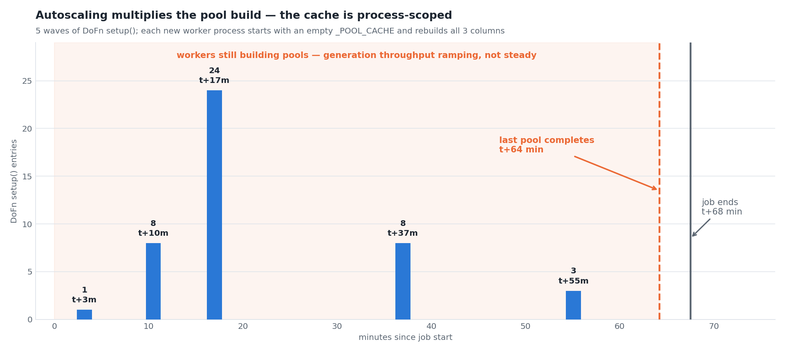
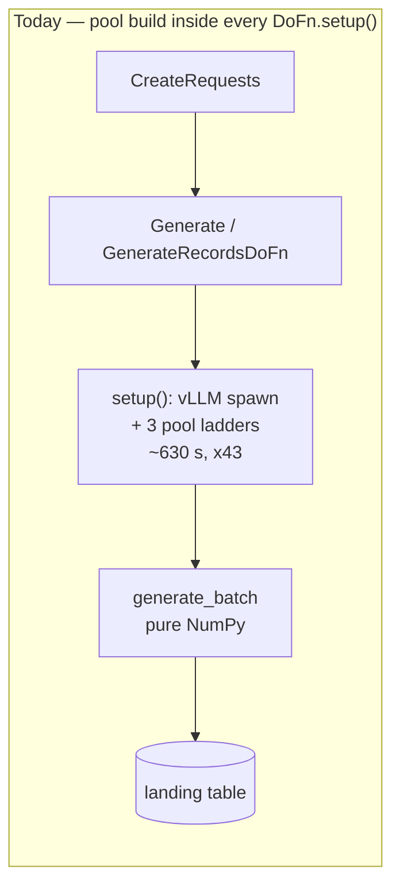
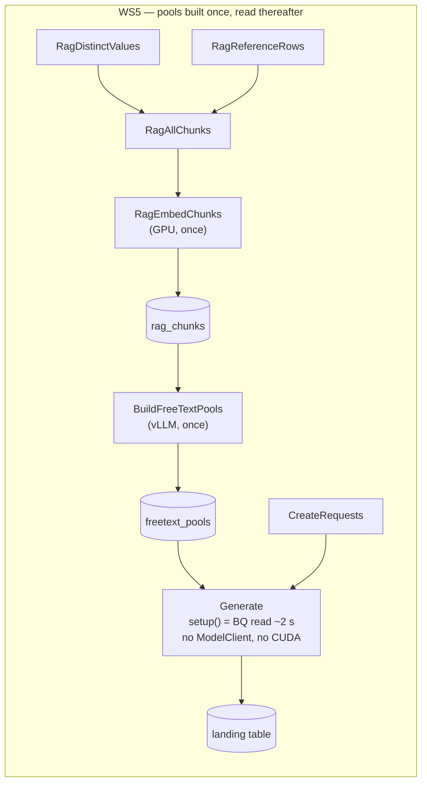
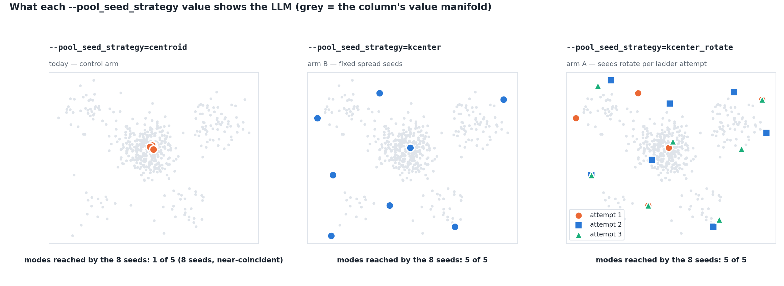
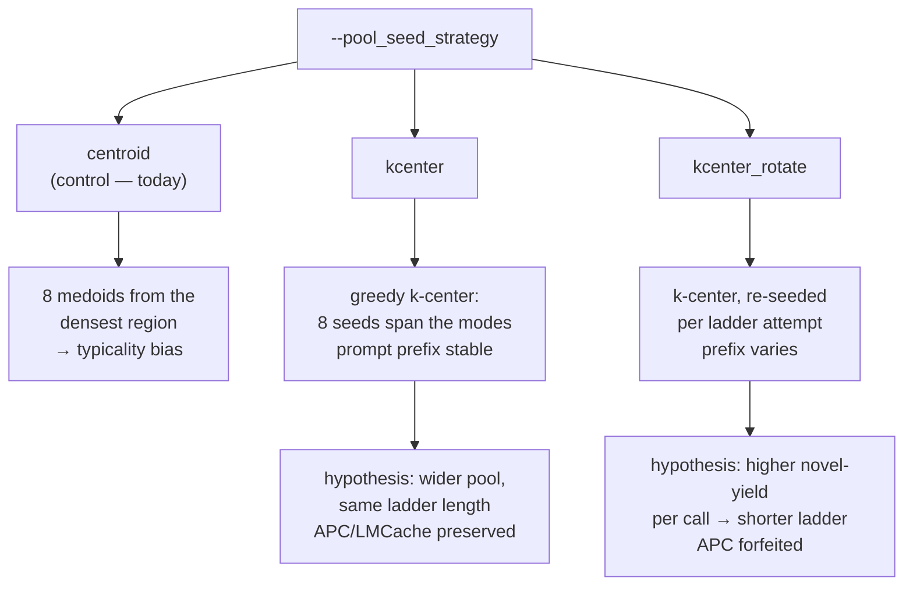
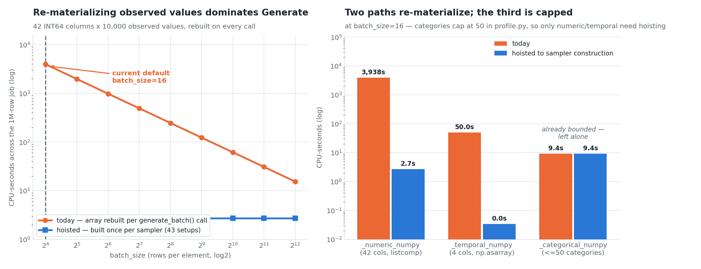

# WS5 — Generation throughput & RAG seeding campaign (visual design)

> **Status: IMPLEMENTED + E2E MEASURED.** All ten plan tasks merged to
> `master` (branch retired); measured on the WS6 five-run matrix and later campaigns;
> the §6 targets are *predictions* until an M4 run measures them. Decisions
> are recorded in [ADR 0020](../adr/0020-freetext-pools-as-persisted-artifact.md).
> Every number in §1 is re-derived from
> `runs/2026-07-26_06_54_25-14348390798392809440/worker_logs.jsonl`
> (the 1M-row stress run); the extraction is reproducible via
> [`scripts/doc/make_ws5_figures.py`](https://github.com/albertols/synthetic-llm-dataflow-bigquery/blob/d32c34743d80c8481445956939b6bbde9c4d4a3c/scripts/doc/make_ws5_figures.py), which also
> regenerates every figure (provenance in §7).
>
> **Implementation plan:** 10 tasks in 4 phases, TDD, one commit per task (the plan file was retired with the planning layer; the decisions are in [ADR 0020](../adr/0020-freetext-pools-as-persisted-artifact.md)).
> This document is written to the `visual-first-documentation` skill
> (`.claude/skills/visual-first-documentation/SKILL.md`), which owns the
> source-of-truth chain, the document contract, and the figure rules.
>
> Companions: [ADR 0018](../adr/0018-parallel-batched-freetext-pools.md)
> (pool builds) · [ADR 0019](../adr/0019-rag-population-scoped-to-consumers.md)
> (population scope + CUDA embed) ·
> [RAG retrieval geometry roadmap](2026-07-25-rag-retrieval-geometry-roadmap.md)
> (this document promotes its P1/P2/P4/P5/P6 candidates) ·
> [reference-sample scaling](2026-07-24-reference-sample-scaling.md).

---

## 1. What the 1M-row run actually measured

The stress run generated 1 000 000 rows from a 67-column source
(`21 STRING / 42 INT64 / 3 TIMESTAMP / 1 DATE`, 210 882 source rows) and took
**68 minutes** across 4 autoscaled L4 workers.



The headline: **generation is not the bottleneck — free-text pool building
is**, by a factor of more than 20 over every other phase.

| Milestone | n | total |
|---|---:|---:|
| `freetext_pool_built` (LLM service time) | 108 | **68 805 s ≈ 19.1 GPU-hours** |
| `b1_pools_built` (per-setup wall) | 43 | 26 946 s |
| `dofn_setup_done` | 43 | 28 982 s (max 965 s) |
| `vllm_ready` (cold spawn) | 6 | 1 403 s |
| `model_pull_done` | 6 | 326 s |
| `b1_chunks_reused` | 43 | 333 s |
| `b1_index_built` | 43 | **2 s** |

Note the last row. The FAISS index — the nominal centrepiece of the RAG layer
— costs 2 seconds across the entire job. §3 follows that thread.

> **`COL_047` / `COL_048` is excluded from every target in §6.** It
> carries binary characters and is a known special case (user instruction,
> 2026-07-26). It accounts for 26 107 s of the pool total; **excluding it, the
> remaining two columns still cost 42 698 s over 72 rebuilds ≈ 11.9
> GPU-hours.** The argument for §2 does not depend on the excluded column, and
> the figures show all three only so the exclusion is auditable.

### 1.1 Why 108 rebuilds

`_POOL_CACHE` in `sdfb_core/engines/b1_rag/engine.py:137` is a **module-level
dict**, so its lifetime is one worker *process*. Autoscaling therefore
multiplies the pool build by the number of processes:



Five waves of `DoFn.setup()` (t+3, +10, +17, +37, +55 min). Of 129 pool
attempts (43 setups × 3 free-text columns), only **21 hit the cache — all of
them between t+11.8 and t+13.8 min**, i.e. within a single process. The waves
at t+37 and t+55 are new processes and got zero reuse.

The consequence is the number that should drive this whole WS: **the last pool
completed at t+64 of a 68-minute job.** Workers spent essentially the entire
run getting ready to generate.

---

## 2. Architecture — pools become a persisted artifact

This mirrors what `rag_chunks` already proved: an artifact produced once by its
own branch, consumed by a cheap read.





Three decisions inside this:

**2.1 A sibling table, not `chunk_kind='pool_value'`.** Pools key on
`(reference_digest, model_uri, column, target)` — `model_uri`, not
`embedder_id`/`embedder_version` — so they do not fit `ChunkStore.fetch()`'s
signature. A `synthetic_rag.freetext_pools` table keeps both contracts honest
rather than overloading one with a discriminator column.

**2.2 `Generate` never constructs a `ModelClient`.** `generate_batch()`
(`engine.py:303`) is verified LLM-free — it calls `_sample_columns` and
`_sample_free_text`, both pure NumPy plus pool draws. The vLLM server is used
*only* by `_build_free_text_pools()` during `setup()`. Removing that removes
6 × ~230 s of cold spawn **and** one of the two parties in the CUDA OOM (§4.1).

**2.3 Stagnation is recorded, not rediscovered.** `freetext_pool_stagnated`
fired 34 times. A pool that stagnates below its target is stored *as*
stagnated, with the attempt count that proved it — so a later worker reads the
conclusion instead of re-running the ladder to reach it. This is what makes the
warm-run target in §6 reachable at all.

---

## 3. The `--pool_seed_strategy` flag

Retrieval today runs **exactly 3 times per worker setup** — once per free-text
column — and it is `retrieve_centroid_top_k(k=8)`: a medoid selection over
≤1024 vectors. Not per row, not per query. `IndexFlatIP` at that size is exact
brute force, which is why `b1_index_built` is 2 s total. The entire GPU
embedder exists to pick **8 seed strings per column**.

And the geometry roadmap already names the flaw: *"a centroid query lands in
the densest region; rows in rare modes are never exemplars."* The LLM is shown
the 8 most average values and asked for novel ones — a direct mechanism for the
low novel-yield and the long ladders.

Rather than two divergent git branches, this is **one build with one flag**, so
the three runs differ in exactly one variable:





| | `centroid` | `kcenter` | `kcenter_rotate` |
|---|---|---|---|
| Seed selection | densest-region medoids | greedy k-center | greedy k-center |
| Per ladder attempt | fixed | fixed | re-seeded |
| Prompt prefix | byte-identical | byte-identical | varies |
| vLLM APC / LMCache | preserved | preserved | forfeited |
| Role | control arm | arm B | arm A |

**On the prefix-caching cost of `kcenter_rotate`:** ADR 0018 set the
stable-prefix rule when pools rebuilt 36 times per job. At once-per-digest,
prefix caching has almost nothing left to amortise — so that constraint is much
weaker than when it was written, and the rotate arm is worth measuring rather
than ruling out on principle.

Reported per arm: novel-yield per LLM call, final pool size per column, ladder
attempts to target.

---

## 4. Generate-stage resource correctness

Three independent defects the 1M run exposed.

### 4.1 CUDA OOM — the embedder loads into vLLM's VRAM

```
engine.py:198   self._embedder = BgeEmbedder(ctx.embedder_uri, device="auto")
→ torch.OutOfMemoryError: tried to allocate 20.00 MiB;
  14.56 GiB total, 10.81 MiB free — process 191 holds 13.80 GiB (vLLM)
→ bundle aborted → dofn_setup_retry attempt=2
```

Twenty megabytes could not be found because vLLM had already sized its KV cache
against the whole card. `demote_to_cpu` (ADR 0019) closes the window *after*
the fact; the structural fix is §2.2 — embedding lives only in the population
branch, and `Generate.setup()` never touches CUDA at all.

### 4.2 Per-call re-materialization of observed values

This one was mis-attributed in the first read of the two "Operation ongoing"
stalls (553 s and 365 s). The stack snapshots landed in `strptime`, which
suggested a lock-contention story — but `_temporal_obs_floats()` **is**
memoized (`_fidelity.py:68`). A stack snapshot shows where a slow bundle
happened to be, not where it spent its time. The real cost is next door:

```python
# _fidelity.py:172 — _numeric_numpy, rebuilt on EVERY generate_batch() call
obs = np.asarray([float(x) for x in p.observed_values if _is_number(x)], dtype="float64")
```

`observed_values` has no cap (`profile.py` stores `tuple(non_null)`), so with a
10 000-row reference sample and **42 INT64 columns**, every call to
`generate_batch(16)` rebuilds 42 separate 10 000-element Python listcomps.
`_temporal_numpy` is a milder version of the same bug: the float *list* is
memoized, but the `np.asarray()` around it still runs per call.



**`_categorical_numpy` is not a problem and is deliberately left alone** —
`categories` is capped at 50 (`_FREE_TEXT_MAX_CATEGORIES`) / 20
(`_TEMPORAL_MAX_CATEGORIES`, `_NUMERIC_MAX_CATEGORIES`) in `profile.py`, so its
per-call rebuild is bounded at single-digit CPU-seconds across the whole job.
Hoisting it would be churn without benefit.

At `batch_size=16`, 1M rows means 62 500 elements — so the vectorization pays
Python-loop overhead 62 500 times over instead of amortising it. Two
independent fixes compound: **hoist the derived arrays to sampler
construction** (they depend only on the profile, which is frozen for the
sampler's lifetime), and **scale `batch_size` with `num_rows`** (floor at
today's 16 so small runs are unaffected).

### 4.3 Batch sizing

`--batch_size` defaults to 16 regardless of `num_rows`
(`cli/run_pipeline.py:102`). At 1M rows that is 62 500 elements of 16 rows
each. Scaling it is the cheapest single change in this document.

---

## 5. Schema & table bootstrap (TEST_1)

One real defect, narrower than it first looked.

```python
# cli/run_pipeline.py:230
if ddl_uri:
    logger.info("Loading DDL from %s", ddl_uri)
    schema = load_ddl(ddl_uri)      # FileSystems.open → 404 → launch dies
    return schema
# ...live extraction below is unreachable whenever the DAG supplies a URI
```

TEST_1 died at *template launch*, before any worker started:

```
NotFound: 404 GET .../ddl_metadata_SRC_dataset_A_TABLE.json: No such object
Error: Template launch failed: exit status 1
```

The live-extraction fallback (`extract_table_schema`) already exists four lines
below, but the DAG always passes a `--ddl_uri`, so it is unreachable in
practice.

**Fix:** attempt the pin; on `NotFound`/IO error fall through to
`extract_table_schema(reference_table)` and emit a `ddl_uri_miss_fallback`
milestone. Precedence is unchanged — an explicit pin still wins when it
resolves — a *missing* pin simply stops being fatal. A **corrupt or
schema-invalid** DDL must still fail loudly; silently ignoring a malformed pin
would be worse than the 404.

**The table-creation half needs no code.** `create_if_not_exists=true` already
derives the load-safe schema (`derive_bq_load_schema` + `CREATE_IF_NEEDED`,
confined to the landing sink by the blast-radius rule). TEST_1 was launched
with `create_if_not_exists=false` and never reached it. This is a submission
flag to document, not a default to flip — widening it would change blast radius
on every run.

---

## 6. Acceptance criteria

Falsifiable against the existing milestones, measured per phase.
**`COL_047` excluded throughout** (see §1).

| Phase | 1M baseline | WS5 target |
|---|---:|---:|
| Pool build, total LLM service | 42 698 s / 72 rebuilds | ≤ 1 200 s / 1 build |
| Cold vLLM spawns | 6 × ~230 s | 1 |
| `dofn_setup_done`, total | 28 982 s | < 300 s |
| Generate re-materialization | ~3 990 CPU-s | < 5 CPU-s |
| Wall clock, cold | 4 050 s (68 min) | < 1 200 s (20 min) |
| Wall clock, warm (pools cached) | n/a | < 300 s (5 min) |

Plus the three-arm `--pool_seed_strategy` comparison (§3), run off **one
build** so the arms differ in exactly one variable.

**Sequencing:** ship Phase 1 of the plan (schema fallback, sampler hoisting,
batch sizing) and re-measure *before* starting the seeding experiment —
otherwise the three arms are confounded with the throughput fixes.

**Caveat on record:** the ≤ 20 min cold target assumes the pool build stays
roughly one column's ladder (~400 s) now that columns build concurrently and
only once per digest. If `kcenter` lengthens some column's ladder, **the cold
target is the thing that gives** — the warm target and the elimination of 19.1
GPU-hours are not at risk either way.

---

## 7. Figure provenance

All four PNGs regenerate with:

```bash
uv run --no-sync python3 scripts/doc/make_ws5_figures.py
```

Palette is the project's established design-doc palette (blue `#2a78d6`,
orange `#eb6834`, aqua `#1baf7a`), reused so WS5 figures sit alongside the
2026-07-24 / 2026-07-25 assets without a second visual language. The script
prints OKLab ΔE separation for all three pairs on every run (33.6 / 24.0 /
27.6 — floor is 15).

| Figure | File | Content |
|---|---|---|
| 1 | `assets/ws5-cost-anatomy.png` | measured milestone totals (log axis) + per-column rebuild cost |
| 2 | `assets/ws5-autoscale-amplification.png` | 5 setup waves vs job timeline; last pool at t+64 of 68 min |
| 3 | `assets/ws5-seed-strategies.png` | one panel per `--pool_seed_strategy` mode; selection algorithms are the real ones, run on synthetic 5-mode 2-D data |
| 4 | `assets/ws5-sampler-hoisting.png` | per-call vs hoisted array cost across `batch_size`; per-sampler-path breakdown |

Measured constants live at the top of the script (`MEASURED` block) so a
superseding run is a one-place edit.
