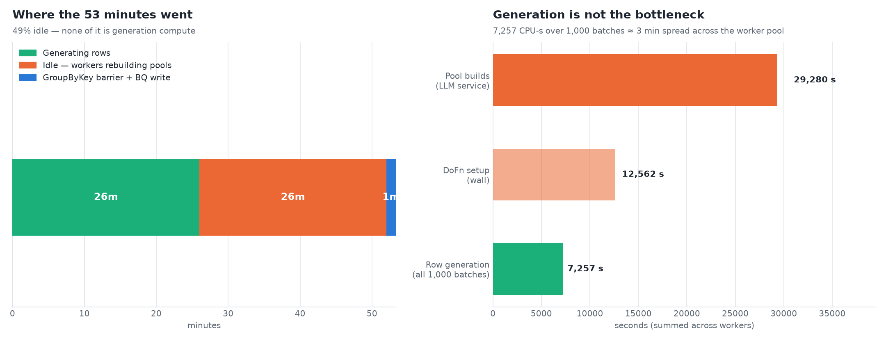
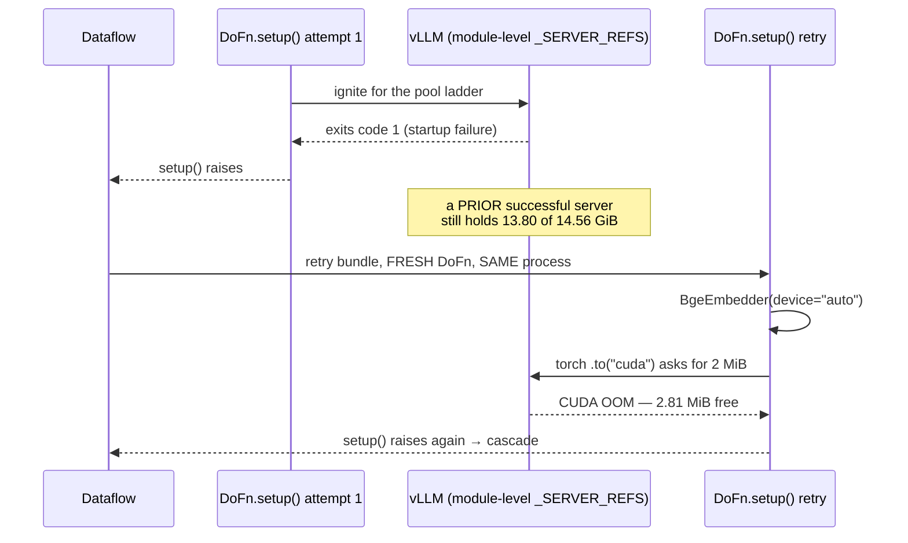
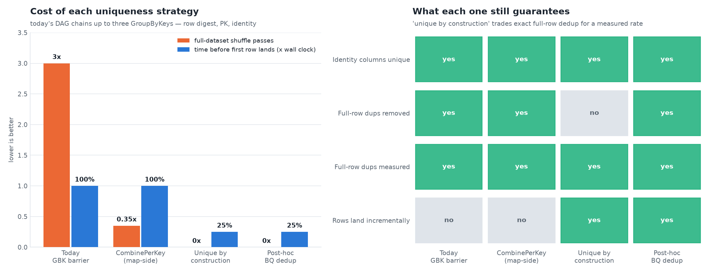
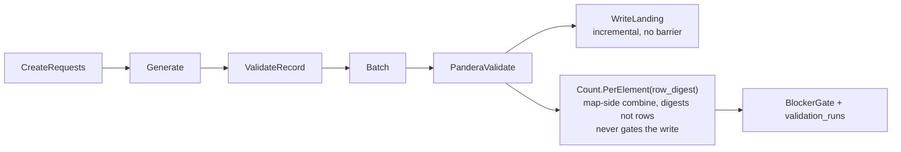
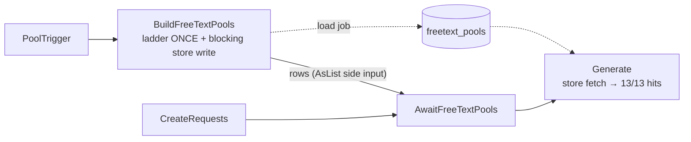
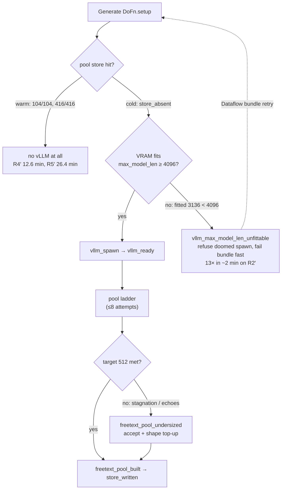

# WS6 — Pipeline shape: the setup gap, the retry cascade, and the GroupByKey barrier

> **Status: IMPLEMENTED + E2E MEASURED.** All five items merged to `master`
> (branch retired); the §6 targets are
> measured by the 2026-07-31 → 2026-08-03 five-run matrix in **§11** — warm
> 1M in 12.6 min (target < 15) and the first 10M-row run at 26.4 min.
>
> **W5 changed from investigation to fix during implementation** — see §5.
>
> Every number is re-derived from
> `runs/2026-07-26_17_10_37-5541097091204532225/worker_logs.jsonl`
> (first GPU/CPU-separated 1M-row Dataflow run) via
> [`scripts/doc/make_ws6_figures.py`](https://github.com/albertols/synthetic-llm-dataflow-bigquery/blob/a01e54abd46e676b53f344bd8ba5d10af231de21/scripts/doc/make_ws6_figures.py), which also
> regenerates every figure (provenance in §7).
>
> Written to the `visual-first-documentation` skill.
> Companions: [ADR 0018](../adr/0018-parallel-batched-freetext-pools.md) ·
> [ADR 0020](../adr/0020-freetext-pools-as-persisted-artifact.md) ·
> [WS5 design](2026-07-26-ws5-generation-throughput.md).

---

## 0. The headline, before anything else

**The single largest win in this run needs no new code — it needs a flag.**

This run emitted **zero** `freetext_pool_store_*` milestones. The WS5 pool store
was never switched on, so all 51 pool rebuilds still happened. That accounts for
**26 of the 53 minutes**. Everything else in this document is worth roughly half
of what simply passing `--freetext_pools_table` and `--build_pool_layer` is
worth.

WS5's batch-size scaling *was* active (exactly 1,000 batches of 1,000 rows), so
the deployed image carries the code — the run just didn't opt in.

---

## 1. What the run actually did

53.3 minutes, 1M rows, 67-column source, batch_size 1,000, autoscaling 1→5.


Three generation hills separated by two dead gaps, then a spike at the end. The
gaps are not scheduling noise — they are **new worker waves paying the free-text
pool ladder before they can emit a single row** (mean 574 s per column build).



| Signal | Value |
|---|---|
| Wall clock | 53.3 min |
| Minutes with any batch completing | **26** |
| `freetext_pool_built` | 51 (mean 574 s) → 29,280 s LLM service |
| `dofn_setup_done` | 24 → 12,562 s |
| `batch_done` | 1,000 → **7,257 CPU-s total** (mean 7.3 s) |
| `dofn_setup_retry` | **11** |
| `vllm_spawn` / `vllm_ready` | 5 / **3** — two spawns failed |
| CUDA OOM occurrences | 12 |

**Row generation is 7,257 CPU-seconds — about 3 minutes spread over the pool.**
It is not the bottleneck and was never close to being the bottleneck.

---

## 2. The retry cascade — a real, independent bug

The 12 OOMs and the 4 vLLM startup failures are **one causal chain**, not two
problems:



Measured: first vLLM failure at **t+8.8 min**, then 11 setup retries clustered
t+8.8 → t+14.4, with the OOM storm at t+13.8–14.4.

The defect is one line — `rag/embedding.py:155`:

```python
device = "cuda" if cuda is not None and cuda.is_available() else "cpu"
```

`is_available()` answers *"does a CUDA device exist"*, **not** *"is there room
on it"*. On a first setup the embedder loads before vLLM ignites, so `auto` is
correct. On any **retry** in the same process, the module-level server reuse
(`_SERVER_REFS`, ADR 0014) means vLLM is already resident — and a 2 MiB
allocation fails.

**Fix (W2), independent of everything else:** `auto` must mean *CUDA if there is
room*. Query free VRAM (`torch.cuda.mem_get_info`) against the model's footprint
plus a margin, and catch `torch.OutOfMemoryError` around the `.to(device)` with
a CPU fallback. Never let VRAM pressure turn into a failed bundle — bge-small on
CPU is slower, not wrong, whereas a raise makes Dataflow retry the whole bundle.

*As implemented:* `_resolve_auto_device` requires **512 MiB** free
(`_MIN_FREE_VRAM_BYTES`) and emits `embedder_cuda_no_room` when it steps aside;
the `.to(device)` is wrapped and emits `embedder_cuda_oom_fallback` if the card
fills between the check and the move.

This is worth fixing regardless of the pool store: WS5 removes the *usual*
trigger (no ladder ⇒ no ignition), but any future retry after any vLLM use
re-opens exactly the same window.

---

## 3. The GroupByKey barrier — why you see no rows until the end

Your observation is precisely right, and it is structural.


`EnforceUniqueness` chains **up to three GroupByKeys** (row digest → PK →
identity, `dofns/uniqueness.py:81-108`). In batch Beam a GroupByKey is a full
materialization barrier: *no* output until *all* input has arrived. So:

- rows cannot land while generation is still running — hence nothing visible
  until the end;
- the entire dataset is written to and read back from shuffle **once per GBK**;
- the measured signature is exactly this — ~1.65 MiB/s through
  `KeyByRowDigest` during the hills, then a narrow spike at t+50 where
  `GroupByRowDigest/Read` hits **12.77 MiB/s** and
  `BigQueryBatchFileLoads/AppendDestination` hits **13.97 MiB/s**.

### Why a SideInput does *not* solve this

A side input must be **fully computed before the main input is processed**. Using
one to hold seen PKs/hashes would impose the same barrier and add a broadcast of
the whole key set to every worker. It is strictly worse than the GBK. Same for
`beam.Distinct` (a GBK underneath) and for a stateful `DoFn` (still needs a
keyed shuffle to co-locate).

### What actually works



**Separate the two concerns that are currently conflated.**

| Concern | Today | Proposed |
|---|---|---|
| Identity / PK columns unique | GBK dedup | **unique by construction** — already synthesized from `(run_id, batch_id, row_index, column)`, which is globally unique; collisions are impossible, so the shuffle proves something already guaranteed |
| Full-row (non-identity) duplicates | GBK dedup, rows dropped to DLQ | **measured, not removed** — `Count.PerElement` over `row_digest` combines map-side and shuffles 32-byte digests instead of whole rows, and never gates the write |
| Landing | after all barriers | **written as generated** |
| Exact dedup, when genuinely required | in Beam | **post-hoc in BigQuery** (`SELECT DISTINCT` / `MERGE`) — off the critical path, and BigQuery is far better at it than a Beam shuffle |

This matches what you asked for: write as we go, check at the end, re-run if the
check fails. `run_id` already salts every run, so a re-run is safe.

**Proposed shape:**



**Kept behind a flag.** `--uniqueness_mode=exact|streaming`, defaulting to
`exact` (today's behaviour, byte-identical) until an E2E proves the streaming
path.

*One subtlety found while implementing:* duplicates LAND in streaming mode, so
feeding their count into `dlq_by_rule` while `valid_count` still counted every
landed row would push `total = valid + dlq` above the rows generated and quietly
**dilute** the blocker ratio — a silently weaker gate. The transform therefore
also publishes `distinct_count`, which `_gate_inputs` uses as `valid_count` in
streaming mode; `distinct + excess` is exactly the rows generated, so the ratio
is computed identically in both modes. One build, one variable — the WS5 `--pool_seed_strategy` pattern.

**The honest trade-off, on record:** in `streaming` mode rows land *before* the
BLOCKER gate evaluates, so a failing run leaves rows in the landing table. Two
ways out, and this needs your call: (a) accept it — the run is marked
`FAILED_BLOCKER` in `validation_runs` and re-run with `--write_disposition=overwrite`;
or (b) land into a per-run staging table and promote with a metadata-only
BigQuery copy once the gate passes. (b) is safer and costs one more table plus
a post-gate step; (a) is simpler and matches "repeat the generation if needed".

### A cheaper intermediate, if exact dedup must stay in Beam

Replace `GroupByKey + FirstRowWins` with a **`CombinePerKey`** taking the first
element. `CombinePerKey` combines **map-side** before the shuffle, so each worker
collapses its own duplicates first and the shuffle carries roughly the unique
set rather than every row. Same semantics — `FirstRowWins` already picks an
arbitrary element from an unordered iterable, so "first" is nondeterministic
today too. This keeps exact dedup and still removes most of the shuffle volume,
but it does **not** remove the barrier: rows still land only at the end.

---

## 4. Batch size — the evidence says leave it alone

You asked whether to push it further. No.

- 1M rows at `batch_size=1000` ⇒ 1,000 elements, mean `batch_done` **7.3 s**,
  max 63 s. Total generation 7,257 CPU-s.
- With ~5 workers × 8 bundle threads ≈ 40-way concurrency, 1,000 elements gives
  25 elements per thread — enough for load balancing with a short tail.
- Doubling `batch_size` halves the element count to 500 and roughly doubles the
  tail element (63 s → ~2 min), buying back only per-element overhead that is
  already amortised.

`_TARGET_ELEMENTS = 1000` (WS5 T3) is landing in the right place. The lever is
setup and the barrier, not batch geometry.

---

## 5. Proposed WS6 work

| # | Item | Type | Why |
|---|---|---|---|
| W1 | Turn the WS5 pool store on; make its *absence* visible in `validation_runs` | config + 1 milestone | 26 of 53 min; no new machinery |
| W2 | `device="auto"` means *CUDA if there is room*; OOM → CPU fallback | bug fix | 12 OOMs, 11 setup retries |
| W3 | `--uniqueness_mode=exact\|streaming` — incremental landing + measured duplicate rate | feature, flagged | removes the barrier and up to 3 full-dataset shuffles |
| W4 | `CombinePerKey` in the `exact` path | optimisation | map-side combining; keeps exact semantics |
| W5 | Losing the port race is reuse, not a startup failure | **bug fix** | head of the whole cascade |

**W5 was scoped as an investigation and became a fix.** Digging past the
wrapper error found the root cause: three spawns hit the fixed `--port 8000`
within 72 seconds, and at the moment of each "startup failure" a healthy
server was already serving four requests (`APIServer pid=421`, KV cache
1.0–1.7 %). The losers exited *address already in use* and
`_wait_until_ready()` raised immediately, because it never re-checks whether
a healthy server already owns the port.

That is the head of the cascade: `setup()` crashes → Dataflow retries the
bundle in the SAME process → the winning vLLM still holds 13.80 GiB → the
embedder OOMs on 2 MiB. **Four startup failures, 11 setup retries and 12
CUDA OOMs all trace to one unchecked assumption.** `_wait_until_ready` now
re-probes on subprocess death and adopts the winner, emitting
`vllm_spawn_lost_race`. A genuinely bad model path still raises.

---

## 6. Acceptance

Measured per phase from existing milestones. `COL_047` excluded (known
binary-char special case).

| Phase | This run | WS6 target |
|---|---|---|
| Minutes with no batch completing | 27 of 53 | < 5 |
| `freetext_pool_built` | 51 | ≤ 3 (W1) |
| `dofn_setup_retry` | 11 | 0 |
| CUDA OOM occurrences | 12 | 0 |
| Time before the first row lands | 100 % of wall clock | < 30 % (W3) |
| Full-dataset shuffle passes | up to 3 | 0 in `streaming`, ≲ 0.5 in `exact` |
| Wall clock, 1M rows, warm pools | 53 min | < 15 min |

**Caveat on record:** the wall-clock target assumes W1 lands the pool store. If
the store is not enabled, none of W2–W4 gets this run under ~40 minutes, because
the pool ladder alone is 26 minutes of it.

---

## 7. Figure provenance

```bash
uv run --no-sync python3 scripts/doc/make_ws6_figures.py
```

Palette matches the WS5 / 2026-07-24 / 2026-07-25 assets (blue `#2a78d6`,
orange `#eb6834`, aqua `#1baf7a`); the script prints OKLab ΔE separation for all
three pairs on every run (33.6 / 24.0 / 27.6, floor 15).

| Figure | File | Content |
|---|---|---|
| 1 | `assets/ws6-run-timeline.png` | `batch_done` per 2-min bucket with idle bands and the barrier release |
| 2 | `assets/ws6-where-time-went.png` | wall-clock split; measured phase totals |
| 3 | `assets/ws6-dedup-options.png` | shuffle cost and time-to-first-row per strategy, with the guarantee matrix |

Measured constants live in the `MEASURED` block of the script; a superseding run
is a one-place edit.

---

## 8. 2026-07-27 three-run postmortem (first runs ON the WS6 build)

Three E2E runs exercised the code above and one another's blind spots.

| Signal | `10_42_52` (known table) | `11_32_51` (**new** table) | `12_26_04` (known, log truncated) |
|---|---:|---:|---:|
| Outcome | 53 min, completed | **FAILED** | running at log end |
| `vllm_spawn` / `vllm_ready` | 5 / 3 | **52 / 0** | 2 / 1 |
| CUDA OOM | **0** (was 12) | 0 | 0 |
| `embedder_cuda_no_room` | 8 | 0 | 3 |
| `freetext_pool_store_absent` | **25** | 4 | 16 |
| `batch_done` mean | 7.3 s / 1,000 rows | — | similar |

**Verified in production:** W2 works — the embedder stepped aside 8× and the
OOM count went 12 → 0. W1 works — the pool-store-absent warning fired, and
the run *still* paid 45 pool rebuilds because the flag still wasn't passed.
W4 is visible in the job graph (`CombineByRowDigest`). W5's adopt path never
fired — correctly, because these spawn failures were real, not races.

**The crash (`11_32_51`) was table-dependent for a structural reason.** A
new `source_table` ⇒ its digest is absent from `rag_chunks` ⇒ the population
branch runs **concurrently** with Generate. Its embedder CUDA contexts hold
part of the card; vLLM asks for `0.9 × total` regardless of what is free;
EngineCore init fails — 52 times over 50 minutes, because every ladder
attempt re-entered the lazy `setup()`. The two same-table runs reused
existing chunks (`b1_chunks_reused`), had no concurrent branch, and ignited.
Fixes: **F1** (utilization derived from `mem_get_info`, capped at 0.9) and
**F2** (3 consecutive failures ⇒ suppress further spawns, fail the bundle in
seconds with `vllm_spawn_suppressed`).

**The funnel (`10_42_52`).** The fused `Generate→KeyByRowDigest` stage ran
at ~0.88k rows/s with PanderaValidate the visible choke: `BatchElements(10,
100)` turned 1M rows into 10k–100k micro-DataFrames. **F3** moves the bounds
to 1,000–10,000.

**Candidates deliberately not implemented** (each needs its own decision):
triple row validation (engine `model_validate` → `ValidateRecordDoFn` →
Pandera validate the same row three times; collapsing to two needs a
three-lines-of-defense discussion), and vectorised `generate_batch` output
(dict-of-lists → list-of-dicts conversion cost at 1M rows).

**Still unmeasured on hardware:** the pool store (never yet enabled — the
warning now fires 25× per run) and `--uniqueness_mode=streaming`.

## 9. 2026-07-28/29 four-run postmortem — the pool store works; the cold build ran twice

Four runs on the `7b81855` build, two per source table, cold then warm:

| Run | Table | Free-text cols | Worker-log span | Pool phase | Store behaviour |
|-----|-------|---------------:|----------------:|-----------:|-----------------|
| R1 cold | A | 3 | 23 min | 632 s + 694 s (**duplicated**) | 3 misses → branch wrote 3 rows; 21 hits later in-run |
| R2 warm | A | 3 | 12.5 min | 9–119 s (reads) | 24/24 hits, branch skipped (`pool_build_skipped`) |
| R3 cold | B | 13 | 45 min | 2,005 s + 2,026 s (**duplicated**) | 13 misses → 13 rows written |
| R4 warm | B | 13 | 11.5 min | reads only | 104/104 hits, branch skipped |

Two findings, one fix each:

**(a) The cold build ran TWICE, concurrently, on one GPU.** The pool branch
and the first Generate setup raced: Generate's engine store-missed (the
branch hadn't written yet — its `WriteFreeTextPools` sink ran *after* the
build) and fell through to building every pool itself. Both builders ran
4-thread ladders against the same vLLM server — 8 concurrent ladders on one
T4 for a token-throughput-bound workload, i.e. every cold build paid ~2x.
The fix is a **runner-level barrier**: the branch now writes
`freetext_pools` itself (blocking load job inside the DoFn — never
streaming inserts, so the seeding-arm digest DELETE works immediately) and
`CreateRequests` is gated on the branch's output via an `AsList` side input
(`AwaitFreeTextPools`). Generate bundles are not *scheduled* until the rows
are readable, so every Generate setup's store fetch hits.



No wall-clock is lost to the ordering: Generate could not produce real rows
without pools anyway — it was just burning the GPU rebuilding them. A store
write failure is loud but non-fatal (`freetext_pool_store_write_error`):
rows still flow, the gate opens, Generate store-misses and rebuilds — the
pre-gate behaviour becomes the fallback.

**(b) Stored rows lied about the build.** `freetext_pools` rows carried
`attempts=0`, `stagnated=false`, and `target` set to the *achieved* size
(COL_047: stored "target 386" for a 512-target build that ran 8
attempts and ended undersized) — the engine never recorded any of it. The
engine now keeps `_pool_build_info[column] = {target, attempts, stagnated}`
(stagnated = the yield-decay break fired, a new `_PoolYield` field) and the
branch persists it.

**Answering "21 STRING columns but only 3 pool rows":** by design. The
profiler classifies most STRINGs as shaped/categorical (constants, dates,
coded IDs) and routes them off the LLM entirely; only true FREE_TEXT columns
(3 on table A, 13 on table B) get LLM pools, and only those are persisted.

## 10. WS7 proposal — per-column pool fan-out (the multi-table scaling step)

The cold pool build is now single-builder but still **single-worker**: one
DoFn runs all N ladders on one GPU while every other worker's GPU idles
(R3: 13 ladders, ~2,000 s on one T4 with a second T4 idle). The ladder work
is embarrassingly parallel across columns, and tomorrow across tables:

- **Stage A — Plan** (1 element, CPU+embedder only): profile the reference
  sample, select seeds per free-text column, emit one `PoolJob(column,
  seed_examples, target)` element per column. No vLLM.
- **Reshuffle** — spread jobs across workers.
- **Stage B — BuildOnePool** (per element, GPU): model client in `setup()`
  (spawn or adopt the worker's vLLM), one ladder per element, one
  `freetext_pools` row out. The gate then feeds on Stage B's output.

With `max_num_workers=4` T4s, R3's 13 ladders drop from ~2,000 s serial-ish
on one GPU to ~4 concurrent ladders per GPU across 2–4 GPUs — a further
2–4x on the dominant cold-run phase. The same `(table, column)` job shape is
exactly what multi-table generation (PK/FK, post-WS7) needs: one pool DAG
for all tables, keyed per table digest. Requires extracting the ladder from
`engine._infer_free_text_pool` into a standalone function both callers
share, and a light "plan-only" engine entry point — deliberately NOT bundled
into this PR.

Remaining smaller candidates: REFERENCE_2-style echo decay (556 verbatim
copies across 8 attempts for a final 222/512 pool — a marginal-yield
forecast could cut the last ~3 attempts), and verifying vLLM prefix caching
is active on the pool prompts (byte-identical prefixes across attempts).

### 9b. The `generation_plan` milestone (2026-07-29)

One INFO line per (digest, table) per worker process — the per-column
strategy map that every postmortem previously re-derived from scattered
milestones:

```
SDFB_MILESTONE name=generation_plan engine=b1_rag table=p.d.t columns=64
  seed_strategy=centroid top_k=8
  plan={"categorical":[...],"constant":[...],"freetext_llm_pool":[...],
        "numeric":[...],"shaped_identifier":[...],"temporal":[...]}
  pool_sources={"NOTES":"store","COL_052":"llm_ladder"}
```

Labels map 1:1 onto the engine's dispatch: `constant` (literal copy),
`categorical` (empirical-frequency sampler), `numeric` (in-range empirical
sampler), `temporal` (jittered range sampler, sentinel-aware — includes
date-shaped STRINGs), `shaped_identifier` (per-position template, routed
off the LLM), `freetext_llm_pool` (RAG-seeded LLM pool; `seed_strategy` /
`top_k` name the run's retrieval arm, `pool_sources` says whether each pool
came from the persisted store, the process cache, or a fresh ladder).

`b2_library` emits the same milestone from one shared implementation
(`sdfb_core.engines.generation_plan` — label mapping + per-engine
once-guard). B.2 differences: `backend=` reports the bulk sampler that
actually serves the run (`empirical` | `sdgx_ctgan` |
`sdgx_fallback_empirical` — the silent-CTGAN-fallback lesson), and there is
no `pool_sources` field because B.2 free-text pools build lazily per batch.

## 11. 2026-07-31 → 08-03 five-run postmortem — the funnel closes, and 10M rows lands

Five runs on the `9b441e6`+ build (`d08040e` head). Every number below is
re-derived from `runs/<JOB_ID>/worker_logs.jsonl` by the same
sweep used for §9 (severity histogram, milestone inventory, batch timeline).

| Signal | R1′ `07-31_05_20` cold A | R2′ `07-31_05_33` cold B | R3′ `07-31_09_11` | R4′ `08-03_09_03` warm B | R5′ `08-03_11_27` warm B **10M** |
|---|---:|---:|---:|---:|---:|
| Rows / free-text cols | 1M / 3 | 1M / 13 | — | 1M / 13 | **10M** / 13 |
| Worker-log span | 22.0 min | 36.7 min | **log export failed (2-byte file)** | **12.6 min** | **26.4 min** (32 workers) |
| First `batch_done` | +13.1 min | ~+28 min after workers up | — | **+4.3 min** | n/a (split lines) |
| `batch_done` window | 5.6 min / 1,000 batches | 5.4 min / 1,000 | — | 5.5 min / 1,000 | 1,000 × 10k rows (WS5 scaling) |
| `vllm_spawn` → `vllm_ready` | 1 → 1 | 14 → 1 (13 refused, see below) | — | **0 → 0** | **0 → 0** |
| Pool store | absent → 3 built + written | absent → 13 built + written | — | **104/104 hits** | **416/416 hits** |
| CUDA OOM / setup retries | 0 / 0 | 0 / 1 bundle retried | — | 0 / 0 | 0 / 0 |
| ERROR lines (real) | 0 (1 benign SDK-progress) | 17 (one causal chain) | — | **0** | 0 (1 benign SDK-progress) |

**§6 acceptance, measured:** warm 1M wall clock **12.6 min** (target < 15 ✓);
`freetext_pool_built` ≤ cols, cold-only ✓; CUDA OOM **0** ✓; setup retries 0
warm ✓. The 10M run sustains **~6.3k rows/s** end-to-end — 10× the rows for
2.1× the wall clock of the warm 1M run, with zero vLLM ignitions.

### The LLM lifecycle + pool failover funnel, as observed



**What R2′ proves:** the 9b441e6 VRAM guard converts the §8 doom loop
(52 spawns / 0 ready / 50 min / job FAILED) into 13 fail-fast refusals inside
~2 minutes, one bundle retry, and a completed job. The guard *works*. The
residual cost is real but bounded: 13 wasted bundle attempts while the winning
server igniting elsewhere held the card. Candidate (small): setup attempts that
measure an unfittable card while a sibling *is igniting* should wait on the
ignition latch instead of failing the bundle.

**Also verified on R2′:** `ddl_uri_miss_fallback` → `ddl_live_extracted` —
a missing DDL JSON in GCS degraded to live extraction and the run proceeded.

### Findings feeding the next cycle

1. **The pool cap is now the diversity ceiling** (measured, 2026-08-04
   free-text crosscheck vs the R5′ 10M table): synthetic `distinct` per
   free-text column **equals its pool size** (95–512) against source distincts
   of 4k–146k; 11/13 columns also show `empty_fraction` source 15–99% vs
   synthetic ~0%. Both are generation-design gaps, not run failures — owned by
   the 2026-08-05 relational-metadata/fidelity design spec.
2. **Echo burn:** R2′ `REFERENCE_2` parsed 1,065 values but rejected 439
   prompt echoes + verbatim copies → pool 296/512 after 8 attempts. §10's
   marginal-yield decay candidate stands.
3. **`generation_plan` fired 4× on R5′** — the once-guard is per-process;
   32 workers ⇒ multiple emissions. Fine for grep, but rename the intent or
   dedupe run-level if "one per run" is to be literal.
4. **Log-export tooling:** R3′'s `worker_logs.jsonl` is 2 bytes and R5′'s has
   17,621 line-split records (multi-line messages not JSON-escaped). The
   export script needs a re-pull + escape fix before the next postmortem.

### PR #11 merge readiness (2026-08-05)

- 748 laptop tests green, `ruff` clean, branch rebased state `CLEAN`/`MERGEABLE`.
- **CI never ran on the PR** — zero workflow runs for the branch, and
  `ci.yml`'s push trigger watches `main` while the default branch is `master`.
  Fix the trigger (or re-push) and require one green check before merge.
- PR title still says "design only, do not merge" — retitle before merging;
  the branch long since became the WS5/WS6 implementation vehicle.
- Head commit `d08040e` unpushed at analysis time.
- Repo squash-merges: review with the two-dot diff (`git diff master ws6-pipeline-shape`).
