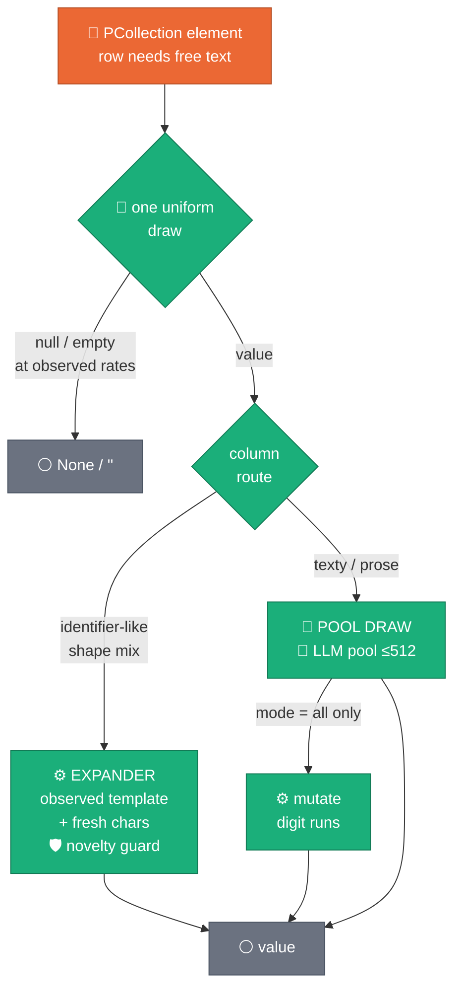
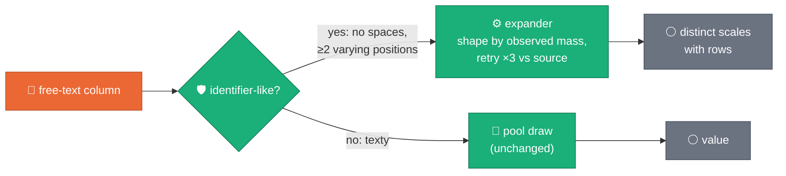
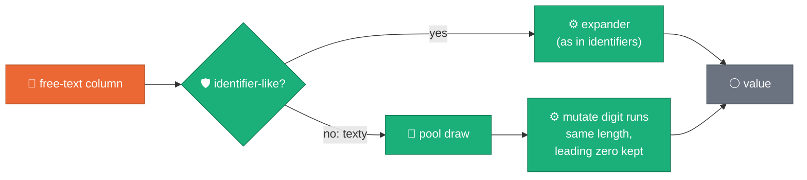
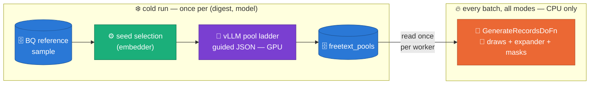

# `--freetext_expansion` — the shape-preserving expander, mode by mode

> **Status: ACCEPTED / SHIPPED** (WS8, 2026-08-05 spec C3; merged to
> `master` via PR #13, released in v0.1.0). Flag surface: `run_pipeline.py
> --freetext_expansion`, Composer DAG param `freetext_expansion`, Flex
> metadata entry of the same name. Default: `identifiers`.
> Companions: [ADR 0021](../adr/0021-relational-contract-in-descriptions.md) ·
> [WS6 §11 five-run postmortem](2026-07-27-ws6-pipeline-shape.md).
> Diagram icon/color classes follow the mermaid house style in
> `.claude/skills/visual-first-documentation/SKILL.md` (🟠 Beam code,
> 🔵 stores, 🟣 GPU/vLLM, 🟢 CPU engine work, ⚪ plain data).

## Evidence — why the flag exists

The 2026-08-04 free-text crosscheck of the 10M-row run measured synthetic
`distinct == pool size` on **all 13** free-text columns (95–512 distinct
values against source cardinalities of 4k–146k): a bounded LLM pool sampled
with replacement is a hard diversity ceiling, and scaling the *pool* is the
wrong axis (~574 s of GPU per column per 512 values). The expander breaks
the ceiling on the CPU side instead — **zero added LLM calls on every
setting**.

## The mechanism — where each mode changes the draw

The null/empty mask fires first in every mode (spec C1 — one uniform draw,
so the two sparsity channels never double-count); the flag only governs how
the *substantive* value is produced. Identifier-likeness: no template
position may emit whitespace and the mass-weighted shape carries ≥2 varying
positions (`shape_mix_is_identifier_like`, `engines/text_shapes.py`).

## One panel per mode

### `off` — the pre-WS8 control

Every value is a pool draw; the expander never runs. Distinct is capped at
pool size — byte-identical to the measured 10M-run behaviour, kept as the
A/B control arm.

### `identifiers` — the default, conservative win

Code-like columns (`U900001`, `0009900000100…`) draw from their observed
**shape mix** instead of the pool — each shape sampled at its observed
frequency, class positions filled fresh. Texty columns are untouched.

### `all` — adds digit-run mutation to texty draws

Same as `identifiers`, plus texty pool draws (`TRF.EX-090000123 A 17`) get
their digit runs re-rolled, so the ~512 templates stop repeating identical
embedded reference numbers.

## CPU / GPU split — the same on every mode, and that is the point

The GPU is governed by the **pool lifecycle**, not by this flag. vLLM does
the genuinely generative work exactly once per `(reference_digest,
model_uri)` — semantic text, format discovery, guided-JSON pools — and the
expander then multiplies cardinality from those templates at CPU cost.
That is the leverage: **GPU for intelligence once, CPU for scale every
batch.**

| Mode | GPU (vLLM) | CPU | Net effect |
|---|---|---|---|
| `off` | Pool build on cold runs; **zero** on warm runs (BQ pool-store hit — R4′/R5′ ran 1M/10M rows with 0 ignitions) | Pool draws + null/empty masks | Today's measured profile |
| `identifiers` | **Identical to `off`** — the flag adds no LLM call and removes none | + shape-template fills + novelty guard (vectorized, per batch) | Diversity ceiling broken at ~zero marginal cost |
| `all` | **Identical to `off`** | + digit-run mutation on texty draws | Same, plus repeat-share drops on texty columns |

Two honest footnotes. First, on cold runs the pool ladder still builds
pools for *all* free-text columns, including identifier-like ones whose
draws the expander will bypass — skipping those ladders is a recorded
follow-up optimization (it would make cold runs *cheaper* under
`identifiers`, never more expensive). Second, "reliable and performant"
here is inherited, not new: the expander rides the WS5/WS6 machinery
(persisted pools, VRAM-fit ignition, fail-fast guards) that the §11
five-run matrix measured at 12.6 min warm 1M and 26.4 min for 10M.

## Mode comparison

| | `off` | `identifiers` (default) | `all` |
|---|---|---|---|
| **What it does** | Every value is a pool draw. | Code-like columns draw from their observed shape mix — each shape at its observed frequency, positions filled fresh. | Same, plus texty pool draws get their digit runs re-rolled. |
| **Distinct ceiling** | = pool size (95–512 — exactly what the 10M crosscheck measured). | Unbounded — scales with rows. The `U`+6-digit test column goes from ≤55 observed to >1,200 distinct in 4k draws. | Same, plus texty columns stop repeating identical reference numbers. |
| **Fidelity guarantees** | Shape precision only as good as the pool. | Precision = 1.0 *by construction* (only observed shapes can be emitted); recall ≈ observed shape mass. Novelty guard: 3 retries against the source sample (<2% residual collision on tight keyspaces). | Digit mutation preserves run length and leading zeros (`0001…` prefixes survive), so shape masks are unchanged. |
| **Risks / cons** | The diversity collapse and `freetext.distinct_floor` gate failures. | A literal-heavy shape (long constant head, few varying digits) has a genuinely small keyspace — expansion honestly can't exceed it. Semantic columns are protected by the identifier-likeness gate (whitespace ⇒ texty). | Mutated digits lose any *cross-field* meaning (a reference number inside prose no longer matches anything) — fine for synthetic, worth knowing for downstream joins on embedded IDs. |
| **Cost** | — | CPU-only, vectorized per batch, zero additional LLM/GPU calls. The LLM pool still supplies semantic text and templates. | Same. |
| **Expected aftermath on the crosscheck** | Status quo (rank-1 findings persist). | `distinct_ratio` collapse and `freetext.distinct_floor` clear on ID-ish columns; `shape_precision` → 1.00; `copy_fraction` stays 0. | Additionally shrinks repeat-share (`top_value_share`) on texty columns like the source's COL_13. |

## Scope

The flag only touches columns routed `FREE_TEXT` **without** a strict
`identifier_shape` (those already generate format-preserving values per
row) — categorical, temporal, numeric and constant columns are untouched in
every mode. `identifiers` is the default because it is the conservative
win: it fires only where the shape evidence says "this is a code," and
`off` remains the exact pre-WS8 behaviour for A/B comparison.

## Figure provenance

Inline mermaid only (control-flow claims — the visual-first form rule),
using the house icon/color classes defined in
`.claude/skills/visual-first-documentation/SKILL.md`. The measured numbers
are pinned by regenerable sources, not typed twice:

| Claim | Source |
|---|---|
| distinct == pool size (95–512) on 13/13 columns at 10M rows | 2026-08-04 crosscheck `metrics_*.json` (user-run; `scripts/e2e/freetext_crosscheck.py`) |
| ≤55 → >1,200 distinct in 4k draws; <2% novelty-guard collision | `packages/sdfb-tests/tests/unit/rag/test_freetext_sampling_fidelity.py` + `.../engines/test_b2_freetext_fidelity.py` (assertions re-verified on every CI run) |
| leading-zero / run-length preservation | `packages/sdfb-tests/tests/unit/engines/test_shape_mix.py::test_mutate_digit_runs_preserves_shape_and_prefix_zero` |
| ~574 s GPU per column per 512 pool values | WS6 doc §1 (measured `freetext_pool_built` mean) |
| warm-run GPU = 0 (pool-store hits at 1M and 10M) | WS6 doc §11 (R4′ 104/104, R5′ 416/416 store hits, zero `vllm_spawn`) |
