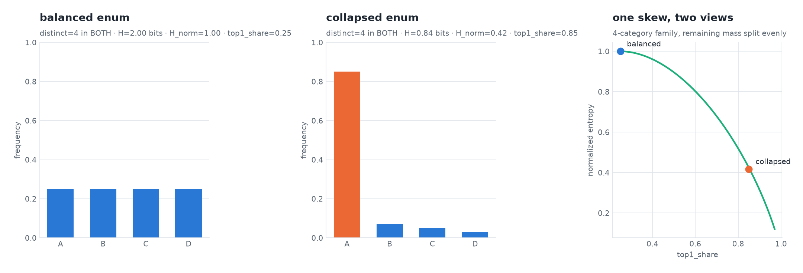
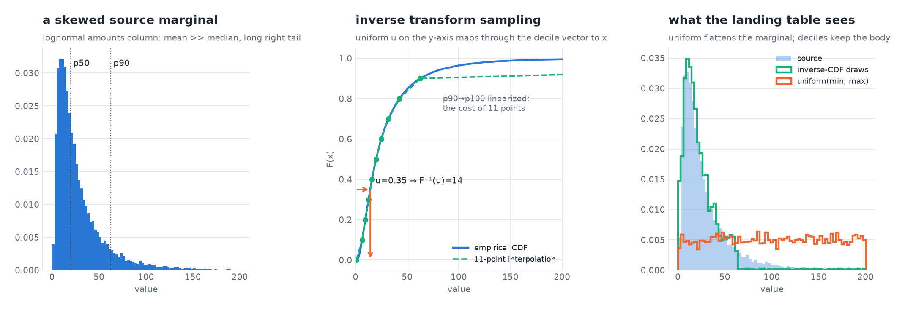
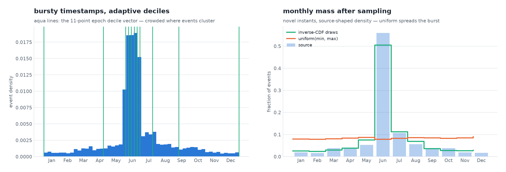
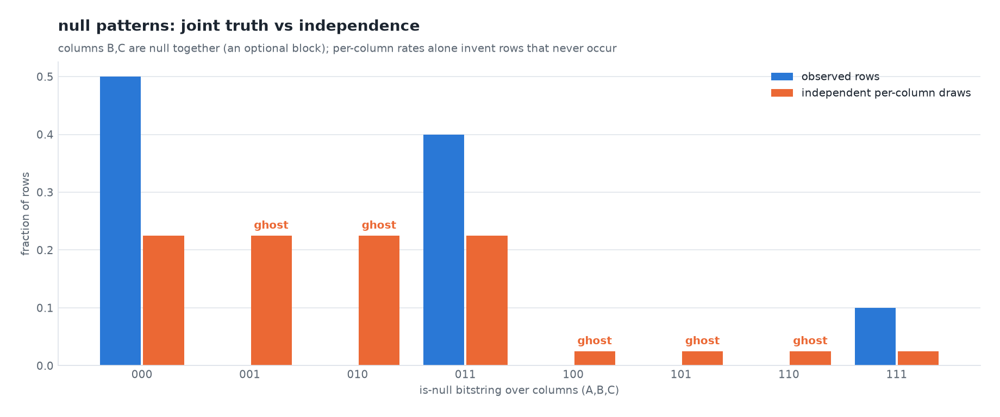
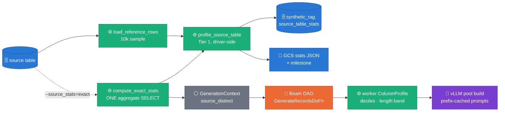
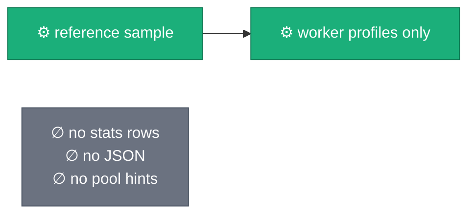
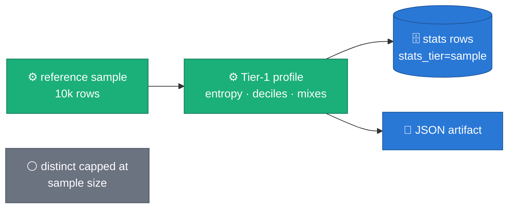
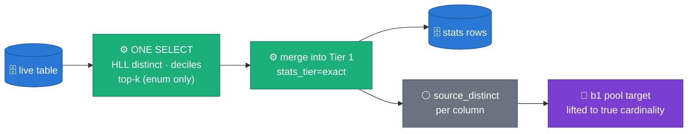
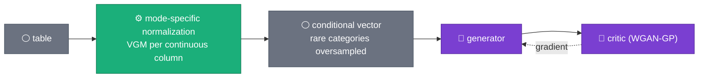

# source_table_stats as a generation input — the mathematics, the tiers, the consumers

> **Status: ACCEPTED** · decision record: [ADR 0022](../adr/0022-stats-driven-generation.md)
> · sibling contract: [ADR 0021](../adr/0021-relational-contract-in-descriptions.md)
> · evidence: five-run postmortem §11 of
> [`2026-07-27-ws6-pipeline-shape.md`](2026-07-27-ws6-pipeline-shape.md) and the
> 2026-08-04 freetext crosscheck (`scripts/e2e/freetext_crosscheck.py`).
>
> This doc doubles as learning material: each concept carries an entry-level
> reading (the figure), a research-level formulation (the formula + primary
> source), and the exact code site that implements it. Figures regenerate via
> `uv run --no-sync python3 scripts/doc/make_source_stats_figures.py`.

## Evidence (measured elsewhere, cited here)

Two measured findings drive this design — both live in their own evidence
docs, neither is re-typed here (visual-first rule: a number is typed once):

- **Synthetic free-text `distinct == pool size`** while source columns held
  4k–146k distinct values — the 10k reference sample caps what any profiler
  can see (postmortem §11).
- **11/13 columns had an empty-parity gap** and synthetic prose ran short —
  the crosscheck's trimmed-empty and length findings.

## The mathematics, visually

### 1 — Entropy and `top1_share`: what distinct-count cannot see

**Claim: distinct count cannot tell a balanced enum from a collapsed one;
entropy and top1_share can.**



*Entry level:* both columns have exactly 4 categories, so `distinct=4`
reports them as identical — but one spreads its rows evenly and the other
puts 85% on a single value. The right panel shows the two stats are two
views of one skew: as the top value absorbs mass, normalized entropy falls
along a single curve.

*Research level:* Shannon entropy
`H(X) = −Σᵢ pᵢ log₂ pᵢ` bits
([Shannon 1948](https://ieeexplore.ieee.org/document/6773024));
`entropy_norm = H / log₂(distinct) ∈ [0,1]` is the ratio to the uniform
maximum, so it is cardinality-independent — comparable across columns.

*Code:* `sdfb_core/stats/source_stats.py::_add_value_mix` — computed from
the same `Counter` that produces `distinct`, so the marginal cost is
O(distinct). *Consumers:* the "skewed copy pattern" trigger for ADR 0021's
frequency-weighted FK sampling, and validation's mode-collapse detector —
a synthetic column whose entropy sits far below source has collapsed even
when its distinct count looks healthy (the shape-level analogue of
[SDMetrics TVComplement](https://docs.sdv.dev/sdmetrics/metrics/quality-metrics/tvcomplement)).

### 2 — The quantile vector and inverse transform sampling

**Claim: uniform-in-range flattens a skewed marginal; inverse transform
through 11 deciles preserves it.**



*Entry level:* read the middle panel like a machine — draw a uniform number
`u` on the vertical axis, walk right until you hit the CDF, drop down to
read the value. Steep CDF regions (dense data) catch most of the walks, so
most draws land where the source is dense. The right panel is the payoff:
orange (what B.2 shipped before ADR 0022) spreads draws evenly over
`[min, max]`; green tracks the source.

*Research level:* if `U ~ Uniform(0,1)` then `X = F⁻¹(U)` has distribution
`F` — the inverse transform / Smirnov method
([Devroye 1986, ch. II](http://luc.devroye.org/rnbookindex.html)). We store
the 11-point empirical quantile vector `(q₀, q₁₀, …, q₁₀₀)` and interpolate
piecewise-linearly (`np.interp`), i.e. we sample from the piecewise-linear
approximation of `F⁻¹`. The annotated p90→p100 segment shows the honest
cost: the top decile's mass is linearized across the tail — the resolution
limit of 11 points (more points = more fidelity, same O(1) sampling).

*Code:* profile side `b2_library/fidelity.py::_decile_points` (one sort,
shared with min/max); sampler side `b2_library/backends.py::_sample_one`
(NUMERIC branch). Every draw remains novel and in-range — no source value
is copied.

### 3 — Epoch deciles: burst density on the time axis

**Claim: decile spacing adapts to burst density, so sampled instants land
where the source's did.**



*Entry level:* the aqua vertical lines are the decile vector drawn on the
calendar. Where events cluster (June), consecutive deciles crowd together;
quiet months get wide gaps. Sampling walks the same inverse-CDF machine as
figure 2, so the June burst survives — uniform jitter (orange, the
pre-ADR-0022 sampler) spreads it flat across the year.

*Research level:* identical mathematics to §2 on the epoch-seconds axis;
the profile's vector is computed *after* sentinel-year extraction
(year 1 / 9999 re-injected at observed frequency) and after the now−10y
clamp, with sub-floor quantile points collapsed onto the floor — the CDF
analogue of the `[minimum, maximum]` clamp. Weekday/hour structure is NOT
preserved by a global CDF (a June-heavy vector says nothing about Mondays);
`dow_mix`/`hour_mix`/`month_mix` are measured for the M2 bucket-preserving
sampler.

*Code:* `b2_library/temporal.py::sample_temporal` (quantile branch),
vector built in `b2_library/fidelity.py::_temporal_profile`.

### 4 — Null patterns: the one joint statistic in M1

**Claim: independent per-column null draws invent ghost patterns and starve
real joint sparsity.**



*Entry level:* real tables have optional *blocks* — columns B and C are
filled together or empty together. Per-column null rates (50% each) are
satisfied equally well by rows that null B and C together (the truth) or
independently (the model) — but independence invents `001`/`010` rows that
never occur in source and starves the real `011` pattern.

*Research level:* the observed pattern distribution is the joint
`P(null_A, null_B, null_C)`; per-column rates are its marginals; both
engines currently sample the *product measure* `∏ P(null_i)`. The
`__table__` pseudo-column records the top-k of the true joint (an O(rows)
pass over is-null bitstrings) — measured, not yet consumed: sampling row
patterns instead of per-column coin flips is the designed M2 consumer.
Correlations/copulas beyond null structure stay with `SdgxBackend`
(see appendix).

*Code:* `sdfb_core/stats/source_stats.py::_null_pattern_entry`; capped at
64 columns (`_NULL_PATTERN_MAX_COLS`), top-8 patterns.

## Why two tiers: what a 10k sample can and cannot estimate

The mathematical rationale for `sample` vs `exact` is a one-liner: **the
sample bounds *fractions* tightly and *cardinality* not at all.**

- **Fractions and quantiles are DKW-bounded.** The
  Dvoretzky–Kiefer–Wolfowitz inequality,
  `P(supₓ |F̂ₙ(x) − F(x)| > ε) ≤ 2·exp(−2nε²)`, puts every
  `null_fraction`, `empty_fraction`, and decile from an n=10k sample within
  ≈±1.4 pp of truth at 95% confidence — regardless of table size. The repo
  already owns this figure: see
  [DKW sampling error vs n](assets/sampling-error-dkw.png) in
  [`2026-07-24-reference-sample-scaling.md`](2026-07-24-reference-sample-scaling.md)
  (reused, not redrawn — concept figures are shared assets).
- **Distinct counts have no such bound.** A 10k sample of a 146k-distinct
  column can report at most 10k — and reported 95 in the five-run
  postmortem. No inequality rescues you; you must look at the whole table.
  That is Tier 2's single job, and why it is the *only* stat wired into
  pool sizing.

Tier 2 pays one table scan for it, using sketches instead of exact
`COUNT(DISTINCT)`:


*Research level:* `APPROX_COUNT_DISTINCT` is HyperLogLog++ — 64-bit hashing,
sparse low-cardinality representation, empirical bias correction
([Heule, Nunkesser & Hall 2013](https://research.google.com/pubs/archive/40671.pdf);
[BigQuery HLL functions](https://docs.cloud.google.com/bigquery/docs/reference/standard-sql/hll_functions)) —
typical error ~0.5% at fixed small memory, mergeable across shards (that
is what makes the one-scan
[approximate aggregation](https://cloud.google.com/bigquery/docs/reference/standard-sql/approximate_aggregate_functions)
pattern cheap). *Code:* `sdfb_beam/io/exact_stats.py::build_exact_stats_sql`.

## Architecture — one profiling pass, tiered, workers stats-table-agnostic

Claim: *every stats consumer sits driver-side or reads a worker-local
profile; no worker ever queries the stats table.*



The stats *table* stays a human/drift artifact; the stats *values* reach
generation through exactly two seams: the worker-local `ColumnProfile`
(recomputed from the same reference rows) and `GenerationContext`
(driver-populated). That is the WS-B invariant, unchanged.

## `--source_stats` — one panel per mode

### `off`



Nothing is profiled driver-side. Engines still profile per worker (they
always do); there is simply no persisted record and no exact pool sizing.

### `sample` (default)



Zero extra BigQuery cost (the sample is already paid for). Fractions and
deciles are DKW-tight; `distinct` is sample-bound — precisely the
pool-starvation trap.

### `exact`



On failure the run degrades loudly to `sample` behavior
(`source_stats_exact_failed` milestone) and stays retryable — the skip key
records the tier actually achieved.

## Consumer map — which stat feeds which generation kind

Honesty column included: a stat that is measured but not yet consumed says
so. Measured-but-unconsumed is the M2 seed, not silent coverage.

| Generation kind | Stat consumed today | Consumer (code) | Figure | Not yet consumed (measured for M2) |
|---|---|---|---|---|
| constant | `is_constant` (route) | both profilers | — | — |
| categorical / BOOL | empirical frequency table (worker-side) | `_sample_categorical` | fig 1 | `entropy`/`top1_share` → WS-A skewed-FK weighting; `top_values` drift checks |
| integer / float / NUMERIC | **decile vector → inverse-CDF** | `b2 backends._sample_one`; b1 anchors empirically already | fig 2 | exact Tier-2 deciles as B.1 anchor supplement |
| dates / timestamps | **epoch decile vector → inverse-CDF** (+ sentinels, now−10y clamp) | `b2 temporal.sample_temporal` | fig 3 | `dow_mix`/`hour_mix`/`month_mix` bucket-preserving sampler |
| free text (LLM pool) | **`source_distinct` → pool target** (Tier 2); **`length_hint` p05–p95 band → prompt suffix** | `b1 engine._pool_target`, `_column_constraint`; `b2 freetext._generate_pool` | §HLL | char-class/entropy prompt steering |
| shaped identifiers | shape templates (existing); never LLM | `text_shapes` | — | `gap_ratio` for sequential-PK realism |
| row nulls | per-column `null_fraction` (existing) | both engines | fig 4 | `__table__` null-pattern mix → joint null sampling |

## vLLM efficiency contract for prompt-side consumers

Every prompt-side stat lands as a **per-column constant suffix**. The pool
prompt's anatomy, in cache terms:

```text
[shared instruction prefix — byte-identical across all calls]   ← KV blocks cached once
[exemplars — stable per column (centroid seeding)]              ← cached per column
[Column constraint: …]  [Most values are 12-48 characters …]    ← constant suffixes, appended last
```

[vLLM automatic prefix caching](https://docs.vllm.ai/en/stable/design/prefix_caching/)
hashes KV blocks and reuses any shared prefix across requests; a suffix
change never invalidates the prefix, but a prefix change invalidates
everything after it — hence the append-only rule (ADR 0018's
byte-identical-prefix discipline, extended to `length_hint`). Pool-size
lifts stay under `_FREE_TEXT_POOL_MAX=512`: pool build cost is linear in
target size (batched 32-value array completions), so `exact` improves
*sizing accuracy*, not cost ceilings.

## Appendix — alternatives considered, redrawn

Canonical external architectures are *redrawn* here (visual-first rule:
never hotlink an unattributable image; a redrawn schematic is license-safe
and palette-consistent).

### GReaT — LLM as the joint sampler (rejected for the serving path)

[Borisov et al., ICLR 2023](https://arxiv.org/abs/2210.06280): encode each
row as text, fine-tune, sample rows autoregressively.


Captures the full joint distribution — at one GPU call per generated row.
Our ADR 0013 spine inverts that: the LLM infers *distributions once* (and
fills bounded free-text pools); the bulk is vectorized CPU sampling. At 10M
rows / 6.3k rows/s that inversion is the difference between a 26-minute run
and a GPU-bound one.

### CTGAN — learned joint structure (deferred to `SdgxBackend`)

[Xu et al., NeurIPS 2019](https://arxiv.org/abs/1907.00503): mode-specific
normalization + conditional generator trained against a WGAN-GP critic.



This is what `sdgx`'s CTGAN-family models do when the B.2 `SdgxBackend` is
enabled — learned column *dependence* at training cost. The empirical
backend's decile vectors deliberately stop at marginals: measured, free,
and deterministic. The dividing line is the null-pattern finding (fig 4) —
joint *nulls* are cheap to measure, so M1 measures them; joint *values*
need a model, so they stay with sdgx/M2.

### RAG retrieval geometry (B.1 pool seeding) — owned elsewhere, reused

How B.1 picks the exemplars that seed each pool (centroid top-k cones,
k-center coverage, prefix rotation) has its own visual doc with four
concept figures — see
[`2026-07-25-rag-retrieval-geometry-roadmap.md`](2026-07-25-rag-retrieval-geometry-roadmap.md)
([retrieval geometry](assets/embedding-geometry-topk.png),
[centroid vs per-query](assets/centroid-vs-perquery.png)). Reused per the
concept-figure rule; this doc adds only the prompt-suffix contract above.

## Acceptance criteria (falsifiable, keyed to existing milestones)

1. `--source_stats=sample` run: `source_stats_written` milestone; every row
   carries `sample_rows`, `stats_tier='sample'`, `profiler_version='2'`.
2. Same digest re-run: `source_stats_skipped`; bumping `PROFILER_VERSION`
   re-writes (versioned skip key).
3. `--source_stats=exact` run: `source_stats_exact` milestone with column
   count; b1 logs pool targets ≥ sample-tier targets for starved columns.
4. Exact pass hard-failure (quota, missing table): job continues;
   `source_stats_exact_failed` at WARNING; rows land as `sample` tier.
5. B.2 synthetic numeric column vs skewed source: decile overlap beats the
   pre-ADR-0022 uniform baseline (KS-style check, see
   [SDMetrics KSComplement](https://docs.sdv.dev/sdmetrics/metrics/quality-metrics/kscomplement)).
6. No literal source values in stats rows for columns with distinct > 50
   (privacy gate — [Carlini et al. 2021](https://arxiv.org/abs/2012.07805)).

## Figure provenance

Regenerate: `uv run --no-sync python3 scripts/doc/make_source_stats_figures.py`
(prints OKLab palette separation on every run — all pairs ≥ the CVD floor).
Concept figures: seeded, deterministic, parameters in the script's
`CONCEPT` block; no measured run numbers.

| Figure | File | Claim |
|---|---|---|
| 1 | `assets/stats-entropy-skew.png` | distinct can't tell balanced from collapsed; entropy/top1_share can |
| 2 | `assets/stats-inverse-cdf.png` | uniform-in-range flattens a skewed marginal; 11 deciles preserve it |
| 3 | `assets/stats-epoch-deciles.png` | decile spacing adapts to burst density |
| 4 | `assets/stats-null-patterns.png` | independent null draws invent ghost patterns |
| reused | `assets/sampling-error-dkw.png` | DKW bounds sample fractions (owned by [`2026-07-24-reference-sample-scaling.md`](2026-07-24-reference-sample-scaling.md)) |
| reused | `assets/embedding-geometry-topk.png` et al. | retrieval geometry (owned by [`2026-07-25-rag-retrieval-geometry-roadmap.md`](2026-07-25-rag-retrieval-geometry-roadmap.md)) |
| inline | mermaid (house classes) | architecture, flag modes, HLL++, GReaT, CTGAN |

External references: [GReaT](https://arxiv.org/abs/2210.06280) ·
[CTGAN](https://arxiv.org/abs/1907.00503) ·
[Shannon 1948](https://ieeexplore.ieee.org/document/6773024) ·
[Devroye 1986](http://luc.devroye.org/rnbookindex.html) ·
[HLL++ 2013](https://research.google.com/pubs/archive/40671.pdf) ·
[Carlini et al. 2021](https://arxiv.org/abs/2012.07805) ·
[vLLM APC](https://docs.vllm.ai/en/stable/design/prefix_caching/) ·
[SDMetrics](https://docs.sdv.dev/sdmetrics/metrics/quality-metrics/kscomplement) —
retrieval date for all URLs: 2026-08-05.
