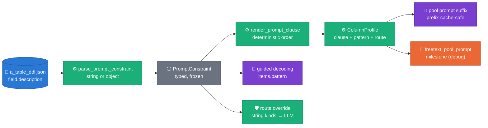
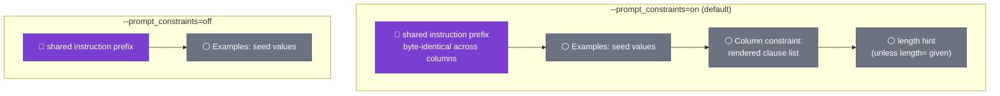
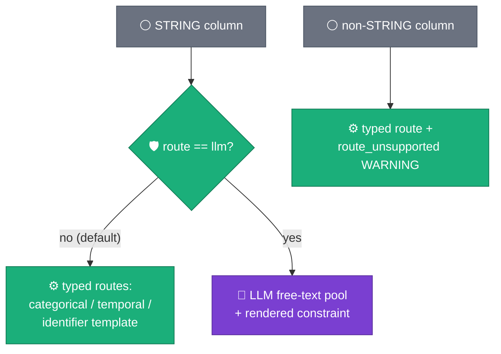
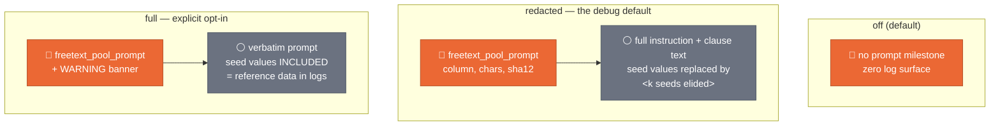

# Wave-2 prompt constraints — structured templates, prompt debug, route override

**Status: IMPLEMENTED + ACCEPTED — R-series acceptance measured (2026-08-20 R1 pair; constraint plumbing verified live-first per ADR 0027)**
Companions: extends [ADR 0021](../adr/0021-relational-contract-in-descriptions.md)
(the `llm_prompt_constraint` description marker) and
[ADR 0022](../adr/0022-stats-driven-generation.md) (stats-driven targets);
decision record: [ADR 0024](../adr/0024-structured-prompt-constraint-templates.md);
user-facing configuration guide (Terraform ⇄ `_ddl.json` worked examples):
[`docs/DDL_CONTRACT_GUIDE.md`](../DDL_CONTRACT_GUIDE.md).
Evidence: the two 2026-08-09 WS8 R1 cold baselines
(`2026-08-09_00_19_04-7880358512029555343` = A_TABLE,
`2026-08-09_00_31_21-17185878817912958022` = B_TABLE), reports in
`runs/` (local, gitignored).

---

## 1. Evidence — what the two R1 runs actually showed

Both runs were pipeline-healthy (PASSED, 0 DLQ, 1M/1M rows, zero CRITICAL
memorization flags). The open quality gap is **free-text shape fidelity and
diversity**, and it decomposes into three distinct mechanisms — only one of
which is a prompting problem.


*Claim: the three 0 %-shape-recall columns fail through three different
mechanisms — template mask collapse (COL_001), unguarded LLM whitespace
normalization (COL_038), and a format the pool never learned (COL_037) — while
seven B_TABLE columns sit at the ~512 pool-cap diversity ceiling.*

### 1a. COL_001 (A_TABLE) — the LLM is not even involved

Source: 24-char upper-hex identifiers, a rigid mask *family* (top masks all
share the `A9A9AA9AA9…` stem; dominant values share a literal `C2E` prefix),
52,549 distinct over 210,882 rows. Synthetic: 1,000,000 distinct values whose
masks are uniform digit/letter scrambles — **0 % of source masks reproduced**,
even though length (24) and charset (hex) are perfect.

Mechanism (traced, not hypothesized): the column takes the identifier route
(`profile.identifier_shape` detected). `B1RagEngine._identifier_draw`
(`engine.py:535`) only draws from the observed mask mix when the top-8 masks
cover ≥ 50 % of distinct values (`_MASK_MIX_MIN_COVERAGE`); COL_001's top-8
masks cover ~20 %, so it falls through to the **collapsed per-position
template**, which merges every variant position into a digit+upper class and
draws each position independently — scrambling the mask arrangement.

**No prompt change can fix this column: its route never calls the LLM.** The
fix is sampler-side (§4a).


*Claim: drawing a whole observed mask and filling its class positions from the
column's observed per-class alphabets reproduces the source mask marginal by
construction; drawing positions independently from the collapsed template
almost never does.* (Concept figure, seeded; implements
`text_shapes.py::sample_from_mask`.)

### 1b. COL_038 (B_TABLE) — the LLM normalized whitespace and nothing stopped it

Source: 82.6 % empty; the non-empty mass is two masks
(`AAAAA9␣␣␣AA9…A` at 89.6 %, `AAAAA9␣␣␣AAAA9…` at 10.4 %) — note the
**three-space literal run**. Synthetic: 513 distinct values (= pool cap + head),
every one a **single-space** variant (`AAAAA9␣AA9…A`) — recall 0, precision 0.

Mechanism: the pool ladder *reached its 512 target*, so neither the shape
top-up nor the shape fallback ever ran. The candidate format gate
(`_pool_llm_yield._in_format`) was inactive because `build_relaxed_shapes`
returns `None` for any column containing whitespace — so the LLM's
whitespace-collapsed candidates were all accepted. Downstream, per-row
expansion (`freetext_expansion=identifiers`) skipped the column because
`shape_mix_is_identifier_like` treats *any* whitespace as prose — pinning
distinct at the pool cap (the ceiling in the evidence figure).

Fixes: a **collapsed-mask candidate gate** (§4c) so wrong-whitespace candidates
are rejected and the ladder falls back to the shape-mix template (which
preserves the literal `␣␣␣` run), plus **literal-space alignment** in
`shape_mix_is_identifier_like` (§4b) so padded code columns expand per-row like
other identifier-shaped columns. A `prompt_constraints` template (§3) is the
*offense* for the same column — telling the model about the exact format
up front instead of only rejecting its mistakes after decoding.

### 1c. COL_037 (B_TABLE) — a format the pool never learned, and a blind crosscheck

Source: 91.4 % empty, 73,231 distinct non-empty values. Synthetic invented a
plausible-looking but wrong format. Two independent defects:

- **Engine**: with only ~8.6 % of reference-sample rows non-empty, the seed
  exemplars under-represent the format; the LLM guessed. The §4c gate rejects
  wrong-mask candidates (the observed sample still carries the true masks), and
  a user-supplied `format`/`pattern` constraint (§3) closes the loop.
- **Tooling**: `freetext_crosscheck.py` computed shape mass over *all* sampled
  rows, so a 91 %-empty column reported **no source shapes at all**
  (`top_shapes: []`, `missing_shapes: []`) — shape recall 0 with no evidence of
  what was missed. Fixed: shape mass is now computed over non-empty values
  (§4e).

### 1d. What the prompt actually contains today (both engines)

```
You generate synthetic tabular data. First identify the exact format of these
example values for the column '<col>' (…), then generate <n> NEW, distinct,
fictitious values in exactly that format. Never copy an example verbatim.
Examples: [<seed values>]. Return JSON {"values": [...]}.
[ Column constraint: <free prose from llm_prompt_constraint>. ]
[ Most values are <p05>-<p95> characters long (median <p50>). ]
```

The only per-column steering is free prose (ADR 0021) plus a measured length
band. There is no structured way to say "exactly three spaces", "prefix `C2E`",
"one of these 4 codes", or "DD.MM.YYYY" — and no way to *see* the prompt a run
actually used (reference values must never reach logs, so today nothing is
logged at all).

**Answer to the run-1 reflection question:** 0 % shape recall does *not*
uniformly indicate missing prompt context. COL_001 never touches the LLM
(prompting is irrelevant); COL_037/COL_038 are genuine prompt-context gaps —
but even a perfect prompt needs the decoding-side gate, because LLMs normalize
whitespace regardless of instructions. Both directions (prompt engineering AND
the underlying freetext process) are worth progressing, and they compose.

---

## 2. Architecture — one constraint object, four consumers



- **One parse site** (`contracts/prompt_constraint.py`), reused by both
  engines' profilers — B.1 `profile.py` and B.2 `fidelity.py` — so the two
  engines can never disagree about what a description means.
- **Backward compatible**: `{"llm_prompt_constraint": "free prose"}` still
  works (it becomes `notes`). Existing descriptions keep their exact rendered
  clause; the pre-C5 empty-constraint prompt stays byte-identical
  (regression-pinned).
- **Forward compatible**: unknown keys are ignored with a
  `prompt_constraint_unknown_keys` WARNING milestone — a newer DDL never
  breaks an older engine, and an older DDL never breaks a newer one.
- **Prefix-cache-safe**: the rendered clause is a per-column constant appended
  after the shared instruction prefix, preserving
  [vLLM automatic prefix caching](https://docs.vllm.ai/en/latest/features/automatic_prefix_caching.html)
  (ADR 0018).

## 3. The template catalog — what users put in `field.description`

The constraint value may be a **string** (unchanged, free prose) or an
**object**. All keys optional; order never matters; unknown keys warn and are
skipped. Grammar-constrained decoding is the reliability backstop for `pattern`
— prompting alone does not guarantee format adherence
([Willard & Louf 2023, *Efficient Guided Generation for LLMs*](https://arxiv.org/abs/2307.09702);
[vLLM structured outputs](https://docs.vllm.ai/en/latest/features/structured_outputs.html)).

| Key | Type | Rendered effect | Also feeds |
|---|---|---|---|
| `format` | str | `format=<prose>` clause | — |
| `pattern` | str (anchored regex ≤ 200 ch) | `pattern=<regex>` clause | guided decoding (`items.pattern`), replacing the derived charset/length regex |
| `examples` | list[str] ≤ 8 | `fictitious examples=[…]` clause | echo/novelty rejection set |
| `values` | list[str] ≤ 64 | `allowed values=[…]` clause | — |
| `prefix` / `suffix` | str | `prefix=…` / `suffix=…` clauses | — |
| `charset` | str | `charset=…` clause | — |
| `length` | int or [min, max] | `length=…` clause | suppresses the derived length hint (no duplicate tokens) |
| `units` | str | `units=…` clause | — |
| `locale` | str | `locale=…` clause | — |
| `route` | `"auto"` \| `"llm"` | — | profiler routing (§3b) |
| `notes` | str | appended prose (the legacy string form lands here) | — |

Worked examples for the archetypes the two tables actually exhibit (values
fictitious — never paste real rows into a description):

```jsonc
// 1. Fixed-width upper-hex identifier with a dominant literal prefix (COL_001-class)
{"llm_prompt_constraint": {
  "format": "24-character uppercase hexadecimal identifier",
  "pattern": "^[0-9A-F]{24}$",
  "prefix": "C2E",
  "length": 24}}

// 2. Space-padded composite reference — interior runs are literal (COL_038-class)
{"llm_prompt_constraint": {
  "format": "fixed-width reference: 5 letters, 1 digit, exactly three spaces, then a 2-letter code and 20 digits and a final letter",
  "pattern": "^[A-Z]{5}[0-9] {3}[A-Z]{2}[0-9]{20}[A-Z]$"}}

// 3. Segmented code, positional semantics (archetype: CCC SS KK V SKUX)
{"llm_prompt_constraint": {
  "format": "3-digit category + 2-digit size + 2-digit colour + 1-digit variant + 4-char SKU suffix",
  "pattern": "^[0-9]{8}[A-Z0-9]{4}$",
  "examples": ["00900000DEMO"]}}

// 4. Date rendered as text, DD.MM.YYYY
{"llm_prompt_constraint": {
  "format": "calendar date as DD.MM.YYYY",
  "pattern": "^[0-3][0-9]\\.[0-1][0-9]\\.[1-2][0-9]{3}$",
  "examples": ["28.08.2019"]}}

// 5. Closed enumeration with business meanings
{"llm_prompt_constraint": {
  "values": ["W", "S"],
  "notes": "W=web order, S=in-store order"}}

// 6. Amount in minor units (integer cents)
{"llm_prompt_constraint": {
  "format": "monetary amount in euro cents, no separators",
  "units": "EUR cents", "charset": "0-9"}}

// 7. Prose narrative, language-pinned
{"llm_prompt_constraint": {
  "format": "short gift message phrase, uppercase",
  "locale": "es-ES",
  "examples": ["FELIZ CUMPLEAÑOS ANA"]}}
```

### 3a. Rendered prompt anatomy (per mode of `--prompt_constraints`)



### 3b. `route` — the non-freetext fallback

A STRING column that profiles as constant, categorical, temporal-shaped, or
identifier-shaped normally never reaches the LLM. `"route": "llm"` overrides
that classification and sends the column down the LLM free-text route *with*
its rendered constraint — the escape hatch for columns whose typed route
reproduces the marginal but loses semantics the user can name.



Non-STRING BQ types (INT64, FLOAT64, DATE, …) keep their typed route and log
`prompt_constraint_route_unsupported` — LLM-generating numerics would regress
the documented B.1 marginal ceiling that R5/B.2 inverse-CDF owns (ADR 0022).
Forward-compatible: a later wave can add type coercion without changing the
contract.

### 3c. `--prompt_debug` — seeing what the model was asked (one panel per mode)

Reference values must never reach logs (standing rule since the 2026-07-16
counts-only milestones), which is why prompts were previously unloggable. The
flag makes the trade explicit:



`redacted` shows everything a prompt engineer iterates on (instruction wording,
rendered constraint, length hint) while eliding the only privacy-bearing part
(seed exemplars). The `sha12` prompt hash lets two runs be compared for prompt
drift without logging text at all (`off` still logs nothing). Milestones appear
in Dataflow worker logs like every other `sdfb.*` milestone.

---

## 4. Run-spotted fixes shipped with this wave

| Fix | Mechanism | Code |
|---|---|---|
| (a) Mask-mix identifier sampling | Below top-8 coverage, draw a whole observed mask (weight-proportional, capped table) and fill class positions from the column's observed per-class alphabets; collapsed template stays the last resort. Shared by both engines. | `text_shapes.py::build_mask_table/sample_from_mask/identifier_value_factory`, `b1_rag/engine.py::_identifier_draw`, `b2_library/freetext.py` |
| (b) Literal-space expansion | `shape_mix_is_identifier_like` now allows *literal* whitespace positions (class-with-whitespace still disqualifies) — space-padded code columns expand per-row instead of pinning at the pool cap. | `text_shapes.py:274` |
| (c) Collapsed-mask candidate gate | For shape-rigid whitespace columns (relaxed gate inactive, `shape_mix_can_template` true), a pool candidate must reproduce an observed *collapsed* mask (digit/letter runs collapse, whitespace runs stay literal) — whitespace-normalized LLM output is rejected and the ladder falls back to the shape-mix template. | `text_shapes.py::collapsed_mask`, `b1_rag/engine.py::_pool_llm_yield`, `b2_library/freetext.py::_generate_pool` |
| (d) `freetext.copy_fraction` epsilon | `max: 0.0 → 1.0e-4` (few-in-a-million coincidental collisions at 1M rows are noise, not memorization) and the probe reports the unrounded value. | `config/thresholds.yml`, `scripts/e2e/e2e_gcp_probe.py` |
| (e) Crosscheck empty-blindness | `RAND() < p LIMIT lim` short-circuits on storage order, so a 91 %-empty column sampled ALL-empty and reported no source shapes at all; a targeted non-empty top-up sample now kicks in below a 50-value floor. | `scripts/e2e/freetext_crosscheck.py::_sample_sql/_needs_nonempty_topup` |
| (f) Categorical empty-parity | **Root cause of the COL_033 Δ0.28 / COL_035 Δ0.24 empty-parity failures, found during this wave**: the categorical similarity blend flattened the empty/whitespace category toward uniform along with everything else (at similarity 0.5, a 95 %-empty category emits at ~72 %). Sparsity categories now keep their exact empirical mass in both engines; the blend applies only within the substantive remainder — matching how FREE_TEXT columns already pin sparsity (`_sparsity_or`). | `b1_rag/_fidelity.py::_categorical_masses`, `b2_library/backends.py::_sample_categorical` |

Deliberately *not* actioned: B.1 numeric decile-KS drift (R5/B.2 owns it, ADR
0022) and `PoolTrigger` 44.5 %/61.6 % stage dominance (measured watch-list;
recorded in the retired `RUN_PLAYBOOK_WS8.md` §5c — git history — and
partially addressed by ADR 0026's expandable-column ladder skip).

## 5. Acceptance criteria (falsifiable, next R1-class runs)

1. **COL_001-class**: crosscheck shape recall ≥ 0.5 with `distinct_ratio`
   within ±0.1 of source (mask-mix draw; was 0.00 / 1.0).
2. **COL_038-class**: shape recall ≥ 0.9, interior space runs preserved,
   distinct ≥ 10× pool cap (expansion unpinned; was 0.00 / 513).
3. **COL_037-class**: crosscheck reports non-empty source shapes
   (`top_shapes` non-empty on a 91 %-empty column) and either recall > 0 or a
   `prompt_constraint` is flagged as the documented next lever.
4. **No new memorization**: `memorization_flags` stays empty/INFO-only on both
   tables; `freetext.copy_fraction` failures = 0 at the 1e-4 epsilon.
5. **Empty parity**: `freetext.empty_parity` failures = 0 on B_TABLE
   (was COL_033 Δ0.28, COL_035 Δ0.24) — the categorical sparsity pin (§4f).
6. **Debuggability**: `--prompt_debug=redacted` emits one
   `freetext_pool_prompt` milestone per built column, with `sha12` stable
   across identical configs and NO seed values in the text.
7. **Compatibility**: a run with only legacy string constraints renders
   byte-identical prompts to pre-wave-2 (pinned by unit test, criterion holds
   by construction in CI).

## 6. Open follow-ups

- **`values` key → categorical short-circuit**: rendering-only in this wave;
  a later wave may map a closed `values` list straight onto the categorical
  route (no LLM call at all).
- **Numeric `route: llm` coercion**: contract reserved, unimplemented.

## 7. Figure provenance

```bash
uv run --no-sync python3 scripts/doc/make_prompt_constraints_figures.py
```

| Figure | File | Content |
|---|---|---|
| Evidence | `assets/prompt-constraints-evidence.png` | Measured shape recall/precision + distinct-vs-pool-cap for the failing columns of both 2026-08-09 runs (`MEASURED` block from the two `freetext_crosscheck_metrics.json`) |
| Mask collapse | `assets/prompt-constraints-mask-collapse.png` | Concept (seeded): mask recall of collapsed-template draws vs mask-mix draws on a synthetic mask family (`CONCEPT` block) |

Palette: repo dataviz palette; the script prints separation on every run.
Citations retrieved 2026-08-10: vLLM automatic prefix caching + structured
outputs docs, arXiv 2307.09702.
