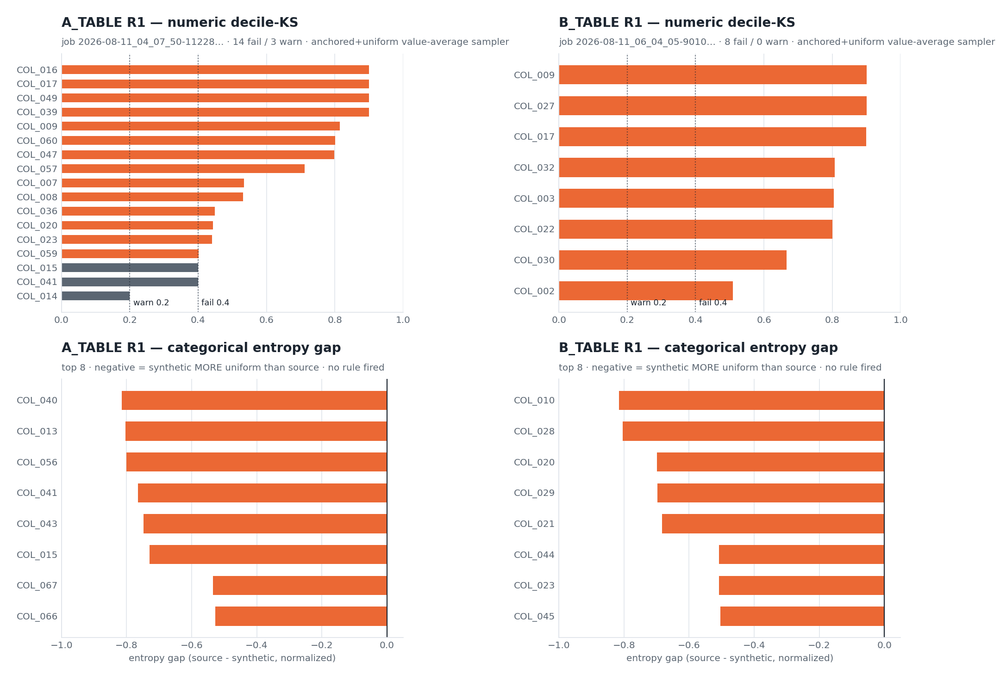
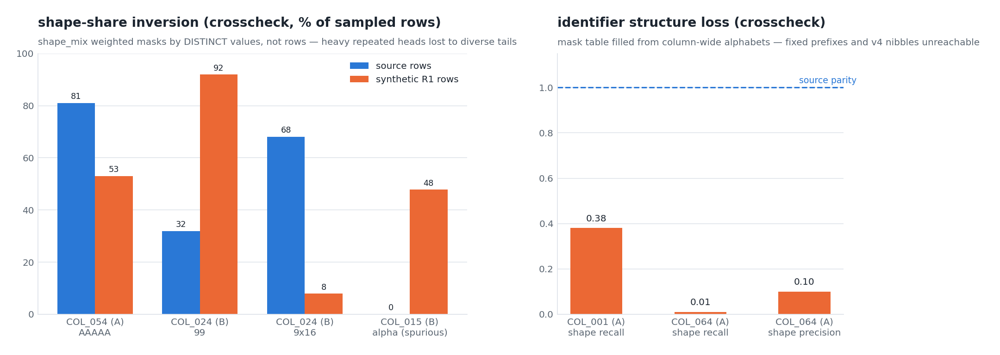
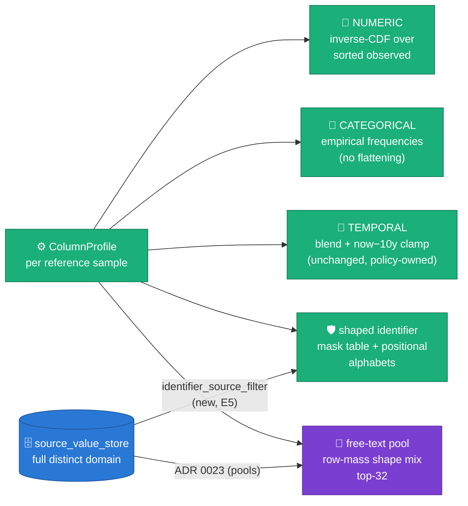
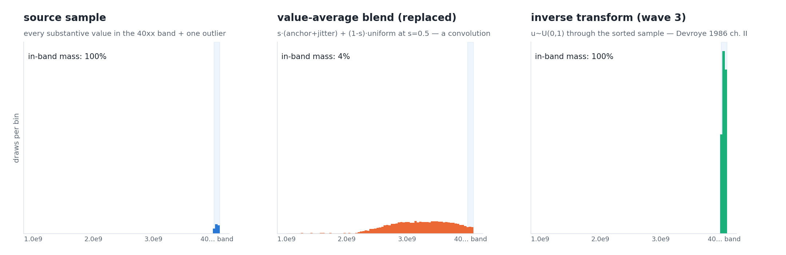
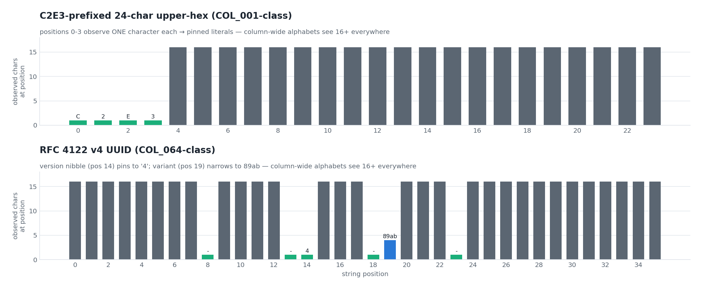
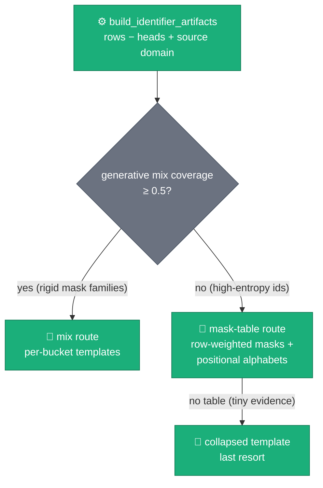

# Marginal fidelity by construction — wave 3 (2026-08-11 R1-pair remediation)

**Status:** ACCEPTED — decision record in
[ADR 0025](../adr/0025-marginal-fidelity-by-construction.md). Builds on
[ADR 0022](../adr/0022-stats-driven-generation.md) (inverse-CDF was decided
for B.2; this wave brings the primitive to B.1 at sample resolution),
[ADR 0023](../adr/0023-source-domain-pool-rejection.md) (the
`source_value_store` seam now also feeds identifier columns), and the wave-2
mask work ([ADR 0024](../adr/0024-structured-prompt-constraint-templates.md)
era, `text_shapes.py`). Figures regenerate via
`scripts/doc/make_marginal_fidelity_figures.py`.

## 1. Evidence — two R1 cold baselines, every column read

Jobs `2026-08-11_04_07_50-11228…` (A_TABLE, 67 columns, 1M rows) and
`2026-08-11_06_04_05-9010…` (B_TABLE, 45 columns, 1M rows), both on the
`d70bc56d` ws8 build, both at the pipeline-default `similarity=0.5`. Reading
every column across stats-diff, crosscheck, probe metrics and worker logs
reduced **all** failing columns to five engine defect classes (E1–E5) and
three tooling gaps (T1–T3).

*Every failing marginal traced to the same two samplers: 22 numeric columns
at decile-KS 0.20–0.90 (top panels; the `numeric.decile_ks` gates are the
dotted lines) and the categorical enums flattened toward uniform with
entropy gaps to −0.82 (bottom panels) — and no catalog rule scored either.*

*Left — E4: `shape_mix` weighted masks by distinct values, so COL_024's
`99`-mask (32% of source rows, a handful of distinct codes) landed at 92% of
synthetic rows while its 16-digit family (68% of rows, 49k distinct) fell to
8%, and COL_015 emitted 48% of its mass in an alpha shape the source never
contains. Right — E3/E5: the identifier mask table, filled from column-wide
alphabets over the reference sample only, lost COL_001's fixed prefix (recall
0.38) and COL_064's UUID version/variant nibbles (precision 0.10).*

## 2. The five engine defects and their fixes

| # | Defect (measured) | Fix (code site) |
|---|---|---|
| E1 | Numeric `s·(anchored+jitter) + (1−s)·uniform` **value-average** — a convolution that reproduces neither shape and lets one in-range outlier hand uniform mass to the whole span (fig 1 top; fig 3) | inverse transform sampling through the full sorted observed sample — `b1_rag/_fidelity.py::_numeric_numpy/_numeric_python`; `similarity` no longer shapes numerics |
| E2 | Categorical similarity blend flattened every skewed enum at the 0.5 default (fig 1 bottom) | empirical frequency table at any similarity — `_fidelity.py::_categorical_masses`; sparsity pinning (wave 2) unchanged |
| E3 | Mask-table fills drew from **column-wide** class alphabets — positional literals (`C2E3` prefix, v4 nibbles) unreachable (fig 2 right, fig 4) | `text_shapes.py::positional_alphabets` narrows every class fill to the position's observed charset; singletons pin as literals |
| E4 | `build_shape_mix`/`build_mask_table` weighted by **distinct values**, inverting row-mass marginals; head values double-counted (fig 2 left) | mix input = rows minus heads (`b1_rag/profile.py`), mask table weights = row occurrences, `top_k` 8→32; all-literal buckets no longer count toward the mix-coverage pivot (`build_identifier_artifacts`) |
| E5 | Identifier evidence = reference sample only → mask recall capped at 0.38 and novelty only sample-guaranteed | identifier columns pull their full source domain through the ADR 0023 store in `setup()` (`identifier_source_filter` milestone); artifacts cached per column (`engine.py::_identifier_draw`) |

### E1 mechanism — why the blend broke COL_009's 40-band

*Concept (seeded, `SEED=11`): a banded domain — every substantive value
opens with `40` — plus one low outlier. The value-average blend fills the
empty gap with mass the source does not have (4% stays in-band, so almost
every synthetic value breaks the prefix); inverse transform sampling
([Devroye 1986, ch. II](http://luc.devroye.org/rnbookindex.html), the same
primitive as B.2's 11-point decile vector from ADR 0022, here at full
sample resolution) keeps 100% of the band and gives the outlier only its
observed share. Implemented in
`_fidelity.py::ColumnSampler._numeric_numpy`.*

### E3 mechanism — positional evidence pins structural literals

*Concept (seeded): the observed charset per position. Where it is a
singleton (aqua) the position is a literal by the same evidence rule
`detect_identifier_shape` uses; narrow classes (blue, the v4 variant
nibble) constrain the fill. No `uuid_v4` special case needed — the evidence
carries it. Implemented in `text_shapes.py::positional_alphabets` +
`sample_from_mask(..., positional=)`.*

## 3. Draw-route decision per identifier column (one panel per mode)

- **mix route** — unchanged wave-2 behavior, except coverage now counts only
  *generative* buckets (≥1 class position): an all-literal singleton bucket
  can only regenerate its observed value verbatim, so it is memorization
  pressure, not coverage.
- **mask-table route** — row-weighted masks, filled per position; retries ×3
  against the observed set (now the full domain when E5's store is attached).
- **collapsed template** — last resort, unchanged.

## 4. Tooling gaps closed alongside (T1–T3)

| # | Gap | Fix |
|---|---|---|
| T1 | 5 false `freetext.copy_fraction` BLOCKERs on day-granularity temporal columns (A_TABLE R1) while `memorization_flags` had already demoted them to INFO | rule honors `temporal_day_granularity` — row stays visible, tagged `exempt`, passing (`e2e_gcp_probe.py::evaluate_freetext_rules`, `config/thresholds.yml`) |
| T2 | crosscheck `copy_fraction` 0.27 vs probe `copy_ratio_substantive` 0.000 on the same column (B_TABLE COL_015) | enum-reuse carve-out: values with source-sample count ≥ 10 leave numerator and denominator; raw kept as `copy_fraction_raw` (`freetext_crosscheck.py::_copy_fractions`) |
| T3 | numeric decile-KS had **no rule anywhere** — only the stats-diff markdown caught 22 failing columns | `numeric.decile_ks` post-run rule (warn 0.2 / fail 0.4) in `config/thresholds.yml`, mirrored by `source_synthetic_stats_diff.py` |

Plus: `build_full_report.py --annexes list` (honest small recaps),
`generation_plan.columns_detail.expandable` (the draw path is now logged, not
reverse-engineered), and both agent prompts
(`end_to_end_validation_report_generation`, `llm_prompt_constraint_recommender`)
re-grounded on the new contract.

## 5. Acceptance criteria (next A/B R2+ runs)

Falsifiable, keyed to existing milestones and reports:

1. `stats_diff`: decile-KS ≤ 0.2 on **every** B.1 numeric column
   (`numeric.decile_ks` rule green); COL_009-class values keep their leading
   band.
2. `stats_diff`: categorical `entropy_gap` within ±0.1 and `top1_delta`
   within ±0.05 on categorical-routed columns.
3. crosscheck: COL_001/COL_005-class values carry their fixed prefix;
   COL_064 emits valid v4 (version nibble `4`, variant `89ab`); shape recall
   on identifier columns rises with `identifier_source_filter` active
   (milestone present in worker logs with the column's full distinct size).
4. crosscheck: shape-share deltas ≈ 0 on COL_054/COL_024/COL_015-class
   columns; COL_015-class `freetext_pool_built` shows `format_rejected > 0`
   (gate re-armed by the row-mass mix).
5. probe: `freetext.copy_fraction` rows on day-granularity temporal columns
   tagged `exempt`, passing; crosscheck and probe copy metrics agree.
6. No numeric/identifier/categorical `llm_prompt_constraint` recommendations
   from the recommender — those classes are sampler-owned now.

## 6. Figure provenance

Regenerate: `uv run --no-sync python3 scripts/doc/make_marginal_fidelity_figures.py`
(prints the OKLab palette separation check on every run; BLUE `#2a78d6` =
source truth, ORANGE `#eb6834` = defective R1 sampler, AQUA `#1baf7a` =
wave-3 sampler — same system as the ADR 0022 asset set).

| Figure | File | Content |
|---|---|---|
| R1 marginal evidence | `assets/marginal-wave3-evidence.png` | EVIDENCE — decile-KS per numeric column + categorical entropy gaps, both tables (`MEASURED` block) |
| Structure loss | `assets/marginal-wave3-structure-loss.png` | EVIDENCE — shape-share inversions + identifier recall/precision (`MEASURED` block) |
| Inverse-CDF vs convolution | `assets/marginal-wave3-invcdf-band.png` | CONCEPT — banded domain, seeded (`SEED=11`) |
| Positional alphabets | `assets/marginal-wave3-positional.png` | CONCEPT — per-position charset sizes, seeded |

Related shared assets (do not redraw): `assets/stats-inverse-cdf.png`
(ADR 0022 — the 11-point decile variant of the same mechanism).
