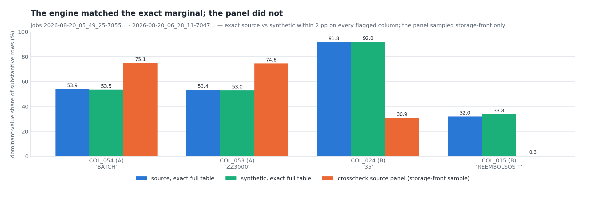
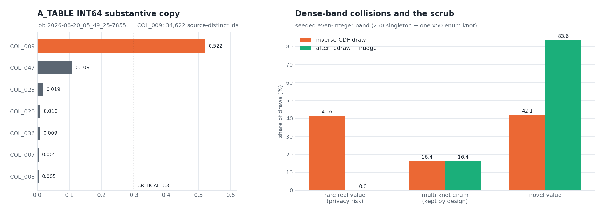
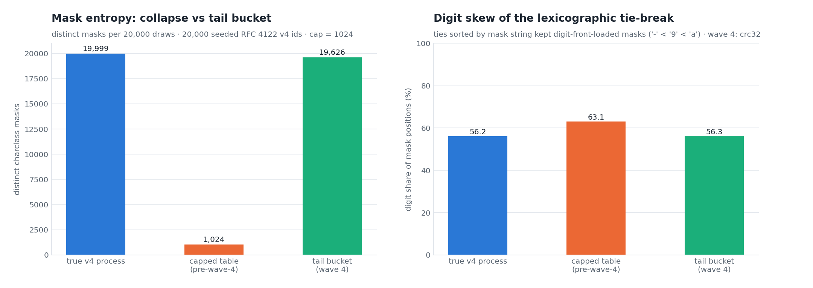
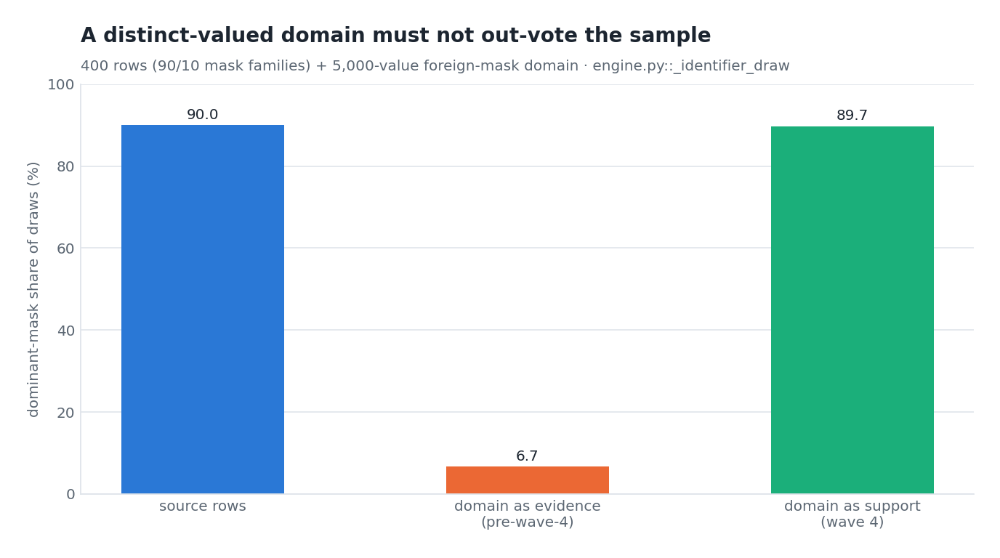
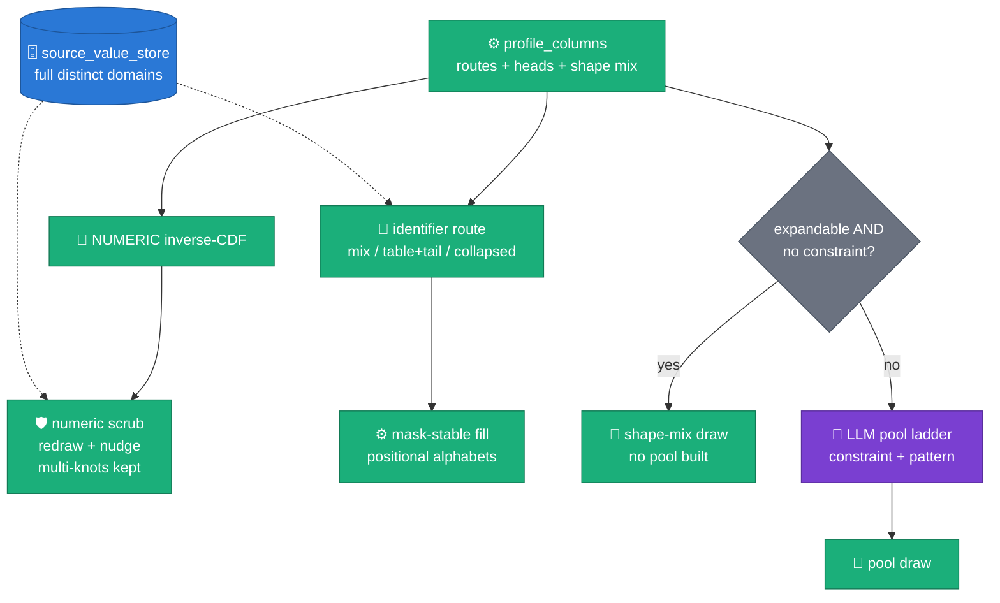
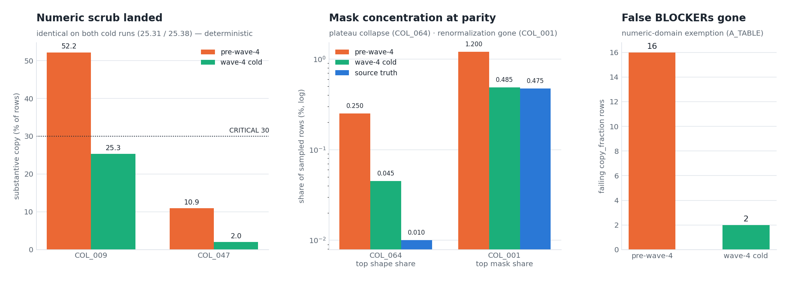
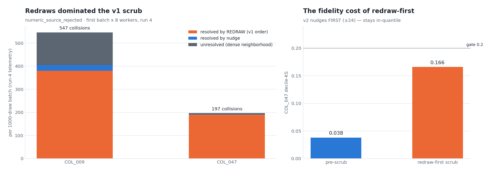

# Wave 4 — trust the measurement first, then fix the sampler

**Status:** ACCEPTED (2026-08-20) · **VERIFIED (2026-08-21, §6)** · **ADR:** [0026](../adr/0026-measurement-first-mask-integrity.md) · [0027](../adr/0027-verified-wave4-operational-integrity.md)
· **Depends on:** [ADR 0023](../adr/0023-source-domain-pool-rejection.md) (source-domain seam),
[ADR 0025](../adr/0025-marginal-fidelity-by-construction.md) (wave-3 samplers — partially re-read here)
· **Figures:** `scripts/doc/make_wave4_figures.py` (2 evidence + 2 concept)

The 2026-08-20 R1 cold pair (`2026-08-20_05_49_25-7855…` A_TABLE,
`2026-08-20_06_28_11-7047…` B_TABLE, 1M rows each) verified ADR 0025's
numeric and categorical fixes end-to-end (A: 67/67, B: 45/45 columns
`decile_ks` ok; B raised zero `memorization_flags`). Reading the remaining
"failures" column-by-column split them into two very different piles:
**measurement artifacts** (the majority) and **four real defects** — one
CRITICAL. This doc carries the evidence for both; the decision record is
ADR 0026.

## 1. Evidence — most of the "shape-mass" findings measured the tool, not the engine



*Claim: on every column the crosscheck flagged as mass-flattened or
inverted, the exact full-table dominant-value share (`APPROX_TOP_COUNT`,
same bundle) matches synthetic within 2 pp — the flagged shares came from
the crosscheck's own source sample.*

`freetext_crosscheck.py` sampled with `WHERE RAND() < @p LIMIT @lim` and
`p` oversampled 3×, so the `LIMIT` was reached about a third of the way
through the table scan: a **storage-order prefix**, not a sample. The
synthetic table (freshly written in bundle order) is homogeneous, so its
panel was fine — every skewed *source* column produced a one-sided
artifact. COL_024's panel was internally inconsistent by 3.7× (its shape
histogram implies a non-empty mean length of 11.7 vs the same bundle's
exact `AVG(LENGTH)` of 3.15). Wave 3's row-mass fixes were, in fact,
working: the 2026-08-11 inversion triple (COL_054 / COL_024 / COL_015) was
partially this same artifact.

Consequences drawn (ADR 0026 §D1): the crosscheck now samples with
`ORDER BY FARM_FINGERPRINT(TO_JSON_STRING(t)) LIMIT n` — deterministic and
storage-order-free, the same pattern `source_synthetic_stats_diff.py` and
`e2e_fetch_samples.py` already used — and its diff carries a
`shape_mass_tv` total-variation term plus a long-tail `missing_shapes`
fallback, so mass shifts are measurable exactly when the sample becomes
trustworthy.

The COL_015 corollary: `'REEMBOLSOS T'` at 31.9% of source non-empty rows
is a **genuine COL_015 value** (the source system truncates the same
narrative into this 12-char legacy field). The synthetic re-emits it at
33.8% via `head_values` — by design. The 2026-08-20 report's backlog #3
("cross-column pool contamination") is **retracted**.

## 2. The four real defects

### 2a. CRITICAL — dense-band INT64 collisions (A_TABLE COL_009, substantive copy 0.52)



*Claim (left, evidence): only COL_009 crosses the memorization CRITICAL
threshold — 34,622 source-distinct numeric identifiers, over half of 1M rows
colliding with a RARE real value. Claim (right, concept): dense-band
inverse-CDF interpolation lands ~42% of draws on rare real integers;
redraw + nudge clears them to 0 while the multi-knot enum knot keeps its
exact share.*

The inverse-CDF (`_fidelity.py::_numeric_numpy`) interpolates between
observed order statistics and rounds; wherever the integer band is dense,
the rounded interpolant IS another real value. Repeated-knot draws
(sample frequency ≥ 2) are k-anonymous enum mass and stay exact — the
numeric twin of FREE_TEXT `head_values`. Fix: identity-like integral
columns (sample distinct > 100, mirroring the probe's memorization floor)
fetch their full domain through the ADR 0023 store
(`numeric_source_filter` milestone) and scrub collisions at draw time
(`engine.py::_scrub_numeric_collisions`: ≤2 redraw rounds, then a ±8
nudge walk; residual logged via `numeric_source_rejected`).

### 2b. Mask-entropy collapse through the 1024 cap (COL_064, COL_001)



*Claim: confining draws to the capped mask table collapses ~unique UUID
masks onto ≤1024 survivors — picked digit-first by the lexicographic
tie-break — while the Good–Turing tail bucket restores ~unique masks at
the true digit share.*

COL_064 (UUID v4): every mask ~unique → all counts tie at 1 → the old
`(-count, mask)` sort kept the 1024 most digit-front-loaded masks
(`'-' < '9' < 'a'`), drawn uniformly — the run's flat ~0.2%-per-shape
plateau. COL_001 (24-hex, 52k distinct): the cap dropped a long tail of
real mass and renormalized survivors by 1/recall — source top mask 0.5% →
synthetic 1.2% at recall 0.456, exactly `0.5/0.456`. Fix
(`text_shapes.py::build_identifier_artifacts`): count ties break on crc32,
and the dropped + singleton row mass moves to a **tail bucket** sampled
per position from observed character frequencies — the singleton count is
the [Good–Turing estimate](https://doi.org/10.1093/biomet/40.3-4.237) of
unseen-mask mass (Good, *Biometrika* 1953). Positional evidence keeps
[RFC 4122](https://www.rfc-editor.org/rfc/rfc4122) v4 nibbles and literal
prefixes by construction.

### 2c. The source domain out-voted the sample (wave-3 regression, D1)



*Claim: appended to the row evidence, a 5,000-value distinct domain
inverts a 90/10 mask marginal to 6.7%; kept as support-only it stays at
89.7%.*

ADR 0025 E5 concatenated the full source domain onto the row multiset
before `build_mask_table` counted it — re-creating, for identifier
columns with a domain attached, the very distinct-weighting ADR 0025 E4
had just fixed (and skewing the mix→table coverage pivot's denominator).
Fix: `engine.py::_identifier_draw` passes the domain separately; weights
and the coverage denominator come from rows, the domain feeds novelty
rejection, alphabets/positional evidence and the tail's support.

### 2d. Novelty retries migrated mass between masks (D2) — and a class-kind leak (COL_038)

Two smaller mechanisms, both reproduced in unit tests rather than figures:

- **Mask-stable retries.** On a collision the old retry redrew the WHOLE
  draw — new mask included — so rejection probability tracked each mask
  family's keyspace saturation and mass migrated from saturated
  (enum-like) families to sparse ones (B_TABLE COL_026: dominant mask
  0.890 → 0.838, one rare variant inflated 42×). The retry now re-picks
  only the FILL inside the chosen mask/bucket
  (`text_shapes.py::identifier_sampler_from`, `pick_relaxed_shape`); a
  keyspace so saturated that 8 fills all collide accepts the collision —
  its values are k-anonymous by pigeonhole
  ([Sweeney 2002](https://doi.org/10.1142/S0218488502001648)).
- **Kind preservation.** `_CHAR_CLASSES` orders hex before plain letters,
  so a letter-only position whose observed chars fell inside `A–F` bound
  to `digits+ABCDEF` and emitted digits 62.5% of the time — B_TABLE
  COL_038's `'CQZWD1   DN…' → 'CQZWD1   6C…'` family split measured
  0.611/0.389, exactly 10/16 vs 6/16. `_class_for` now refuses any class
  that introduces a character kind (digit/upper/lower) the position never
  showed.

## 3. Draw-path architecture after wave 4



Two routing changes ride the same wave:

- **Dead ladders skipped.** Columns whose draws come from shape-mix
  expansion never read their pool; the ladder was dead cost — PoolTrigger
  held 41% (A) / 53% (B) of cold wall time. `_skip_expandable_pools` uses
  the SAME predicate as the draw path (`_draws_from_expansion`), so a
  skipped column is guaranteed to expand; the skip is visible per column
  (`freetext_pool_skipped_expandable`).
- **Constraints beat expansion.** A column carrying an
  `llm_prompt_constraint` never expands: the constraint's enforcement
  vehicle is the pool prompt and its guided `pattern`, which expansion was
  silently bypassing (a `format`/`charset` clause on an expandable column
  was decorative). This makes the R1-c constraint edits actually reach
  COL_015-class tails.

## 4. Tooling changes (one per finding class)

| Finding | Change | Where |
|---|---|---|
| Storage-front sample | deterministic `FARM_FINGERPRINT` ordering, both sides + top-up | `freetext_crosscheck.py::_sample_sql` |
| Mass shifts invisible at recall = precision = 1.0 | `shape_mass_tv` (total variation, [Gibbs & Su 2002](https://doi.org/10.1111/j.1751-5823.2002.tb00178.x)) in diff + findings + score | `freetext_crosscheck.py::_diff_column` |
| `missing_shapes: []` at recall 0.68 | sub-floor tail counted (`missing_shapes_below_floor`) + top-5 fallback | `freetext_crosscheck.py::_missing_shape_lists` |
| 15 false `copy_fraction` BLOCKERs on INT64 | `exempt_numeric_domains` (visible, tagged `numeric_domain`; CRITICAL channel stays `memorization_flags`) | `e2e_gcp_probe.py` + `config/thresholds.yml` |
| Stall ladder unattributable to a column | `pool_ladder` per-column milestone timestamps | `e2e_gcp_probe.py::_worker_log_milestones` |

## 5. Acceptance criteria (next R-series runs)

1. `numeric_source_filter size=…` fires for COL_009/COL_047-class columns;
   post-run `copy_ratio_substantive` on COL_009 drops well below the 0.3
   CRITICAL threshold; `memorization_flags` stays empty.
2. Crosscheck on COL_064: synthetic top-shape plateau gone (no shape at
   ≥0.1% mass); COL_001 top-mask share ≈ source share (no 1/recall
   inflation).
3. `freetext_pool_skipped_expandable` fires for expandable columns;
   PoolTrigger share of cold wall time drops materially on B_TABLE-class
   tables; skipped columns keep `distinct ≫ pool cap`.
4. Crosscheck reports carry `shape_mass_tv` ≈ 0 on COL_024/COL_054-class
   columns (the artifact class), and non-empty `missing_shapes` whenever
   recall < 0.9.
5. `freetext.copy_fraction` rows on INT64 columns read
   `exempt: numeric_domain` and pass; STRING rows keep the old behavior.

## 6. R-cycle verification (2026-08-21 four-run cycle)

The next cold pair (`2026-08-20_14_13_44-17334…` A_TABLE,
`2026-08-20_14_39_00-1599…` B_TABLE, wave-4 build) measured every §5
acceptance criterion; a second same-build cold pair on 2026-08-21
reproduced the numbers. Decision record for the follow-ups: [ADR
0027](../adr/0027-verified-wave4-operational-integrity.md).



*Claim: every acceptance criterion moved as designed — COL_009
substantive copy 0.522 → 0.253 (identical on both cold runs:
deterministic, not variance, despite the run report's first read),
COL_064's shape plateau collapsed 0.25% → 0.045% per shape, COL_001's
top-mask share landed at source parity (0.485 vs 0.475; was 1.2%), and
the false `copy_fraction` BLOCKERs fell 16 → 2.*



*Claim: the v1 scrub resolved collisions mostly by REDRAW — which
redistributes rejected mass across the whole marginal — and a
sparse-neighborhood column paid decile-KS 0.038 → 0.166 for a privacy
gain its k-anonymity floor mostly didn't need; the v2 scrub nudges first
(±24, in-quantile) and takes its keep-set from SOURCE frequencies
(`fetch_frequent`, HAVING COUNT ≥ 10), closing the pseudo-multi-knot gap
that held COL_009 at 0.25 instead of its ~0.14 telemetry residual.*

Two more verification facts the cycle surfaced:

- **The B_TABLE cold run never ignited vLLM**: all 13 tracked free-text
  columns resolved `expandable` (`freetext_pool_skipped_expandable` ×13)
  — by design (E5), but ~28 GPU-minutes billed idle; the engine now says
  so (`llm_route_unused` WARNING) and COL_048-class binary columns skip
  their dead 8.6-min ladder too (`freetext_pool_binary_fallback`).
- **`shape_mass_tv` saturates on near-unique-mask columns** (COL_064
  measured 0.956 — two ~unique-mask sets are disjoint even for a perfect
  generator). The metric that carries the claim is now `shape_head_tv`
  (TV over named head shapes, long tail grouped), reported in the
  crosscheck's executive summary.

Regenerate: `uv run --no-sync python3
scripts/doc/make_wave4_verification_figures.py`.

## 7. Figure provenance

```bash
uv run --no-sync python3 scripts/doc/make_wave4_figures.py
```

| Figure | File | Content |
|---|---|---|
| panel vs truth | `assets/wave4-panel-vs-truth.png` | EVIDENCE — exact vs panel dominant-value shares, 4 columns |
| mask entropy | `assets/wave4-mask-entropy.png` | CONCEPT — cap collapse vs tail bucket on 20k seeded v4 ids |
| domain weights | `assets/wave4-domain-weights.png` | CONCEPT — D1 inversion vs support-only domain |
| numeric scrub | `assets/wave4-numeric-scrub.png` | EVIDENCE + CONCEPT — INT64 substantive copy; dense-band scrub |

Measured numbers are typed once, in the script's `MEASURED` block, sourced
from the two immutable bundles under `runs/`. Concept panels
are seeded and run through the live repo code (`build_identifier_artifacts`,
`identifier_sampler_from`, `np.interp` — the same inverse transform
`_fidelity.py` uses); re-running reproduces them pixel-identically.
Citations retrieved 2026-08-20.
