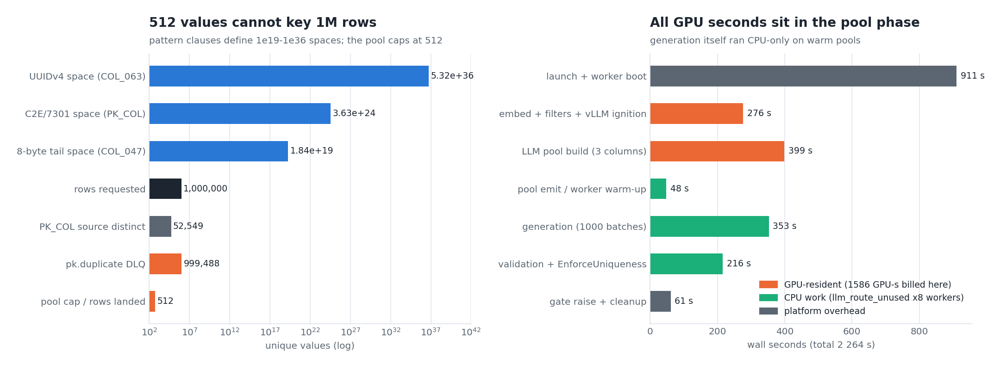
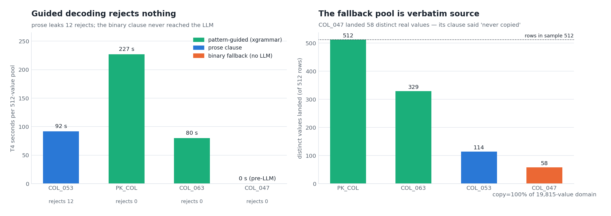
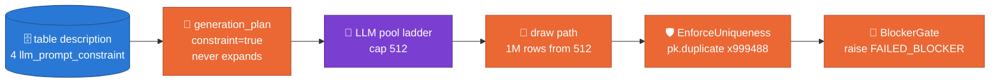
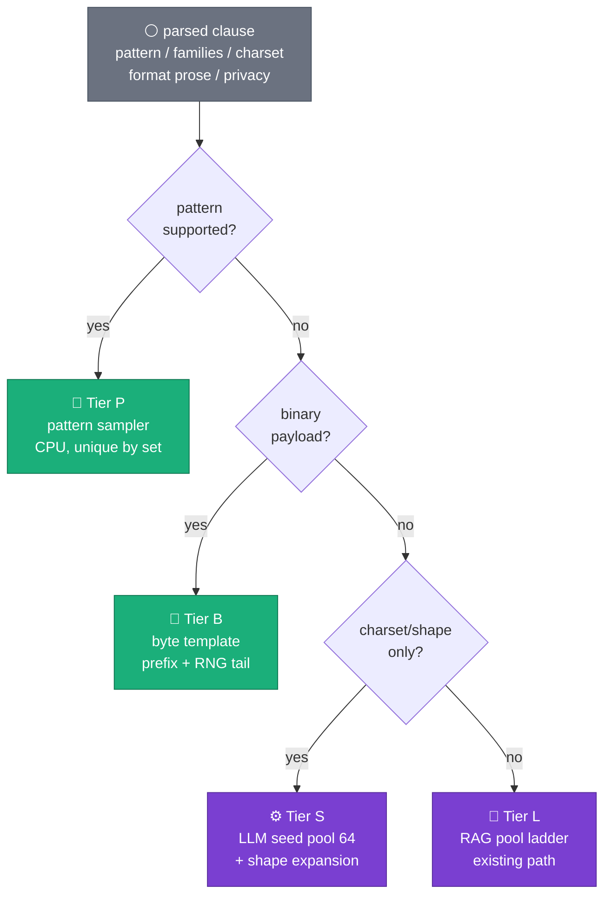
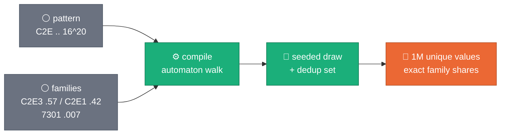
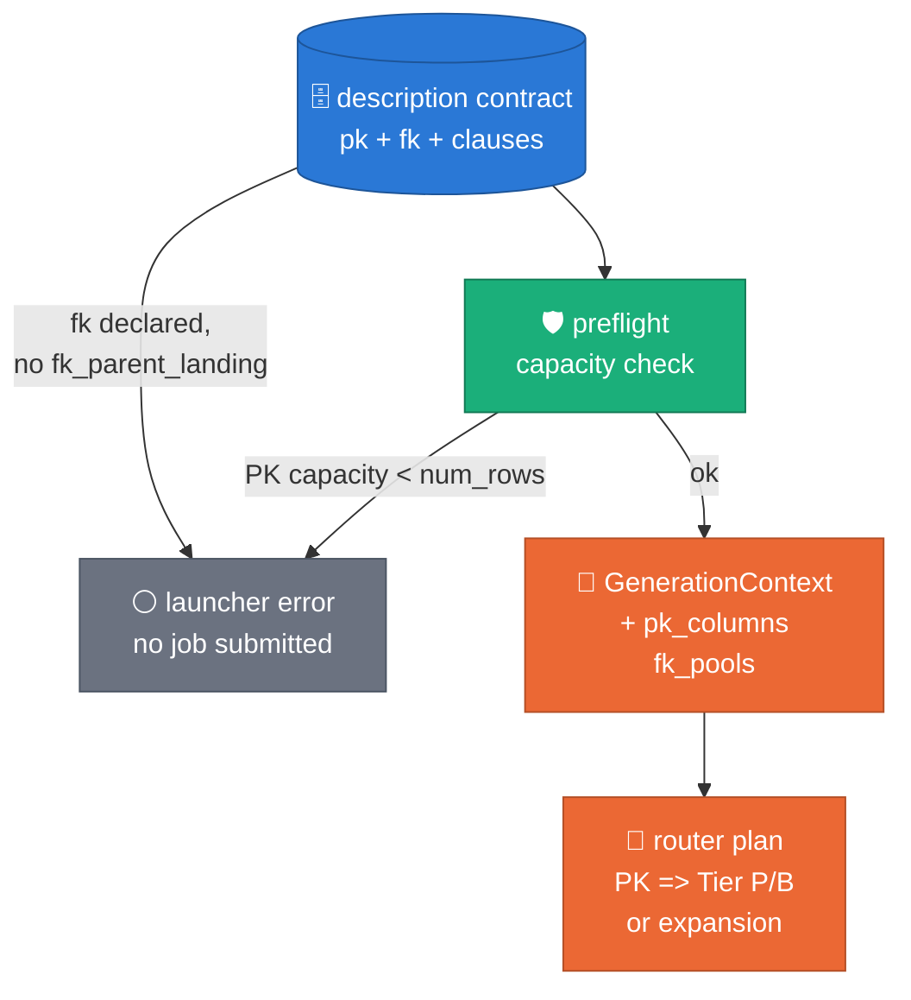
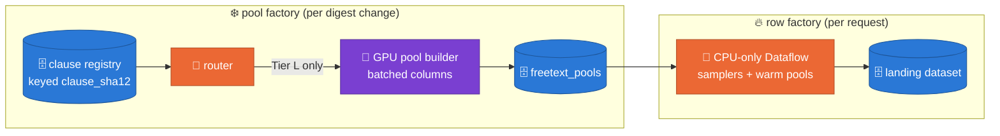

# Constraint router — program-first sampling for `llm_prompt_constraint` at fleet scale

**Status:** ACCEPTED (2026-08-22) — Tier P/B + P4/P6 preflight + pretty
relational logging implemented (TDD, laptop; Tier S deferred, B.2
draw-path routing follow-up) · decision record: [ADR 0028](../adr/0028-constraint-router-relational-plan.md)
**Depends on:** [ADR 0021](../adr/0021-relational-contract-in-descriptions.md) (FK pools) · [ADR 0024](../adr/0024-structured-prompt-constraint-templates.md) (clause templates) · [ADR 0018](../adr/0018-parallel-batched-freetext-pools.md) (prefix caching)
**Amends:** [ADR 0026](../adr/0026-measurement-first-mask-integrity.md) (constraint-wins-over-expandable) · [ADR 0027](../adr/0027-verified-wave4-operational-integrity.md) (binary fast-path)
**Figures:** `scripts/doc/make_constraint_router_figures.py` (2 evidence)

The first PK+FK run (`2026-08-21_14_54_30-1966084111444777604`, 1M rows,
B_TABLE) failed by construction: the declared PK is a constrained
free-text column, constrained columns never expand (ADR 0026), and pools
cap at 512 — so 999 488 rows were `pk.duplicate` before a single quality
rule ran. The same run shows the deeper pattern this design fixes:
**every one of its four constraint clauses describes a mechanical
format, and none of them needed an LLM.** This doc turns that evidence
into a router that sends each clause to the cheapest sufficient
generator, wires the relational contract into the generation plan, and
sets the clause-authoring/vLLM/RAG practices that hold at thousands of
tables.

---

## 1. Evidence — what the 2026-08-21 run measured



*The declared PK (`PK_COL`) draws from a constrained pool capped at
`_FREE_TEXT_POOL_MAX = 512` (`engine.py:116`) while its own pattern
clause defines a 3.6e24-value space; 999 488 of 1 000 000 rows DLQ'd as
`pk.duplicate` and the job died at the BlockerGate
(`pipeline.py:525`). Right panel: all 1 586 GPU-seconds sit in the
pool phase; the 5.9-min generation phase ran on warm pools with
`llm_route_unused` on all 8 workers.*



*Left: the two pattern-carrying clauses (PK_COL, COL_063) were
grammar-compiled (xgrammar) and rejected nothing; the prose-only clause
(COL_053) leaked 12 format rejects past prompting; the binary clause
(COL_047) never reached the LLM — `is_binary_class` short-circuits
pre-LLM (`engine.py:1046`). Right: COL_047's fallback pool landed 58
distinct **verbatim source values** (`copy_ratio_substantive = 1.0`)
although its clause says "never copied from a seed value
(privacy-sensitive)" — the fallback violates the clause it implements.*

Two findings that are *not* defects, for the record:

- **COL_053's "BATCH" majority (274/512 landed) is head-value
  re-emission** (ADR 0023/0025): the source's dominant literal carries
  ~54% share and the draw path reproduces it. Marginal fidelity working
  as designed — not LLM example-anchoring.
- **"COL_048" naming**: the binary column is COL_047 in this bundle's
  DDL ordering; the wave-4 bundle indexed the same physical column
  (COL_047) as COL_048 — the engine comment at `engine.py:1044`
  still calls it "COL_048-class". Clause↔column identity at fleet scale
  must key on `clause_sha12` (already logged by
  `prompt_constraints_found`), never on positional column ids.

And one silent failure: the table contract declares an FK on
`(COL_005, COL_006, COL_008)`, but `--fk_parent_landing` was not passed,
so `run_pipeline.py:682` skipped `load_fk_pools` **without any log
line** — zero `fk_pool_loaded` / `relational_contract_loaded`
milestones, zero `fk.orphan` evaluations, FK columns generated from
marginals. Referential integrity was unverified, not passed.

## 2. Architecture — what happened vs what the router does

What this run did (simplified to the four constrained columns):



The router decides the generator **launcher-side, from clause fields
alone** — before any worker, GPU, or graph exists:



Applied to this run: PK_COL and COL_063 are Tier P, COL_047 is Tier B,
COL_053 is Tier S. **Zero Tier-L columns — the whole 6.6-min GPU pool
phase and the 15-min T4 worker fleet were avoidable**, which is exactly
the `llm_route_unused` cost note generalized: the router predicts the
GPU verdict at launch time.

## 3. The router tiers — one panel per mode

### Tier P — pattern sampler (CPU, uniqueness by construction)



A clause with a machine-checkable `pattern` (alternation, literals,
character classes, bounded quantifiers — the subset ADR 0024 clauses
already use) compiles to a random automaton walk (prior art:
[exrex](https://github.com/asciimoo/exrex); in-repo:
[Hypothesis `from_regex`](https://hypothesis.readthedocs.io/en/latest/data.html#hypothesis.strategies.from_regex),
already a test dependency). Weighted alternation honors the structured
`families` shares — the C2E3/C2E1/7301 split the prose currently carries
as unparseable percentages. A dedup set gives uniqueness at any
`num_rows` (the C2E space is 3.6e24; collisions are negligible, the set
is a guarantee). LLM involvement: none — the value space *is* the
specification. The 2026-08-21 run's own output shows what the LLM adds
here: its "random" UUIDs are patterned, low-entropy hex
(`f6a7b8c9-3d4e-4f5a-…`, landed duplicates ×5), strictly worse than
`random.getrandbits`-driven sampling against
[RFC 9562](https://www.rfc-editor.org/rfc/rfc9562) §5.4.

### Tier B — byte template (fixes the COL_047 privacy violation)

The binary fast-path (ADR 0027) stays pre-LLM but stops drawing from
the source domain: emit `literal prefix + length-pinned RNG tail`
(non-printable bytes included — an RNG has no charset bias to fight,
unlike a tokenizer). The clause's `privacy` note becomes an enforced
flag: a Tier-B column **never** falls back to source values; if the
template cannot be derived, the run fails preflight instead of
memorizing. Replaces milestone `freetext_pool_binary_fallback` with
`freetext_pool_byte_template`; `copy_ratio_substantive` drops from 1.0
to ~0 (shared prefix only).

### Tier S — seed pool + expansion (prose charset clauses)

COL_053-class clauses (shape rotation, no pattern) keep a *small* LLM
seed pool (64, not 512 — style, not cardinality) and layer the existing
shape-mix expander (ADR 0025) on top for tail draws. Head-value
re-emission continues to carry dominant literals. This is the current
`expandable` machinery with the ADR 0026 "constraint kills expansion"
rule *narrowed*: the constraint still owns format (via seed style +
shape mix from the constraint's declared shapes), but no longer forfeits
cardinality.

### Tier L — RAG pool ladder (unchanged, now the exception)

Semantic free text keeps the full existing path: per-column chunks
(`CHUNK_KIND_FREE_TEXT_COL`), centroid/k-center exemplar retrieval,
escalating sampling ladder, guided JSON arrays. What changes is
*demand*: only Tier-L columns need embeddings, chunks, and GPU time.

## 4. Relational contract → generation plan (BLOCKER-1 and -2)



- **PK reaches the plan.** Today `GenerationContext` carries `fk_pools`
  but no PK (`base.py`); the engine is PK-blind and the gate discovers
  the conflict 37 minutes and 1 586 GPU-s too late. The preflight
  (ADR 0021 seam, `run_pipeline.py::_load_reference_and_preflight`)
  gains a capacity check: *for every PK column, the routed generator's
  unique capacity must cover `num_rows`* — Tier P/B are unbounded;
  a capped pool fails **at the launcher**, before submission.
- **FK declared ⇒ resolved or refused.** `contract.fk` non-empty with
  no `--fk_parent_landing` becomes a preflight error (explicit
  `--fk_parent_landing=skip` downgrades to a `fk_declared_skipped`
  WARNING milestone). A declared contract can be inactive only loudly.

## 5. Fleet scale — thousands of tables



The run already proves the split: generation ran CPU-only on warm pools
(right panel, fig 1). Generalized:

- **Route at the registry, not per run.** Clauses are content-addressed
  (`clause_sha12`); route decisions, compiled samplers, and pools are
  cached per `(clause_sha12, reference_digest)`. A thousand tables with
  recurring key formats (UUID, hex keys, code enums) collapse onto a
  few dozen distinct clauses.
- **GPU jobs carry only Tier-L work, batched.** This run built 3 pools
  *sequentially* on one engine (12 → 7 running requests, 100–180
  tok/s); a pool-factory job submits all pending Tier-L ladders
  concurrently so the vLLM queue stays full.
- **Row-factory jobs are CPU-only by verdict, not by luck.** The router
  computes `llm_route_unused` at launch; the launcher picks the machine
  profile accordingly (RUN_PLAYBOOK cost note becomes automatic).

### Prompt engineering for the remaining Tier-L/S calls

Grounded in this run's telemetry:

1. **Static-prefix-first prompt layout.** vLLM
   [automatic prefix caching](https://docs.vllm.ai/en/latest/features/automatic_prefix_caching.html)
   (ADR 0018) reuses KV for shared *prefixes* only. The pool prompt
   interpolates the column name in its first sentence
   (`engine.py::_build_pool_prompt`), so the measured 73→89% hit rate
   is intra-column only. Reorder: invariant instructions first, then
   `column / constraint / seeds` — the preamble KV is then shared
   across *every column of every table*.
2. **Grammar over prose, always.** Measured: `pattern=true` clauses
   rejected 0 candidates; the prose clause leaked 12. vLLM
   [structured outputs](https://docs.vllm.ai/en/latest/features/structured_outputs.html)
   with xgrammar ([Dong et al. 2024, arXiv:2411.15100](https://arxiv.org/abs/2411.15100))
   is the enforcement vehicle; prose steers style only.
3. **Pin sampling explicitly per request.** The served model's
   `generation_config.json` silently overrode defaults
   (`temperature=0.7, top_k=20, top_p=0.8` — APIServer warning in the
   worker log). The escalation ladder must set its own params on every
   request; never inherit model-card defaults.
4. **Clause authoring standard** (DDL_CONTRACT_GUIDE follow-up):
   `pattern` > structured `families` (shares as numbers, not prose
   percentages) > `charset` > `format` prose; pin `length` when fixed;
   `privacy: never_copy_source` as an enforced flag; no literal legal
   values as prose examples.

### RAG at scale (embedding · chunking · retrieval)

The router is the RAG optimization: chunking, embedding, and retrieval
stay per-column and digest-keyed (WS2 machinery), but only Tier-L
columns pay for them. In this table that is 0 of 4 constrained columns;
across a fleet dominated by keys/codes/UUIDs the embedding corpus
shrinks by the same fraction. For the Tier-L remainder, the existing
`kcenter_rotate` seed rotation (ADR 0018) remains the diversity lever;
nothing new is needed until a genuinely semantic corpus (names,
descriptions, addresses) enters scope — revisit then, with its own
evidence.

## 6. Acceptance criteria (falsifiable, R1-c re-run)

| # | Criterion | Milestone / probe |
|---|---|---|
| 1 | PK routed Tier P; `pk.duplicate = 0`; `status=PASSED` | `validation_runs`, DLQ by rule |
| 2 | Launcher refuses PK-on-capped-pool before submission | preflight unit test + launcher log |
| 3 | FK active: pools loaded, orphan probe = 0 rows | `fk_pool_loaded`, orphan SQL (§6b) |
| 4 | FK declared + not activated ⇒ preflight error | preflight unit test |
| 5 | COL_047-class: `freetext_pool_byte_template` emitted; `copy_ratio_substantive ≈ 0` | worker log + gcp_metrics annex |
| 6 | Pattern columns bill zero GPU; `llm_route_unused` decided at launch | job machine profile + milestones |
| 7 | Family shares land within sampling error (C2E3 ≈ .57, C2E1 ≈ .42, 7301 ≈ .007) | stats_diff on re-run |

## 7. Figure provenance

```bash
uv run --no-sync python3 scripts/doc/make_constraint_router_figures.py
```

| Figure | File | Content |
|---|---|---|
| fig 1 | `assets/constraint-router-pk-blocker.png` | pool-cap geometry (log) + wall-time/GPU anatomy |
| fig 2 | `assets/constraint-router-outcomes.png` | per-clause build seconds & rejects + landed distincts |

All numbers live in the script's `MEASURED` block, sourced from
`runs/2026-08-21_14_54_30-1966084111444777604/`
(`_full_report.md` annexes + `worker_logs.jsonl`). Palette
BLUE/ORANGE/AQUA per the asset set; OKLab separation printed on every
regeneration. External links retrieved 2026-08-22.
