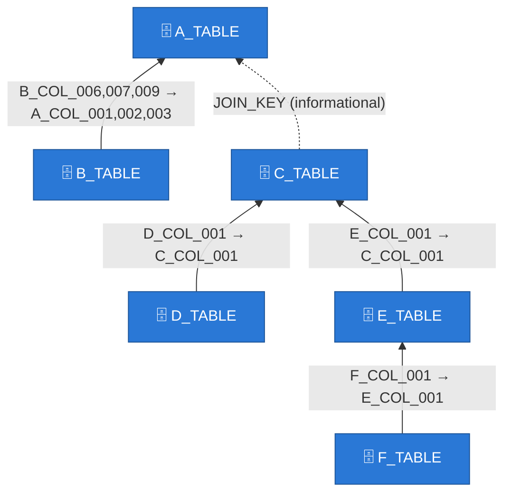
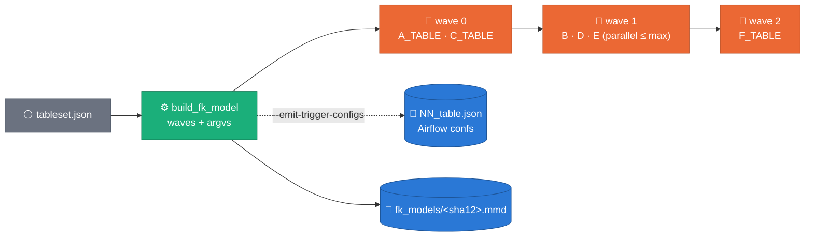

# FK-model generation scenarios — flag semantics, visual relational logging, history mappings

**Status:** ACCEPTED (2026-08-22, rev B: minimal-input scenarios, derived FK activation; **Stage 2 implemented same day** — single-job multi-table pipeline, [ADR 0030](../adr/0030-single-job-relational-generation.md)) · decision record: [ADR 0029](../adr/0029-fk-model-scenarios-and-history-mappings.md)
**Superseded in part by:** [`2026-08-23-referential-integrity-joint-fk-draws.md`](2026-08-23-referential-integrity-joint-fk-draws.md) / [ADR 0031](../adr/0031-joint-fk-key-draws.md) — FK columns now draw whole parent key TUPLES (composite edges were per-column here), and `fk_enforcement_summary` reports at launch what an informational edge costs.
**Superseded in part by:** [`2026-08-24-relationships-as-config.md`](2026-08-24-relationships-as-config.md) / [ADR 0032](../adr/0032-relationships-as-config.md) — the scenarios are unchanged, but the model comes from `config/relationships/*.yaml` (not table descriptions), `--fk_contracts_json` is gone, and `informational: true` is now `enforced: false`.
**Depends on:** [ADR 0021](../adr/0021-relational-contract-in-descriptions.md) (parent-first FK) · [ADR 0028](../adr/0028-constraint-router-relational-plan.md) (P6, relational logs)
**Reference model:** `docs/assets/fk_relationship_example.{png,tf}` — the 6-table production-shaped model (A→F, composite PK/FK, one out-of-DDL `JOIN_KEY`). **Not published** (gitignored via `docs/assets/fk*`); the §2 mermaid below carries the same shape for readers without the files.

Scope note: multi-table generation is M2 territory (CLAUDE.md constraint 5);
this design opens it deliberately, on the owner's direction, staying on the
ADR 0021 parent-first mechanism for Stage 1.

---

## 1. The scenarios — two inputs, everything else derived (rev B)

Users give `--landing_table` (one FQN or a comma-separated list) +
`--generate_fk_relationships` (default `true`). `fk_parent_landing` is
NOT an input — parents land in the landing table's own dataset, so it
derives; the flag stays only as an expert override for cross-dataset
parents. Every launch logs one `launch_scenario` milestone stating the
resolved plan (scenario, table order, mode).

| # | Input | Behavior |
|---|---|---|
| 1 | one table, `false` | that table only; declared enforced edges ignored **loudly** |
| 2 | one table, `true` (default) | no relationships ⇒ identical to 1, zero friction; relationships ⇒ the launcher expands to the table's whole connected component (informational edges count for grouping) and generates ALL of it, parents-first, sequentially, run_ids suffixed |
| 3 | many tables, `false` | each independently, given order — the dozens-of-unrelated-tables path |
| 3b | many tables, `true` | union of components, deduped, parents-first |

Activation is verified where it matters: an enforced edge whose parent
is unlanded/empty stops **at pool-load time** with the missing refs
named (`assert_fk_pools_nonempty`) — preflight no longer refuses
anything FK-related, and the `skip` sentinel is gone. Component
membership comes from a landing-dataset contract scan
(`--fk_contracts_json` injects it offline); scan failure degrades
loudly (`fk_discovery_unavailable`) to single-target planning.
`run_tableset.py` remains the POWER path: same planner semantics plus
within-wave parallelism (`--max-parallel`) and Airflow trigger-conf
emission.

## 2. The FK model is one definition — `sdfb_core/contracts/fk_model.py`

`build_fk_model(tables, contracts)` resolves nodes, edges, external
parents, and parents-first levels (enforced edges only; cycles raise).
`run_tableset`, the launcher log, and the worker log all render from it —
inline copies drift (2026-07-28 R1 lesson). Ref resolution prefers the
`dataset.table` match and falls back to a unique table-name match,
because contracts name refs by the **landing** dataset while sets list
**source** FQNs (`io/fk_pools.parent_landing_fqn` already resolves by
table name).

**Informational edges** (`"informational": true` on an FK entry): the
6-table model's A↔C relationship rides `JOIN_KEY` — a column absent
from every DDL. Declaring it as a normal FK would fail preflight P2
(unknown column). Informational edges are drawn dashed in every diagram
and **excluded from all enforcement**: no P2 check, no P6 requirement,
no FK pool, no orphan rule, no ordering constraint (C stays a root
alongside A — an unenforceable edge must not serialize independent
generations).

*Waves for this model: `[A, C] → [B, D, E] → [F]` — three sequential
levels, up to 3 jobs in parallel inside level 2.*

## 3. Seeing the relationship in Dataflow logs

GCP Logging is text, so the "pretty symbols diagram" is **pasteable
mermaid source**, one log entry, adjacent to the existing plan logs:

- **Launcher**: `fk_generation_mode` + `fk_model_pretty` (full resolved
  model, `model_sha12=` in the header for recycling) right after
  preflight — before any worker exists.
- **Worker**: `fk_model_pretty` next to `relational_e2e` /
  `generation_plan_pretty` (same once-per-plan guard), rendering the
  table-local star from `GenerationContext.fk_edges` (which now carries
  `ref_cols` + `informational`).

Copy the block from Cloud Logging into any mermaid renderer and you get
the `fk_relationship_example.png` shape for the exact run you are
inspecting.

## 4. Orchestration Stage 1 — waves over today's proven single-table job

`run_tableset.py` gains `--generate-fk-relationships`, `--max-parallel`
(parallel **within** a wave; waves stay sequential — children never run
before parents landed; a failure aborts everything after the current
chunk), and `--emit-trigger-configs DIR` which writes the **ordered
Airflow trigger confs** instead of launching — the Composer path: the
Composer DAG (`composer/synthetic_beam_bigquery.py`) stays single-table
and simply gained the two params. The set's model lands as
`runs/fk_models/<model_sha12>.mmd` for report recycling.

## 5. Stage 2 (IMPLEMENTED — ADR 0030) — one Dataflow job for the whole model

The measured argument (evidence:
[`constraint-router-pk-blocker.png`](assets/constraint-router-pk-blocker.png)
right panel, MEASURED in `scripts/doc/make_constraint_router_figures.py`):
launch + worker boot was **911 s** against **353 s** of generation for 1M
rows. Sequential per-table jobs for the 6-table model pay that boot ~6×
(~91 min of overhead); wave-parallelism helps wall-clock but still boots
one fleet per table.

The shape, now implemented (`build_relational_pipeline` + `TableSpec` /
`FkEdgeSpec`, `--multi_table_mode=single_job` default; DirectRunner-
proven, Dataflow run evidence = the acceptance gate):

- One job, per-table stages; a child's FK columns take the parent's
  **generated key PCollection as a side input** — no landing round-trip,
  referential integrity by construction
  ([Beam side inputs](https://beam.apache.org/documentation/programming-guide/#side-inputs);
  100k parent keys ≈ a few MB, comfortably side-input-sized).
- One vLLM per worker serves every table's Tier-L pool builds — the
  queue stays full (the 2026-08-21 run idled at 7–12 requests), and
  ADR 0028 D6's static-preamble prompts share prefix cache across
  tables.
- Per-table tagged outputs keep DLQ / validation / BlockerGate isolation;
  a parent's gate failure cancels its children only.
- The ADR 0028 router shrinks the GPU need per table first — many tables
  will be CPU-only by verdict, which weakens the single-job argument for
  them and strengthens it for the GPU minority. Decide on measurements.

## 6. History mappings + diagram recycling (report layer)

`runs/history_mappings_replacement.json` — **local-only
decode key** (the whole `runs/` tree is gitignored; treat
it exactly like `real/`): first-arrival letter prefixes `A…Z, AA, AB, …`
(dozens of unrelated future tables), columns `<PREFIX>_COL_NNN` in DDL
order, aliases immutable once assigned, out-of-DDL fields (JOIN_KEY)
listed under `retained`. `scripts/e2e/history_mappings.py` owns
assignment (`seed-example` → A..F skeleton matching the reference model;
`adopt` binds an alias to its real FQN; `assign` maps a DDL). The bundle
exporter consumes it via `--history-mappings/--history-table-fqn`:
preset aliases win over the legacy `COL_NNN`/`PK_COL` role naming and
the per-job `mapping.json` is no longer written.

Diagram recycling: reports embed `runs/fk_models/<sha>.mmd`
verbatim when the logged `model_sha12` matches — zero tokens spent
redrawing an unchanged model (prompt §5.5).

## 7. Acceptance criteria

| # | Criterion | Probe |
|---|---|---|
| 1 | Every launch logs `fk_generation_mode` + (`fk_model_pretty` or `fk_model_absent`) | launcher log |
| 2 | Isolated run with declared edges: `fk_generation_disabled` + `fk_declared_skipped` present; no `fk_pool_loaded` | worker/launcher log |
| 3 | 6-table set plans waves `[A,C] → [B,D,E] → [F]`; informational edge never forces order | `run_tableset --dry-run` |
| 4 | A wave member's failure prevents all later waves | `run_waves` unit + set run |
| 5 | `--emit-trigger-configs` order = flattened waves; child confs carry `fk_parent_landing` | emitted files |
| 6 | Same model twice ⇒ same `<sha12>.mmd`, report embeds it verbatim | fk_models/ dir + report diff |
| 7 | Re-exporting a bundle with the registry keeps every alias from the previous bundle | oss/ diff across runs |
| 8 | Informational edge passes preflight; enforced edge still requires `fk_parent_landing` | preflight unit tests |

## 8. Figure provenance

No new PNGs: §2/§4 diagrams are inline mermaid (diffable, per the form
heuristic); the boot-vs-generation numbers live in
`scripts/doc/make_constraint_router_figures.py::PHASES` (their single
home) and render in `assets/constraint-router-pk-blocker.png`. The
reference model drawing is the user-provided
`docs/assets/fk_relationship_example.png` with its Terraform twin.
External link (vLLM/Beam docs) retrieved 2026-08-22.
