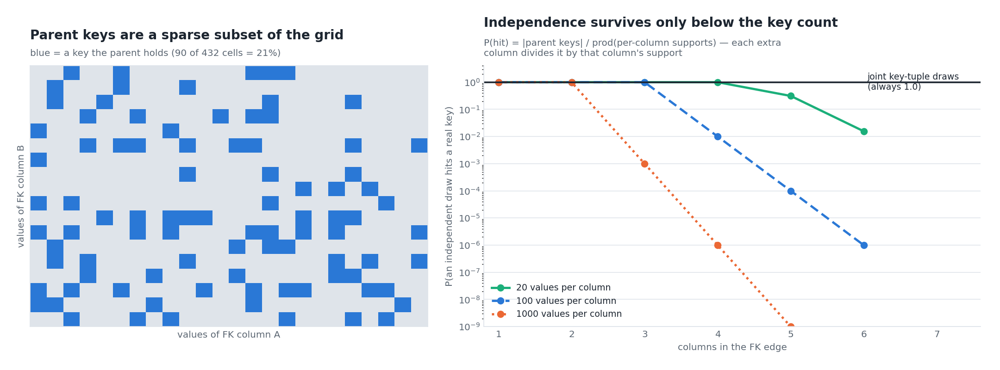
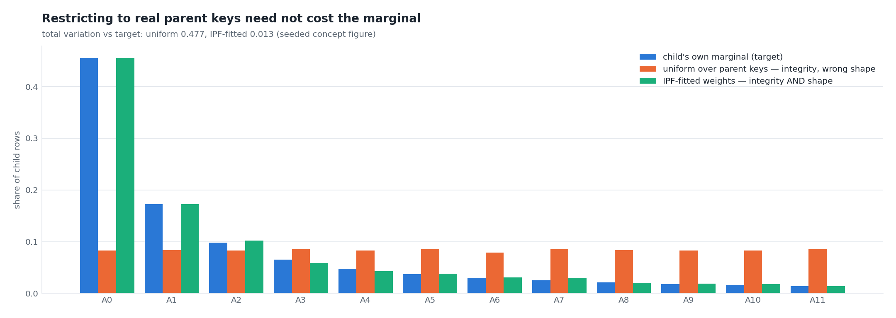

# Referential integrity by construction — joint FK key draws

**Status:** ACCEPTED (2026-08-23) — gate MET: the R6 FK-enforced Dataflow
pair landed (2026-08-25 1M · 2026-08-26 10M, 0 orphans on 10M child rows; ADR 0033)
**Decision:** [ADR 0031](../adr/0031-joint-fk-key-draws.md)
**Depends on:** [ADR 0030](../adr/0030-single-job-relational-generation.md)
(in-DAG parent-key handoff) · [ADR 0029](../adr/0029-fk-model-scenarios-and-history-mappings.md)
(scenarios, informational edges) · [ADR 0021](../adr/0021-relational-contract-in-descriptions.md)
(the contract) · [ADR 0025](../adr/0025-marginal-fidelity-by-construction.md)
(the marginal-fidelity bar this must not break)
**Evidence:** run `2026-08-23_05_12_06-966936752936039329` (first
two-table single-job run: `A_TABLE` parent + `B_TABLE` child)

---

## §1 What the run showed

The 2026-08-23 relational run was clean on every dimension it measured —
1M rows per table, 0 DLQ, PK 100% unique on both tables, every numeric
decile-KS inside the ADR 0025 gate, the `COL_047` memorization CRITICAL
resolved. It also landed **817,627 child rows referencing a parent that
does not exist**, and reported `status=PASSED`.

Two independent causes, both fixed here.

**Cause 1 — the edge was declared display-only.** The contract carried
`"informational": true`, which by ADR 0029 means "never enforced". The
closure still grouped both tables into one 49-minute job on the strength
of that edge, generated the parent, and enforced nothing. The launcher's
only signal was a WARNING emitted *after* the graph was built.

**Cause 2 — and enforcing it would have been worse.** The edge is
composite (3 columns). v1 loaded *per-column* pools and let each column
draw independently, so the child assembles a combination the parent may
never have held.


*The same declared edge under three regimes. Left: what ran (81.8%
orphans, marginal draws), what v1 enforcement would have produced
(≥97.3%, hatched — a derived bound, not a measurement), and what joint
draws produce (0, structurally). Right: the cardinalities behind it —
the child landed 166,928 distinct `COL_008` values against the parent's
22,345.*

The bound is arithmetic, not simulation: with per-column pools the child
lands a real key with probability at most
`|parent keys| / ∏_c d_c = 1,000,000 / 37,182,080 = 2.69%`.
**Enforcing a composite FK per-column is worse than not enforcing it at
all.**

## §2 Why independence cannot work

A parent's key set is a *sparse subset* of the product of its columns'
value ranges. Independence samples the product; integrity requires the
subset.



*Left (concept): every blue cell is a key the parent holds; the grey
ones are combinations that look plausible per column and exist nowhere.
Right (concept): P(hit) = |parent keys| / ∏ supports — each additional
FK column divides it by that column's support, so independence is only
safe while the product stays under the parent's key count. A
single-column edge is exact, which is why v1 was never wrong in the
cases it had been tested on.*

The fix is to make the **tuple the unit of the draw** — a child row
takes a whole key that the parent actually landed, indexed once.

## §3 Integrity without losing the marginal

Drawing uniformly over the parent's keys fixes integrity and breaks
something ADR 0025 spent a whole wave earning: the child's own column
distributions. A parent key held by 30% of the child's rows would become
`1/|keys|` of them.

Nor is the naive product of the child's per-column shares enough:
restricted to the parent's key set and renormalized, it *distorts* those
shares, because a value the parent holds in many key tuples collects
mass from all of them (worked 2-column case: a 70% child share lands at
84%).

So the weights are **fitted, not assumed** — iterative proportional
fitting ([Deming & Stephan 1940](https://doi.org/10.1214/aoms/1177731829))
rakes a weight vector over the parent's key tuples until every column's
induced marginal matches the child's observed marginal. It is the
I-projection of the child's distribution onto the parent's key set.



*Concept figure, seeded. Uniform-over-keys flattens a skewed child
marginal (total variation 0.477 from target); the IPF fit tracks it
(0.013) while every drawn tuple stays a real parent key.
Implemented in `sdfb_core/engines/fk_keys.py::_fit_weights`.*

Two more properties the draw preserves, both measured off the child's
own reference sample:

| Property | Rule | Why |
|---|---|---|
| Unseen parent values | Good–Turing floor ([Good 1953](https://doi.org/10.1093/biomet/40.3-4.237)) — singleton rate spread over parent values the child sample never showed | Zero-weighting them would make the synthetic child's domain strictly smaller than the parent's |
| NULL FK tuples | Preserved at the child's observed rate, all-or-nothing per tuple | A NULL FK means "no parent" (SQL MATCH SIMPLE), not a broken reference; forcing every row to reference a parent invents relationships and moves the null marginal |

## §4 Where it sits in the DAG


The side input keeps its ADR 0030 role as the ordering barrier; what
changed is its *payload* — a list of `{"cols", "keys"}` edge payloads
instead of per-column value lists — and what happens after it.

**Cost.** The fit is O(|keys| × columns) per sweep and runs once per
engine setup: 4.7 s on a 100k-key, 3-column pool. The draw is one
uniform variate plus a binary search per row: **1.1 s per 1M rows**,
measured on the same pool. Neither is visible next to a 400 s LLM pool
build.

## §5 The gate that was missing

No rule anywhere scored referential integrity, so a run with 81.8%
orphans reported `PASSED`. Two additions close it:

| Layer | Signal | When it fires |
|---|---|---|
| Launch | `fk_enforcement_summary` (WARNING) | Before any GPU spend: names each edge, and for an informational one whose columns exist on both sides, prints the exact contract edit that would enforce it |
| In-DAG | `fk.orphan` (BLOCKER, threshold 0) | Per row, against the same key set the child sampled from — orphans divert to the DLQ and count toward the blocker ratio |

`fk.orphan` can only fire on a generator regression, which is the point:
"0 orphans" becomes a measured per-run fact in `validation_runs` rather
than an argument about the code. It is the same three-lines-of-defense
posture the repo already applies to types, schema and uniqueness.

The launch-time summary is the one that would have saved this run's
49 GPU-minutes:

```text
FK ENFORCEMENT | 0 enforced · 1 informational
  B_TABLE (COL_005,COL_006,COL_008) ..> landing.A_TABLE (COL_005,COL_006,COL_008)   [informational]
      ENFORCEABLE: every column exists on both sides. Delete `"informational": true`
      from this FK entry in B_TABLE's table description to generate real referential
      integrity (the fk.orphan rule then gates the run).
  → referential integrity NOT verified this run: with 0 enforced edges there is no
    parent key set to draw from and the fk.orphan rule has nothing to check.
```

## §6 Scale

| Dimension | Behaviour | Limit |
|---|---|---|
| Child rows | O(log \|keys\|) per row, no shuffle, no join | none observed — 1.1 s/1M rows |
| Parent keys | broadcast side input, capped at 100k tuples | above the cap the child references a uniform sample of parents, so its FK distinct count cannot exceed 100k — now announced by `fk_key_pool_capped` (WARNING) instead of being silent |
| Edge width | one draw per edge, transposed onto its columns | none |
| Tables | one side input per enforced edge, inside the ADR 0030 single job | the parent must be in the same job or already landed |

The cap is the one real ceiling. A child of hundreds of millions of rows
against a parent with more than 100k distinct keys concentrates its
fan-out onto the sampled subset. The escape hatch, when a run needs it,
is a co-partitioned shuffle join (draw a key *index* per child row,
resolve it through a `CoGroupByKey` against the parent's indexed keys) —
recorded as the next step, not built, because no measured run has needed
it yet.

## §7 Acceptance criteria

Falsifiable, keyed to milestones that already exist:

1. `fk_enforcement_summary` appears in the launcher log of every run
   whose target declares an FK edge, at WARNING when 0 edges enforce.
2. `fk_key_pool_bound` reports `weighting=child_marginal` and
   `key_tuples=N>0` per enforced edge on the worker side.
3. The live orphan query (RUN_PLAYBOOK §4) returns **0** for the
   enforced edge.
4. `validation_runs.dlq_by_rule` contains no `fk.orphan` entry, and
   `status=PASSED`.
5. `stats_diff_<child>.md` keeps every FK column's decile-KS inside the
   ADR 0025 0.2 warn band — integrity did not cost the marginal.
6. Wall time within noise of the 2026-08-23 baseline (2,970 s): the fit
   and the draw are not visible next to pool build.

## §8 Figure provenance

```bash
uv run --no-sync python3 scripts/doc/make_fk_integrity_figures.py
```

| Figure | File | Content |
|---|---|---|
| §1 | `assets/fk-orphan-rate.png` | EVIDENCE — measured orphan rate, the per-column bound, the joint-draw result; per-column distinct counts both sides |
| §2 | `assets/fk-feasible-set.png` | CONCEPT — feasible-set geometry; P(hit) decay vs edge width, seeded |
| §3 | `assets/fk-marginal-fit.png` | CONCEPT — marginal preservation, uniform vs IPF, seeded |

Every measured number is typed once, in that script's `MEASURED` block,
sourced from `_full_report.md` §0/§1/§4 and the `gcp_*_metrics` annexes
of run `2026-08-23_05_12_06-966936752936039329`. The palette separation
check runs on every regeneration.

**Citations**

- Deming, W. E. & Stephan, F. F. (1940), *On a Least Squares Adjustment
  of a Sampled Frequency Table When the Expected Marginal Totals are
  Known*, Ann. Math. Statist. 11(4) —
  <https://doi.org/10.1214/aoms/1177731829> (retrieved 2026-08-23). The
  IPF/raking procedure behind `_fit_weights`.
- Good, I. J. (1953), *The Population Frequencies of Species and the
  Estimation of Population Parameters*, Biometrika 40(3–4) —
  <https://doi.org/10.1093/biomet/40.3-4.237> (retrieved 2026-08-23).
  The singleton-rate estimate behind the unseen-value floor.
- Beam side inputs —
  <https://beam.apache.org/documentation/programming-guide/#side-inputs>
  (retrieved 2026-08-23).
- SQL `MATCH SIMPLE` NULL semantics for composite foreign keys —
  ISO/IEC 9075-2 §8.11, as documented by PostgreSQL:
  <https://www.postgresql.org/docs/current/ddl-constraints.html#DDL-CONSTRAINTS-FK>
  (retrieved 2026-08-23).
