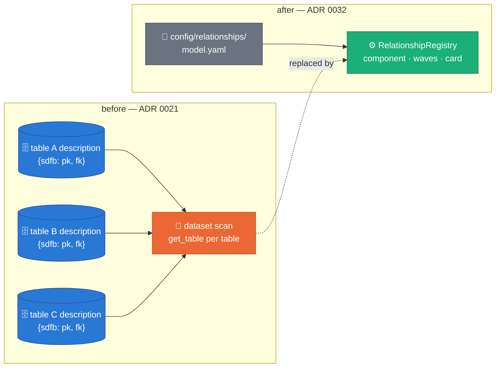
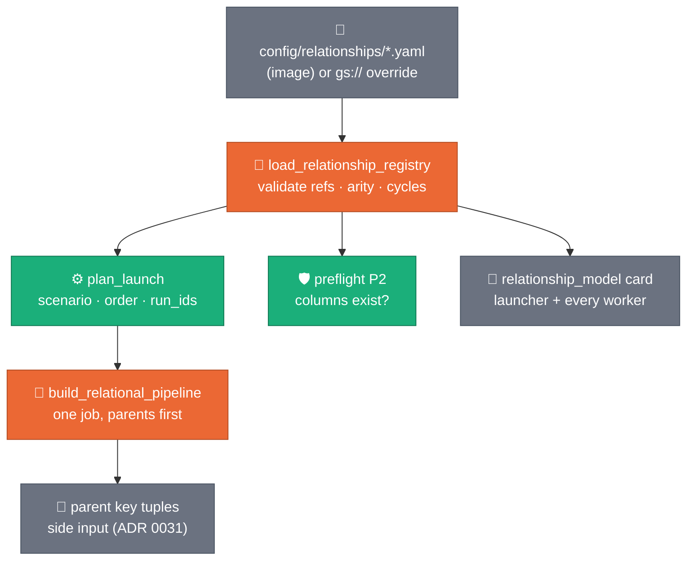

# Relationships as config — one file, not N table descriptions

**Status:** ACCEPTED (2026-08-24) — gate MET: the R6 pair (2026-08-25/26)
launched from `config/relationships/` with the relationship card in driver + worker logs
**Decision:** [ADR 0032](../adr/0032-relationships-as-config.md)
**User guide:** [`config/relationships/README.md`](../../config/relationships/README.md)
**Supersedes:** [ADR 0021](../adr/0021-relational-contract-in-descriptions.md)
(the description contract) · ADR 0029 D3 (`informational` → `enforced`)
**Depends on:** [ADR 0030](../adr/0030-single-job-relational-generation.md)
(one job per model) · [ADR 0031](../adr/0031-joint-fk-key-draws.md)
(what an enforced edge then does)

---

## §1 The problem with putting a model in N places

A relational model is one object: "these tables, these keys, these edges".
ADR 0021 stored it as N fragments, one inside each BigQuery table
description, because Terraform exposes no PK block and BigQuery constraints
are unenforced metadata. Three consequences showed up in practice:

| Symptom | Cause |
|---|---|
| The launcher scanned the whole landing dataset (`get_table` per table) on every launch | no single place held the model |
| Changing one edge meant `bq update` / `terraform apply` on production metadata | the model lived in the database |
| "Generate the model but leave that branch out today" was not expressible | a description says what a table IS, not what a launch should DO |
| A 49-minute run enforced nothing, and the reason sat in two descriptions | the state was knowable but not readable |

The fix is not a better encoding — it is moving the model to where models
belong: a versioned file the repo owns, reviewed in a PR, diffable.



## §2 What a launch reads

Two inputs still decide everything — `--landing_table` and
`--generate_fk_relationships`. What changed is where the answer comes from.


*One model, four launches. Blue = generated by this launch; a solid green
edge draws parent key tuples (ADR 0031); a dotted orange edge is present in
the model but not drawn this run. Scenario 3b is the expensive one, so the
launcher warns rather than silently expanding.*

`--relationships_uri` takes a folder or a single file, local or `gs://`
(the same `FileSystems` seam `--thresholds_uri` uses, so a `gs://`
override needs no new machinery — only `storage.objects.list`/`get` for
the launcher's service account, and only on the LAUNCHER: the model is
resolved driver-side and travels to workers as text). The match is one
level deep (`<uri>/*.yaml`, `*` does not cross `/`). A URI that cannot be
listed, or an explicitly-passed URI holding no models, is a LOUD stop —
silently degrading to "no relationships" would generate every table alone
and still report success, which is the failure mode this whole change
exists to prevent.

The registry answers four questions and nothing else asks them:
`component(table)` (who travels with it), `generation_waves(tables)`
(what may run in parallel, parents first), `enforced_edges(table)` (what
actually draws keys), and `card(table)` (what the log shows).

## §3 Two flags, two different jobs


*`enabled: false` on a table removes it from the GRAPH — and takes with it
anything that reached the rest of the model only through it, which is the
whole point: one flag prunes a branch. `enforced: false` on an edge keeps
the relationship documented and visible while drawing no keys from it.*

Neither flag is a permission: a disabled table still generates when it is
the explicit target. This is what makes "generate A, but leave the B branch
out today" a one-line edit instead of a metadata migration.

## §4 One card, both logs

The model is resolved ONCE, driver-side, rendered once, and carried to the
workers as text (`GenerationContext.relationship_card`). Driver and worker
logs therefore cannot disagree, and no graph code runs on a worker.

```text
RELATIONSHIP MODEL example_retail | source config/relationships/example_retail.yaml | sha 0c2c337b85bb
  5 tables declared · 3 in this launch · 2 enforced + 1 documented edges · 1 DISABLED
  "accounts -> orders -> order lines, plus an unrelated ledger"
 wave 0 | A_TABLE                  pk(A_COL_001,A_COL_002) identity(A_COL_009)
 wave 1 | B_TABLE                  pk(B_COL_001)
        |   +- (B_COL_006,B_COL_007) --> A_TABLE (A_COL_001,A_COL_002)   [enforced]
 wave 2 | C_TABLE                  pk(C_COL_001)
        |   +- (C_COL_004) --> B_TABLE (B_COL_001)   [enforced]
        |   +- (JOIN_KEY) ..> A_TABLE (JOIN_KEY)   [documented, never drawn]
   --   | D_TABLE                  pk(D_COL_001)   [DISABLED — detached]
        |   +- (D_COL_002) --> C_TABLE (C_COL_001)   [this table DISABLED — not drawn]
   --   | E_TABLE                  pk(E_COL_001)
        |   +- (E_COL_002) --> warehouse_ds.EXT_TABLE (EXT_ID)   [enforced]
```

Everything an operator asks at 3am is on that block: which model, which
FILE, the sha, the keys, every edge and its state, the generation waves,
and what is deliberately out. Fenced mermaid rides underneath for the
report tooling to lift by sha. The same card renders offline:

```bash
uv run --no-sync python3 scripts/relationships/card.py --table B_TABLE
```

## §5 Where it plugs in



`deployment_prerequisites.py` step 12 closes the loop before a launch:
every table the models name must exist in the landing dataset (a DISABLED
one may be absent — it is detached on purpose).

## §6 What was removed

Deletion, not deprecation — a second source of truth is the defect:

| Removed | Replaced by |
|---|---|
| `contracts/relational.py::parse_relational_contract` + the `{"sdfb": 1}` table marker | `contracts/relationships.py` |
| `TableSchema.relational_contract()` | the registry (schema describes COLUMNS) |
| the extractor's `table_info.relational` mirror | the model file itself |
| `_discover_landing_contracts` (dataset scan) | `load_relationship_registry` |
| `--fk_contracts_json` | `--relationships_uri` (the normal path, not a test hatch) |
| `contracts/fk_model.py` (second grapher) | registry `component` / `waves` / `mermaid` |
| `contracts/fk_enforcement.py` (inferring intent from column existence) | the model says it outright; preflight P2 checks the columns |
| `ForeignKey.informational` | `FkEdge.enforced` |

A legacy `{"sdfb": 1, …}` object left in a description is now inert, and a
test pins that it stays inert — the failure mode to avoid is a description
that *looks* authoritative and is read by nothing.

## §7 Acceptance criteria

1. `relationships_loaded` names the files, models, table count and sha in
   the launcher log; `relationships_absent` when the folder is empty.
2. `relationship_model` appears once per table in BOTH launcher and worker
   logs, with identical content.
3. A launch with `--generate_fk_relationships=true` on a member of a model
   generates its whole enabled component, parents first, in one job.
4. Setting `enabled: false` on a middle table shrinks the next launch to
   exactly the tables still reachable — no other change.
5. A typo'd column in a model file stops at preflight P2, naming it, before
   any worker starts.
6. `deployment_prerequisites.py` reports model tables that do not exist.
7. No `bq update` / `terraform apply` is needed to change any of the above.

## §8 Figure provenance

```bash
uv run --no-sync python3 scripts/doc/make_relationships_figures.py
```

| Figure | File | Content |
|---|---|---|
| §2 | `assets/relationships-scenarios.png` | CONCEPT — the four launch outcomes over one fixed model |
| §3 | `assets/relationships-flags.png` | CONCEPT — `enabled` and `enforced`, one panel per mode |

Both are concept figures: fixed layout, no solver, no randomness, and no
measured numbers (this change moves where truth lives; it does not claim a
measurement). The palette separation check runs on every regeneration.
