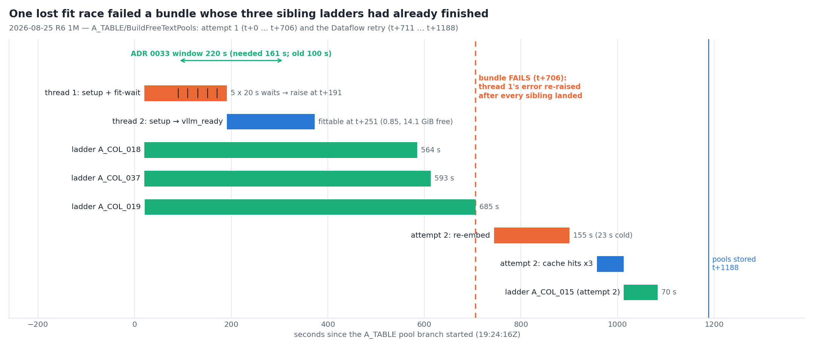
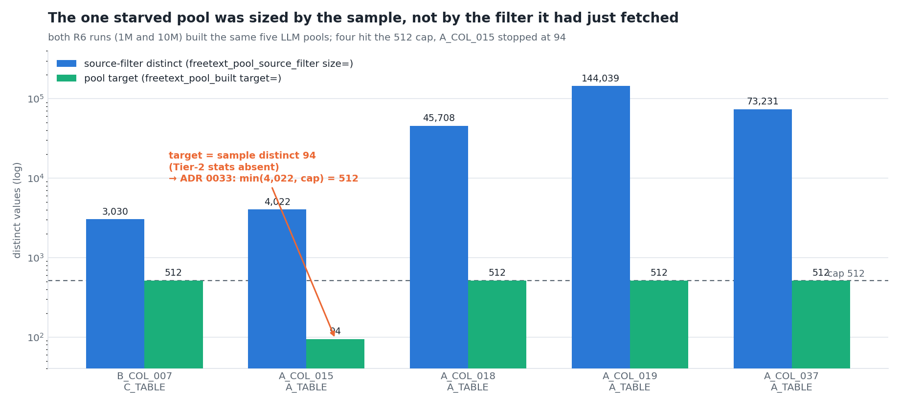
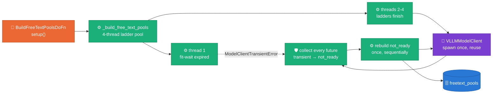
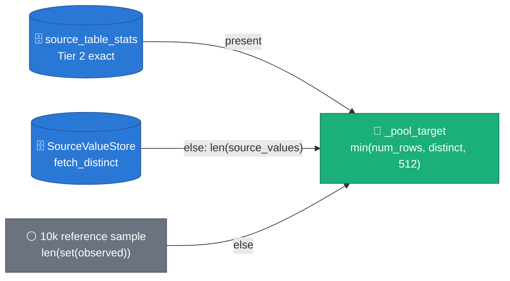
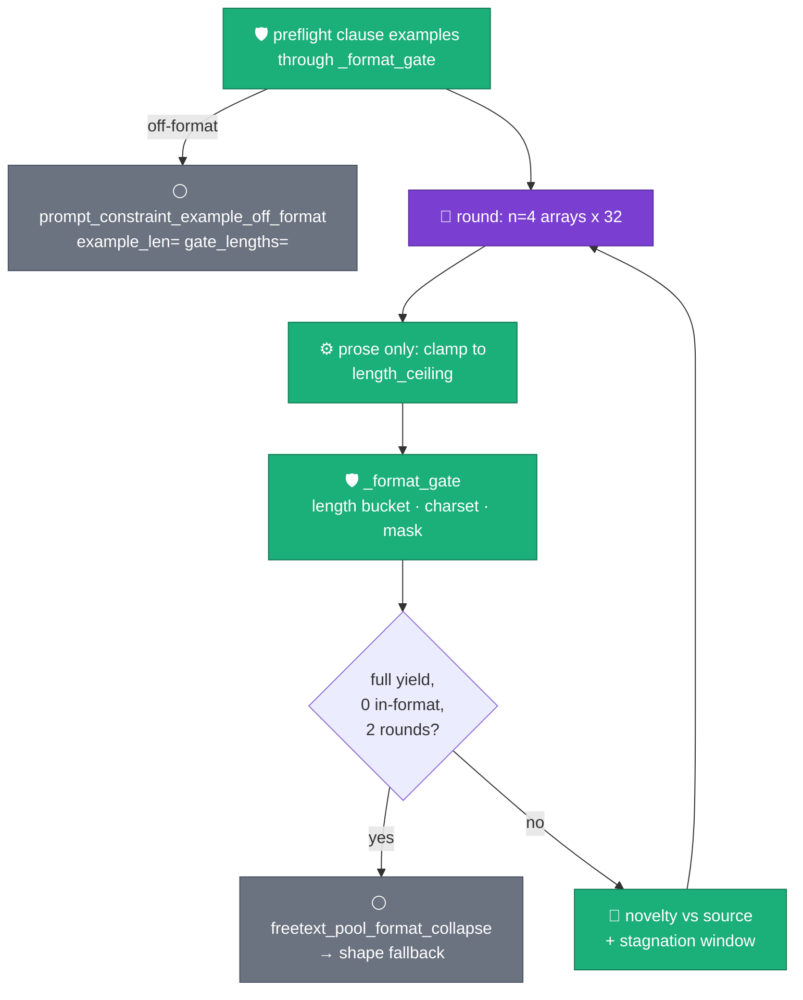

# R6 at scale — what the worker logs said that the reports did not

**Status:** ACCEPTED (2026-08-29) — laptop-proven (TDD, 1,332 tests,
DirectRunner); the next cold relational launch is the acceptance gate
**Decision:** [ADR 0033](../adr/0033-pool-ladder-integrity-at-scale.md)
**Evidence:** `runs/2026-08-25_12_05_08-14035293654817605690`
(R6, 1M rows/table) · `runs/2026-08-26_05_01_16-3186876581127148459`
(R6, 10M rows/table) — `_full_report.md` + `worker_logs.jsonl` in each
**Depends on:** [ADR 0018](../adr/0018-parallel-batched-freetext-pools.md)
(parallel ladders) · [ADR 0020](../adr/0020-freetext-pools-as-persisted-artifact.md)
(persisted pools) · [ADR 0022](../adr/0022-stats-driven-generation.md)
(target tiers) · [ADR 0030](../adr/0030-single-job-relational-generation.md) /
[ADR 0031](../adr/0031-joint-fk-key-draws.md) (the relational job under test)

---

## §1 The headline is clean; the logs are not

Both runs generated the enabled FK pair (`C_TABLE` parent, `A_TABLE`
child) in one Dataflow job on 2→4 `n1-highmem-8` + T4 workers, image
`oss-pk-ready-6ed7b93`, `qwen3/4b-instruct-2507`:

| Check | 1M / table (55 min) | 10M / table (93 min) |
|---|---|---|
| PK uniqueness (full landing) | 1.0 / 1.0 | 1.0 / 1.0 (0 duplicate keys) |
| FK orphans (independent full join) | **0** / 1,000,000 | **0** / 10,000,000 |
| Full-row duplicates (10k sample) | 0 / 0 | 0 / 0 |
| Stats diff | 67/67 + 45/45 `ok` | 67/67 `ok` + 44/45 (`C_COL_007` FK-column warn, ADR 0031 trade-off) |
| Memorization | 1 INFO (day-granularity date) | same |
| Validation gate | PASSED × 2, `dlq_by_rule={}` | PASSED × 2 |
| Free-text | 4 steerable A_TABLE gaps, `copy_frac=0` | same 4, `copy_frac=0` |

The reports' backlogs are "LOW (steerable)" only. The five findings below
come from `worker_logs.jsonl` — milestone-level evidence the report
generator does not read.

### 1a. A bundle failed in the 1M run — after its work was done

*One lost fit race failed a bundle whose three sibling ladders had already
finished.* The A_TABLE pool branch ran four ladders on a thread pool
(ADR 0018). Thread 1 entered the shared `VLLMModelClient.setup()` at
t+20 s, measured an unfittable card (3,616 < 4,096 tokens at 0.635 of
10,487 MiB free), waited 5 × 20 s and raised at t+191. Thread 2 entered
at t+191, and at t+251 the card was fittable (0.85, 14,093 MiB free —
sibling embedders had demoted). `vllm_ready` at t+373; three ladders
finished at t+585/613/706. `_build_free_text_pools` then re-raised
thread 1's error (t+706) — the work item failed, Dataflow retried:
re-embed 155 s, three process-cache hits, the missing 70 s ladder,
pools stored at t+1188.

The 10M run fit on its first measure (`vllm_max_model_len_clamped
fitted=5712`) with ~300 MiB to spare. Same image, same tables: on a T4
this is a coin flip, not a fixed condition.

### 1b. The one starved pool was sized by the sample

*`A_COL_015`'s target was its 10k-sample cardinality (94) while the
source filter the same setup fetched held 4,022.* `_pool_target` already
preferred the Tier-2 exact count (ADR 0022) — it was absent
(`--source_stats=exact` not run), so the sample distinct sized the pool.
The 10M recommender doc read the 100-distinct synthetic column as "pool
stagnation"; it was the target. Four of five LLM pools hit the 512 cap.

### 1c. One column rejected 98 % of its LLM values, three rounds running

*`A_COL_037` (fixed 31 chars) parsed 393 values per run; the gate refused
385 (1M) / 386 (10M) — the clause's own fictitious example is 28
characters and the model echoed it (8 / 7 verbatim echoes).* Three
rounds (~150 s each on T4) ran before the stagnation window closed and
the shape fallback built the pool. Right panel: `A_COL_019` is a 35-char
fixed-width narrative field (source p95 == max == 35, with p05 at 18);
the prose gate passes everything, so the pool ran to 62 characters (50
in the 1M run).

### 1d. The GPU served pool builds for 9 of 93 minutes

*vLLM was busy from spawn to the last pool for 7.9 minutes (plus ~1 min
of embeds); four T4s were billed 272 GPU-minutes.* Generation itself is
CPU work at 25 s per 10k-row batch (7.1k rows/s parent, 10.2k rows/s
child), and 64 `llm_route_unused` WARNINGs fired from generate DoFn
instances whose pools came from the store — the designed warm path
(ADR 0020), mislabelled as idle hardware.

---

## §2 The mechanism: a ladder thread that loses the race is retried, not fatal

Before ADR 0033 the `COLLECT` box kept the first exception and re-raised
it after every future landed — correct for a real defect (a bad schema
fails once, loudly), fatal for a *not-ready* client. The change is one
classification: `ModelClientTransientError` (`sdfb_core.engines.base`)
is "not usable yet"; `ModelLenUnfittableError` (`vllm_client.py`)
subclasses it. Such a failure is queued, the column is rebuilt once
after the siblings land (`freetext_pool_ladder_retried column= error=`),
and only a second failure raises. `_infer_free_text_pool` re-raises the
transient class even in lax mode — the exemplar fallback is for "the LLM
yielded nothing", never for "the client never answered" (the 2026-07-10
root cause was exactly that path: `setup()` never ran → universal
memorization).

The client side also widens its in-process window: `_UNFITTABLE_RETRY_ATTEMPTS`
6 → 12 (220 s between first and last measure; 161 s was needed). A
two-table job (ADR 0030) doubles the DoFn instances demoting embedders
during setup; a third table would add more churn.

## §3 The target ladder: exact stats → source filter → sample

`_collect_pool_job` now fetches the source filter first (it fetched it
anyway, right after the target) and passes `source_cardinality=len(source_values)`.
The filter is the exact distinct set whenever it is under the store's cap
— which is precisely when it matters (sparse and mid-cardinality columns);
above the cap the target is 512 regardless. Tier 2 stays authoritative
when present (`test_pool_target_prefers_the_exact_stats_count_over_the_filter`).

## §4 The format gate learns two things

- **Example preflight (D4).** `_FormatGate` (the former closure, now an
  object exposing `prose` and `lengths`) judges each `constraint_examples`
  entry before the first round. `A_COL_037`'s example would have logged
  `example_len=28 gate_lengths=31` at plan time, next to
  `prompt_constraints_found`. The example is kept — the operator
  authored it — and the recommender prompt / DDL guide now require
  examples in the observed length bucket.
- **Collapse exit (D3).** `_collapse_rounds` counts consecutive rounds
  with ≥ 32 parsed values and none in format; at 2 the ladder logs
  `freetext_pool_format_collapse` and exits `stagnated=True`, which is
  the existing shape-fallback path. One escalation retry is kept; the
  third (and any later) round is gone.

## §5 The prose ceiling — one panel per outcome

*Intuition:* a field stored at a fixed width does not have long values —
it has values that were cut. Its length histogram is a free distribution
whose upper tail is folded onto the width (panel a). *Formally*
(`text_shapes.py::length_ceiling`): over substantive values, `p95 == max`
and `max − p05 ≥ max(4, ⌊max/4⌋)` ⇒ ceiling `= max`; a lone maximum
(panel b, `p95 < max`) or a narrow band (panel c, the shape template
already carries the width) ⇒ none. Only prose columns (no relaxed-shape
length bucket, no collapsed-mask gate) use it; identifier-ish columns
already enforce their buckets. Candidates past the ceiling are truncated
*before* the novelty check (`_clamp_to_ceiling`), so a clamped value that
collides with a real one is still rejected, and the count lands in
`freetext_pool_length_clamped column= clamped= max_len=`.

## §6 Observability: warm is not idle

| Setup outcome | Before | After (ADR 0033) |
|---|---|---|
| ≥ 1 column ran an LLM ladder | silent | silent |
| every column from the store / process cache | `llm_route_unused` **WARNING** × every DoFn instance (64 at 10M) | `freetext_pools_warm columns=N` INFO |
| no LLM-derived pool at all (expandable / typed / binary) | `llm_route_unused` WARNING | unchanged — this is the ADR 0027 "GPU idle" signal |

New milestones (all in `docs/RUN_PLAYBOOK.md` §7): `freetext_pool_ladder_retried`,
`freetext_pool_format_collapse`, `prompt_constraint_example_off_format`,
`freetext_pool_length_clamped`, `freetext_pools_warm`.

## §7 What stays on the backlog (and why)

| Item | Evidence | Why not now |
|---|---|---|
| CPU/GPU worker split for the generate stage (two jobs, or a warm CPU-only replay) | §1d: 9 busy GPU-minutes, 272 billed | architecture change (RUN_PLAYBOOK cost note); the persisted store already makes a warm replay GPU-free |
| `FREE_TEXT_POOL_MAX` above 512 for 45k–144k-distinct columns | 4 pools at the cap; `A_COL_018` still misses its 29 % all-digit shape | GPU-time decision — a cap of 2,048 is 4× the ladder cost per column |
| FK-column marginal (`C_COL_007` decile-KS 0.21 at 10M) | ADR 0031 v1 trade-off, uniform over a 100k-key cap | co-partitioned join beyond the cap (ROADMAP) |
| `C_TABLE/EnforceUniqueness/CombineByPk` 8 min at 10M | job graph | scales with rows; L4 / larger workers |
| Worker startup 8–15 min (image pull) | `workers_ready` markers | image size; outside this branch |

## §8 Acceptance criteria (next cold relational launch)

1. `freetext_pool_ladder_retried` either absent, or followed by
   `freetext_pool_built` for the same column in the same setup — never a
   failed work item on `BuildFreeTextPools`.
2. `freetext_pool_built column=A_COL_015 target=512` (or `min(source
   distinct, 512)` for any sparse column) with `source_stats` absent.
3. `A_COL_037`-class column: `attempts=2`, `freetext_pool_format_collapse`,
   then `freetext_pool_shape_fallback`; `prompt_constraint_example_off_format
   example_len=28 gate_lengths=31` in the pool branch log.
4. Crosscheck `len_max` of `A_COL_019` == source `len_max` (35);
   `freetext_pool_length_clamped column=A_COL_019 max_len=35` fired.
5. Every generate setup logs `freetext_pools_warm`; `llm_route_unused`
   count is 0 for a job whose pool branch ran a ladder.
6. The oss bundle's `gcp_metrics` carries `NETWORK_TAG_n`, never a tag name
   (`leak_scan` clean).

## §9 Figure provenance

Regenerate: `uv run --no-sync python3 scripts/doc/make_r6_scale_figures.py`
(matplotlib Agg, dpi 160; palette BLUE `#2a78d6` / ORANGE `#eb6834` /
AQUA `#1baf7a`, OKLab ΔE ≥ 15 checked on every run). Every measured number
is typed once, in the script's `MEASURED` block; the concept figure's
`CONCEPT` block is seeded (33).

| Figure | File | Content |
|---|---|---|
| pool race | `assets/r6-scale-pool-race.png` | 1M A_TABLE pool-branch timeline: fit-wait expiry, sibling spawn, three ladders, bundle failure, retry |
| pool targets | `assets/r6-scale-pool-targets.png` | source-filter distinct vs pool target per LLM column (log) |
| format gate | `assets/r6-scale-format-gate.png` | `format_rejected` per column, both runs; `A_COL_019` length quantiles vs the 35-char wall |
| where time went | `assets/r6-scale-where-time-went.png` | 10M job phases; GPU-busy band vs billed GPU-minutes; rows/s |
| length ceiling (concept) | `assets/r6-scale-length-ceiling-concept.png` | three seeded length distributions and the `length_ceiling` verdict on each |
