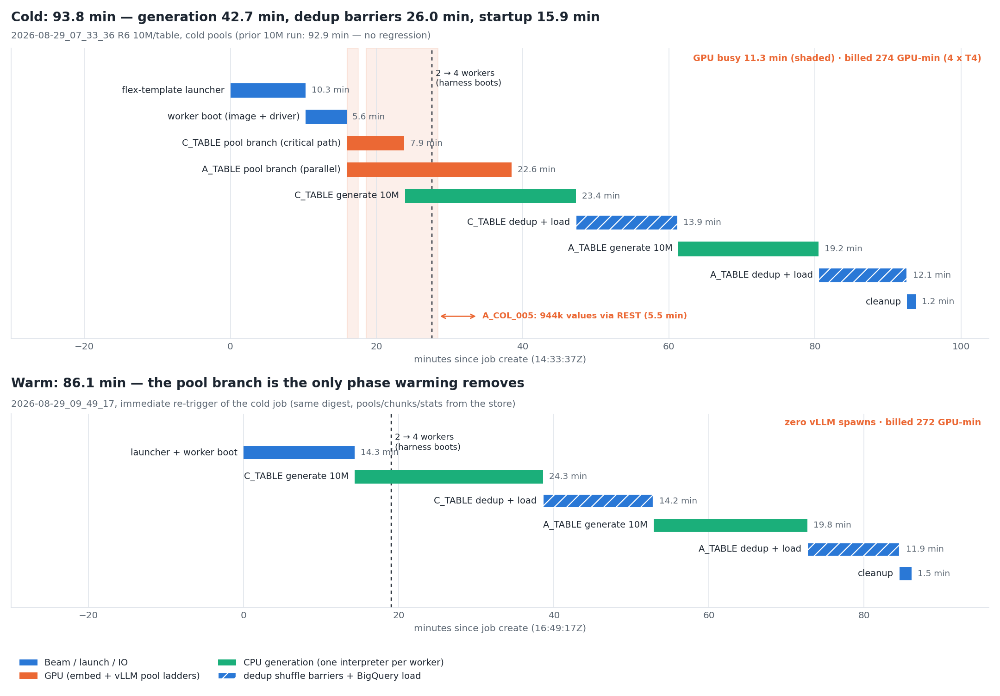
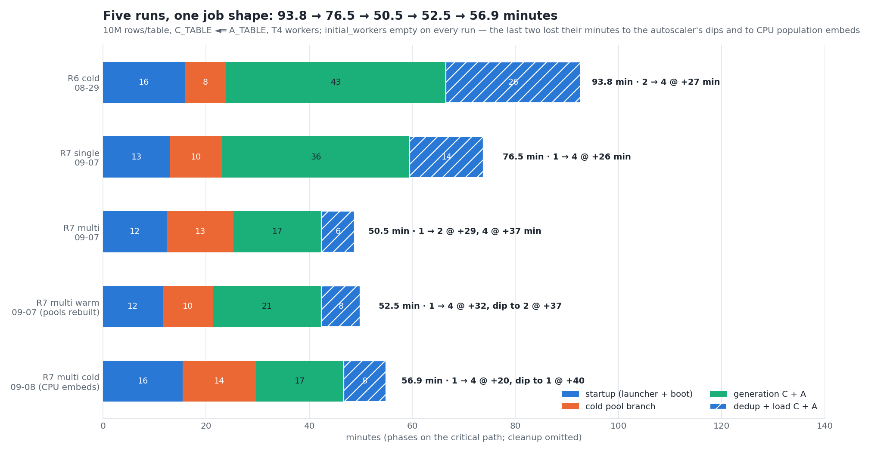
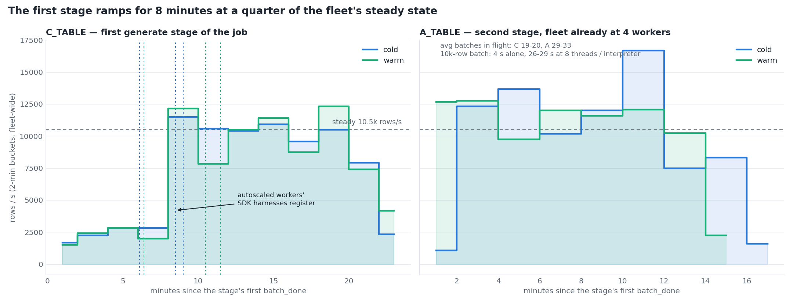
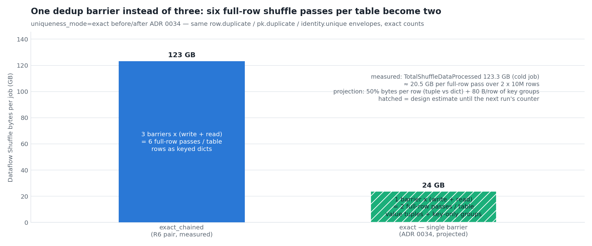
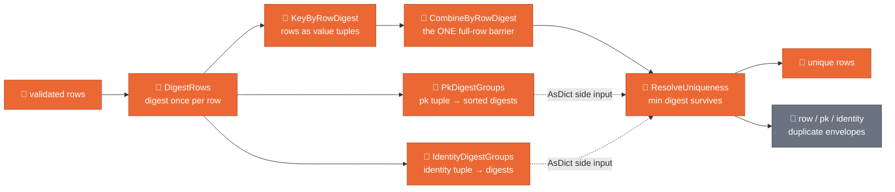
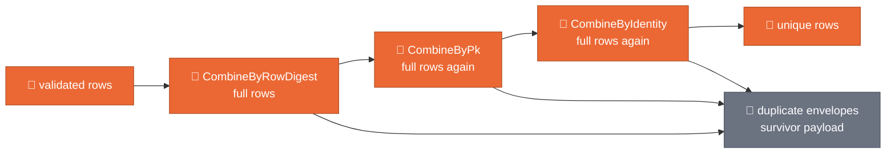
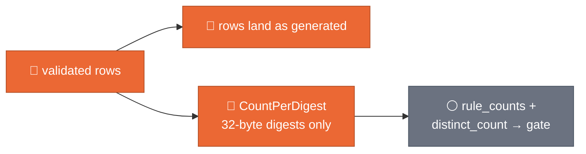
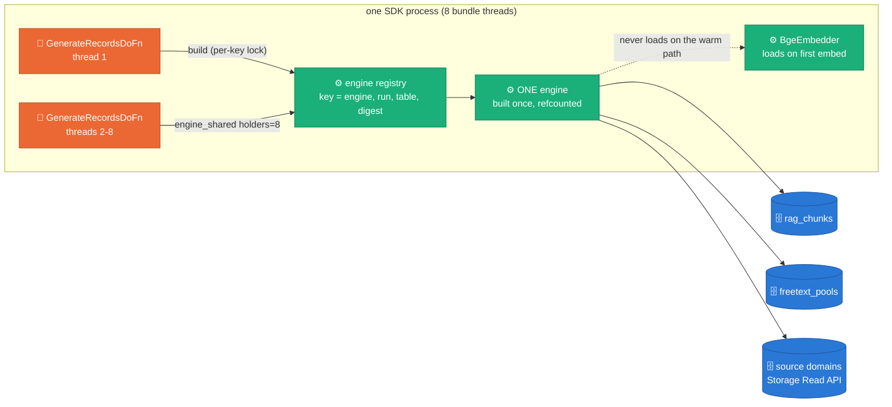

# Generation throughput — where a 10M-row relational job spends 94 minutes

**Status:** ACCEPTED (2026-09-07) — verified on the same-day R7 pair
(`single` ≈ 76.5 min, `multi` ≈ 50.5 min, §1b); one defect found and
fixed (D4 fallback); `sdk_containers=multi` validated, opt-in for one
more launch
**Decision:** [ADR 0034](../adr/0034-generation-throughput-single-barrier-shared-engines.md)
**Evidence:** `runs/2026-08-29_07_33_36-13355700596190055276` (R6, cold,
10M rows/table, 93.8 min) · `runs/2026-08-29_09_49_17-12681434869969021419`
(its immediate warm re-trigger, 86.1 min) — `_full_report.md` +
`worker_logs.jsonl` in each
**Depends on:** [ADR 0020](../adr/0020-freetext-pools-as-persisted-artifact.md)
(persisted pools) · [ADR 0030](../adr/0030-single-job-relational-generation.md)
/ [ADR 0031](../adr/0031-joint-fk-key-draws.md) (the relational job under
test) · [ADR 0033](../adr/0033-pool-ladder-integrity-at-scale.md) (the
previous pair's fixes, all present in image `oss-pk-ready-5214aa5`) · the
WS6 uniqueness modes ([design](2026-07-27-ws6-pipeline-shape.md))

---

## §1 There is no regression — there is a ceiling, and warming cannot move it

Both jobs generated the enabled FK pair (`C_TABLE` parent, `A_TABLE`
child) in one Dataflow job, `n1-highmem-8` + T4, `qwen3/4b-instruct-2507`,
and both are clean end to end:

| Check | cold (93.8 min) | warm (86.1 min) |
|---|---|---|
| PK uniqueness (full landing, both tables) | 1.0 / 1.0 | 1.0 / 1.0 |
| FK orphans (independent full join, 10M child rows) | **0** | **0** |
| Full-row duplicates (10k samples) | 0 / 0 | 0 / 0 |
| Stats diff | 67/67 `ok` + 44/45 (`C_COL_007` FK-column warn, ADR 0031) | same |
| Memorization | temporal-domain INFO flags only | same |
| Validation gate | PASSED × 2, `dlq_by_rule={}` | PASSED × 2 |
| vLLM ignitions | 1 (served both tables' pool branches) | **0** |

The previous 10M run (2026-08-26, [release v0.1.0](https://github.com/albertols/synthetic-llm-dataflow-bigquery/blob/a01e54abd46e676b53f344bd8ba5d10af231de21/docs/releases/v0.1.0/report.md))
took 92.9 min; this cold run took 93.8. The "degradation" is not a
regression — it is a flat ceiling that the warm twin exposes: with zero
vLLM spawns and every store hit, the job still ran 86 minutes.



*Warming removes only the 8-minute pool branch; CPU generation and the
dedup shuffle barriers are ~70 % of both jobs, and the GPU served pool
ladders for ~11 of the cold job's 94 minutes while four T4s were billed
274 GPU-minutes.* Phase edges come from the job's phase markers
(`launcher_start`, `autoscale`, `workers_ready`, `cleanup`) and the
worker milestones (`pool_branch_emitted`, first/last `batch_done`,
`fk_key_pool_capped`, `TriggerLoadJobs`).

### 1a. The report misread two of its own gaps

The E2E report attributed a 27.4-minute gap
(`identifier_source_filter → fk_key_pool_capped`) to "the FK parent-key
cap computation over C_TABLE's 10M-row landing table". The worker log
says otherwise: `fk_key_pool_capped` fires 25 seconds after C_TABLE's
`TriggerLoadJobs`. The gap is the child wave *waiting for the parent
wave* — generation, three dedup barriers, and the BigQuery load — which is
exactly what ADR 0030's in-DAG side input is designed to do. The key-pool
sample itself (`FkSample` + IPF fit) costs ~10 s.

The report's `generation_stall_max_seconds = 1078.6` is not a generation
stall either. The probe mines Beam's "Bundle processor … has been creating
for at least N seconds" WARNING, and that message carries the stalled
frame: `engine.py::_fetch_identifier_domains → source_values.py::fetch_distinct
→ _row_value`. The A_TABLE pool branch paged the 944,582 distinct values of
`A_COL_005` through the BigQuery REST row iterator at ~2.9k rows/s — 5.5
minutes inside `DoFn.setup()` (the orange arrow in the cold panel). The
[E2E prompt](https://github.com/albertols/synthetic-llm-dataflow-bigquery/blob/a01e54abd46e676b53f344bd8ba5d10af231de21/.github/prompts/end_to_end_validation_report_generation.prompt.md)
now says so.

### 1b. Acceptance — the 2026-09-07 R7 pair, then the 09-07/09-08 multi pair



*Five runs of one job shape: 93.8 → 76.5 → 50.5 → 52.5 → 56.9 minutes.
The single-barrier dedup halved the dedup phase on the `single` run; the
multi-process topology then halved generation; startup and the cold pool
branch stayed put. The last two runs gave minutes back: the autoscaler
dipped to 1–2 workers between the parent and child stages on both
(`initial_workers` was empty on every run), and the 09-08 cold run paid
a 15-minute population stage for the CPU embeds of ADR 0034 D8 rev. 1.*
Runs
`2026-09-07_05_04_25-2281175974286848139` (`sdk_containers=single`) and
`2026-09-07_07_33_01-10181729754686044047` (`multi`), image
`oss-pk-ready-00fc613`, worker logs only (the per-run table is in
[ADR 0034 § Acceptance evidence](../adr/0034-generation-throughput-single-barrier-shared-engines.md)).

What the multi log proves: exactly one `vllm_spawn_lock_acquired` per
worker, the sibling pool branch `vllm_spawn_lock_wait` → `vllm_reuse`, no
CUDA OOM, no lost race, 10k-row batches in 5.6–6.7 s, C_TABLE at 16k
rows/s on 1–2 workers and 31k rows/s in the one bucket where four were
up. The single log proves D2: `engine_shared holders=2..8` on every
worker, four builds per table instead of 32, `dofn_setup_done` p50 26 s
instead of 75 s.

What it exposed: **every source-domain fetch failed in both runs** —
`source_values_arrow_fallback error=PermissionDenied` (the worker SA has
no `bigquery.readsessions.create`) followed by `*_source_filter_error
error=ValueError`, because the REST fallback re-iterated the
`RowIterator` the Storage attempt had already started. For those two
runs the ADR 0023 rejection sets, the identifier/numeric domains and the
ADR 0033 filter-sized pool target (`A_COL_015` back to 94) were
inactive. Fixed the same day (fresh `QueryJob.result()` for the fallback;
`PermissionDenied` disables the Storage attempt per process, loudly
once; `roles/bigquery.readSessionUser` granted and documented). The
pools those runs persisted go through the launcher's taint preflight
(`pool_source_overlap` → delete + rebuild) on the next launch; their
landed rows need the E2E probe's `copy_ratio` before they count as
clean. Two smaller follow-ups from the same logs: the multi cold start
paid eight `vllm_unfittable_wait`s (344 s ignition) while eight
population embedders held the card — rev. 1 moved them to CPU under
`multi` — and the single-barrier read stage's side inputs were
re-fetched per bundle (`max_cache_memory_usage_mb` pinned to 512).

What the second multi pair proved and falsified (09-07 15:53 "warm",
whose pools the taint preflight rebuilt as designed, ≈ 52.5 min; 09-08
01:28 cold, 56.9 min; the per-run table is in the ADR): the D4
amendment holds (`identifier_source_filter size=944582` on every
fetch; the Storage attempt is denied and disabled once per process
until `roles/bigquery.readSessionUser` is granted). The warm run's vLLM
ignition, 183 s with no population contention, is the target number.
The cold run's CPU embeds were a regression: 56 CPU embedders across
the fleet turned a 2.9-min population stage into 15.4 min and starved
the model pull (177.6 s vs 52.5 s) and the engine init (598.7 s) on the
same VMs. Rev. 2 keeps the embed on the GPU and bounds the fan-out to
`rag_embed_shards` (2) keyed groups, and the pool branch's trigger waits
on the embedded chunks (`AwaitRagPopulation`), so the spawn meets a free
card. The autoscaler chart of both runs shows the same shape — up for
the parent, down to 1–2 workers through the parent's load and the
child's pool phase, up again for the child — which costs the child's
first minutes and is what `autoscaling=fixed` (ADR 0034 D9) removes.

## §2 Generation: one interpreter per worker



*C_TABLE — the first generate stage of the job — runs its first eight
minutes at ~2.5k rows/s until the two autoscaled workers' SDK harnesses
register; steady state is ~10.5k rows/s (C_TABLE) / ~12k (A_TABLE), which
is four interpreters for 32 billed vCPUs.*

Three facts from the worker log fix the topology:

- `--dax_workflow_worker_num_threads_per_worker=8` — eight harness
  threads per worker; `no_use_multiple_sdk_containers` (RUN_PLAYBOOK §3)
  makes them threads of ONE Python process (`sdk-0-0`).
- `batch_done seconds=4.0` for the first, uncontended 10k-row batch;
  26–29 s once eight threads share the GIL. Aggregate throughput is what
  one core of Python delivers per worker, plus whatever NumPy releases.
- Three `Starting Unified Worker` boots at 15:01:10–18 (cold) and
  17:08:15–18 (warm): the job launched on 2 workers and the autoscaler
  added the rest ~4 minutes into the first stage. Their SDK harnesses
  registered ("Set shuffle service client total memory limit") 3–5 min
  later, which is the jump in both C_TABLE curves. A_TABLE, the second
  stage, started on the full fleet and ramped in one bucket.

The per-row pipeline that shares that interpreter is: engine sampling →
Pydantic `model_validate` inside the engine → `model_dump` → identity
synthesis → `EnforceFkIntegrity` → a second `model_validate`
(`ValidateRecordDoFn`) → `BatchElements` → a pandas frame for Pandera →
`row_digest` (JSON + blake2b) → shuffle encoding. None of it touches the
GPU. The `SDK failed progress reporting 6 times` ERRORs in both logs are
the harness failing to answer the runner while that interpreter is
saturated.


*Thirty-two engine builds per table — 4 workers × 8 threads — cost 2,940
thread-seconds cold and 2,824 warm on C_TABLE (p50 75 s, max 444 s); one
uncontended build costs 18 s.* Every instance re-read the chunk store,
rebuilt the FAISS index, fetched five pools and every numeric column's
source domain and k-anonymity set, and (A_TABLE) re-fitted the FK key
pool — serialized on the process-level single-flight locks that exist to
stop exactly this duplication *per fetch*, but not *per engine*.


*One interpreter per worker caps the fleet near 10.5k rows/s; every other
lever in this design trims minutes around that stage, only more
interpreters move it.* The projection is hatched: linear in interpreters
until the shuffle write and the BigQuery load bind, and the `R7m`
experiment reads the real number.

## §3 Dedup: three full-row shuffle barriers per table



*One barrier instead of three cuts the dedup phase from six full-row
shuffle passes per table to two — from 123 GB measured to ~24 GB
projected per job — with the same envelopes and counts.*

`EnforceUniqueness` (exact mode) chained `CombineByRowDigest →
CombineByPk → CombineByIdentity`, each a `CombinePerKey` whose value is
the whole row as a keyed dict. On 10M unique keys the map-side lift
compacts nothing; every row crosses Dataflow Shuffle three times.
`TotalShuffleDataProcessed` was 123 GB for the cold job; the
`CombineByPk` read stage alone was the fifth-largest fused stage
(527 s on C_TABLE), the barrier phases carried `Will retry read due to
resource exhausted` storms, and one harness rebooted inside each
barrier phase (15:29 cold, 17:36 warm). Twenty-six of the ninety-four
minutes.

### 3a. `uniqueness_mode` — one panel per mode

**`exact` (default, ADR 0034 D1)** — one full-row barrier; PK and identity
resolved from key-only groups delivered as side inputs to the barrier's
read stage:



The three `Map`s fuse into the generate stage; `PkDigestGroups` and
`IdentityDigestGroups` shuffle `(key tuple, 32-hex digest)` pairs and
emit only keys shared by ≥ 2 distinct rows (normally none). The resolver
keeps one survivor per digest (`seen − 1` `row.duplicate` envelopes),
then the smallest digest per PK tuple (`pk.duplicate`), then the smallest
digest per identity tuple *among PK survivors* (`identity.unique`) — the
chain's order, made deterministic. Row-duplicate envelopes carry the
survivor's payload as before; PK/identity envelopes carry the dropped
row's own payload. Rows travel through the barrier as value tuples in
schema order (`_pack_row`), roughly half the bytes of a keyed dict.

**`exact_chained` (the pre-ADR-0034 path, kept for A/B)** — the same
envelopes and counts, three barriers:



**`streaming` (WS6 W3, unchanged)** — no barrier; duplicates are measured
on a digest-only branch and land:



## §4 The engine registry and the lazy embedder (ADR 0034 D2, D3)



The first DoFn of a (engine, run, landing table, reference digest) key
builds under a per-key lock while its siblings wait on that lock instead
of building eight engines; holders are refcounted and the last release
tears the engine (and the `ModelClient` it was built with) down, so a lone
DoFn keeps `engine_setup → engine_teardown → client_teardown`. A failed
build is never shared. Thread safety of `generate_batch` is by
construction: per-batch RNGs from `(run_id, batch_id)`, idempotent lazy
caches (`_numeric_array`, `_identifier_artifacts`, `_cum_np`), and the
routed emitted-set — now per process instead of per thread, which
*tightens* PK uniqueness by construction. B.2 inherits the seam: one CTGAN
fit and one lazy pool ladder per process instead of eight.

`BgeEmbedder` construction now loads nothing; `ensure_loaded()` (from
`embed()`) imports the HF stack, resolves `auto`, loads and moves once. A
`demote_to_cpu()` before any load pins the eventual load to CPU. The
store-warm generate path — row-doc vectors from `rag_chunks`, pools from
`freetext_pools` — never embeds, so it never imports transformers, never
loads 130 MB of weights, and never opens a CUDA context beside vLLM; the
cold path (bulk embed on CUDA, demote, ladder) is byte-identical.

`BigQuerySourceValueStore` reads through `RowIterator.to_arrow()`: large
results stream through the Storage Read API, small ones from the cached
first page, and an Arrow-path failure falls back to row iteration with
`source_values_arrow_fallback` — same SQL, same cap, same process cache.

## §5 Launch knobs — one panel per mode (ADR 0034 D5, D6)

**`initial_workers`** — empty leaves Dataflow's default (the pair's
2 → 4 ramp in the timeline and ramp figures); `4` starts a 10M run on the
whole fleet. Pinned by the launcher through `WorkerOptions.num_workers`,
the `disk_size_gb` channel; an explicit Beam `--num_workers` wins.
`run_e2e.sh` tier `R7` carries it as `job.num_workers`.

**`sdk_containers=single|multi`** — one figure, both modes, everything
that changes inside a worker:


*`single` (default, the RUN_PLAYBOOK §3 pin) runs one SDK harness
process per worker: eight threads on one GIL, so the pure-Python generate
stages keep about one vCPU busy while the process owns the vLLM spawn
outright. `multi` (Dataflow's default) runs one process per vCPU, eight
GILs, and the launcher — which reads the topology from the experiments
and logs `sdk_container_topology` — builds the vLLM client with
`cross_process=True`: a bound loopback port (`_PortMutex`, :8001) makes
one process the spawner, the other seven wait and reuse its server
through the `/v1/models` probe, and teardown keeps the server alive. The
price is eight engine builds per worker instead of one; the population
embed is bounded to `rag_embed_shards` processes per job and finishes
before the spawn (ADR 0034 D6, D8).* Source
`assets/sdk-containers-topology.drawio`, exported side by side.

What the multi option measured, in the figures that own the numbers:

| Finding | Figure | What to read |
|---|---|---|
| The GIL ceiling is real: at one interpreter per worker the fleet rate saturates well below the vCPU count; at eight it multiplies | `assets/throughput-gil-ceiling.png` | measured single vs multi fleet rate, the linear projection hatched |
| The whole job shrinks, and only the generate + dedup phases move | `assets/throughput-evolution.png` | the R7 single → multi bars; startup and the cold pool branch stay put |
| Setup is paid once per process, not once per thread | `assets/throughput-setup-cost.png` | `dofn_setup_done` per instance; eight per worker under multi, all sharing one spawn |
| One spawn per worker, no lost race, no OOM | ADR 0034 § Acceptance evidence | `vllm_spawn_lock_acquired` ×1, `vllm_spawn_lock_wait` on the rest, one `vllm_ready` |
| Eight GPU embedders beside the spawn hurt; fifty-six CPU embedders hurt more | ADR 0034 D8 (rev. 1 → rev. 2) | 344 s → 598.7 s → target 183 s ignition across the three multi runs |

**NVIDIA MPS — evaluated, not adopted.** Dataflow's
[Multi-Process Service](https://docs.cloud.google.com/dataflow/docs/gpu/use-nvidia-mps)
(`worker_accelerator=…;use_nvidia_mps`; forbids
`no_use_multiple_sdk_containers`; meant for `RunInference` with
`model_copies > 1`) shares one CUDA context across SDK processes. Here the
GPU has one tenant per worker — the vLLM server every process reaches
over HTTP — and the only concurrent multi-process CUDA use, the cold
population embed, now runs on CPU under `multi`. MPS would not touch the
T4 KV budget that bounds the pool ladders; it would add a daemon between
vLLM and the driver. It becomes relevant only with a second model
process per card (two vLLM replicas on an L4), which is not this design.

The spawn window (pull → dtype guard → spawn → ready) is exclusive across
processes because a loopback port can be bound by one process only —
the same shared host network that makes the reuse probe on `:8000` work
across SDK containers. Losers poll the probe and bind to the winner's
server; teardown never terminates a server another process may still be
bound to (`vllm_server_kept_alive`), and the lazy embedder keeps the seven
non-spawning processes off the GPU. This is the one change the laptop
cannot prove end to end; it stays an experiment (`R7m`, or the DAG with
`sdk_containers=multi`) until §7's acceptance reads clean.

## §6 What this design leaves alone

- **Startup (15–16 min).** The flex-template launcher phase is ~10 min
  (`launcher_start → autoscale`) and the GPU worker boot ~5 min. Both are
  image size and driver install; a slimmer launcher image is an
  [ADR 0009](../adr/0009-single-flex-template-image.md)-level decision.
- **The T4 KV budget.** `vllm_max_model_len` clamped 8192 → 4288 on a
  card holding an 8 GB fp16 checkpoint; a 512-value pool ladder for one
  column costs ~4.4 min (`freetext_pool_built seconds=264.9`) and the
  four A_TABLE ladders ran 520–650 s each in parallel. A quantized
  checkpoint (`config/models.yml`) is the lever; not a code change.
- **A_COL_037's clause example** is still 28 characters on a 31-character
  column — `prompt_constraint_example_off_format` fired again and the
  ladder ran 5 rounds to `pool_size=14` before the shape top-up. An
  operator edit (DDL_CONTRACT_GUIDE §4), tracked since ADR 0033.
- **The FK-column marginal** (`C_COL_007` warn at 10M) stays the ADR 0031
  v1 trade-off.
- **B.2 pools through the pool branch / store** — the shared engine already
  collapses B.2's lazy ladders from eight per process to one; persisting
  them is the next B.2 step.

The one fidelity fix that did ship: `A_COL_019` is mask-gated in this run
(`gate_lengths=mask`), so ADR 0033's prose-only ceiling never engaged and
pool values reached 48 characters against a 35-character source. The
ceiling now applies to every length-blind gate (`_FormatGate.length_blind`).

## §7 Acceptance — the next cold + warm pair (M4, T4)

Falsifiable, keyed to milestones that exist in the code:

1. `dominant_stages` carries no `CombineByPk` / `CombineByIdentity` stage;
   `TotalShuffleDataProcessed` per job ≤ 45 GB (≈ 24 GB if the tuple
   packing halves rows as designed); PK 1.0 and 0 orphans unchanged;
   `dlq_by_rule` identical to the pair's.
2. `engine_shared holders=8` on every worker and ≤ 4 `dofn_setup_done`
   per table; no `Bundle processor … creating for at least` WARNING above
   60 s.
3. `initial_workers=4` + `autoscaling=fixed`: no `Starting Unified
   Worker` after `workers_ready`; C_TABLE's first 2-min bucket within 2×
   of its steady rate; the worker count never drops between the parent
   and child stages (the 09-07/09-08 multi pair dipped to 1–2).
4. `identifier_source_filter column=A_COL_005 size=944582` lands within
   30 s of the previous milestone; no `source_values_arrow_fallback`.
5. No `embedder_device` milestone from a store-warm generate setup;
   `embedder_device device=cuda` still precedes `b1_embed_done` on the
   cold pool branch.
6. `freetext_pool_length_clamped column=A_COL_019 max_len=35` on the cold
   ladder and `len_max == 35` in the crosscheck.
7. `R7m` only: exactly one `vllm_spawn_lock_acquired` per worker,
   `vllm_spawn_lock_wait` on the others, no CUDA OOM, no
   `vllm_spawn_lost_race`, and the generate stage's aggregate
   `batch_done` rate above the pair's 10.5k rows/s. Until then `single`
   stays the default.
8. Population (ADR 0034 D8 rev. 2, multi cold start): at most two
   `embedder_device` from `RagEmbedChunks` per job, the stage under
   3 min, model pull under 60 s, vLLM ignition ≈ 180–200 s with zero
   `vllm_unfittable_wait`.

## §8 Figure provenance

```bash
uv run --no-sync python3 scripts/doc/make_throughput_figures.py   # regenerates + validates palette
```

Every measured number is typed once, in the script's `MEASURED` block
(the two runs' worker logs, `gcp_metrics` annexes and job phase
markers); projections live in `PROJECTED` and render hatched. Palette
BLUE / ORANGE / AQUA with the OKLab separation check on every run.

| Figure | File | Content |
|---|---|---|
| where time went | `assets/throughput-where-time-went.png` | cold vs warm phase timelines, GPU-busy span, autoscale boots, the REST-paged domain fetch |
| generation ramp | `assets/throughput-generation-ramp.png` | rows/s per 2-min bucket per table and run; SDK-harness registrations of the autoscaled workers |
| setup cost | `assets/throughput-setup-cost.png` | per-instance `dofn_setup_done` / `b1_pools_built` seconds, 32 per table, cold and warm |
| shuffle barriers | `assets/throughput-shuffle-barriers.png` | `TotalShuffleDataProcessed` measured for the chain vs the single-barrier projection (hatched) |
| GIL ceiling | `assets/throughput-gil-ceiling.png` | measured fleet rate at one interpreter per worker vs. eight (R7 multi, four workers); the 8× linear projection hatched |
| evolution | `assets/throughput-evolution.png` | critical-path phases of the five runs (R6 cold, R7 single, R7 multi, the 09-07 multi with rebuilt pools, the 09-08 multi cold with CPU embeds) with wall time and worker ramp |
| sdk_containers topology | `assets/sdk-containers-topology.drawio` → `.png` | concept figure, no measured numbers: one worker under `single` vs `multi` — threads and GILs per vCPU, the engine registry per process, the vLLM spawn mutex and reuse, the bounded population embed; exported with the next-ai-drawio MCP plugin |
