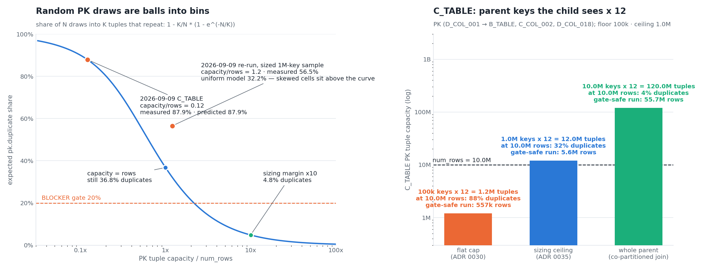
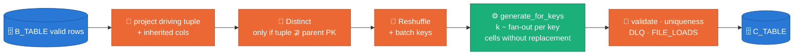
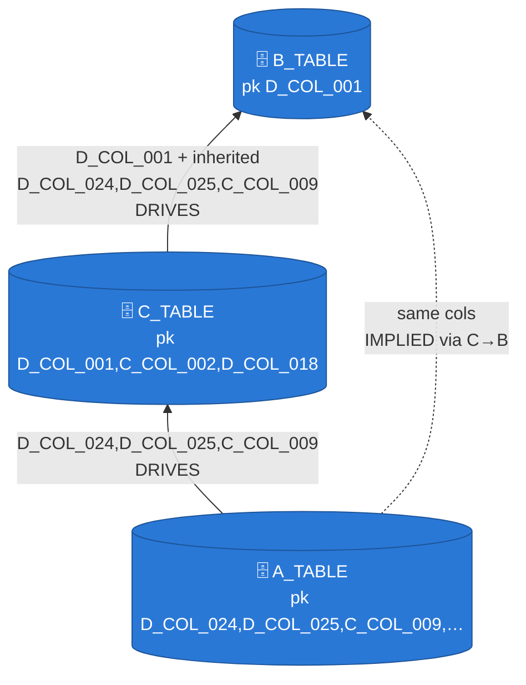

# Parent-driven fan-out generation — children are generated from their parent's keys

**Status:** ACCEPTED (laptop, 2026-09-10) — ADR 0036; Dataflow acceptance pending the M4 three-table launch
**Amended since:** §3's driving-edge table is superseded — ADR 0036 **rev 2** (derived driving parent + widening) and [ADR 0037](../adr/0037-multi-parent-children.md) (first-declared default; the `independent` and `conditional` roles replace the "neither driving nor implied" stop). The rest of this document stands; what a launch does when the full source disproves a declared `pk:` is [ADR 0038](../adr/0038-measured-conflicts-adjust-the-model.md), which post-dates this design.
**Implementation rulings** made during Tasks 1–11 that this doc predates (design intent unchanged, mechanism refined) are recorded in [ADR 0036 §Decision](../adr/0036-parent-driven-fanout-generation.md#decision) D1–D6, numbered inline as `[Ruling N]`.
**Depends on:** [ADR 0030](../adr/0030-single-job-relational-generation.md) (single-job relational launch) · [ADR 0031](../adr/0031-joint-fk-key-draws.md) (joint key tuples) · [ADR 0032](../adr/0032-relationships-as-config.md) (model files) · [ADR 0035](../adr/0035-pk-capacity-fk-bound-members.md) (why random draws cannot key a child)
**Supersedes, for in-job edges:** the FK key-pool side input and its cap (ADR 0030/0031/0035), the IPF child-marginal weighting (ADR 0031 D2), and `--num_rows` on driven children
**Decided by:** [ADR 0036](../adr/0036-parent-driven-fanout-generation.md)
**Evidence:** the two 2026-09-09 three-table launches in [`make_pk_capacity_figures.py`](https://github.com/albertols/synthetic-llm-dataflow-bigquery/blob/d32c34743d80c8481445956939b6bbde9c4d4a3c/scripts/doc/make_pk_capacity_figures.py) — 87.9% then 56.5% `pk.duplicate` on C_TABLE at 10M rows, both from random draws of a PK that contains an FK

## 1. Evidence — what the two runs proved



*The measured story is in ADR 0035: a PK assembled from random draws is
balls into bins. Run 1 saw 100k parent keys (87.9% duplicates); run 2
saw 1M (56.5%, above the uniform curve because the categoricals are
skewed). The right panel shows the ceiling of that road: even the whole
10M-key parent leaves ~4% duplicates at 10M rows, and the ADR 0031
co-partitioned join would buy exactly that — coverage, not a key.*

Two facts the runs made explicit:

1. **A child's row count is not a free parameter.** C_TABLE's rows are
   B_TABLE's keys times the children each key has. Asking for
   10M of both is asking for a ratio the source does not have.
2. **A PK that contains an FK is a per-parent key.** `(D_COL_001,
   C_COL_002, D_COL_018)` is unique *inside* each parent key. The draw must
   be structured per parent key, not across the table.

## 2. The mechanism


*Left — the child's size is the parent count times the source fan-out
histogram, zero bucket included. Right — inside one parent key, drawing
the PK-completing cells at random collides at
`1 − C/k·(1 − e^(−k/C))`; drawing them without replacement never does,
and the source PK guarantees `k ≤ C`.
`sdfb_core/engines/fanout.py::FanoutPlan` (to be built).*



The child's Generate stage consumes the parent's landed key tuples
instead of synthetic batch requests. For each key the engine draws how
many children it owns from the source fan-out histogram, draws the
PK-completing categorical cells for that key without replacement,
copies the inherited columns, and fills every other column through the
existing samplers and pools. There is no side input, no cap, and no
join. Grandchildren fan out from children by the same mechanism.

## 3. The contract — `config/relationships/*.yaml`

Two additions, no new concepts.

**Inherited columns ride on the edge.** C_TABLE's edge widens to
`cols: [D_COL_001, D_COL_024, D_COL_025, C_COL_009] → B_TABLE (same)`.
The tuple already travels jointly (ADR 0031); the parent's PK inside it
determines the rest, so grouping by the wide tuple equals grouping by
the parent key. The engine copies inherited columns from the key tuple and
keeps them out of the per-column samplers, exactly as FK columns are
kept out today.

**One driving edge per child.** The edge whose parent's keys the child
is generated from.

| Child's enforced in-job edges | Driving edge | Preflight |
|---|---|---|
| exactly one | that edge | — |
| several, one marked `drives: true` | the marked edge | every other edge must be *implied* (below) |
| several, none marked | — | **stop**: name the candidates and the one-line edit |

> **Superseded, twice.** The last row never shipped as written: ADR 0036
> **rev 2** derives the driving edge when no edge is marked (the
> most-derived parent drives and its edge is widened), and
> [ADR 0037](../adr/0037-multi-parent-children.md) D2 completes the rule
> — with no marker and no ancestry, the **first declared** edge drives
> with a `fk_driving_edge_defaulted` WARNING. The "must be *implied*"
> column went with it: a non-implied edge is now `independent` or
> `conditional`, not a stop. The only stop left is two edges marked
> `drives: true` on one table.

An edge is **implied** when its columns are a subset of the driving
edge's columns and the driving parent carries those columns from that
other parent through its own enforced edge (transitively). A_TABLE's
edge to B_TABLE is implied through C_TABLE's widened edge. An edge that
is neither driving nor implied was, at the time of writing, a preflight
stop with the exact edit — before ADR 0036 it was a silent overwrite
(`_draw_fk_columns` writes each edge's columns in turn; the last edge
wins). ADR 0037 replaced that stop with the `independent` and
`conditional` roles.



Documented (`enforced: false`) edges and parents landed in earlier jobs
are unchanged. Root tables, and children whose only enforced parents
are external, keep today's path: `--num_rows`, driver-side BQ pools,
the ADR 0035 capacity check.

## 4. Launch-time statistics

**Fan-out histogram per driving edge**, measured driver-side on the
*source* child table: children per parent tuple, grouped by the edge's
child columns, as `k → number of parent tuples with k children`. The
zero bucket is the source parent's distinct tuple count over `ref_cols`
minus the child's distinct tuple count. Cached in the source stats
store keyed by source table, edge columns and model sha, so a re-launch
pays nothing. One `fk_fanout_measured` milestone per edge: `parents=
children= mean= p50= p95= max= zero_share=`.

```sql
-- one scan of the FK columns; BigQuery bills those columns only
SELECT n AS k, COUNT(*) AS parents
FROM (SELECT <child cols>, COUNT(*) AS n FROM `<source child>` GROUP BY <child cols>)
GROUP BY n
```

**PK-completing cells from the source, not the sample.** The joint
distribution of the PK-completing categoricals is measured by the same
kind of query (`GROUP BY <categorical PK members>` on the source child),
cached alongside the histogram. The 5k-row reference sample is the
fallback when the store is absent; at hundreds of millions of source
rows the sample under-represents rare cells, and rare cells are exactly
where a per-key draw without replacement must be able to go.

**Derived rows.** A driven child's expected size is the parent's row
count in this launch times the mean fan-out including zeros. Roots take
`--num_rows`; a `--num_rows` on a driven child is refused at preflight
with the derived figure. The launch card lists the derived count per
table before anything runs (`relational_single_job rows_detail=`), and
grandchildren chain from their parent's derived count.

**Preflight for driven children** replaces the ADR 0035 random-draw
check with a per-key check: the largest `k` in the histogram must fit
in the joint cells the PK-completing categoricals cover (source cells,
sample fallback). If it does not, the declared PK is not a key in the
source either, and preflight says so. A `--num_rows` on a driven child
is refused with the derived figure. Unbounded PK members (patterns, numerics, temporals)
pass as today. The random-draw check stays for root tables.

## 5. DAG shape

- **Input is the parent's valid rows**, after its uniqueness barrier,
  projected to the driving tuple plus inherited columns. A Distinct runs
  only when the tuple does not contain the parent's PK (A_TABLE driven
  by C_TABLE's parent-key tuple): a shuffle of three narrow columns.
- **Reshuffle, then batch keys.** The Reshuffle breaks fusion with the
  parent's write path so child generation spreads across the fleet.
  Keys per batch = batch size / mean fan-out, so a batch carries about
  today's row count.
- **Same DoFn, a second request shape.** `GenerateRecordsDoFn` accepts
  `{"keys": [...], "batch_id": ...}` next to `{"n": ..., "batch_id":
  ...}`; the engine is built in `setup()` as today. The data dependency
  on the parent replaces the side-input barrier.
- **Chunked emission.** The DoFn emits children in chunks of at most
  the batch size regardless of key boundaries, so a hot key (a parent
  with tens of thousands of children in the source tail) never produces
  an oversized bundle; the per-key without-replacement state lives
  inside the DoFn call and carries across chunks of the same key.
- **Uniqueness mode for driven children.** A PK completed by the
  fan-out draw is unique by construction, so a driven child with no
  identity columns defaults to `--uniqueness_mode=streaming` (no
  landing-path barrier — WS6 W3); the gate still folds the measured
  count, and a non-zero reading is a generator regression. Streaming
  measures on TWO digest branches: the whole-row digest
  (`row.duplicate`) and, whenever `pk_columns` is declared, the PK
  tuple's digest (`pk.duplicate`) — without the second branch the very
  claim this design makes (the PK is unique by construction) would be
  the one thing the driven default cannot see. A byte-identical row
  counts under both rules, so the pair is an upper bound. Roots and
  identity-bearing tables keep `exact` (ADR 0034). At 100M rows the
  barrier is the dominant stage, so this is the largest single saving
  of the design.
- **Downstream is unchanged**: ValidateRecord, the single uniqueness
  barrier (ADR 0034), DLQ, FILE_LOADS sinks, run summary and gate.
  `num_rows_requested` becomes the derived expectation.
- **The in-DAG FK gate is skipped for driven edges.** It needs the
  parent key set as a side input, which is what this design removes.
  Integrity is by construction; the playbook's post-run orphan query
  stays as the independent measured check.

## 6. Engine API

- `GenerationEngine.generate_for_keys(keys, cfg)` on the ABC, next to
  `generate_batch(n, cfg)`. Roots keep the old path untouched.
- A shared `sdfb_core/engines/fanout.py` does the relational part for
  both engines: per key, `k` from the histogram; `k` distinct cells by
  weighted sampling without replacement from the joint cell
  distribution; inherited columns copied from the tuple. `k > cells`
  cannot happen after preflight; if it does the batch fails into the
  DLQ as `engine_failure` rather than emitting a duplicate.
- **Cost per key is O(k), not O(C).** With `k ≪ C` (the common case)
  the draw is weighted sampling with rejection of repeats — expected
  O(k) draws, no O(C) array per key; when `k` approaches `C` it
  switches to a full weighted permutation (Efraimidis–Spirakis, O(C
  log k)). A 100M-key parent with a 10k-cell PK completion therefore
  costs ~10⁸·k operations, not 10¹².
- Everything else is the engine's existing sampling for the batch's
  total row count; FK, inherited and PK-completing columns are
  overridden afterwards, where `_draw_fk_columns` overrides FK columns
  today.
- The rng per key is seeded from the run seed and the key's hash: the
  same parent yields the same children on a re-run.

## 7. Observability and validation reading

| Milestone | Where | Reads as |
|---|---|---|
| `fk_fanout_measured edge= parents= children= mean= p50= p95= max= zero_share=` | launcher, per driving edge | the source ratio the child will reproduce |
| `fk_edge_role edge= role=driving\|implied\|external` | launcher, per edge | which edge generates, which is satisfied by construction |
| `relational_single_job rows_detail=` | launcher | derived row count per table, before the GPU spends |
| `relational_fk_edge … mode=fanout keys_in=` | worker, per driven edge | the edge generated from parent keys, and how many |
| `pk.duplicate` in `validation_runs.dlq_by_rule` | run summary — measured in BOTH `exact` and `streaming` mode (the streaming PK digest branch) | expect **0** on a fan-out-completed PK; non-zero = generator regression (the ADR 0031 `fk.orphan` reading). Counted alongside `row.duplicate`, so a byte-identical row shows in both: an upper bound |
| playbook orphan query | post-run | independent integrity check, now for every driven edge |

## 8. Acceptance criteria

1. `tests/unit/engines/test_fanout.py`: histogram sampling honours the
   zero bucket; the without-replacement draw never repeats a cell and
   matches the weights in aggregate; inherited columns copy verbatim;
   the same key yields the same children under the same seed;
   `k > cells` raises.
2. Preflight: driving-edge derivation, the `drives:` ambiguity stop, the
   implied-edge rule on the A_TABLE shape, the per-key PK check, the
   derived row count and the refusal of `--num_rows` on a driven child.
3. DirectRunner, three-table shape with the fakes: every child FK tuple
   exists in the parent; `pk.duplicate = 0`; landed rows within
   sampling noise of parents × mean fan-out; both A_TABLE edges hold.
4. Model-file tests: widened edge, `drives: true`, `implied` derivation.
5. M4: `B_TABLE → C_TABLE → A_TABLE` at 10M B_TABLE rows; C_TABLE and
   A_TABLE derive; `validation_runs` reads PASSED with `pk.duplicate`
   absent, the orphan query returns 0 on both driven edges, and
   `stats_diff_<child>.md` keeps the FK columns inside the ADR 0025 band.

## 9. Rollout

1. ADR 0036 + this doc; `make_fanout_figures.py` regenerates the figure.
2. Real-model edit on the M4: widen C_TABLE's edge, mark A_TABLE's
   C_TABLE edge `drives: true`. Preflight prints the derived counts.
3. The three-table launch above.
4. ADR 0035's random-draw check and sized sample remain for root tables
   and external parents; the side-input ceiling stops mattering for
   in-job edges.

## 10. Alternatives rejected

- **Co-partitioned join (ADR 0031 §6).** Coverage, not a key: random
  draws still collide in the heavy cells (~4% at the whole parent,
  more with skew), the ratio is whatever uniform sampling yields, and
  it re-adds a child-sized shuffle ADR 0034 removed.
- **Hybrid** (fan-out for PK-bearing edges, join for the rest): two
  mechanisms for one problem.
- **Fan-out from the reference sample.** A 5k-row sample of a 10M-row
  child almost never holds two rows of one parent; it reads k = 1
  everywhere.

## 11. Scale — hundreds of millions of rows across related tables

The requirement (2026-09-10): performance, reliability, accuracy and
scalability at hundreds of millions of rows over a model that will
exceed ten tables. What each level of the chain costs under this design,
and what it does not cost:

| Concern | Per driven child | Compared with today |
|---|---|---|
| Shuffle | ONE narrow shuffle of the parent's key tuples (Reshuffle; ~50 B/key → ~5 GB per 100M parent keys) plus a Distinct of the same width when the tuple lacks the parent PK | no side-input broadcast (the 1M-tuple ceiling is gone); no child-sized CoGroupByKey (the join alternative would add ~100 GB per 100M children) |
| Uniqueness barrier | none on the landing path in `streaming` mode (PK unique by construction; duplicates still measured) | ADR 0034's single full-row barrier stays for roots only — at 100M rows it is the dominant stage |
| Memory per SDK process | the reference sample, pools and the engine as today; the histogram and cell table are KB | no key pool of up to 1M tuples per process |
| CPU per row | the existing vectorized samplers; the per-key draw adds O(k) | the IPF fit (4.7 s per engine at 100k keys, super-linear) is gone |
| GPU | unchanged: pools are per column, batched, independent of row count | — |
| Chain depth | each level is a stage keyed off its parent's valid rows; Dataflow schedules levels as parents finish, one fleet, one vLLM ignition (ADR 0030/0034) | same |
| Reliability | a retried bundle regenerates the same children (rng seeded per key); chunked emission bounds bundle size under hot keys; the histogram and cells are cached by source sha, so a re-launch pays no BQ scan | side-input recompute and IPF refit on every retry today |
| Accuracy | fan-out and PK cells from the full SOURCE, not a 5k sample; FK by construction; PK by construction | marginals from the sample; FK by construction; PK by chance |

Where the ceiling now is: the parent's own size. A 100M-row root still
pays its generation and its exact barrier; children ride on it. The
first real number for this table comes from the M4 launch in §8.5 —
until then the row is a design claim, not a measurement, and the
milestone report must say so.

## 12. Figure provenance

| Figure | Script | Content |
|---|---|---|
| `assets/pk-capacity-random-draws.png` | `scripts/doc/make_pk_capacity_figures.py` | MEASURED: the two 2026-09-09 runs on the balls-into-bins curve; the capacity ladder |
| `assets/fanout-generation.png` | `scripts/doc/make_fanout_figures.py` | CONCEPT (seed 7): fan-out histogram → derived rows; per-key random vs without-replacement duplicates |

Regenerate: `uv run --no-sync python3 scripts/doc/make_fanout_figures.py`.
Palette: BLUE truth / ORANGE defect / AQUA healthy; the OKLab check
prints on every run.
