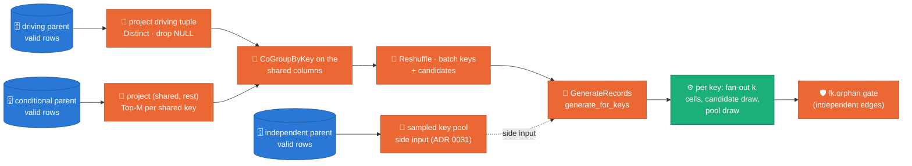
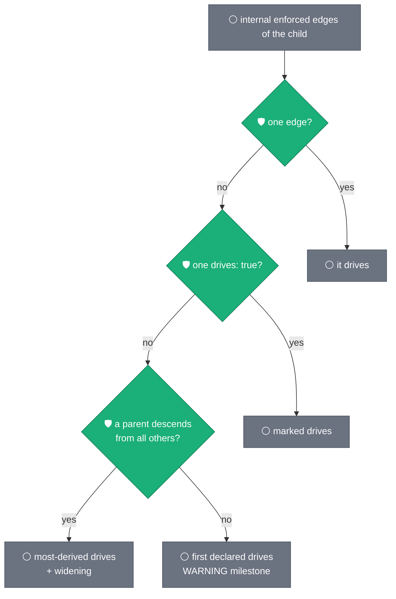

# Multi-parent children — independent and conditional edges

**Status:** DESIGN → implemented on `ws12-fanout-generation` (ADR 0037).
Extends [ADR 0036](../adr/0036-parent-driven-fanout-generation.md)
(parent-driven fan-out, one driving edge per child) and reuses
[ADR 0031](../adr/0031-joint-fk-key-draws.md) (joint key-tuple pools).
Companion: [ADR 0037](../adr/0037-multi-parent-children.md) records the
decision; this document is the argument and the contract.

## 1. Evidence — the shapes a model can declare and what the launch did

The 2026-09-11 five-table expansion of the anonymised production-shaped model
(`A_TABLE`, `C_TABLE`, `E_TABLE`, `F_TABLE` enabled; hub `B_TABLE` and
`D_TABLE` detached) stopped at preflight three times in one evening, each
on a shape ADR 0036 never saw: a root whose FK member points at a
disabled parent (fixed ef66717), a 3.6e27-string pattern member (fixed
ca8f948), a true 1:1 child whose PK **is** its driving edge (fixed
8573665). The shape sweep written afterwards
(`packages/sdfb-tests/tests/unit/contracts/test_relationship_shapes.py`)
pins what the registry resolves today and names the two shapes it
cannot:

| shape | registry today | why |
|---|---|---|
| hub with many children | resolves | one edge per child |
| chain / tree | resolves | one edge per child |
| forest of components, 1:1 chains | resolves | one edge per child |
| child → parent **and** grandparent | resolves | grandparent edge `implied` (carried through the parent, ADR 0036 D4) |
| **star-schema fact**: child → `dim_a`, child → `dim_b`, no ancestry between them | **stops** | second edge is neither driving nor implied |
| **true diamond**: `left`/`right` both under `top`, `bottom` → both | **stops** | second edge shares `T` with the driving edge and adds `R` |

Under ADR 0036 D4 an edge that is neither driving nor implied is a
`RelationshipError`, because before ADR 0036 the engine wrote every
edge's columns in turn and the last one silently won. This design
gives those two edges a role and a mechanism instead of a stop, and
keeps every guarantee ADR 0036 made for the driving edge.

## 2. The mechanism — four roles, three DAG paths



**Claim:** every enforced in-set edge of a child reaches the engine
through exactly one of three paths, and each path is correct by
construction for the columns it owns.

| role | when | DAG path | what the row gets | integrity |
|---|---|---|---|---|
| `driving` | the edge whose parent keys the child is generated from (ADR 0036) | key-batch request stream | the whole driving tuple, inherited columns, PK cells | by construction |
| `implied` | columns ⊆ driving columns and carried by the driving parent from that parent (ADR 0036 D4) | none | nothing to draw | by construction, through the driving edge |
| `independent` **(new)** | no column shared with the driving edge (a star-schema dimension) | sampled key pool as a side input (ADR 0030/0031 path, unchanged) | a whole parent key tuple, drawn per row | by construction from the pool; the `fk.orphan` gate measures it |
| `conditional` **(new)** | at least one column shared with the driving edge, and possibly more (a diamond branch) | co-partitioned `CoGroupByKey` on the shared columns, before batching | the shared columns come from the driving key; the rest is one candidate tuple that exists in the parent for that shared value | by construction; unmatched keys follow the NULL policy (§4) |
| `external` | parent outside the launch | driver-side pool (unchanged) | whole tuple | by construction; a column overlap with the driving edge is logged, not resolved (§9) |

Overlap is by **child column name**: the child column `T` in
`(T,L)->left` and in `(T,R)->right` is one column with one value, so it
must satisfy both parents. `rest` is the edge's columns outside the
overlap; it may be empty — then the edge is a pure existence filter
(`(K)->P` driving and `(K)->Q` conditional: the child's `K` must exist
in `Q` too).

## 3. Which edge drives — the rule, in order

1. One internal enforced edge → it drives.
2. Exactly one edge marked `drives: true` → it.
3. No marker: the parent that descends from every other candidate
   parent drives, and its edge to the other parent is widened with the
   child's pins (ADR 0036 rev 2 — unchanged).
4. **No marker and no ancestry between the parents (ruling A, 2026-09-11):
   the first declared internal enforced edge drives.** The launcher logs
   `fk_driving_edge_defaulted table= edge= hint='mark drives: true to
   choose'` at WARNING and the card tags it `DRIVES (first declared)`.
   Toggling `enabled` stays enough; `drives: true` remains the override.
5. More than one `drives: true` is still a `RelationshipError`.

The only stop left in `edge_roles` is rule 5. Every other internal edge
is driving, implied, independent or conditional.



**Claim:** the driving edge is a pure function of the model file and
never a launch stop unless two edges are both marked.

## 4. The conditional path in detail

For a driving edge `D` (`D.cols` → `P_D.ref_cols`) and a conditional
edge `X` (`X.cols` → `P_X.ref_cols`):

- `overlap(X) = [c for c in X.cols if c in D.cols]` (child names, in
  `X.cols` order); `rest(X) = [c for c in X.cols if c not in D.cols]`.
- **Driving side** — the projected key tuple `k` is aligned to
  `D.ref_cols`; its join key is `tuple(k[D.cols.index(o)] for o in overlap)`.
- **Parent side** — each `P_X` valid row maps to
  `(join_key, rest_value)` with `join_key = tuple(r[X.ref_cols[X.cols.index(o)]]
  for o in overlap)` and `rest_value = tuple(r[X.ref_cols[X.cols.index(c)]]
  for c in rest)`. Rows whose join key holds a NULL are dropped
  (`fanout/candidates_dropped_null`), Distinct unless the projection
  contains `P_X`'s declared PK, then **Top-M per join key** ordered by
  `blake2b(run_id, rest_value)` — a deterministic sample of at most
  `M = --fk_candidate_cap` (default 64) candidates per shared value, so a
  hot shared key never carries an unbounded list.
- **Join** — `{"k": keyed driving keys, "c": candidates} | CoGroupByKey`,
  then one element per driving key: `(k, {edge_id: [rest_value, …]})`.
  Several conditional edges chain one join each. The result goes through
  the existing Reshuffle → BatchElements → request payload, which gains
  `"matches": {edge_id: [candidates_for_key_0, …]}` aligned with `keys`.
  `edge_id = f"({','.join(X.cols)})->{X.ref}"` — the label the launcher's
  milestones already print. The PARENT is part of the id: two conditional
  edges from the SAME child columns to different parents are declarable,
  and a columns-only id let the second join overwrite the first in
  `matches` (review ruling 14).
- **Engine** — `generate_for_keys(keys, cfg, matches=None)`. Per key,
  `sdfb_core.engines.base.conditional_draws` calls
  `sdfb_core.engines.fanout.joint_key_draw` (fix wave A1, final review;
  the cell rule corrected by fix wave E1): the cell each child carries
  AND every conditional edge's candidate are decided JOINTLY, one walk
  over the CROSS PRODUCT of the dimensions that genuinely BOUND the
  combination. This replaced two INDEPENDENT `i % len` cyclic walks
  (`conditional_values`, deleted) whose realised combinations were only
  `lcm(n_cells, c_1, …, c_m)`, not their product — 2 cells × 2 candidates
  gave 2 combinations for 4 children, not 4 — and which RAISED inside
  `CellTable.draw(k, exact=True)` the moment a key's fan-out exceeded an
  exact cell table. `apply_conditional_overrides` reads the candidate
  half of the `KeyDraw` and writes it on `rest(X)`'s child columns
  **after** the pool draws and **before** the driving/cell overrides,
  exactly where B.2 already applies pool tuples.
- **The cell rule turns on EXACTNESS, not on conditional edges** (fix
  wave E1). `plan.exact_cells` — the cells must KEY the child, so child
  `i`'s FIRST `_mixed_radix` digit indexes a per-key seeded weighted
  PERMUTATION of the cell rows (`CellTable.permutation`): two children of
  one key never share a cell, exactly as ADR 0036 drew them, and
  candidate digits only start advancing once the cells are exhausted.
  Otherwise — an unbounded PK member (pattern, numeric, temporal) keys
  the child instead — the cells carry only their measured MARGINAL: each
  child draws one independently WITH replacement
  (`CellTable.draw(exact=False)`), and the cell dimension is NOT part of
  the mixed-radix walk at all. A permutation prefix here handed a 99:1
  cell table out 50:50 at a fan-out of 2, silently inverting that
  column's distribution for the whole table — the defect the earlier
  wording ("the cell digit varies fastest… either way") missed. Each
  conditional edge is still shuffled per key either way
  (`derive_key_seed(run_id, key, salt=edge_id)`).
- **Capping vs. wrapping.** Capacity is the product of the dimensions
  that genuinely bound the PRIMARY KEY: the cell count ONLY when
  `exact_cells`, times — per conditional edge whose `rest` supplies a PK
  member (`ConditionalEdge.pk_member`, set by the launcher from
  `effective_pk_of`) — its ACTUAL candidate count for that key, or
  **1** when that edge has none, because NULL-filling that edge is exactly
  ONE combination (a NULL is not a key member, ADR 0031, so it neither
  drops the key nor multiplies what it can represent — fix wave E2's
  correction: a candidate-less nullable edge used to disable capping for
  the WHOLE combination instead of contributing a factor of 1, which let
  a 2-row cell table emit PK-duplicate rows with `shortfall == 0`, no
  warning). The fan-out is CAPPED at that capacity (`min(k, capacity)`)
  if, and only if, `plan.exact_cells`; a capped key's shortfall
  (`requested - emitted`) is reported once per worker process **per
  driven table** (fix wave E3 — keyed on the landing table, so a
  single-job relational run's later driven tables are no longer
  invisible) as `fanout_rows_capped`. An INEXACT PK never caps — an
  unbounded member completes it, so capping would drop rows the PK can
  legitimately represent — and its candidate digits wrap (`i % capacity`
  over the candidate radices alone) while its cells keep drawing
  independently from their measured weights, untouched by the wrap.
- **An edge outside the PK bounds nothing (fix wave G1).** A role of
  `conditional` only means the edge SHARES a column with the driving
  edge; whether its `rest` keys anything is a separate question, and only
  the edges that do may multiply the capacity. A child PK `(T, GRADE, R)`
  with 2 `GRADE` cells, a keying edge offering 3 candidates and a LOOKUP
  edge offering 20 computed `2 × 3 × 20 = 120 ≥ 100`, emitted all 100
  children of a hot key and reported `shortfall == 0` — but only
  `2 × 3 = 6` distinct `(GRADE, R)` pairs exist, so 94 rows landed or
  diverted as `pk.duplicate` with no `fanout_rows_capped`. Preflight P4
  (§6) always counted only the PK-touching edges, so the two now spell
  ONE rule. The non-PK edges walk their own radices, so each child still
  draws its own candidate instead of freezing on the first. `pk_member`
  defaults to **false** when a payload omits it: under-counting caps
  early and says so, over-counting is silent.
- **NULL policy (ruling B, 2026-09-11; both schemas since fix wave A4)**
  — a key with no candidate: when every `rest(X)` column is NULLABLE in
  BOTH the landing schema AND the generation schema, the engine writes
  NULL there (the tuple is then legitimately parentless, ADR 0031);
  otherwise `GenerateRecordsDoFn` removes the key before generation,
  increments `fanout/keys_unmatched`, and emits one DLQ envelope
  `rule_id="fk.unmatched"`, `error_type="referential_integrity"`,
  weighted by the key's expected rows (`n / len(keys)`), so the BLOCKER
  gate sees the lost rows. When the two schemas DISAGREE (landing
  NULLABLE, generation REQUIRED — the record model would otherwise
  silently reject the row and the engine's own `except Exception: continue`
  would discard it with no envelope, counter or milestone), the edge is
  treated as NON-nullable and one
  `fk_nullable_schema_mismatch table= edge= landing= generation= reason=
  pk=` WARNING names it. The same applies to a `rest` column inside the
  PK the run ENFORCES — the relationship model's `pk:` (ADR 0032), with
  `TableSchema.primary_keys` standing in only when the model declares
  none (`reason=declared_pk`, fix waves F2 + G2): the record model
  rejects a NULL there whatever the mode says, and reading the BQ
  constraint alone never fired on the canonical setup, where it is
  `None`. `rest(X)` empty (pure existence filter) is never nullable: an
  unmatched key is dropped and counted.

**Claim (figure `multi-parent-candidate-cap.png`):** with the default
cap, the PARENT-side candidate list for a shared value holds fewer than
64 entries only where the parent offers 64 or fewer candidates for that
value; the source's tail decides, and the cap is a flag. This is the
list `_conditional_candidates` builds — it says nothing on its own about
whether the ENGINE wraps or caps a fan-out beyond it; that is the
capping-vs-wrapping rule two bullets up.


*A shared value's candidate list is truncated only when its distinct
candidates outrun the cap.* Formally the list holds `min(c, M)` entries
for candidate count `c` and cap `M = --fk_candidate_cap`; the truncation
attributable to `M` is confined to `c >= k > M` (the orange wedge),
while `k > c` is forced by the source and identical at every cap. What
the engine does with a `k` beyond the list size it receives is NOT
"wrap" in the common case any more — see the capping-vs-wrapping bullet.
Mechanism: `_conditional_candidates` (`sdfb_beam/pipeline.py`) sizes the
list; `sdfb_core.engines.fanout.joint_key_draw` (via
`sdfb_core.engines.base.conditional_draws`) decides whether a fan-out
beyond it caps or wraps.

The sequence below is the concrete `(T,L,R)` diamond from §1: `bottom`'s
PK is exactly the driving edge `(T,L)` plus the conditional `rest`
`(R)`, so there is no additional PK-completing member and `n_cells = 1`
trivially — `exact_cells` holds and the `right` candidates are
non-empty, so the common CAPPING path applies, not wrapping. A key
needing more distinct combinations than its cells alone provide (for
example an extra categorical PK column outside both edges) multiplies
that trivial `1` up: fix wave A1's acceptance shape asks for 3 children
from a 2-row cell table with 2 candidates and gets all 3, pairwise
distinct, from the 2×2=4 joint combinations
(`test_fanout_beyond_the_cells_rides_the_conditional_candidates`).

```mermaid
sequenceDiagram
  participant K as driving key (T=t1, L=l7)
  participant J as CoGroupByKey on T
  participant C as right candidates for T=t1
  participant G as joint_key_draw
  K->>J: (t1) → key
  C->>J: (t1) → [r3, r9, r1] (Top-M by hash)
  J->>G: key + matches {"(T,R)->right": [r3, r9, r1]}
  G->>G: k = 5 requested; n_cells = 1 (trivial); capacity = 1 x 3 = 3
  G->>G: order = shuffle([r3,r9,r1]) = [r9,r3,r1]
  G-->>G: rows get R = r9, r3, r1 — CAPPED at 3, not wrapped to 5
  G-->>G: fanout_rows_capped requested=5 emitted=3 capacity=3 (once/worker/table)
```

## 5. The independent path — nothing new, one wall removed

An independent edge is today's ADR 0030/0031 side-input pool: the
parent's landed keys, sampled to `key_sample_cap`, delivered to the
Generate ParDo as `fk_side`, drawn as whole tuples inside the engine
(`_draw_fk_columns` in B.1, the pool loop in B.2 — both already run
inside `generate_for_keys`), and checked by `EnforceFkIntegrityDoFn`.
The one change is in `_route_parent_edges`: a driven child may carry
side-input edges next to its driving edge. ADR 0036 D1 forbade it
because a side-input edge sharing columns with the driving edge would be
overwritten; that case is now `conditional`, so what remains on the
side-input path is disjoint by construction.

## 6. Preflight — capacity with the new members (P4, ADR 0035/0036, corrected fix wave A2)

`_check_driven_pk` keeps its shape (exact members only) and learns ONE
factor per key, not two:

- a **conditional** edge whose `rest` sits in the PK contributes at most
  `--fk_candidate_cap` (the operator's flag, used as-is — §4):
  `max_k ≤ n_cells × Π (--fk_candidate_cap)` — one factor per conditional
  edge in the PK — or the launch stops naming the edge or the flag. This
  factor is an UPPER bound, not a promise: `joint_key_draw` (§4) caps a
  key at what its co-parent ACTUALLY offered, which can be fewer than
  the flag, and reports the gap as `fanout_rows_capped` rather than
  silently under-delivering.
- an **independent** edge is NOT a factor, corrected from the original
  design above. Its pool is drawn per ROW WITH REPLACEMENT
  (`_draw_fk_columns`), so two children of one parent key CAN and DO
  draw the same parent tuple — counting its pool cap here declared PKs
  safe that the engine then duplicated (the review's finding). Its
  columns still count as `known` (no cell table is measured over them),
  but the stop names it as a NON-factor rather than offering "a parent
  that lands more keys", which never actually helped.

Members outside the PK never enter P4. Inexact PKs (an unbounded member)
skip P4 as today; streaming uniqueness measures `pk.duplicate`.

## 7. Scale — what each path costs at 100M+ rows

| path | shuffle | memory | bound |
|---|---|---|---|
| independent | one sampled side input per edge (≤ 1M tuples, ADR 0035 ceiling) | per worker: the pool | unchanged from ADR 0031 |
| conditional | per edge: one Distinct (skipped when the projection holds the parent PK) + one Top-M combine on the parent side, one CoGroupByKey on the driving keys | per request: `keys_per_batch × M × Σ\|rest\|` values | `keys_per_batch` is lowered so candidate TUPLES per request never exceed 100k — until `M × n` passes 100k on its own, which WARNS (see note) |
| driving | unchanged | unchanged | unchanged |

The conditional row's 100k ceiling bounds candidate TUPLES, not the raw
value count: `keys_per_batch` (`in_set_parent_edges` in
`run_pipeline.py`) is lowered so `keys_per_batch × M × n` — one tuple
per key per conditional edge, `n` conditional edges — never exceeds
100k. The per-request VALUE count is `keys_per_batch × M × Σ|rest|`
(summed over the conditional edges' `rest` column counts), which
exceeds the tuple ceiling whenever a conditional edge's `rest` spans
more than one column. `M` here is `--fk_candidate_cap`, the operator's
flag, used VERBATIM (fix wave F1 reverted an A3 attempt to clamp it to
the measured max fan-out: `M` sizes the Top-M SAMPLE per shared JOIN
VALUE, reused by every driving key carrying that value, not a per-key
allotment, so clamping it collapsed a 1:1 driving edge's shared value to
one candidate — a point mass, most of the co-parent's rows never
referenced, on the default flag). The payload-size concern A3 was
reaching for is already served by `keys_per_batch` above — up to the
point where it cannot be. `100_000 // (M × n)` floors at 1, so once
`M × n` exceeds 100k on its own, ONE key per request still carries
`M × n` tuples and nothing bounds it further. The cap stays unclamped
(F1's ruling), and the degenerate bound is named instead: one
`fk_candidate_request_unbounded table= candidate_cap= conditional_edges=
tuples_per_request= ceiling=` WARNING per table at launch (fix wave G5).

Hot shared keys: the parent side is capped at M by the combine, the
driving side is an iterable the runner streams. Both joins are keyed on
narrow tuples, never on rows. No new side input grows with the driving
parent.

## 8. Observability

| milestone / counter | where | meaning |
|---|---|---|
| `fk_edge_role … role=independent\|conditional overlap=` | launcher, per edge | the role and, for conditional, the shared columns |
| `fk_driving_edge_defaulted table= edge=` (WARNING) | launcher | rule 4 chose; mark `drives: true` to choose yourself |
| `fk_edge_overlap_external table= edge= other= overlap= note=` (WARNING) | launcher, once per overlapping PAIR with an external end — **including a single-table launch**, where no edge roles are resolved (fix wave G3) | fix wave F3: `edge=` is always the external one, `other=` what it clashes with — driving∩external, external∩external or external∩any non-driving edge; the last write wins, so `other`'s tuple may not exist in its own parent |
| `fk_nullable_schema_mismatch table= edge= landing= generation= reason= pk=` (WARNING) | launcher, once per conditional edge | fix waves A4 + F2 + G2: `reason=` is `declared_pk`, `schema_mode_mismatch`, or both — landing/generation schemas disagree on this edge's `rest` nullability, and/or a `rest` column (named in `pk=`) sits in the PK the run ENFORCES (the model's `pk:`, else the DDL constraint), which rejects NULL regardless of mode |
| `fk_candidate_request_unbounded table= candidate_cap= conditional_edges= tuples_per_request= ceiling=` (WARNING) | launcher, per table | fix wave G5: `--fk_candidate_cap × conditional edges` passes the 100k per-request ceiling on its own, so `keys_per_batch` has floored at 1 and bounds the request no further. Lower the cap |
| `relational_fk_edge mode=side_input\|conditional overlap=` | worker, per edge | the DAG path each edge took |
| `fanout_bound … conditional=<n> candidate_cap=` | worker, once | the engine's plan (`candidate_cap` is `--fk_candidate_cap` verbatim — fix wave F1) |
| `fanout_rows_capped requested= emitted= capacity=` (WARNING) | worker, once per process PER DRIVEN TABLE | fix waves A1/E2/E3/G1/G4: a key's PK-bounding dimensions (cells when `exact_cells`, times the candidate count — or 1 — of each conditional edge whose `rest` supplies a PK member) could not represent its full fan-out, so `emitted < requested`; keyed on the landing table so every driven table of a single-job run reports its own capping |
| `fanout/candidates_dropped_null`, `fanout/keys_unmatched` | counters | parent rows with a NULL shared key; keys with no candidate (non-nullable) |
| `fk.unmatched` | DLQ rule | one envelope per dropped key, weighted by its expected rows |

The card renders `[enforced, independent]` and
`[enforced, conditional on (T)]`; `card.py --mermaid` draws them as solid
edges with the role in the label.

## 9. Out of scope, named

- **Any external edge sharing a written column with another edge** —
  not just the original driving∩external case (the driver-side pool is
  drawn as a whole tuple and the driving edge overwrites the shared
  columns): fix wave F3 extended coverage to external∩external and
  external∩any non-driving edge too, since the cross-edge ownership stop
  (final review, ADR 0037 Consequences) cannot apply any of its remedies
  to an external edge. Every such
  pair logs one `fk_edge_overlap_external table= edge= other= overlap=
  note=` WARNING (`edge=` always the external one) instead of stopping
  the launch — in a SINGLE-TABLE launch too, where no edge roles are
  resolved at all and the classic denormalised child (both parents
  external) used to launch with no stop AND no signal, its rows diverting
  as `fk.orphan` at run time with nothing in the launch log naming the
  overlap (fix wave G3). The risk is named plainly, not resolved: the last edge
  written keeps the shared column, so the OTHER edge's tuple may not
  exist in its own parent — unchanged from before ADR 0037, now visible
  instead of silent. Bring the parent into the launch to resolve it.
- **Weighted conditional draws** — candidates are uniform within the
  match set. ADR 0031's IPF weighting stays on the independent path.
- **Correlation between branches** — a diamond's `L` and `R` are drawn
  independently given `T`; the source's joint `(L,R)` distribution is
  not reproduced. Documented as a limitation of the design.

## 10. Acceptance

DirectRunner, fake client, whole-tuple checks — eight tests in
`packages/sdfb-tests/tests/unit/test_fanout_shapes.py` (8 passed):

- **star**: `dim_a`, `dim_b`, `fact` — every `fact` row's `A_ID` in
  `dim_a`, `B_ID` in `dim_b`; PK unique; row count within the histogram.
- **diamond**: `top`, `left`, `right`, `bottom` — every `(T,L)` in
  `left`, every `(T,R)` in `right`, and the two `T`s are one value.
- **beyond the cells** (fix wave A1,
  `test_fanout_beyond_the_cells_rides_the_conditional_candidates`): a
  driven child asks 3 children per key from a 2-row cell table with a
  conditional edge covering the rest — the cells and candidates jointly
  offer 2×2=4 combinations, so all 3 land, pairwise distinct, in the
  exact regime that used to raise inside `CellTable.draw(exact=True)`.
- **inexact cells keep their skewed marginal** (fix wave E1,
  `test_inexact_cells_keep_their_skewed_marginal`): an UNBOUNDED PK
  member (a synthesized `SEQ_ID`) plus a conditional edge together — the
  cell column is drawn WITH replacement from its 9:1 source weights,
  landing > 0.75 on the heavy cell (a permutation prefix lands exactly
  0.5) with at least one key repeating a cell across its children.
- **existence filter**: `(K)->P` driving, `(K)->Q` conditional with
  empty rest: every landed `K` is in `Q`; the keys not in `Q` reach the
  DLQ as `fk.unmatched` with the expected-row weight.
- **nullable branch**: `R` NULLABLE and half the `T`s absent from
  `right`: those rows land with `R = NULL`, no DLQ.
- **graph**: six tables mixing a tree, a star fact, a diamond and a 1:1
  chain; zero orphans on every enforced edge, `generation_waves` order
  respected.
- **two conditional edges to different parents** (review ruling 14,
  `test_two_conditional_edges_to_different_parents`): a child column
  that is an existence filter against TWO co-parents at once — each
  edge's own `edge_id = (cols)->ref` keeps its candidates from
  overwriting the other's in `matches`.
- **registry**: the shape sweep's strict xfails pass with the marker
  removed; `test_true_diamond_rejoining_at_the_bottom`
  (`test_relationship_shapes.py`, no `drives:` marker on `left`/`right`,
  no ancestry between them) resolves to "first declared drives, the
  other is conditional".

## 11. Figure provenance

| figure | file | generated by |
|---|---|---|
| candidate cap vs wrap | `docs/designs/assets/multi-parent-candidate-cap.png` | `scripts/doc/make_multi_parent_figures.py` (CONCEPT block: seeded Zipf fan-out per shared value, caps 16/64/256) |
| DAG shapes and the driving rule | inline mermaid above | — |

Regenerate: `uv run --no-sync python3 scripts/doc/make_multi_parent_figures.py`.
