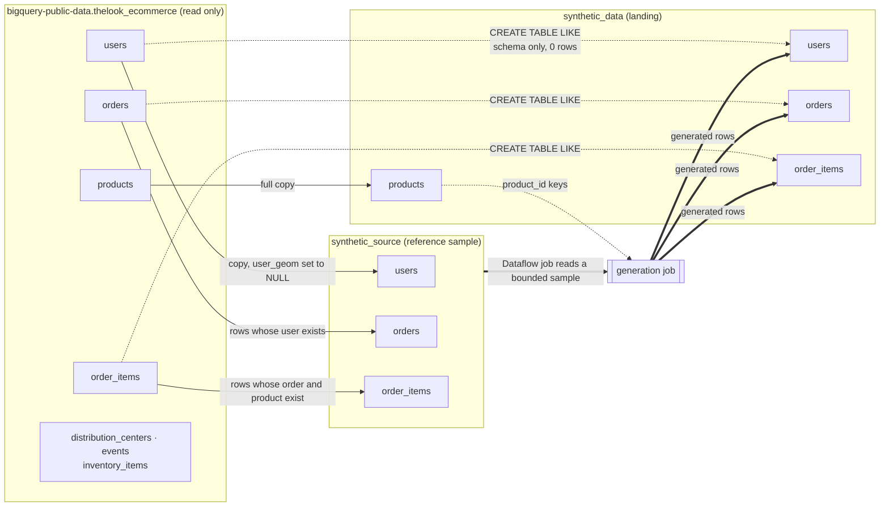
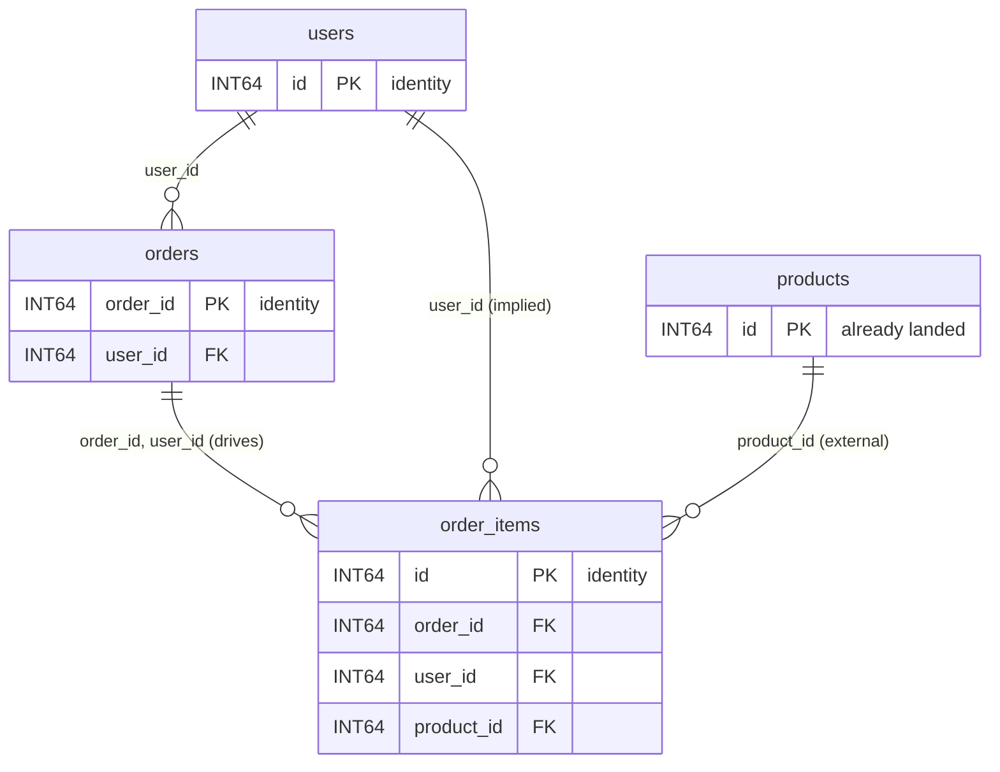
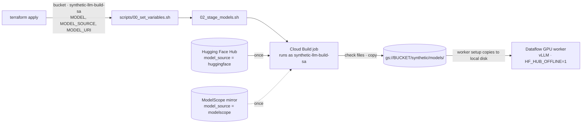
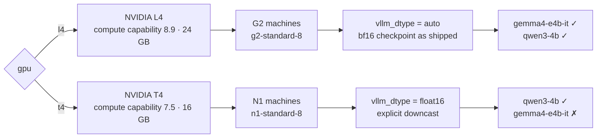

# Synthetic data generation

This directory contains the Terraform code to deploy the Google Cloud
infrastructure and permissions for the synthetic data generation solution
guide, into an existing project and network. It can also launch the
generation job.

These deployment scripts are part of the
[Dataflow synthetic data generation solution guide](../../use_cases/Synthetic_Data_Generation.md).

## Tables: what comes from `thelook_ecommerce`

The demo generates three related tables of the fictitious
`bigquery-public-data.thelook_ecommerce` dataset. Nothing in your project is
a view or a partition of the public dataset: Terraform runs one BigQuery
script at apply time that copies what the job reads and creates empty
tables for what the job writes.



| Public table | `synthetic_source` | `synthetic_data` | In the relationship model |
| :-- | :-- | :-- | :-- |
| `users` | All rows, same schema; `user_geom` (GEOGRAPHY) values nulled | Empty table `LIKE users`, then generated | Root: `num_rows` rows |
| `orders` | Rows whose `user_id` exists in `users` | Empty table `LIKE orders`, then generated | Child of `users` |
| `order_items` | Rows whose `(order_id, user_id)` exists in `orders` and `product_id` in `products` | Empty table `LIKE order_items`, then generated | Child of `orders`; drives the launch |
| `products` | — | Full copy, never generated | External parent of `order_items.product_id` |
| `distribution_centers`, `events`, `inventory_items` | — | — | Not used |

The source snapshots and the landing tables keep the public names, column
order and types, so the landing schema is exactly the public one. The job
writes with `create_if_not_exists=false` into these tables and never
creates a table. GEOGRAPHY values are nulled in the snapshot because the
generator does not synthesize WKT; a column that is all NULL in the
reference sample is generated as NULL. `inventory_item_id` has no declared
relationship, so it is generated as a plain column.

The foreign keys come from
[`config/relationships/gcp_public_fk_example.yaml`](../../pipelines/synthetic-llm-dataflow-bigquery/config/relationships/gcp_public_fk_example.yaml),
never from table descriptions:



Targeting `order_items` launches the whole component in one job: `users`
first, then `orders` from the user keys that landed, then `order_items` from
the order keys that landed, with `product_id` drawn from `synthetic_data.products`.

### Pipeline tables

Every other table has the dataset, name and schema of a file in the
pipeline's
[`config/bq_schema/<dataset>/<table>.schema.json`](../../pipelines/synthetic-llm-dataflow-bigquery/config/bq_schema/).
Terraform creates one table per file, so a schema added there is deployed
without a Terraform change.

| Dataset | Table | Partitioned by day on | Written by the job |
| :-- | :-- | :-- | :-- |
| `synthetic_data_quality` | `dlq` | `dlq_inserted_at` | Rows that failed a check, with the rule and error context |
| `synthetic_data_quality` | `validation_runs` | `created_at` | One verdict per generated table and run |
| `synthetic_data_quality` | `fk_fanout_stats` | — | Cached parent-to-child fan-out measured on the source |
| `synthetic_rag` | `rag_chunks` | `created_at` | Embedded reference rows, reused across runs |
| `synthetic_rag` | `freetext_pools` | — | LLM-built value pools for free-text columns, reused across runs |
| `synthetic_rag` | `source_table_stats` | — | Per-column statistics of each source table |

## Configuration the job reads

The image packages the pipeline's `config/` directory; the launch parameters
select from it.

| File | Read by | What it sets for this deployment |
| :-- | :-- | :-- |
| [`config/relationships/gcp_public_fk_example.yaml`](../../pipelines/synthetic-llm-dataflow-bigquery/config/relationships/gcp_public_fk_example.yaml) | Launcher, `relationships_uri` | Primary keys, identity columns and foreign keys of `users`, `orders`, `order_items`. Point `relationships_uri` at a `gs://` copy to change them without rebuilding the image. |
| [`config/thresholds.yml`](../../pipelines/synthetic-llm-dataflow-bigquery/config/thresholds.yml) | The job, `thresholds_uri` default, `env=dev` | Severity per rule. PK duplicates and FK orphans are BLOCKERs with a threshold of 0; the job fails when more than 20% of rows fail a BLOCKER rule on `dev` (5% `uat`, 1% `prd`). |
| [`config/models.yml`](../../pipelines/synthetic-llm-dataflow-bigquery/config/models.yml) | Nobody at runtime: a registry | GCS layout, Hugging Face repository, license and GPU memory of each model. Terraform's `model` variable picks the matching `gcs_uri` as `model_uri`. |
| [`docker/flex_template_metadata.json`](../../pipelines/synthetic-llm-dataflow-bigquery/docker/flex_template_metadata.json) | `03_build_flex_template.sh` | The Flex Template parameter contract. |
| [`config/bq_schema/`](../../pipelines/synthetic-llm-dataflow-bigquery/config/bq_schema/) | Terraform | The pipeline tables above. |

## Open-weight models: Hugging Face to Cloud Storage

Terraform does not download model weights. A multi-gigabyte download inside
`terraform apply` would run on the operator's machine, repeat on every
replacement, and leave nothing useful in the state. Terraform creates what
the download needs, and `scripts/02_stage_models.sh` runs it once as a Cloud
Build job in your project:



| `model` | Repository (same id on both hubs) | GCS prefix under `synthetic/models/` | License |
| :-- | :-- | :-- | :-- |
| `gemma4-e4b-it` (default) | `google/gemma-4-E4B-it` | `gemma4/e4b-it/v1/` | Apache-2.0 |
| `qwen3-4b` | `Qwen/Qwen3-4B-Instruct-2507` | `qwen3/4b-instruct-2507/v1/` | Apache-2.0 |
| embedder, always staged | `BAAI/bge-small-en-v1.5` | `embedders/bge-small-en-v1.5/v1/` | MIT |

All three repositories are public and ungated, so the build needs no token.
It copies only the configuration, tokenizer and `safetensors` files, and
fails if a checkpoint is incomplete or has no chat template. Workers read the
weights from the bucket only: the image sets `HF_HUB_OFFLINE=1` and
`TRANSFORMERS_OFFLINE=1`.

Alternatives:

* **Your own copy.** Upload any checkpoint in the same layout, for example a
  fine-tuned model, with `gcloud storage cp --recursive`, and pass its prefix as
  `model_uri`.
* **A gated repository.** Store a Hugging Face token in Secret Manager, grant
  `synthetic-llm-build-sa` access, and add it to
  `cloudbuild_stage_models.yaml` as `availableSecrets` (`HF_TOKEN`).
* **Weights inside the image.** Not used here: the image would grow by the
  model size, every worker would pull it at startup, and a model change would
  need an image rebuild.

## GPU, machine type and vLLM dtype

Each worker has one GPU. The `gpu` variable picks the machine family, the
accelerator and the dtype vLLM serves the model with, and it limits which
models can run:



| `gpu` | GPU | Machine family (default) | `worker_accelerator` | Models | `vllm_dtype` |
| :-- | :-- | :-- | :-- | :-- | :-- |
| `l4` (default) | NVIDIA L4, compute capability 8.9, 24 GB | G2 only (`g2-standard-8`) | `type:nvidia-l4;count:1;install-nvidia-driver` | `gemma4-e4b-it`, `qwen3-4b` | `auto`: serves the bf16 checkpoint as is |
| `t4` | NVIDIA T4, compute capability 7.5, 16 GB | N1 only (`n1-standard-8`) | `type:nvidia-tesla-t4;count:1;install-nvidia-driver:5xx` | `qwen3-4b` only | `float16`, required |

Why the dtype depends on the GPU:

* Both checkpoints ship in bf16, which needs compute capability 8.0 or
  higher. An L4 runs them as they are.
* A T4 cannot run bf16. Qwen is numerically safe in fp16, so the explicit
  `float16` downcast is what makes it run there.
* Gemma is not fp16-safe: its activations overflow and it silently emits
  empty output. The worker refuses `float16` for a Gemma checkpoint, so there
  is no Gemma-on-T4 configuration. Terraform stops at plan time if you ask for
  one.
* `vllm_max_model_len=8192` caps the KV cache. Without it, vLLM sizes it for
  Qwen's native 262K context (about 36 GiB), which fits neither GPU.

`machine_type` can be any size of the family (`g2-standard-4` to `-16` all
carry one L4), and Terraform rejects a machine type from the other family.
The T4 driver pin `:5xx` follows Dataflow's guidance for vLLM. Check that
`region` offers the GPU and that you have quota for it. Terraform writes
`GPU`, `MACHINE_TYPE`, `ACCELERATOR` and `VLLM_DTYPE` to
`scripts/00_set_variables.sh`, and both launches use them.

## Bill of resources created by this script

| Resource | Name | Description |
| :-- | :-: | :-- |
| Project services | — | Artifact Registry, BigQuery (+ Storage API), Cloud Build, Compute, Dataflow, IAM, Logging, Monitoring, Storage. Never disabled on destroy. |
| Docker registry | `synthetic-llm-containers` | Artifact Registry repo for the single launcher + GPU worker image. The build service account can write, the Dataflow service account can read. Keeps the 3 latest versions. |
| Service account | `synthetic-llm-dataflow-sa` | Flex Template launcher and Dataflow workers: Dataflow worker/developer, BigQuery data editor, job user and read session user, Storage object admin, metrics and log writer. |
| Service account | `synthetic-llm-build-sa` | Cloud Build identity for `01_build_and_push_container.sh` and `02_stage_models.sh`: log writer, Storage object admin, Artifact Registry writer. |
| BigQuery datasets | `synthetic_source`, `synthetic_data` | Source snapshots and landing tables, see [Tables](#tables-what-comes-from-thelook_ecommerce). |
| BigQuery datasets | `synthetic_data_quality`, `synthetic_rag` | One per directory in `config/bq_schema/`. |
| BigQuery tables | 6 pipeline tables | One per schema file, see [Pipeline tables](#pipeline-tables). |
| BigQuery job | `sdfb-thelook-tables-*` | One script: snapshots, `products` copy and empty landing tables. It runs again only when the script changes; landing tables that exist are kept. |
| Dataflow job | `sdfb-thelook-tf-*` (opt) | The generation job, only when `launch_job = true`. |
| Subnet IAM | — | `roles/compute.networkUser` for the Dataflow service account on `subnetwork`, only when it is set (local or Shared VPC). |
| GCS bucket | `bucket_name` (opt) | Model weights, Dataflow temp and staging, and the Flex Template spec. Created only if `create_bucket = true`. |

All datasets are in `US`, next to the public data: BigQuery cannot join
across locations.

## Configuration variables

| Variable | Type | Description |
| :-- | :-: | :-- |
| `project_id` | `string` | Required. Existing project where resources are provisioned. |
| `region` | `string` | Required. Region for Dataflow, Cloud Build, Artifact Registry and the bucket. It must offer the chosen GPU (for example `us-central1`). |
| `bq_location` | `string` | Optional. Default `US`, the location of `bigquery-public-data.thelook_ecommerce`. |
| `subnetwork` | `string` | Optional. Subnetwork path or URI for the workers. It needs Private Google Access, because workers have no public IP. |
| `bucket_name` | `string` | Optional. Defaults to `project_id`. |
| `create_bucket` | `bool` | Optional. Default `false`. |
| `service_account_name` | `string` | Optional. Default `synthetic-llm-dataflow-sa`. |
| `build_service_account_name` | `string` | Optional. Default `synthetic-llm-build-sa`. |
| `model` | `string` | Optional. `gemma4-e4b-it` (default, needs `gpu = "l4"`) or `qwen3-4b`. |
| `model_source` | `string` | Optional. `huggingface` (default) or `modelscope`, where `02_stage_models.sh` downloads from. |
| `gpu` | `string` | Optional. `l4` (default, G2, dtype `auto`) or `t4` (N1, dtype `float16`, `qwen3-4b` only). See [GPU, machine type and vLLM dtype](#gpu-machine-type-and-vllm-dtype). |
| `machine_type` | `string` | Optional. A machine type of the GPU's family. Default `g2-standard-8` for `l4`, `n1-standard-8` for `t4`. |
| `num_rows` | `number` | Optional. Rows for the root table `users`. Default `1000`. |
| `launch_job` | `bool` | Optional. Default `false`. `true` launches the generation job from Terraform. |
| `destroy_all_resources` | `bool` | Optional. Default `true`: `terraform destroy` also removes table contents and the bucket. Use `false` for anything you want to keep. |

## How to deploy

1. Create `terraform.tfvars` in this directory:
   ```hcl
   project_id    = "YOUR_PROJECT_ID"
   region        = "us-central1"
   create_bucket = true
   bucket_name   = "YOUR_PROJECT_ID-synthetic-llm"
   # subnetwork  = "regions/us-central1/subnetworks/YOUR_SUBNET"
   ```
2. Run `terraform init` and `terraform apply`.
3. From the [pipeline directory](../../pipelines/synthetic-llm-dataflow-bigquery/README.md),
   build the image, stage the models and publish the template:
   `./scripts/01_build_and_push_container.sh`, `./scripts/02_stage_models.sh`
   and `./scripts/03_build_flex_template.sh`.
4. Launch the job, either way:

   ```mermaid
   flowchart LR
     a[terraform apply] --> b[01 image] --> c[02 models] --> d[03 template]
     d --> e1[04_run_dataflow.sh<br/>gcloud]
     d --> e2[terraform apply<br/>-var launch_job=true]
     e1 & e2 --> f[05_verify_run.sh RUN_ID]
   ```

   * **gcloud:** `./scripts/04_run_dataflow.sh [NUM_ROWS]` prints the `RUN_ID`.
   * **Terraform:** `terraform apply -var launch_job=true`. The run id is the
     job name without the `sdfb-` prefix (`thelook-tf-…`). Both launches pass
     the same parameters; the Terraform test fails if they drift apart.
     Terraform re-creates a finished batch job on the next apply, so apply
     without `launch_job` once the job is done.
5. `./scripts/05_verify_run.sh RUN_ID` checks row counts, primary-key
   duplicates, foreign-key orphans and the `validation_runs` verdicts.

The account that runs the scripts needs permission to act as both service
accounts (`roles/iam.serviceAccountUser`) and quota for the chosen GPU in `region`.

## Scripts generation

Terraform writes `../../pipelines/synthetic-llm-dataflow-bigquery/scripts/00_set_variables.sh`
with every name above. The pipeline scripts source it automatically; to use
the variables in your shell:

```bash
source ./scripts/00_set_variables.sh
```

## How to remove

This is a batch pipeline, so nothing keeps running once a job finishes.

**BEWARE: THE COMMAND BELOW DESTROYS ALL THE MANAGED RESOURCES, INCLUDING THE GENERATED TABLES.**

```bash
terraform destroy
```
