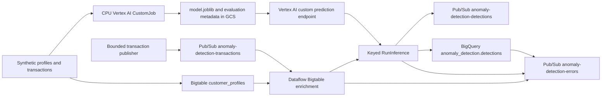

# Real-time anomaly detection

This executable demonstration trains an Isolation Forest on synthetic transactions,
deploys it to a managed Vertex AI endpoint, and enriches incoming transactions with
Bigtable customer averages before batched Dataflow inference. Every successful
prediction is published to Pub/Sub and archived in BigQuery.



The [one-pager](one_pagers/anomaly_detection_dataflow_onepager.pdf) and
[architecture PDF](guides/anomaly_detection_dataflow_guide.pdf) remain architectural
references. This Markdown walkthrough and the component READMEs describe the
executable implementation.

## Prerequisites and identities

Use an existing billing-enabled Google Cloud project, an existing network, and
one region supporting Dataflow, Bigtable, CPU Vertex AI custom training and online
prediction. Reserve quota for one `n1-standard-4` training worker, one
`n1-standard-2` endpoint replica, one `n1-standard-2` Dataflow worker and one
Bigtable node. Resource names such as `anomaly-detection-transactions`,
`customer_profiles`, and BigQuery dataset `anomaly_detection` are collision-resistant
to prevent clashes in existing or shared projects.

Install Terraform, the Google Cloud CLI, Docker with a running daemon, and
**Python 3.14**. The entire solution runs on **Python 3.14** across all tiers:
Dataflow pipeline workers, local tooling, custom training containers, and custom
prediction serving containers. Google's prebuilt scikit-learn training image reached
end of availability on July 11, 2026, and the prebuilt prediction image
(`sklearn-cpu.1-6`) reaches end of patch support on October 14, 2026. To avoid the
vendor deprecation treadmill and guarantee long-term stability, custom Python 3.14
containers (`python:3.14-slim`) are built and deployed for both training and serving.

Authenticate the CLI with your approved user or impersonated identity. For local
Python and Terraform, configure Application Default Credentials, for example:

```bash
gcloud auth application-default login
```

The infrastructure deployer needs API-enablement, application-resource creation
and IAM-management permissions. The workflow operator needs Vertex AI job/model/
endpoint creation, read, deployment, deletion and endpoint IAM permissions; it
must be able to act as the dedicated training identity. The Dataflow submitter
must be able to create Dataflow jobs and act as the dedicated worker identity.
The seed/publish/smoke operator also needs Bigtable table writes, input-topic
publishing, temporary subscription management, output/error topic attachment,
BigQuery table read and `bigquery.jobs.create`, and artifact-bucket object access.
These operator privileges are distinct from the restricted worker roles.

Terraform creates `anomaly-detection-sa` and `anomaly-training-sa`. The worker gets
input-subscription consume, output/error-topic publish, profile-table read,
detections-table write, staging-bucket object access, repository read, Dataflow
worker and metrics roles. The training identity can write only objects beneath
`anomaly-training/` in the configured bucket and read the repository. The workflow
adds the custom `anomalyDetectionPredictor` role to its endpoint for the worker;
that role contains only `aiplatform.endpoints.predict`.

Ensure the actual Cloud Build execution identity can write the image repository,
read uploaded sources and write build logs. Terraform retains the legacy Cloud
Build account's repository writer binding, but a project using another build
identity must grant those permissions to that identity. Standard Google-managed
Vertex AI service agents must retain their service-agent roles to read model
artifacts and run training/deployment. Cross-project buckets or organization IAM
restrictions may require additional grants from their owners.

The existing subnet must provide Private Google Access, sufficient IP addresses,
and worker TCP ingress/egress on ports 12345 and 12346 for the `dataflow` tag.
Configure NAT where internet access is needed. Dataflow always launches with
private worker IPs and its dedicated service account. `SUBNETWORK` supports local
and Shared VPC paths; the legacy `NETWORK` variable is a fallback **subnet path**.
A standard authenticated Vertex AI endpoint is used; it does not require a public
IP on the Dataflow workers.

## 1. Provision application resources

From the repository root:

```bash
cd terraform/anomaly_detection
```

Create an ignored `terraform.tfvars`:

```hcl
project_id = "YOUR_PROJECT_ID"
region = "us-central1"
subnetwork = "regions/us-central1/subnetworks/YOUR_SUBNET"
bucket_name = "YOUR_EXISTING_BUCKET"
create_bucket = false
# Set false to protect Bigtable, the detections table and managed bucket contents.
destroy_all_resources = true
```

For Shared VPC, use a full subnet URL containing the host project. Terraform grants
subnet-level network-user access to the worker; the deployer must have permission
to set that subnet's IAM policy. Terraform does not create a project, billing
association, network, firewall or NAT. Existing bucket reuse is the default.

```bash
terraform init
terraform fmt -check
terraform validate
terraform plan -out=tfplan
terraform apply tfplan
cd ../../pipelines/anomaly_detection
source scripts/00_set_variables.sh
python3.14 -m venv .venv
source .venv/bin/activate
python -m pip install -r requirements.txt -r requirements-tooling.txt -r requirements-dev.txt
```

Never edit `00_set_variables.sh` manually; Terraform regenerates it. It includes
topics, subscriptions, Bigtable names, the BigQuery table, identities, image names
and network settings.

## 2. Build the worker, training, and serving containers

```bash
bash scripts/01_build_and_push_container.sh
bash scripts/01_build_training_container.sh
source .deployment/training_environment.sh
bash scripts/01_build_serving_container.sh
source .deployment/serving_environment.sh
```

All three builds run through Cloud Build:
- **Dataflow worker**: Built on `apache/beam_python3.14_sdk:2.76.0`, keeping strict parity with `apache-beam[gcp]==2.76.0`.
- **Vertex AI training**: Custom Python 3.14 container (`python:3.14-slim`) with `scikit-learn>=1.6,<2`, `numpy>=2.0,<3`, `scipy>=1.15,<2`, and `joblib>=1.4,<2`.
- **Vertex AI serving**: Custom Python 3.14 container (`python:3.14-slim`) with FastAPI and Uvicorn exposing standard Vertex AI prediction routes (`/health`, `/predict`).

The training and serving scripts resolve their pushed tags to immutable digests and write `.deployment/training_environment.sh` and `.deployment/serving_environment.sh`.

Google's prebuilt **training** container reached its published availability end on July 11, 2026. The prebuilt **prediction** container (`sklearn-cpu.1-6`) reaches end of patch support on October 14, 2026. Custom containerization under Python 3.14 guarantees uniform dependency versions, modern Python runtime support, and complete decoupling from prebuilt container deprecation timelines.

## 3. Train, validate the artifact and deploy

```bash
python -m anomaly_detection_pipeline.workflow train
python -m anomaly_detection_pipeline.workflow validate
python -m anomaly_detection_pipeline.workflow deploy
source scripts/03_endpoint_environment.sh
python -m anomaly_detection_pipeline.workflow verify
```

`train` submits one CPU CustomJob, waits for remote completion and records the
artifact URI in Cloud Storage. The trainer creates 5,000 normal training examples
and evaluates against 1,000 independently generated normal/anomalous transactions.
It exports `model.joblib` and `metadata.json`, including evaluation metrics,
feature order, seeds, sample counts and dependency versions.

`validate` downloads that run's trusted artifact and executes it inside the
custom Python 3.14 serving container using local Docker. The report includes the
artifact SHA-256, serving digest and resolved dependencies. `deploy` requires this
stage, uploads the model using the verified serving digest (`SERVING_CONTAINER_URI`),
configures health route `/health`, predict route `/predict`, port 8080, creates
an endpoint, deploys one CPU replica (`n1-standard-2`), and adds worker prediction
IAM (`roles/anomalyDetectionPredictor`). It creates a separate ignored endpoint
environment file. `verify` checks a batch of two numeric vectors and requires two
scalar predictions in `{-1, 1}`.

The ignored `.deployment/manifest.json` records ownership, resource names, image
URIs, compatibility evidence and completed stages. Keep it until cleanup. Re-run
the same command with the same manifest to resume a partial run. A local lock
prevents simultaneous commands using that manifest; do not copy it to multiple
machines and run them concurrently. Interrupted creates are reconciled by the
unique `workflow_run` label. If an outcome remains ambiguous, the command stops
without creating a duplicate. Inspect the region's Vertex AI operations and
resources, wait for pending operations, and retry. Only after proving an operation
failed without creating a resource should you remove its specific `pending`
marker (or `deploy_pending`). Never delete the whole manifest to retry.

To use a compatible external endpoint, skip training/validation/deployment, set
`MODEL_ENDPOINT` and optionally `MODEL_LOCATION` (defaults to `REGION`), then run
`verify`. Its owner must grant the worker `aiplatform.endpoints.predict` on that
endpoint. The endpoint must accept the same three ordered numeric features and
return one scalar `-1` or `1` for every instance. External endpoints and models
are never adopted into the manifest or deleted by workflow cleanup.

## 4. Seed profiles and launch Dataflow

The solution clearly separates the **client-side testing and demonstration harness** ([`anomaly_detection_pipeline/demo.py`](file:///home/ihr/github/dataflow-solution-guides/pipelines/anomaly_detection/anomaly_detection_pipeline/demo.py), executed via `workflow.py`) from the **remote Dataflow worker pipeline** ([`anomaly_detection_pipeline/pipeline.py`](file:///home/ihr/github/dataflow-solution-guides/pipelines/anomaly_detection/anomaly_detection_pipeline/pipeline.py)).

Before launching the streaming pipeline or publishing transactions, use the client-side harness to seed Bigtable with customer reference profiles:

```bash
python -m anomaly_detection_pipeline.workflow seed
bash scripts/02_run_dataflow.sh
```

### The role of `demo.py` in end-to-end testing and demonstrations

The client-side harness ([`anomaly_detection_pipeline/demo.py`](file:///home/ihr/github/dataflow-solution-guides/pipelines/anomaly_detection/anomaly_detection_pipeline/demo.py)) provides three core operations exposed via `workflow.py`:

1. **State seeding (`seed`)**:
   Connects directly to Bigtable (instance `anomaly-detection`, table `customer_profiles`, family `profile`, qualifier `average_amount`) and writes 100 deterministic baseline profiles (`customer-0000` through `customer-0099`). This pre-populates the historical spending baseline needed by Dataflow workers to calculate the amount-to-average ratio.
2. **Synthetic data generator (`publish`)**:
   Generates a bounded batch of synthetic transactions and publishes them to `anomaly-detection-transactions`. Every 5th transaction is generated as an intentional anomaly (e.g. 10x spending spikes or anomalous locations). It outputs the generated `transaction_id`s in JSON so you can query and observe them flowing through BigQuery in real time.
3. **Automated cloud smoke verification (`smoke`)**:
   Executes a self-contained, automated integration test across the live pipeline:
   - Creates dedicated temporary Pub/Sub subscriptions on both the output detections topic (`anomaly-detection-detections`) and the dead-letter error topic (`anomaly-detection-errors`).
   - Publishes valid transactions (normal and anomalous).
   - Injects negative test cases: a **malformed JSON** payload (missing required schema fields) and a **missing profile** transaction (customer ID not in Bigtable).
   - Polls Pub/Sub and queries BigQuery to verify that all valid IDs arrive in both sinks and that both negative test cases are caught and routed to `anomaly-detection-errors`.
   - Cleans up all temporary subscriptions in a `finally` block upon completion or timeout.

### Dataflow streaming execution

Profiles are keyed by customer ID in Bigtable instance `anomaly-detection`, table
`customer_profiles`, column family `profile`, qualifier `average_amount`.
Re-seeding writes the same 100 deterministic customer averages. Capture the
Dataflow job ID printed during submission; do not repeatedly launch the streaming
job to retry a smoke test.

Input messages on `anomaly-detection-transactions` contain JSON such as:

```json
{"transaction_id":"txn-001","customer_id":"customer-0000","timestamp":"2026-09-05T12:00:00Z","amount":135.1,"distance_from_home":12.0,"recent_transaction_count":2}
```

Features are `[amount / customer_average_amount, distance_from_home,
recent_transaction_count]`. Distance is in kilometres; recent count is supplied
by the event producer (use a consistent window, such as the previous hour).
This pipeline does not compute that rolling count. Amounts and averages must use
the same currency. For a profile average of 135.10, the example produces
`[1.0, 12.0, 2.0]`. Metadata is retained through keyed batched `RunInference`.

The Pub/Sub detection and BigQuery row have the same schema:

```json
{"transaction_id":"txn-001","customer_id":"customer-0000","timestamp":"2026-09-05T12:00:00Z","features":[1.0,12.0,2.0],"prediction":1,"is_anomaly":false,"endpoint":"projects/YOUR_PROJECT_ID/locations/us-central1/endpoints/ENDPOINT_ID"}
```

`-1` means anomalous and `1` means normal. Output detections are published to
`anomaly-detection-detections` and streamed into BigQuery table
`anomaly_detection.detections`. The table is partitioned on `timestamp` and
clustered by customer and transaction IDs. Pub/Sub and BigQuery are independent
sinks; at-least-once processing can produce duplicates. Use `transaction_id` when
reconciling or deduplicating; this is not an atomic cross-service write.

Malformed JSON, invalid fields and missing profiles go to `anomaly-detection-errors`.
Transient Vertex failures are retried up to three times with 30-second RPC
limits; exhausted/invalid predictions also go to that topic. Permanent BigQuery
streaming insertion errors are routed there; transient insertion errors retry.
Errors carry `stage`, `input` and `error`. Counters under namespace `anomaly`
include received/enriched records, invalid or missing profiles, predictions,
inference failures and BigQuery failures.

## 5. Publish and verify the complete path

Wait for the Dataflow job to reach `Running` status in the Google Cloud Console or via `gcloud dataflow jobs list`. Once running, choose between an automated end-to-end smoke test or an interactive live demonstration:

### Option A: Automated end-to-end test (`smoke`)

To run an automated, end-to-end validation test of the entire pipeline (including Bigtable enrichment, Vertex AI inference, BigQuery ingestion, and dead-letter queue routing):

```bash
python -m anomaly_detection_pipeline.workflow smoke --count 20 --timeout 600
```

This command:
1. Provisions temporary, isolated subscriptions on both `anomaly-detection-detections` and `anomaly-detection-errors`.
2. Emits 20 transactions (including intentional anomalies), plus 2 negative edge cases: malformed JSON and an unknown customer ID.
3. Continuously checks that all 20 valid transactions arrive in Pub/Sub and BigQuery, and confirms that both negative cases are successfully routed to the error topic.
4. Cleans up all temporary subscriptions upon completion.

### Option B: Interactive live demonstration (`publish`)

To demonstrate the pipeline with manual inspection, publish a bounded stream of events:

```bash
python -m anomaly_detection_pipeline.workflow publish --count 20 --timeout 120
```

Each bounded publication generates a unique set of transaction IDs and prints it:

```json
{"transaction_ids": ["9f8c12a4b5d6-txn-000", "9f8c12a4b5d6-txn-001", ...]}
```

Synthetic event timestamps are deterministic, starting January 1, 2026; query BigQuery by the printed transaction IDs rather than today's partition date.

The synthetic model demonstrates service integration; it is **not a validated
fraud detector**. Its anomalies are deliberately separable and its offline
metrics do not establish production accuracy, fairness or calibration. Real use
requires representative data, temporal evaluation, drift monitoring and an
operational response policy.

### Verifying Bigtable enrichment and prediction plausibility

Query the BigQuery detections table to verify that feature enrichment and model inference are operating correctly:

1. **Verify Bigtable Profile Enrichment**:
   Confirm that `features[OFFSET(0)]` (`amount / customer_average_amount`) reflects dynamic lookups against Bigtable `customer_profiles`:
   ```sql
   SELECT
     transaction_id,
     customer_id,
     ROUND(features[OFFSET(0)], 3) AS amount_to_avg_ratio,
     ROUND(features[OFFSET(1)], 2) AS distance_km,
     CAST(features[OFFSET(2)] AS INT64) AS recent_tx_count,
     prediction,
     is_anomaly
   FROM `YOUR_PROJECT_ID.anomaly_detection.detections`
   ORDER BY timestamp DESC
   LIMIT 20;
   ```
   *Expected behavior*: `amount_to_avg_ratio` varies across customers and transactions, strictly matching the seeded customer profile averages from Bigtable.

2. **Verify Prediction Plausibility and Feature Distribution**:
   Inspect how the Isolation Forest model partitions feature distributions between normal transactions and anomalies:
   ```sql
   SELECT
     is_anomaly,
     prediction,
     COUNT(*) AS transaction_count,
     ROUND(AVG(features[OFFSET(0)]), 3) AS avg_amount_ratio,
     ROUND(MIN(features[OFFSET(0)]), 3) AS min_amount_ratio,
     ROUND(MAX(features[OFFSET(0)]), 3) AS max_amount_ratio,
     ROUND(AVG(features[OFFSET(1)]), 2) AS avg_distance_km,
     ROUND(AVG(features[OFFSET(2)]), 1) AS avg_recent_tx_count
   FROM `YOUR_PROJECT_ID.anomaly_detection.detections`
   GROUP BY is_anomaly, prediction;
   ```
   *Expected behavior*: Normal transactions (`is_anomaly = false`) cluster around typical baseline values (`amount_ratio ~ 1.0`, low distance, low recent count), whereas detected anomalies (`is_anomaly = true`) exhibit significantly higher average amount ratios, geographic distances, or transaction frequencies.

## 6. Cleanup and non-Terraform resource teardown

Bigtable nodes, the deployed endpoint and streaming Dataflow workers incur
recurring charges even when the publisher is idle. Also account for training,
Cloud Build, image/artifact storage, Pub/Sub, BigQuery and any existing NAT.
Stopping the publisher does not stop those resources.

Follow this ordered sequence to guarantee that all non-Terraform runtime resources
are cleanly undeployed and deleted before destroying the underlying infrastructure.

### Step 6.1: Cancel the streaming Dataflow job

```bash
gcloud dataflow jobs list --project="$PROJECT" --region="$REGION" --status=active --limit=10 --format='table(id,name,currentState)' --quiet
export JOB_ID=YOUR_DEMO_JOB_ID
gcloud dataflow jobs cancel "$JOB_ID" --project="$PROJECT" --region="$REGION" --quiet
gcloud dataflow jobs describe "$JOB_ID" --project="$PROJECT" --region="$REGION" --format='value(currentState)' --quiet
```

Wait until the Dataflow job reports `JOB_STATE_CANCELLED` or `JOB_STATE_DRAINED`.

### Step 6.2: Workflow cleanup (automated)

Run workflow cleanup to undeploy the Vertex AI endpoint, delete the model, cancel
any running training jobs, and delete the training artifact prefix in Cloud Storage:

```bash
python -m anomaly_detection_pipeline.workflow cleanup
```

Workflow cleanup reconciles pending owned creates, checks ownership labels,
undeploys and deletes its endpoint, deletes its model, cancels an active owned training
job before deleting it, and deletes only its unique training artifact prefix.
It preserves foreign deployments, external endpoints, the project, network and
reused bucket.

### Step 6.3: Non-Terraform manual cleanup fallback

If the workflow manifest was lost, modified, or if resources were created outside
the workflow runner, clean up runtime resources manually with `gcloud`:

1. **Vertex AI Endpoints**:
   ```bash
   # List endpoints
   gcloud ai endpoints list --project="$PROJECT" --region="$REGION"
   # Undeploy deployed models first
   gcloud ai endpoints undeploy-model "$ENDPOINT_ID" --project="$PROJECT" --region="$REGION" --deployed-model-id="$DEPLOYED_MODEL_ID"
   # Delete the endpoint
   gcloud ai endpoints delete "$ENDPOINT_ID" --project="$PROJECT" --region="$REGION" --quiet
   ```

2. **Vertex AI Models**:
   ```bash
   gcloud ai models list --project="$PROJECT" --region="$REGION"
   gcloud ai models delete "$MODEL_ID" --project="$PROJECT" --region="$REGION" --quiet
   ```

3. **Vertex AI Custom Training Jobs**:
   ```bash
   gcloud ai custom-jobs list --project="$PROJECT" --region="$REGION" --filter="state:JOB_STATE_RUNNING"
   gcloud ai custom-jobs cancel "$JOB_ID" --project="$PROJECT" --region="$REGION" --quiet
   ```

4. **Cloud Storage Runtime Artifacts**:
   ```bash
   # Clean up model artifacts and pipeline temporary staging files
   gcloud storage rm -r "gs://${BUCKET}/anomaly-training/" || true
   gcloud storage rm -r "gs://${BUCKET}/temp/" || true
   gcloud storage rm -r "gs://${BUCKET}/staging/" || true
   ```

5. **Ephemeral Pub/Sub Subscriptions**:
   ```bash
   # Delete any residual smoke test subscriptions
   for sub in $(gcloud pubsub subscriptions list --project="$PROJECT" --filter="name:smoke-" --format="value(name)"); do
     gcloud pubsub subscriptions delete "$sub" --project="$PROJECT" --quiet
   done
   ```

6. **Artifact Registry Container Images** (optional):
   ```bash
   gcloud artifacts docker images list "${REGION}-docker.pkg.dev/${PROJECT}/anomaly-detection-containers"
   ```

### Step 6.4: Destroy Terraform infrastructure

Once all runtime workloads and Vertex AI resources are deleted, destroy the
Terraform infrastructure:

```bash
cd ../../terraform/anomaly_detection
terraform destroy
```

Do not destroy Terraform first: its identities and bucket permissions are needed
during workflow and model cleanup.

## Local and container validation

```bash
# In pipelines/anomaly_detection with Python 3.14 activated:
python -m unittest discover -s tests -v
yapf --diff --recursive --style yapf anomaly_detection_pipeline tests training serving main.py setup.py
pylint --rcfile ../pylintrc -j 1 anomaly_detection_pipeline tests training serving main.py setup.py
python setup.py sdist
bash scripts/verify_serving_container.sh
docker build -t anomaly-worker-check .
docker run --rm --entrypoint python -v "$PWD:/source:ro" -w /source anomaly-training-check -m unittest discover -s training/tests -v
docker run --rm --entrypoint python -v "$PWD:/source:ro" -w /source anomaly-serving-check -m unittest discover -s serving/tests -v
```

CI uses Python 3.14 for all pipeline, tooling, training, and serving checks.
Terraform validation includes a mocked resource-contract test (`terraform test`,
Terraform 1.7+). Local mocks establish graph/contract behavior; only a completed
cloud smoke run establishes working IAM, networking, quotas and service integration
in a designated project. Record its project, region, job ID, manifest, image
digests and result separately from local test results.
