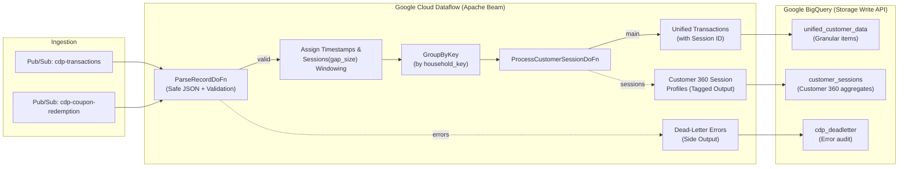

# Customer Data Platform

At its core, a real-time CDP is a sophisticated software solution designed to unify customer data from various sources, providing a single, comprehensive view of each individual customer. The "real-time" element is crucial: it emphasizes the ability to collect, process, and analyze customer data as events occur, enabling businesses to respond instantly to changing customer behaviors and preferences.

This reference architecture demonstrates how to ingest multi-stream customer events (transactions and coupon redemptions) from **Cloud Pub/Sub**, reconstruct customer journeys and shopping sessions via Apache Beam's dynamic **`Sessions(gap_size)` windowing**, aggregate Customer 360 session metrics, isolate invalid payloads into a **Dead-Letter Queue (DLQ)**, and write high-throughput records into **BigQuery** using the **Storage Write API**.

## Architecture Overview



## Documentation

- [Real-time Customer Data Platform Solution Guide and Architecture (PDF)](./guides/cdp_dataflow_guide.pdf)

## Assets included in this repository

- [Terraform code to deploy infrastructure for Customer Data Platform](../terraform/cdp/)
- [Sample streaming pipeline in Python for Customer Data Platform](../pipelines/cdp/)

## Key Architectural Capabilities

- **Dynamic Event-Time Sessionization (`window.Sessions`)**:
  - Reconstructs customer shopping journeys by dynamically grouping events that occur within an inactivity gap (default 15 minutes).
  - Handles late-arriving data safely with watermark-based accumulating triggers and allowed lateness windows.
- **Customer 360 Session Profile Aggregation**:
  - Automatically calculates session metrics: total spend, basket size, coupons redeemed, distinct products purchased, stores visited, and campaigns engaged.
- **Production Dead-Letter Queue (DLQ)**:
  - Diverts unparseable payloads or missing key violations to a dedicated BigQuery dead-letter table without halting pipeline execution.
- **High-Throughput Storage Write API**:
  - Streams granular transaction items and session summaries into BigQuery using `STORAGE_WRITE_API` for immediate analytical availability.
- **Zero Public IP Security**:
  - Fully compliant with enterprise networking guardrails, enforcing `--no_use_public_ip` and dedicated worker service accounts.

## Quickstart & Verification

1. **Provision Infrastructure**:
   ```bash
   cd terraform/cdp
   terraform init && terraform apply
   ```
2. **Launch Streaming Pipeline**:
   ```bash
   cd ../../pipelines/cdp
   source scripts/00_set_environment.sh
   ./scripts/01_build_and_push_container.sh
   ./scripts/02_run_dataflow.sh
   ```
3. **Generate Streaming Events**:
   ```bash
   python3 ./cdp_pipeline/generate_transaction_data.py --continuous --interval=1.0
   ```
4. **Inspect Unified Results & Customer 360 Profiles in BigQuery**:
   ```bash
   bq query --use_legacy_sql=false 'SELECT session_id, household_key, product_id, sales_value, coupon_upc FROM cdp_dataset.unified_customer_data LIMIT 10'
   bq query --use_legacy_sql=false 'SELECT session_id, household_key, total_spend, total_transactions, coupons_redeemed_count FROM cdp_dataset.customer_sessions LIMIT 10'
   ```
