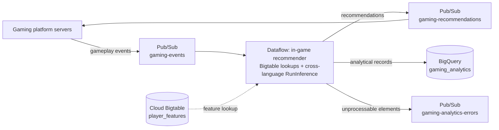

# Real-Time Gaming Analytics

Real-time gaming analytics refers to collecting, processing, and analyzing player data as it is generated during gameplay. This provides immediate insights into player behavior, game performance, and overall player experience. Incorporating real-time feedback into a game enriches both single-player and multi-player experiences and improves revenue per user when integrated with an existing application architecture.

While this solution is geared towards one single industry (gaming) on the surface, gamification is now pervasive across many verticals. The same principles apply to education, healthcare, retail and e-commerce.

This reference architecture demonstrates how to ingest gameplay events from the gaming platform servers via **Cloud Pub/Sub**, hydrate them with player features held in **Cloud Bigtable**, score them with a scikit-learn model running on the Dataflow workers, publish recommendations back to a **Pub/Sub** topic for immediate in-game activation, and persist analytical records to **BigQuery**.

In Python, the hydration and scoring steps map directly onto the turnkey `Enrichment` and `RunInference` transforms. The sample pipeline in this repository is written in Java, and the two transforms are not in the same situation there:

- `Enrichment` **is** Python only, so the Java pipeline performs the equivalent feature lookups with the Cloud Bigtable data client inside a `DoFn`.
- `RunInference` is **available to Java** through the cross-language wrapper [`org.apache.beam.sdk.extensions.python.transforms.RunInference`](https://beam.apache.org/documentation/ml/multi-language-inference/) (artifact `beam-sdks-java-extensions-python`), which runs the Python transform behind an expansion service. The Java pipeline uses it with the Python `SklearnModelHandlerNumpy`, so the model executes in the Python SDK harness on the same worker. This requires **Dataflow Runner v2** (`--experiments=use_runner_v2`).

The shape of the pipeline is the same in both languages.

## Documentation

- [Gaming Analytics Solution Guide & Architecture (PDF)](./guides/gaming_analytics_dataflow_guide.pdf)

## Architecture



The essential property of this architecture is that **Pub/Sub is used as the output**, enabling continuous injection of recommendations back into the game. Player engagement depends on the time-to-activation.

The analytics side can be part of the same pipeline or, as recommended in the guide, deployed as a separate pipeline reading from the output topic, to avoid performance interference between the in-game activation path and the analytics path.

## Assets included in this repository

- [Terraform code to deploy infrastructure for Gaming Analytics](../terraform/gaming_analytics/): Provisions the input, output and dead-letter Pub/Sub topics and subscriptions, a Cloud Bigtable feature store, a BigQuery dataset with an event-time partitioned `player_recommendations` table, an Artifact Registry repository for the custom Python SDK harness container, an optional GCS bucket, and a dedicated least-privilege Dataflow worker service account.
- [Sample streaming pipeline in Java](../pipelines/gaming_analytics_java/): Reads the gameplay events from the input subscription, hydrates them with the Cloud Bigtable player feature store, scores them with a scikit-learn model through cross-language `RunInference` running on the workers, publishes the recommendations to the output topic for in-game activation, writes the analytical records to BigQuery, and routes every unprocessable element to the dead-letter topic. It ships the custom Python SDK harness container that the scoring step runs in: the model is trained during the container build and baked into the image, so the artifact and the interpreter that unpickles it are the same versions by construction, and the image is served from Artifact Registry rather than Docker Hub. The Terraform module generates `pipelines/gaming_analytics_java/scripts/00_set_environment.sh` with every value the pipeline needs: topics, subscriptions, Bigtable coordinates, BigQuery table, worker machine type, the container URI to publish the harness image to, and `MODEL_PATH`, the location of the model inside that image.

## Design considerations

| Step | Description |
| :--- | :--- |
| **Real-time input and output (Extract)** | The architecture assumes Cloud Pub/Sub or Kafka for receiving data from the gaming servers. The Terraform module provisions Pub/Sub. Setting up the real-time export from the gaming platform into Pub/Sub is out of scope. |
| **Enrichment (Transform)** | Upstream sources are assumed to only carry ids; every other feature required for inference lives in Cloud Bigtable (or Vertex AI Feature Store), both of which are supported by the turnkey Apache Beam [`Enrichment`](https://beam.apache.org/documentation/transforms/python/elementwise/enrichment/) transform. That transform is Python only, and unlike `RunInference` it has no cross-language wrapper; the Java pipeline in this repository therefore performs the equivalent lookups with the Cloud Bigtable data client inside a `DoFn`. For any other database, use the [Web APIs I/O connector](https://beam.apache.org/documentation/io/built-in/webapis/). |
| **Inference (Transform)** | `RunInference` works both with a local model leveraging a GPU (lowest prediction latency) and with external models deployed in a Vertex AI endpoint, as a HuggingFace pipeline, or as a GenAI API. It is **reachable from Java** through the [cross-language wrapper](https://beam.apache.org/documentation/ml/multi-language-inference/), which is what the pipeline in this repository uses: the Python `SklearnModelHandlerNumpy` loads a pickled scikit-learn model in the Python SDK harness on the worker, so predictions stay in-process. This requires Dataflow Runner v2, and the Python package versions must match the ones the model was pickled with — which the guide guarantees by training the model inside the harness image itself, during the container build. scikit-learn is CPU only, so the Terraform module provisions plain CPU workers; a model that benefits from a GPU would need both an accelerator and a model handler that can use one. |
| **Output (Load)** | Predictions are written to a Pub/Sub topic that buffers activations before they are sent back to the gaming platform. For marketing platforms without a specific connector, use the Web APIs I/O connector; Google Ads has a dedicated Beam connector. |
| **Unprocessable data** | Failed elements are routed with branching outputs to a dead-letter Pub/Sub topic instead of being dropped, for later inspection and reprocessing. |

## Technical benefits

Dataflow is the premier platform for building real-time gaming analytics and in-game activation applications:

- **Streaming AI**:
  - Enhance the player experience with streaming predictions. Call models from your pipeline with `RunInference` — from Python directly, or from Java through the cross-language wrapper — either locally on the workers (CPU or GPU) or through a Vertex AI endpoint, and deliver personalized gameplay in real time.
- **Ultra-low-latency feature lookups with Cloud Bigtable**:
  - Cloud Bigtable delivers single-digit millisecond row lookups at petabyte scale, letting workers hydrate id-only events with player features without bottlenecking throughput.
- **Horizontal autoscaling**:
  - Gaming workloads oscillate over the course of a day, a week, or a launch cycle. Dataflow's horizontal autoscaling avoids overprovisioning for a big release and underprovisioning during quiet periods.
- **Event time model**:
  - Apache Beam provides rich semantics for analyzing on event time rather than processing time, preserving analytical accuracy even when players disconnect mid-session.
- **Deep I/O integration**:
  - Read performance from streaming systems such as Pub/Sub and Kafka scales effortlessly beyond 10 GB/s.
- **Global availability**:
  - Dataflow's worldwide availability, backed by Google's network infrastructure, lets stream processing respond gracefully to traffic spikes wherever they occur.

## Customer stories

- **Nintendo** deployed Pub/Sub, Dataflow, and BigQuery to collect log data from Super Mario Run, which reached 40 million downloads in four days without any major issues.
- **Niantic**'s data science teams worked with BigQuery, Bigtable, Dataflow, and Pub/Sub to support the launch of Pokémon GO, scaling to close to a million transactions per second in a matter of minutes.
- **King / Activision Blizzard** migrated from on-premises systems to Dataflow to ingest data and support its massive data archive.

## How to deploy

Follow the [Terraform module README](../terraform/gaming_analytics/README.md) for the full instructions:

```bash
cd terraform/gaming_analytics
# create terraform.tfvars with at least project_id and region
terraform init
terraform plan -out=tfplan
terraform apply tfplan
```

Then launch the pipeline, following the
[pipeline README](../pipelines/gaming_analytics_java/README.md):

```bash
cd ../../pipelines/gaming_analytics_java
source scripts/00_set_environment.sh
./scripts/01_build_and_push_container.sh   # builds the Python SDK harness image, model included
./scripts/02_populate_bigtable.sh          # seeds the feature store
./scripts/03_launch_pipeline.sh
./scripts/04_publish_events.sh             # publishes synthetic gameplay events
```

To tear the deployment down, cancel any active Dataflow streaming job first, then run `terraform destroy`.
