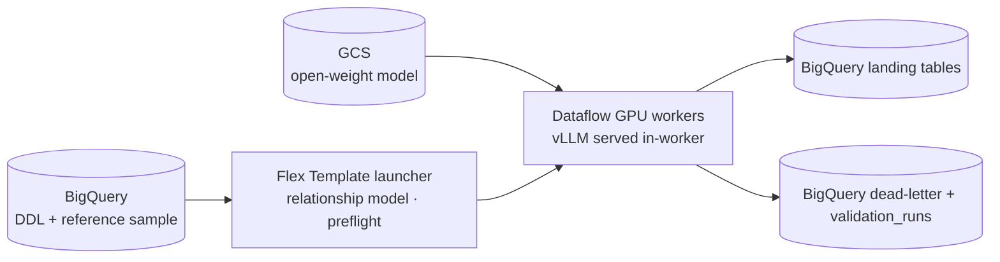

# Synthetic data generation

Development, testing and analytics prototyping need realistic tabular data,
but production tables usually cannot be copied for privacy, regulatory or
residency reasons. Masking degrades statistical realism, hand-written
fixtures do not scale, and sending real rows to an external LLM API to get
"lookalike" data moves them outside your control. This solution guide
generates fictitious but realistic rows for any BigQuery table from its DDL
and a bounded reference sample. The LLM runs **inside the Dataflow job**, on
GPU workers in your own project, and the output is validated and audited as
it lands.

## Assets included in this repository

- [Terraform code to deploy the infrastructure for synthetic data generation](../terraform/synthetic-llm-dataflow-bigquery/)
- [Sample pipeline in Python generating relational synthetic data with a self-hosted LLM on Dataflow](../pipelines/synthetic-llm-dataflow-bigquery/)

## Architecture

1. **Plan.** The launcher reads the table's DDL and a relationship model
   (primary keys, foreign keys, identity columns), and orders the connected
   tables parents first.
2. **Learn once, sample in bulk.** Workers profile the reference sample and
   call the LLM a bounded number of times to build value pools for free-text
   columns. Rows are then sampled in vectorized code, so LLM cost does not grow
   with the row count.
3. **Keep relations valid.** Child tables are generated from the keys their
   parents actually landed in the same job, so foreign keys hold by
   construction.
4. **Validate and audit.** Each row passes schema, uniqueness and integrity
   checks. Failures go to a dead-letter table, and every run writes a verdict
   to `validation_runs`.

The sample deployment generates `users → orders → order_items` from the
fictitious `bigquery-public-data.thelook_ecommerce` dataset, into tables with
the same names and schemas in your project. The relationship model and the
tables are described in the
[Terraform README](../terraform/synthetic-llm-dataflow-bigquery/README.md).

## Technical benefits

- **No data egress, no external AI APIs.** Model weights are staged once to
  Cloud Storage and served by vLLM on the workers, with no model hub at
  runtime. Reference rows and prompts stay inside the project.
- **Batch GPU inference on Dataflow.** One image serves the Flex Template
  launcher and NVIDIA L4 or T4 workers; Dataflow provisions the GPUs and drivers
  and releases them when the job ends.
- **Relational integrity at scale.** A whole foreign-key component (chains,
  stars, diamonds) is generated in one job with measured parent-to-child
  fan-out.
- **Quality you can query.** Dead-letter rows keep their full error context;
  per-table verdicts, duplicate and orphan counts are plain BigQuery tables.
- **Portable.** The engines are pure Python behind one interface and the
  pipeline is Apache Beam, so it runs locally with the DirectRunner and a
  fake model client.
